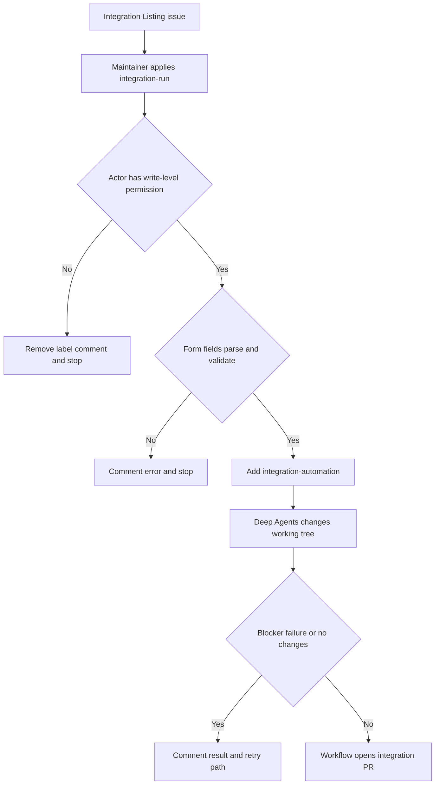
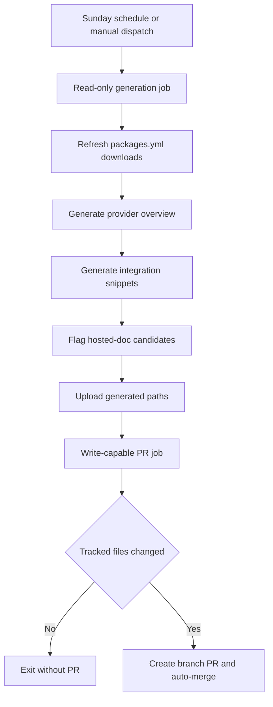

# Integration Listing Automation

## Purpose and ownership

Integration discovery has two complementary paths:

- **Maintainer-gated intake** turns an Integration Listing issue into a reviewable pull request. The form applies `integration-submission` and `integration`; a maintainer must apply `integration-run` before privileged automation starts.
- **Scheduled refresh** updates measured package/download metadata and regenerates discovery output. It never substitutes for review of an integration's eligibility, URL, or capabilities.

Treat issue-form values and third-party listing data as untrusted metadata. The workflow owns labels, comments, branches, and pull requests; the agent may change files but leaves them uncommitted. The durable editable inputs are listed below; generated files are outputs and must not be hand-edited.

| Input | Owner and purpose |
| --- | --- |
| `scripts/data/integration_external_docs.yaml` | Canonical external-integration metadata, grouped by language and component. A row normally provides `name`, a language-specific `pypi` or `npm` package, `docs_url`, and optional component capabilities. |
| Hosted integration MDX frontmatter | `integration:` frontmatter is the metadata source for hosted guides discovered under `src/oss/{python,javascript}/integrations/`. |
| `packages.yml` | Source of truth for LangChain package/repository records. It feeds package discovery and the Python provider overview. |
| `src/oss/python/integrations/providers/all_providers.mdx` | Authored provider-card index used when resolving a provider link for the generated overview. |

An external listing is the normal outcome below the hosted-guide threshold. A hosted guide requires at least 50,000 monthly PyPI or npm downloads, or an explicit maintainer featured decision; it is not enough to set `featured: true` merely because the threshold is met. When promoting an external entry to a hosted guide, remove the duplicate external YAML row.

## Intake to reviewable pull request


```mermaid
flowchart TD
    Form["Integration Listing issue"] --> Gate["Maintainer applies integration-run"]
    Gate --> Auth{"Actor has write-level permission"}
    Auth -- No --> Stop["Remove label comment and stop"]
    Auth -- Yes --> Parsed{"Form fields parse and validate"}
    Parsed -- No --> ParseError["Comment error and stop"]
    Parsed -- Yes --> Mark["Add integration-automation"]
    Mark --> Agent["Deep Agents changes working tree"]
    Agent --> Diff{"Blocker failure or no changes"}
    Diff -- Yes --> Report["Comment result and retry path"]
    Diff -- No --> PR["Workflow opens integration PR"]
```

This flow shows the authorization, duplicate-processing, and workflow-owned handoff boundaries.

`integration-submission` is triggered by issue label events or manual dispatch, but executes only for the `integration-run` label event or a dispatch. Its non-cancelling, per-issue concurrency group prevents a subsequent attempt from cancelling an earlier one. Before checkout, it calls the collaborator-permission API and accepts only `admin`, `maintain`, or `write`. An unauthorized label event has `integration-run` removed, receives an explanatory comment, and stops.

The parser maps rendered form headings to stable fields without evaluating their contents. It removes empty optional responses and requires the appropriate registry package for `Python`, `TypeScript`, or `Both`. A successful parse adds `integration-automation`, which also suppresses duplicate processing; a parse failure comments on the issue and does not invoke the agent.

The agent uses the project `submit-integration` skill and treats the form JSON as untrusted literal metadata. `.agents/skills/` is the canonical project skill directory and has higher Deep Agents precedence than the former `.deepagents/skills/` location, so this skill reference requires no shim. It makes a best-effort eligibility/listing decision without asking questions and may write `integration-submission-error.md` only for a hard blocker. It must not commit, push, create a PR, or mutate GitHub. For a blocker, agent failure, or no diff, the workflow comments rather than opening a PR. Otherwise it creates `integration/issue-<number>` with the package/eligibility, URL/provider-card, and generated-surface review checklist, then links and mentions the PR from the source issue. To retry a parse, agent, or no-change failure, remove `integration-automation` and have a maintainer reapply `integration-run`.

## Rendering external and hosted rows

`refresh_integration_downloads.py` reads hosted-guide frontmatter and merges it with the external YAML. Hosted rows link to their local integration route; external rows link the display name to `docs_url`. The renderer sorts available download counts descending, then names, with unavailable values last. A row without a usable language-specific package can still render with `N/A` downloads; an external row with no `docs_url` is excluded.

Component schemas control the output rather than forcing one universal table: chat includes capability flags, middleware includes availability and source, retrievers include hosting/package fields, and vectorstore capability columns appear only if at least one row supplies the relevant value. The generated snippets use numeric `data-sort-value` attributes for initial and offline ordering; client-side code can later refresh badge values and sort ordering.

Run the generator from the repository root:

```bash
uv run python scripts/refresh_integration_downloads.py --write
```

It writes `src/snippets/oss/*-downloads.mdx` for nonempty supported components and `*-featured.mdx` for chat or components with featured rows. Those snippets carry a generated-file marker. The download resolver caches package lookups, retries npm and PyPI HTTP 429 responses up to six times with capped exponential backoff, and degrades other network, parsing, or missing-data failures to unavailable data rather than aborting the complete collection.

## URL safety is a pre-emission invariant

An external `docs_url` may be `https://`, `http://`, or a site-relative path beginning with exactly one `/`. Protocol-relative `//…` paths and unsafe schemes such as `javascript:`, `data:`, and `vbscript:` are rejected. During row collection, a missing URL emits a warning and skips that external row; an unsafe URL raises an error rather than allowing a rendered link.

Use the no-network, no-write validation mode before changing external metadata:

```bash
uv run python scripts/refresh_integration_downloads.py --check-docs-urls
```

This mode reports both missing and unsafe YAML values before any writes. CI runs it in a read-only job. Unit tests cover accepted and rejected URL schemes, safe-link fallback, repository-YAML validation, and table-text normalization.

The hosted-docs candidate flagger is not a URL-validation boundary: candidate collection requires only a nonempty `docs_url`. Do not treat a candidate's presence in Linear output as proof that its link is safe to render.

## Package records and generated provider overview

`packages.yml` contains package names, repositories, optional TypeScript package names, download measurements/timestamps, and metadata used by package surfaces. `highlight` is a maintainer-only override: it bypasses the overview's normal download cutoff and is sorted ahead of ordinary entries. `packages_yml_get_downloads.py` rejects duplicate package names, skips entries updated within 24 hours, records a missing Pepy badge as zero, and records a refreshed timestamp for each fetched record.

`partner_pkg_table.py` generates `src/oss/python/integrations/providers/overview.mdx`. It excludes fixed core packages; then includes packages at 100,000 downloads or packages with `highlight`, sorts highlighted packages first by downloads, and limits the table to 50 entries. It resolves the provider URL in this order: an explicit absolute `provider_page`, an existing hosted provider page, a matching card href in `all_providers.mdx` (including external URLs), the GitHub repository, then PyPI. It rejects `has_reference_docs: true` combined with `integration: false`.

Regenerate after package metadata, generator, or provider-card changes:

```bash
uv run python pipeline/tools/partner_pkg_table.py
```

CI regenerates this overview and fails if the checked-in file differs, directing changes to metadata or the generator instead of the generated MDX.

## Scheduled automation and Linear follow-up


```mermaid
flowchart TD
    Trigger["Sunday schedule or manual dispatch"] --> ReadOnly["Read-only generation job"]
    ReadOnly --> Counts["Refresh packages.yml downloads"]
    Counts --> Overview["Generate provider overview"]
    Overview --> Tables["Generate integration snippets"]
    Tables --> Candidate["Flag hosted-doc candidates"]
    Candidate --> Artifact["Upload generated paths"]
    Artifact --> Writer["Write-capable PR job"]
    Writer --> Changed{"Tracked files changed"}
    Changed -- No --> Exit["Exit without PR"]
    Changed -- Yes --> RefreshPR["Create branch PR and auto-merge"]
```

This separates the read-only data/generation work from the job allowed to write a refresh branch and pull request.

`update-package-downloads.yml` runs every Sunday at 23:59 UTC and also supports manual dispatch. Its read-only job runs the package download refresher, provider-table generator, integration snippet generator, and hosted-docs candidate flagger. Only `packages.yml`, the Python provider overview, and generated integration snippets cross the artifact boundary into the write-capable job. That job exits without a PR when those tracked paths have no diff; otherwise it creates a timestamped `chore/update-package-downloads-…` branch, opens a PR, and enables squash auto-merge.

The candidate flagger identifies external entries at 50,000 downloads per month by default, accepts `--threshold`, and includes the component curation bar in the issue context. It is dry-run by default; creation requires both `LINEAR_API_KEY` and `LINEAR_TEAM_KEY`. Before creating a Linear issue, it searches by a stable title fragment that omits changing download counts, avoiding duplicate open work.

## Safe change and review workflow

1. Decide external versus hosted from actual package measurements and a maintainer featured decision. Do not manufacture download counts or capabilities.
2. Change the owned input: external YAML, hosted `integration:` frontmatter, `packages.yml`, or an authored provider card. Never directly edit generated snippets or `overview.mdx`.
3. For an external row, use partner documentation where possible, then a public GitHub repository, then the registry page; preserve the URL-scheme invariant.
4. Run `uv run python scripts/refresh_integration_downloads.py --check-docs-urls`, regenerate affected snippets with `--write`, and regenerate the provider overview when `packages.yml` or provider-card resolution changes.
5. Review generated diffs for the intended language/component, correct external link, capability columns, download fallback behavior, and provider link. For intake PRs, also confirm the hosted eligibility decision and workflow checklist.

## Related pages

- [GitHub Actions and CI/CD](/openwiki/integrations/github-actions.md)
- [CLI tools](/openwiki/operations/cli-tools.md)
- [Quickstart](/openwiki/quickstart.md)
- [Testing overview](/openwiki/testing/test-overview.md)
