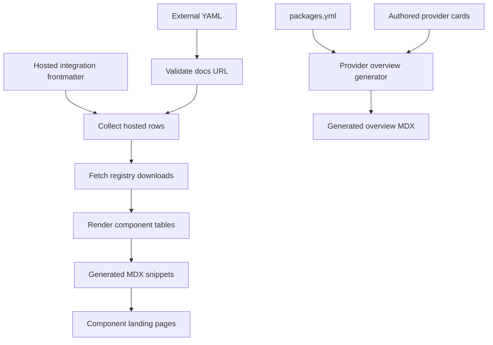
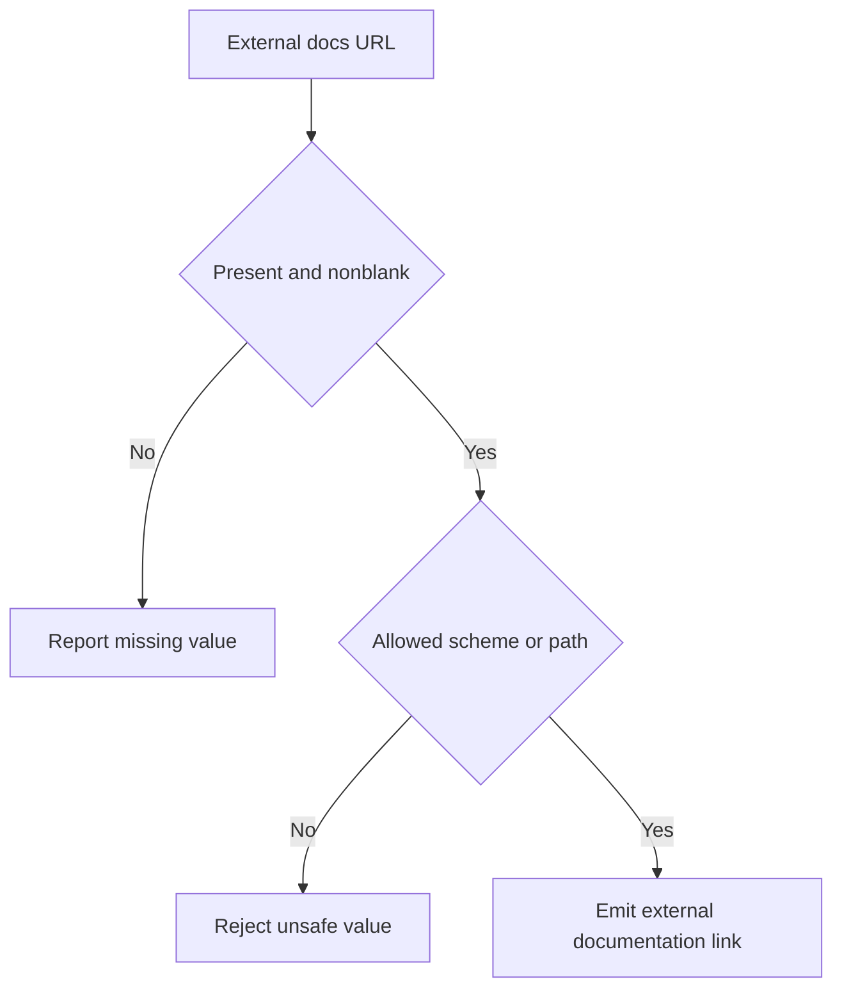
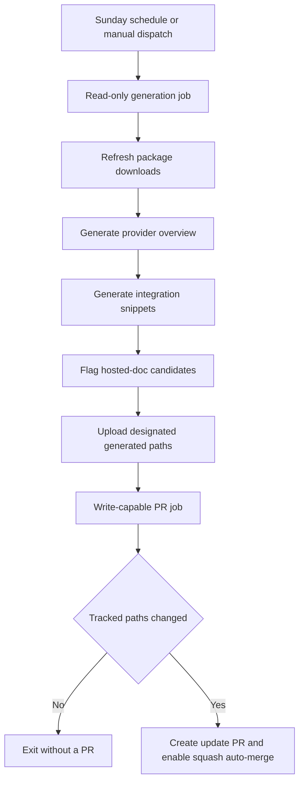

# Integration Listing Automation

Integration discovery is an input-to-output workflow: maintainers change metadata or authored provider cards, then generators render public discovery surfaces. Do **not** hand-edit generated integration snippets under `src/snippets/oss/` or `src/oss/python/integrations/providers/overview.mdx`; correct an owning input or generator and regenerate.

## Listing boundary and source ownership

A package with at least 50,000 monthly PyPI or npm downloads, or an explicit maintainer featured decision, is eligible for a hosted MDX guide. The threshold does not itself authorize `featured: true`. Integrations below that boundary use an external listing that links to partner-owned documentation. When a listing becomes a hosted guide, remove the duplicate external YAML row.

| Owner | Controls | Safe change |
| --- | --- | --- |
| `scripts/data/integration_external_docs.yaml` | External rows grouped by language and component: display name, registry package, `docs_url`, and applicable component metadata | Add, correct, or remove the external row. Prefer partner docs, then a public repository, then the registry page. |
| Hosted integration MDX frontmatter | `integration:` metadata found below `src/oss/{python,javascript}/integrations/` | Correct hosted-guide metadata, not the rendered table. |
| `packages.yml` | LangChain package and repository records, download data, and maintainer-only `highlight` | Correct package metadata. `highlight` bypasses the provider-overview download filter and sorts before ordinary packages. |
| `src/oss/python/integrations/providers/all_providers.mdx` | Authored provider cards and their destinations | Maintain a card when a provider needs discovery or its destination should resolve as the package's provider link. |

External YAML is the canonical metadata source for external language/component rows. The table generator merges those rows with hosted `integration:` frontmatter. An external row needs a display `name` and a safe `docs_url`; `pypi` or `npm` supplies download data when available. It links the displayed name to `docs_url`, whereas a hosted row links to its LangChain route.

## Metadata-to-table flow


```mermaid
flowchart TD
    External["External YAML"] --> Validate["Validate docs URL"]
    Hosted["Hosted integration frontmatter"] --> Collect["Collect hosted rows"]
    Validate --> Collect
    Collect --> Fetch["Fetch registry downloads"]
    Fetch --> Render["Render component tables"]
    Render --> Snippets["Generated MDX snippets"]
    Snippets --> Landing["Component landing pages"]
    Packages["packages.yml"] --> Overview["Provider overview generator"]
    Cards["Authored provider cards"] --> Overview
    Overview --> Generated["Generated overview MDX"]
```

This shows the separate input paths for integration-table snippets and the provider overview.

`refresh_integration_downloads.py` scans the supported Python and JavaScript component directories, excluding index, template, and example-data files. It collects hosted rows and external rows, then sorts available download counts descending and names secondarily; unavailable counts sort last. The generator emits an all-rows snippet for a component with rows and emits a featured snippet for chat or for a component with featured rows. Landing pages import these snippets—for example, JavaScript embeddings and Python document loaders—so the generated files are public documentation inputs.

Table shape is component-specific: chat has capability fields; middleware and retrievers have their respective metadata columns; and vectorstore capability columns appear only when at least one row declares that capability. Capability and download cells carry numeric sort values, allowing stable first-paint and offline ordering while the client can refresh badges.

Run from the repository root:

```bash
uv run python scripts/refresh_integration_downloads.py --write
```

Without `--write`, the command prints tables. `--language` and `--component` restrict generation to supported values or `all`. Review regenerated output for language, component, links, capabilities, and unavailable-download handling; repair metadata or generator logic and rerun rather than patching a generated row.

### URL validation is a pre-emission boundary

External URLs are untrusted input. A `docs_url` may be `https://`, `http://`, or a site-relative path beginning with exactly one `/`. Protocol-relative `//…` paths and other schemes, including `javascript:`, `data:`, and `vbscript:`, are rejected.


```mermaid
flowchart TD
    Value["External docs URL"] --> Present{"Present and nonblank"}
    Present -- No --> Missing["Report missing value"]
    Present -- Yes --> Safe{"Allowed scheme or path"}
    Safe -- No --> Reject["Reject unsafe value"]
    Safe -- Yes --> Link["Emit external documentation link"]
```

This boundary prevents external metadata from becoming an unsafe generated link.

During collection, a missing external URL is warned about and its row is skipped; an unsafe URL raises an error. The dedicated validation mode reports both missing and unsafe YAML values before network calls or writes:

```bash
uv run python scripts/refresh_integration_downloads.py --check-docs-urls
```

CI runs that command in a read-only job. The focused tests cover accepted and rejected schemes, unsafe-link fallback, validation of repository YAML, and Markdown cell normalization.

Download lookup is best-effort. npm and PyPI fetches retry HTTP 429 up to six times with exponential backoff. The process caches results by registry/package during a run; other request, parsing, and missing-data failures degrade that row to unavailable download data rather than aborting collection.

## Provider overview: a separate derived surface

`pipeline/tools/partner_pkg_table.py` generates `src/oss/python/integrations/providers/overview.mdx` from `packages.yml`. It excludes configured core packages, includes a package at 100,000 downloads or one marked `highlight`, sorts highlighted packages first and then by downloads, and limits output to 50 entries. `has_reference_docs: true` together with `integration: false` is invalid.

Provider destinations resolve in priority order: an absolute `provider_page` in `packages.yml`; a hosted provider page from a configured slug or short package name; a matching `all_providers.mdx` card href, including an external URL; the declared repository; then PyPI. Update the metadata or authored card that owns the destination, then run:

```bash
uv run python pipeline/tools/partner_pkg_table.py
```

CI regenerates the overview and fails if it differs from the checked-in file, directing a change to `packages.yml` or `partner_pkg_table.py`, never to the generated overview.

## Scheduled refresh and promotion follow-up


```mermaid
flowchart TD
    Trigger["Sunday schedule or manual dispatch"] --> Generation["Read-only generation job"]
    Generation --> Downloads["Refresh package downloads"]
    Downloads --> Provider["Generate provider overview"]
    Provider --> Tables["Generate integration snippets"]
    Tables --> Candidates["Flag hosted-doc candidates"]
    Candidates --> Artifact["Upload designated generated paths"]
    Artifact --> Writer["Write-capable PR job"]
    Writer --> Changed{"Tracked paths changed"}
    Changed -- No --> Stop["Exit without a PR"]
    Changed -- Yes --> PR["Create update PR and enable squash auto-merge"]
```

This shows the privilege boundary: generation has read-only contents permission, while the later job can write a branch and pull request.

`update-package-downloads.yml` runs at 23:59 UTC every Sunday and can be dispatched manually. It refreshes `packages.yml`, then generates the provider overview and integration snippets. The package refresher rejects duplicate package names, avoids refetching records updated within 24 hours, records a missing Pepy badge as zero, and timestamps refreshed records.

The artifact handoff is intentionally narrow: only `packages.yml`, the Python provider overview, and generated `*-downloads.mdx` and `*-featured.mdx` snippets reach the write-capable job. It exits when those tracked paths have no diff; otherwise it creates a timestamped `chore/update-package-downloads-…` branch, opens a PR, and enables squash auto-merge.

The same run flags external integrations at the 50,000-download threshold for hosted-doc follow-up. The flagger accepts `--threshold`; it is a dry run unless both `LINEAR_API_KEY` and `LINEAR_TEAM_KEY` are configured. Before it creates a Linear issue, it searches a stable title fragment that excludes the changing download count, avoiding duplicate open work.

## External contribution and issue intake policy

External contributors should use the Integration listing issue form, not a manual PR for a new listing. `external-integration-pr-comment.yml` runs as `pull_request_target` for non-draft PR updates. It only uses GitHub API data about changed files and PR-head file content; it does not check out or execute fork code. For a non-bot external author, it detects new integration MDX files or a change to the external-listing YAML, applies the `integration` label, and identifies organization membership with its GitHub App token.

For a non-featured external contribution, the workflow posts one marker-protected redirect to the issue form and closes an open PR. A newly added MDX page whose frontmatter has `featured: true` receives the label but skips that redirect-and-close path. Internal members and configured internal bots are not redirected by this workflow.

The issue workflow is separate. Applying `integration-run` invokes it only when the triggering actor has `admin`, `maintain`, or `write` permission; issue creation alone cannot start it. A non-cancelling per-issue concurrency group and the `integration-automation` label avoid duplicate processing. The workflow parses the issue form, reports parse errors on the issue, and passes structured fields to the agent as untrusted literal metadata. The agent must leave edits uncommitted and must not push, create a PR, or comment.

A blocker file, failed agent, or no diff yields an issue comment rather than a PR. When edits exist, the workflow creates `integration/issue-<number>` with review checks for eligibility, URL/provider card, and generated surfaces; it then links and mentions the PR on the source issue.

## Safe change procedure

1. Decide whether the integration is external or hosted from measured registry downloads and a maintainer feature decision. Do not invent download counts or capabilities.
2. Change the owning input—external YAML, hosted frontmatter, `packages.yml`, an authored provider card, or generator code—not a derived output.
3. For external metadata, validate URLs:

   ```bash
   uv run python scripts/refresh_integration_downloads.py --check-docs-urls
   ```

4. Regenerate affected snippets with `--write`; regenerate the provider overview when package metadata, provider-card matching, or its generator changes.
5. Review the generated diff. When validation or table rendering changes, run:

   ```bash
   uv run pytest tests/unit_tests/test_refresh_integration_downloads.py
   ```

## Related pages

- [Source Directory Map](/openwiki/architecture/source-map.md)
- [GitHub Actions and CI/CD](/openwiki/integrations/github-actions.md)
- [Adding Pages](/openwiki/operations/adding-pages.md)
- [Testing overview](/openwiki/testing/test-overview.md)
