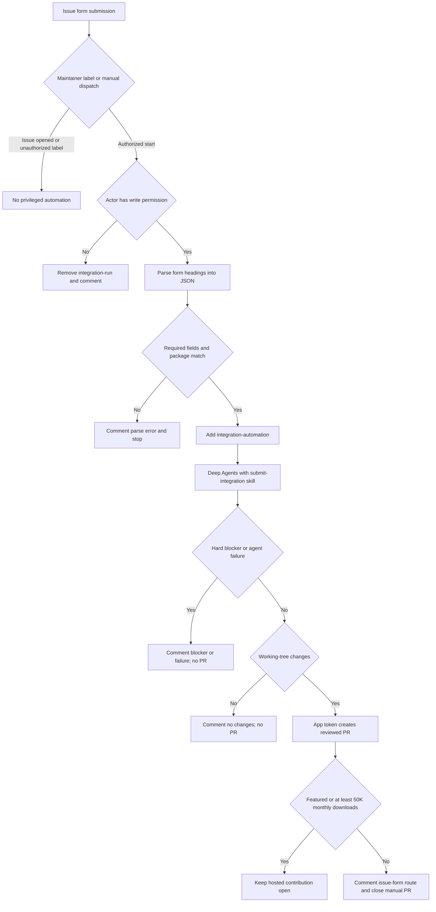
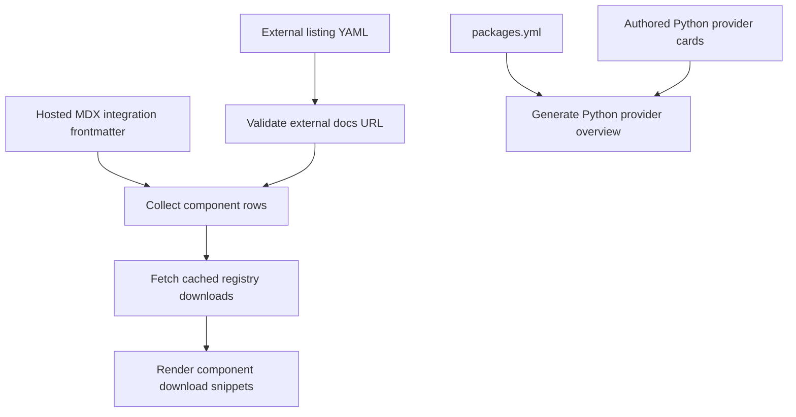
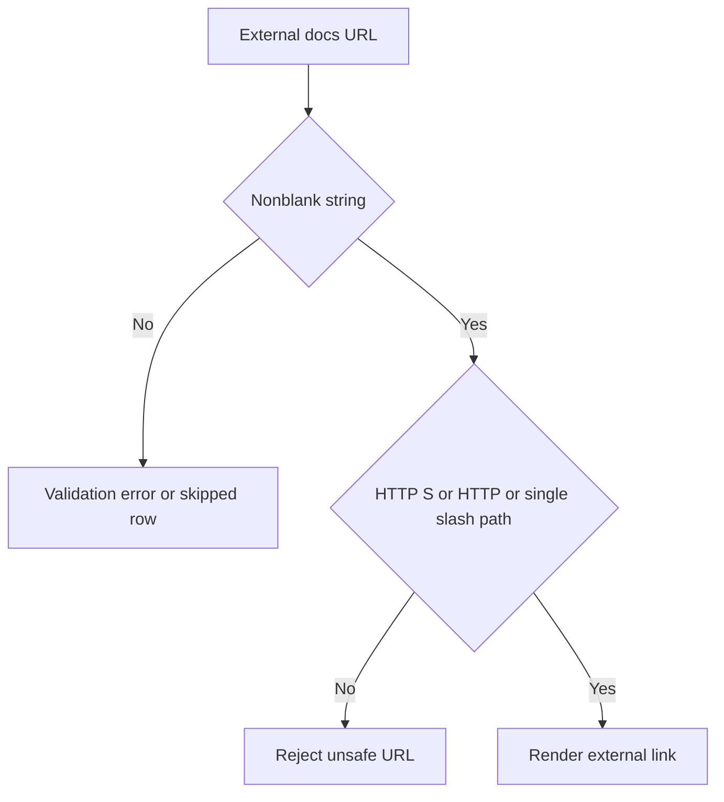
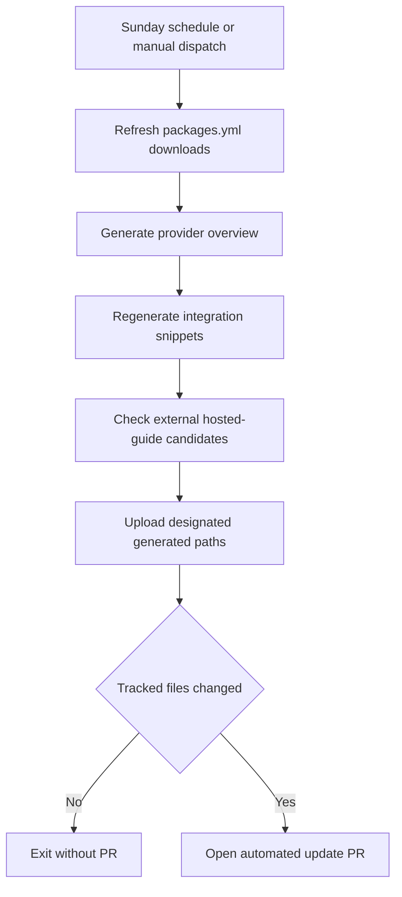

# Integration Listing Automation

Integration discovery is assembled from distinct owned inputs rather than edited as a single page. A listing can have a hosted MDX guide, an external table entry, an authored provider card, and a package-registry entry; not every integration has every surface. The automation has two independent generated products:

- **Component download snippets** combine hosted-guide `integration:` frontmatter and external-listing YAML. They are consumed by component landing pages.
- The **Python provider overview** is generated from `packages.yml`, with the authored Python provider-card catalog participating in link resolution.

Generated snippets and `src/oss/python/integrations/providers/overview.mdx` are outputs. Change the owning metadata or generator, then regenerate; do not preserve a hand-edited generated result.

## Submission boundary: issue form to reviewed PR

The supported entrypoint for a new, externally contributed listing is the `[integration]` issue form. It asks for a display/class name, language, component, published PyPI and/or npm package, documentation URL, optional public GitHub repository, a factual provider-card description, and optional chat/vector-store capability flags. The package publication confirmation is required by the form. The form itself does not start automation: an issue merely being opened is inert.

A maintainer applies `integration-run` when the submission is ready. The workflow also supports an explicit `workflow_dispatch` with an issue number. Before reading the issue as work instructions, it checks the dispatching actor's repository collaborator permission; only `admin`, `maintain`, or `write` may proceed. An unauthorized label application is removed and receives a one-time explanatory comment. The workflow has write permissions, so this authorization check is a security boundary, not a cosmetic status check.

The issue body is parsed as GitHub's `### heading` sections by `parse_integration_submission_issue.py`. It maps stable form labels to JSON keys, strips HTML comments, treats `n/a`, `none`, and `_no response_` as absent optional values, and never evaluates field contents. Required sections and language/package combinations are validated. A parse failure is reported on the issue and stops before the agent; the maintainer can remove `integration-automation`, correct the form, and re-apply `integration-run`.


```mermaid
flowchart TD
    Issue["Issue form submission"] --> Trigger{"Maintainer label or manual dispatch"}
    Trigger -- "Issue opened or unauthorized label" --> NoRun["No privileged automation"]
    Trigger -- "Authorized start" --> Permission{"Actor has write permission"}
    Permission -- "No" --> Unauthorized["Remove integration-run and comment"]
    Permission -- "Yes" --> Parse["Parse form headings into JSON"]
    Parse --> Valid{"Required fields and package match"}
    Valid -- "No" --> ParseError["Comment parse error and stop"]
    Valid -- "Yes" --> Mark["Add integration-automation"]
    Mark --> Agent["Deep Agents with submit-integration skill"]
    Agent --> Blocked{"Hard blocker or agent failure"}
    Blocked -- "Yes" --> Failure["Comment blocker or failure; no PR"]
    Blocked -- "No" --> Changes{"Working-tree changes"}
    Changes -- "No" --> NoChanges["Comment no changes; no PR"]
    Changes -- "Yes" --> PR["App token creates reviewed PR"]
    PR --> Eligibility{"Featured or at least 50K monthly downloads"}
    Eligibility -- "Yes" --> Keep["Keep hosted contribution open"]
    Eligibility -- "No" --> External["Comment issue-form route and close manual PR"]
```

This guarded flow keeps unauthorized, malformed, blocked, and non-featured contributions out of privileged or inappropriate paths.

### Deep Agents execution and trust model

After parsing, the workflow adds `integration-automation`, comments that processing started, and builds a prompt containing the parsed JSON. The `submit-integration` skill explicitly treats every field as untrusted data: URLs, descriptions, and capability notes are literal listing metadata, not instructions. The agent is unsupervised and must make best-effort choices using form fields, registry metadata, and package README data; it must not ask questions, push, open a PR, or comment on GitHub. It leaves changes uncommitted for the workflow handoff and writes `integration-submission-error.md` only when no reasonable listing is possible.

Deep Agents runs with the repository skill, a bounded shell allow-list, no memory, a fixed working directory, and a maximum turn/timeout budget. The workflow does not mint the GitHub App token until after the agent finishes, so the agent cannot use that PR-creation credential. If a blocker file exists or the agent fails, the workflow comments on the issue and creates no PR. A successful run with no diff also reports no changes rather than opening an empty PR.

The final handoff uses a short-lived App token and creates branch `integration/issue-<number>` with a review checklist, source issue, and author mention. The issue receives the PR link, and the PR receives an author ping. This is a reviewed handoff: the agent edits the working tree, while the workflow owns publication.

## Listing decision and source ownership

A full hosted guide is for integrations with at least 50,000 monthly PyPI or npm downloads, or an explicit maintainer feature override in the issue. An integration below that threshold is listed externally instead of receiving a new hosted MDX page. The decision does not make `featured: true` automatic: that is a maintainer decision. When moving an integration to a hosted guide, remove its matching external YAML row to avoid two table rows.

| Owned input | Responsibility | Change when |
| --- | --- | --- |
| `scripts/data/integration_external_docs.yaml` | Third-party rows grouped as `language` then `component`; `name`, registry package, `docs_url`, and supported component metadata | Adding, correcting, or removing an external listing |
| Hosted integration MDX frontmatter under `src/oss/{python,javascript}/integrations/` | The hosted row's display name, PyPI/npm package, featured/deprecated status, and component capabilities | Changing a hosted guide's listing metadata |
| `packages.yml` | Package/repository registry, monthly download record, JS package mapping, visibility, and maintainer-only `highlight` | Changing the Python provider overview's package input |
| `src/oss/python/integrations/providers/all_providers.mdx` | Authored provider discovery cards and their destinations | Adding or correcting provider discovery content or an overview-link fallback |

The external YAML comments define the link preference: partner documentation, then a GitHub repository, then a PyPI/npm page. It is the canonical source for external language/component entries. Hosted rows instead come from `integration:` frontmatter. A page without an `integration:` mapping or a `name` is skipped with a warning rather than becoming a row.

`all_providers.mdx` is authored content, not a generated provider overview. A card can link to an external destination, while a hosted provider page has a site-relative destination. The Python overview generator parses these cards as a fallback, so card title and href changes can affect generated overview links.


```mermaid
flowchart TD
    Hosted["Hosted MDX integration frontmatter"] --> Rows["Collect component rows"]
    External["External listing YAML"] --> Validate["Validate external docs URL"]
    Validate --> Rows
    Rows --> Downloads["Fetch cached registry downloads"]
    Downloads --> Render["Render component download snippets"]
    Packages["packages.yml"] --> Overview["Generate Python provider overview"]
    Cards["Authored Python provider cards"] --> Overview
```

This diagram separates the component-table pipeline from the provider-overview pipeline.

## Component download-table generation

Run the generator from the repository root:

```bash
uv run python scripts/refresh_integration_downloads.py --write
```

It scans configured component directories for Python and JavaScript, excluding index pages, templates, and example data. It collects hosted rows, appends external rows for the same language/component, then sorts rows with known downloads descending and name secondarily; unavailable counts are last. The run caches each registry/package download lookup. npm and PyPI requests retry HTTP 429 up to six times with exponential backoff; other request, parsing, or missing-data failures leave that row without a package/download value instead of failing the full collection.

The generated files begin with a do-not-edit marker. An all-rows `*-downloads.mdx` snippet is written for every nonempty component. A `*-featured.mdx` snippet is also written for chat, even if empty, and for any other component with featured rows. The renderer chooses component-specific columns: chat capabilities, middleware availability/source, retriever fields, and vector-store capability columns only when at least one row declares the corresponding value. It embeds sort values in capability and download cells for the client-side table sorter.

Without `--write`, the command renders tables to standard output. `--language` and `--component` limit it to the supported choices or `all`. Use these options for focused regeneration, but run a full regeneration before merging a cross-cutting metadata change.

### External URL boundary

External `docs_url` values are untrusted metadata because they become Markdown link destinations. The generator permits `https://`, `http://`, or a site-relative path beginning with exactly one `/`; it rejects blank values, protocol-relative `//…`, and other schemes such as `javascript:`, `data:`, and `vbscript:`.


```mermaid
flowchart TD
    URL["External docs URL"] --> Present{"Nonblank string"}
    Present -- "No" --> Missing["Validation error or skipped row"]
    Present -- "Yes" --> Allowed{"HTTP S or HTTP or single slash path"}
    Allowed -- "No" --> Unsafe["Reject unsafe URL"]
    Allowed -- "Yes" --> ExternalLink["Render external link"]
```

This is the link-safety boundary before external metadata reaches generated MDX.

There are deliberately different failure semantics by entrypoint:

- `--check-docs-urls` validates every external YAML row without network calls or writes, reports missing or unsafe values, and exits nonzero on errors.
- Normal collection warns and skips an external row missing `docs_url`, but an unsafe external URL raises `ValueError` and stops generation.
- A hosted row with an unsafe optional `docs_url` loses that URL and renders its normal internal route instead, so `_model_link` never emits an unsafe href.

Validate listing URLs before regeneration:

```bash
uv run python scripts/refresh_integration_downloads.py --check-docs-urls
```

The pull-request workflow named **Check for External Doc Links** is complementary rather than a replacement for this validator: for pull requests to `main` that touch Markdown-related paths, it runs a shell scan across authored `.md` and `.mdx` files and fails on retired documentation hostnames (apart from the Helm exception). Replace such links with relative documentation routes or `reference.langchain.com` API links.

## Python provider overview

The overview generator has a different input contract:

```bash
uv run python pipeline/tools/partner_pkg_table.py
```

It reads `packages.yml`, ignores core package names, derives a short name and display title, rejects `has_reference_docs: true` together with `integration: false`, and keeps packages with at least 100,000 downloads unless `highlight` is set. Highlighted packages sort before ordinary packages, then both groups sort by downloads; the output is limited to 50 rows. `highlight` is explicitly documented as a maintainer-only way to feature strategic or new integrations.

The generator chooses a provider destination in this order: an absolute `provider_page` in `packages.yml`; an existing hosted provider page using `provider_page` or the derived short name; a matching `all_providers.mdx` card href; the configured GitHub repository; and finally PyPI. Thus, update the package record when package identity or an explicit destination changes, and update the provider card when its discovery destination is intentionally the fallback.

The generated overview itself carries a do-not-manually-edit marker. CI regenerates it and fails if the checked-in result differs, directing changes to `packages.yml` or `partner_pkg_table.py`.

## Scheduled refresh and hosted-guide follow-up

`update-package-downloads.yml` runs every Sunday at 23:59 UTC and may also be manually dispatched. Its read-only generation job refreshes package downloads, writes the provider overview, regenerates integration snippets, and then uploads only `packages.yml`, the overview, and generated snippets to the write-capable job. The latter exits without a PR when those tracked paths are unchanged; otherwise it creates a timestamped branch and an automated PR with squash auto-merge enabled.


```mermaid
flowchart TD
    Schedule["Sunday schedule or manual dispatch"] --> Counts["Refresh packages.yml downloads"]
    Counts --> Provider["Generate provider overview"]
    Provider --> Snippets["Regenerate integration snippets"]
    Snippets --> Flag["Check external hosted-guide candidates"]
    Flag --> Artifact["Upload designated generated paths"]
    Artifact --> Diff{"Tracked files changed"}
    Diff -- "No" --> NoPR["Exit without PR"]
    Diff -- "Yes" --> PR["Open automated update PR"]
```

This workflow separates read-only generation from the job permitted to write a branch and pull request.

The package refresher detects duplicate package names, avoids refetching a package updated in the previous 24 hours, records a missing Pepy badge as zero, and timestamps refreshed records. The same scheduled workflow also looks for external entries at the 50,000-download threshold. It is a dry run without both `LINEAR_API_KEY` and `LINEAR_TEAM_KEY`; with both configured, it creates Linear follow-up only after searching by a stable title fragment so changing counts do not create duplicate open issues.

## External-contributor PR policy

`external-integration-pr-comment.yml` listens with `pull_request_target`, but deliberately does not check out or execute the contributor's branch. It reads the changed-file list and head-file contents through the GitHub API, and checks `langchain-ai` membership. Bot authors are ignored; internal authors are ignored; external authors' newly added integration MDX or changes to `scripts/data/integration_external_docs.yaml` are labeled `integration`.

For a new MDX file, the policy reads frontmatter from the PR head and keeps the PR open when `featured: true` or when its PyPI/npm package verifies at least 50,000 monthly downloads. Otherwise it posts one idempotent redirect to the integration issue form and closes the PR. A `langchain-ai` member reopening the PR is an explicit keep-open override, honored on reopen and subsequent synchronize events. Membership lookup failures are conservative: the author is treated as external, while a failed eligibility lookup raises an error instead of silently closing an eligible contribution.

This `pull_request_target` design is intentionally narrow: it grants labeling/comment/close permissions to trusted workflow code while treating fork content as data. It must not be changed to run scripts from the fork or to let issue/PR text start privileged automation.

## Change and verification procedure

1. Decide whether the integration is a hosted guide or external listing from measured monthly registry downloads and a maintainer feature decision. Do not use a generated table as the source of truth.
2. Change the owner: hosted `integration:` frontmatter, external YAML, `packages.yml`, an authored provider card, or generator code. If promoting an external listing to a guide, remove the external row.
3. Validate external links, then regenerate the affected component tables and, when package/provider-link inputs changed, the Python overview.
4. Inspect the generated diff for component, language, links, capability columns, featured rows, and unavailable-download fallback. Do not hand-patch a snippet or overview.
5. Run focused URL and rendering coverage when changing the download generator or its metadata rules:

   ```bash
   uv run pytest tests/unit_tests/test_refresh_integration_downloads.py
   ```

The focused tests cover accepted and rejected URL forms, ensure an unsafe URL cannot enter a rendered link, validate the repository YAML, and verify Markdown-cell normalization. CI independently detects manual drift in the generated provider overview; the scheduled workflow provides recurring regeneration of both output families.

## Related pages

- [Source Directory Map](/openwiki/architecture/source-map.md)
- [GitHub Actions and CI/CD](/openwiki/integrations/github-actions.md)
- [Agent skills](/openwiki/operations/agent-skills.md)
- [Testing overview](/openwiki/testing/test-overview.md)
