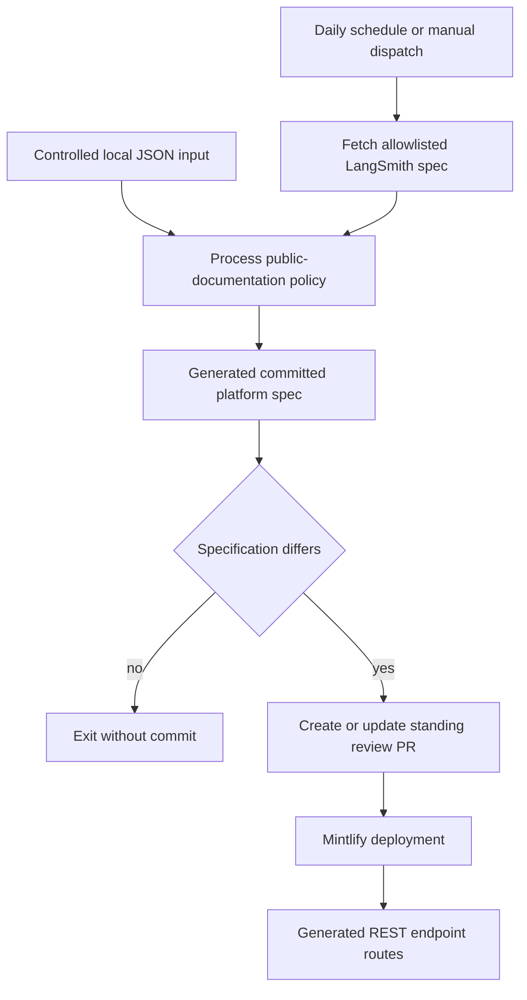

# LangSmith Platform OpenAPI Refresh

The LangSmith REST API reference is published from the generated, committed `src/langsmith/langsmith-platform-openapi.json`. It is **not** an authored MDX endpoint tree: `src/docs.json` supplies that file to Mintlify's `langsmith/smith-api` directory, and Mintlify generates endpoint routes at deployment. The refresh is therefore a public-documentation publication workflow, not a formatting convenience. Do not edit the generated specification or imagined generated endpoint pages by hand.

## Ownership and trust boundary

| Concern | Owner | Safe maintenance action |
| --- | --- | --- |
| Upstream API description | `https://api.smith.langchain.com/openapi.json` | Fix service-owned content upstream when appropriate. |
| Public-reference policy | `scripts/process_langsmith_openapi.py` | Adjust the explicit hide, grouping, title, or ordering rules and regenerate. |
| Generated deployment input | `src/langsmith/langsmith-platform-openapi.json` | Review and merge the refresh PR; never manually patch the JSON. |
| Refresh and GitHub write authority | `.github/workflows/refresh-langsmith-openapi.yml` | Preserve its narrow path staging, no-diff exit, and standing-PR behavior. |
| Endpoint-page rendering | Mintlify deployment configured by `src/docs.json` | Inspect a deployed preview or production; generated endpoint pages are not MDX sources. |

The processor accepts network input only from `api.smith.langchain.com`. It uses `https://api.smith.langchain.com/openapi.json` by default, TLS's default SSL context, an `Accept: application/json` request header, and a 30-second timeout. Any other parsed hostname raises an error before a request is made. A local `--input` file is an alternative for controlled reproduction and policy work.



This flow shows the boundary from a constrained upstream input through curated JSON and review to Mintlify-generated routes.

The GitHub Actions job is a trusted writer, not a pull-request workflow. It runs on `ubuntu-latest` with a 15-minute timeout and only `contents: write` and `pull-requests: write` permissions, checks out shallow history, sets up Python 3.13 plus uv, and runs the processor with `--write`. Its write phase stages only `src/langsmith/langsmith-platform-openapi.json`; this narrow artifact path and the review PR are the trust boundary for a changing remote specification.

## Public-documentation shaping

`process_spec()` mutates the upstream OpenAPI object and emits consistently indented UTF-8 JSON with a trailing newline. It skips path-level OpenAPI metadata while iterating operations. The transformation deliberately curates what Mintlify exposes:

- **Hide non-public operations.** It sets `x-hidden: true` on operations carrying configured Fleet, product-feedback, internal/infrastructure, administration/debug, or low-value-system tags, and on configured health and internal path rules. It also sets `x-hidden` on matching top-level tag entries. This is an explicit public-documentation filter; it does not infer public eligibility from an upstream `x-public` field.
- **Normalize operation titles.** Every operation gets a summary (falling back to `METHOD path`), sentence-cased while preserving an allowlist of acronyms and proper nouns. Backend `[Beta]` and trailing `V2` wording become consistent trailing `(Beta)` and `(v2)` markers. Visible `/v2/` operations receive `(v2)` unless they are sandbox paths; three v2 run operations use canonical title overrides to align with their v1 counterparts. Existing markers are removed before markers are re-applied, so title processing is idempotent.
- **Build usable navigation metadata.** The processor creates a top-level `tags` list if absent, updates known tags with human-readable `x-group` values, adds tag objects for tags found only on operations, and sorts them by the configured public group order. Unknown groups sort alphabetically after the ordered groups.

The policy lives in the processor constants: `HIDDEN_TAGS`, `HIDDEN_PATHS`, `HIDDEN_PATH_PREFIXES`, `TAG_GROUPS`, `GROUP_ORDER`, and the v2/title-preservation tables. Add or remove a public category there rather than editing a generated operation or tag in the JSON artifact. Because hidden marking and title normalization are designed to survive reprocessing, a local candidate can be run repeatedly without accumulating markers or changing ordering.

## Entrypoints and local operation

Run from the repository root. A default invocation obtains the current remote source; a local input avoids a network fetch. Without `--write`, the processor previews the complete transformed JSON on standard output. `--output` overrides the default generated-artifact path.

```bash
uv run python scripts/process_langsmith_openapi.py --write
```

```bash
uv run python scripts/process_langsmith_openapi.py --input /path/to/openapi.json
```

```bash
uv run python scripts/process_langsmith_openapi.py --input /path/to/openapi.json --write
```

Treat a local write as regeneration of a derived artifact, not permission to manually curate its JSON. When a refresh produces an unexpected exposure, omission, label, or sidebar group, change the upstream specification where it is authoritative or change the processor policy, rerun it, and review the resulting diff.

## Daily refresh and review-PR lifecycle

The workflow runs daily at 10:00 UTC and supports `workflow_dispatch`. It first writes the freshly processed artifact in the initial checkout, copies it to the runner's temporary directory, and restores the checked-out artifact. It then queries GitHub for an open PR whose head is `chore/refresh-langsmith-openapi`:

1. If one exists, it fetches that branch shallowly and resets the local branch to it. Otherwise it creates the branch from the checkout.
2. It restores the newly generated artifact from temporary storage onto that branch and compares only that path.
3. With no diff, it exits without a commit or PR change.
4. With a diff, it commits the generated file. An existing PR receives an appended commit and normal push. Without an open PR, the workflow force-pushes the standing branch—safe because no open PR references it—and creates a PR against `main`.

This design maintains at most one outstanding refresh PR instead of creating a daily queue. Reviewers should treat its generated diff as a proposed change to the public API reference: check newly visible or hidden operations, title/version labels, and tag groups. The PR is the human review boundary between trusted remote ingestion and the committed Mintlify input; successful fetching or processing is not approval to publish an unreviewed change.

## Validation limits and failure handling

The processor's failure modes are intentionally direct: a disallowed fetch hostname raises `ValueError`; network, TLS, timeout, or JSON-decoding failures prevent a candidate from being produced; and GitHub checkout, push, or PR failures stop the shell step because it uses `set -euo pipefail`. A no-diff result is a successful no-op, not a failed refresh.

There is no repository command that proves Mintlify rendered every LangSmith REST endpoint page. `make check-openapi` currently validates only `langsmith/agent-server-openapi.json`, not the platform artifact. The local broken-link filter explicitly removes `/langsmith/smith-api` reports (alongside the other deployment-generated OpenAPI route families) because those pages do not exist in the local build. Inspect a Mintlify preview or the deployed site for the rendered REST endpoint surface; use the processor command to verify transformation and the refresh PR to verify the candidate change.

## Safe change checklist

1. Do not hand-edit `src/langsmith/langsmith-platform-openapi.json` or create MDX for its generated endpoint routes.
2. Keep remote fetches restricted to `api.smith.langchain.com`; use `--input` for a controlled local candidate.
3. Modify hiding, grouping, title, or ordering rules in `scripts/process_langsmith_openapi.py`, then regenerate and review the complete diff.
4. Preserve the workflow's single generated path, no-diff exit, and one-standing-PR lifecycle when changing automation.
5. Review a refresh PR as a public API documentation change, then inspect a Mintlify preview or production for deployment-generated endpoint rendering.

## Related pages

- [Source Directory Map](/openwiki/architecture/source-map.md)
- [GitHub Actions and CI/CD](/openwiki/integrations/github-actions.md)
- [Mintlify Integration](/openwiki/integrations/mintlify.md)
- [Reference Documentation](/openwiki/integrations/reference-docs.md)
- [Quickstart](/openwiki/quickstart.md)
- [Testing Overview](/openwiki/testing/test-overview.md)
