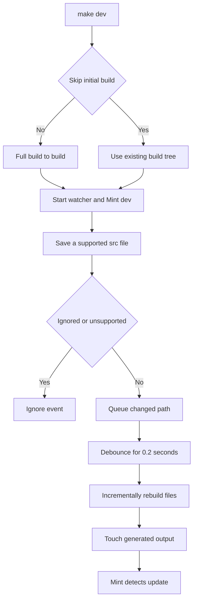

# Local Development Workflow

The local loop has a strict input/output boundary: author documentation, navigation, and assets in `src/`; the Python pipeline generates the Mintlify-facing `build/` tree. `build/` is disposable output. Never edit it directly: a full build removes and recreates it.

## First-time setup

The checkout requires Python 3.13 or later, Node.js, and `uv`. Install Python dependency groups, project npm dependencies, the global Mintlify CLI, and the local Claude Code skill links:

```bash
git clone https://github.com/langchain-ai/docs.git
cd docs
make install
```

`make install` runs `uv sync --all-groups`, `npm install`, and `npm install -g mint@latest`; it also invokes `make skills`. The latter links each canonical `.agents/skills/<name>/` directory into the gitignored `.claude/skills/` directory for Claude Code. It retains non-symlink personal entries and removes stale symlinks. Re-run `make skills` after pulling a newly added or renamed skill. Other supported agents use `.agents/skills/` directly; see [Agent Authoring Skills](/openwiki/operations/agent-skills.md).

If the `docs` console script is unavailable after installation, open a new shell. Confirm the separate global executable with `mint --version`.

## Choose an entrypoint

Use the Make targets for normal checkout work. `make dev` and `make build` run `npm install` first and invoke the pipeline with the repository root on `PYTHONPATH`.

```bash
make dev                         # full build, watch, and local preview
make build                       # full build, then exit
uv run pipeline dev              # direct development command
uv run pipeline dev --skip-build # reuse a suitable existing build tree
uv run pipeline build            # direct one-shot build
```

The CLI exposes `docs build --watch`, but the build command ignores command arguments and returns after one build. Use `dev` for supported watch behavior.

## Start the edit–preview loop

```bash
make dev
```

Unless `--skip-build` is set, development mode first performs a full build. It then watches `src/` recursively and starts `mint dev --port 3000` from `build/`. Open <http://localhost:3000> and check the rendered route, navigation, formatting, and links.



This flow distinguishes the full-build reset from focused updates during a preview session.

### Startup, failure, and shutdown

A normal start returns failure before creating the watcher or Mint process when its initial build fails. `--skip-build` deliberately bypasses that guard and only warns when `build/` does not exist, so use it only with a suitable existing generated tree. If `mint` cannot start, the command exits with an installation recommendation. After startup, a nonzero Mint exit, a cancelled watcher, or an unexpected watcher stop makes development mode fail.

Press Ctrl+C to stop. The command signals watcher shutdown, cancels a pending debounced rebuild, terminates Mint, waits up to five seconds, then kills Mint if necessary. It cancels and joins the watcher, Mint wait, and log-forwarding tasks so an interrupted session does not leave them running. On Windows Mint is launched through a shell for `.CMD` compatibility; Unix uses direct execution.

## What an incremental update does

The watcher uses `watchdog` events from `src/`. Create and modify events for builder-supported extensions are queued; this includes Markdown and MDX, JSON, images and video, YAML, styles, JavaScript/JSX/TSX, text, HTML, and fonts. It ignores editor backups ending in `~`, `.bak`, or `.orig`, plus hidden temporary files ending in `.tmp`, `.temp`, or `.swp`.

Queued paths are deduplicated in a set. Every event resets a 0.2-second debounce task, which batches rapid writes. One path rebuilds on one worker; a larger batch uses a `ThreadPoolExecutor` with at most four workers and reports progress. The watcher then touches the emitted files so Mint notices their timestamps and hot-reloads. Versioned OSS content can touch both Python and JavaScript outputs, while OpenWiki and Deep Agents Code use one unversioned output.

The watcher handles a deletion differently: it removes only the source-relative path under `build/` when present. It does not apply the full builder routing map.

## Know when to reset with a full build

`make build` runs the full `DocumentationBuilder.build_all()` lifecycle without watching. The builder clears `build/`, emits Python and JavaScript OSS variants, builds unversioned Deep Agents Code, OpenWiki, and LangSmith content, builds managed Deep Agents variants, copies shared files and npm snippet components, and generates `llms.txt` and `llms-full.txt`.

Incremental watcher builds call the per-file path. They do not rerun whole-tree shared-file collection, npm snippet overlays, or LLM artifact generation; source deletions can also leave routed variants behind. Run `make build` after navigation, routing, shared-asset, snippet-component, broad preprocessing, deletion, or other cross-file changes, and whenever the preview looks stale. Fix the authored input or generator and rebuild—never patch `build/`.

For builder routing and preprocessing detail, see [Build System Architecture](/openwiki/architecture/build-system.md). For the renderer-facing contract, see [Mintlify Integration](/openwiki/integrations/mintlify.md).

## Validate the change

Choose the narrowest check that establishes the changed boundary:

| Change boundary | Command | What it checks |
| --- | --- | --- |
| Pipeline, preprocessing, routing, or watcher behavior | `make test` | Pytest with network sockets disabled except Unix sockets. Focus the watcher suite with `make test TEST_FILE=tests/unit_tests/test_watcher.py`. |
| Python tooling and spelling | `make lint` | Ruff format/check, `ty`, and Codespell on `src`. |
| Markdown style | `make lint_md` | Markdownlint below `src`; use `make lint_md_fix` to apply its fixes. |
| Prose | `make lint_prose` | Installs the Vale version pinned in `.mise.toml` to `.bin/vale`, then checks `src` or `FILES`. |
| Generated links and anchors | `make broken-links-with-anchors` | Builds first, runs Mint from `build/` with `--check-anchors`, and filters known non-actionable reports. |
| Source `@[ref]` references | `make check-cross-refs` | Checks source references separately from Mint's built-site check. |

The focused watcher tests currently cover backup and temporary-file filtering. Add focused tests when changing event filtering, rebuilding, routing, or shutdown behavior. See [Testing Overview](/openwiki/testing/test-overview.md) for the wider validation model.

## Run Mint safely and recover from common problems

Run raw `mint` commands from `build/`, not the project root. From the root, Mintlify can scan `.venv` package files and parse Python-package Markdown as MDX. Prefer the wrappers, which build and use the generated working directory:

```bash
make broken-links
make broken-links-with-anchors
```

For a raw command, use:

```bash
cd build
mint broken-links
```

Both link-check targets run after a full build, validate redirect destinations with `--check-redirects`, and filter known deployment-generated and standalone-snippet reports before failing on remaining link lines; the anchor target additionally passes `--check-anchors`. The same working-directory rule applies to raw export and OpenAPI commands. If Mint reports compatibility errors, update it with `mint update` or `npm install -g mint@latest`.

When Mint warns that a new navigation page does not exist, ensure `src/docs.json` lists the root `index` route without an extension:

```json
{
  "group": "New group",
  "pages": ["new-group/index", "new-group/other-page"]
}
```

### Recovery checklist

1. Re-run `make install` if Python dependencies, npm packages, Mint, or Claude Code skill links are missing.
2. For a failed initial build or suspicious preview, run `make build` and correct `src/` or pipeline configuration.
3. If Mint exits, read its forwarded logs, update Mint when needed, and restart `make dev`.
4. For navigation, generated artifacts, routing, or deletion behavior that an incremental update cannot explain, run a full build.
5. Run raw Mint commands only after `cd build`; otherwise use the Make target.

## Related pages

- [Quickstart](/openwiki/quickstart.md)
- [Build System Architecture](/openwiki/architecture/build-system.md)
- [Mintlify Integration](/openwiki/integrations/mintlify.md)
- [Agent Authoring Skills](/openwiki/operations/agent-skills.md)
- [Testing Overview](/openwiki/testing/test-overview.md)
