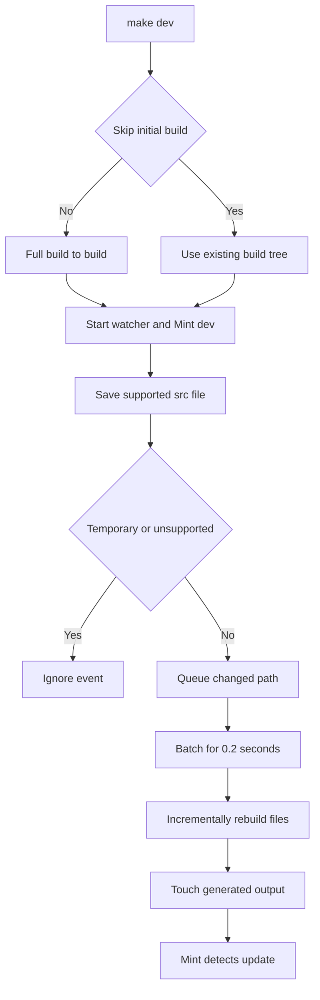

# Local Development Workflow

The local workflow has a strict source/output boundary: author Markdown, MDX, navigation, and assets in `src/`; the Python pipeline generates the Mintlify-facing `build/` tree. `build/` is disposable output—never edit it directly, because a full build removes and recreates it.

## Prerequisites and first-time setup

The repository requires Python 3.13+, Node.js, and `uv`. Clone the repository and install its Python dependency groups, project npm packages, and the global Mintlify CLI:

```bash
git clone https://github.com/langchain-ai/docs.git
cd docs
make install
```

`make install` runs `uv sync --all-groups`, `npm install`, and `npm install -g mint@latest`. The `docs` console script is installed by the Python project; if it is not found after installation, start a new shell. Mint is a separate global executable, so use `mint --version` to confirm it is available.

### Editor baseline

Open the repository directory itself so VS Code can apply `.vscode/settings.json`; other EditorConfig-aware editors use `.editorconfig`. For Markdown and MDX, keep soft wrapping on rather than inserting hard line breaks, preserve intentional trailing spaces, and do not auto-format on save. Repository settings use UTF-8, LF endings, spaces, a final newline, and two-space indentation for JSON and YAML.

## Choose an entrypoint

Use Make targets for normal checkout work. They install project npm dependencies before invoking the pipeline with the repository root on `PYTHONPATH`.

```bash
make dev                         # initial build, watch, and preview
make build                       # one clean full build, then exit
uv run pipeline dev              # direct development command
uv run pipeline dev --skip-build # reuse an existing build tree
uv run pipeline build            # direct one-shot build
```

`make dev` and `uv run pipeline dev` are equivalent development modes. `make build` and `uv run pipeline build` perform a full build without watching. Although the CLI accepts `docs build --watch`, the build implementation does not use that option; use `dev` for supported watch behavior.

## Start the edit–preview loop

```bash
make dev
```

Unless `--skip-build` is supplied, development mode builds the full site before starting the watcher. It then recursively watches `src/` and launches `mint dev --port 3000` with `build/` as its working directory. Open <http://localhost:3000> and inspect the rendered route, navigation, formatting, and links—not just the source file.



This is the normal local lifecycle: a full build establishes the generated tree, while the watcher applies focused source-file updates for the preview.

### Initial-build and process failures

A normal development start does not serve stale output if the initial build fails: it logs the failure and returns exit code 1 before creating the watcher or Mint process. `--skip-build` deliberately bypasses that guard and only warns if `build/` is absent. Use it only when a suitable generated tree already exists, such as after a brief interruption; use a normal `make dev` or `make build` after structural changes.

If `mint` cannot be started, the development command exits 1 and recommends `make install` or `npm install -g mint@latest`. Once started, it forwards Mint stdout as info logs and stderr as error logs. It waits for either Mint or the watcher: a nonzero Mint exit, a cancelled watcher, or an unexpected watcher stop makes the command fail.

### Stop cleanly

Press Ctrl+C in the terminal running development mode. The command asks the watcher to shut down, cancels any pending debounced rebuild, and terminates Mint. It waits up to five seconds for Mint to exit, then kills it if needed; it also cancels and joins the log-forwarding and watcher tasks. This avoids leaving a watcher or preview process running after an interrupted session.

## What the watcher does—and does not do

The watcher uses `watchdog` for recursive `src/` events. It handles create and modify events for builder-supported content and asset types, including `.mdx`, `.md`, `.json`, image and video formats, YAML, CSS, JavaScript/JSX/TSX, text, HTML, and font files. Editor backups ending in `~`, `.bak`, or `.orig`, and hidden temporary files ending in `.tmp`, `.temp`, or `.swp`, are ignored.

Events are accumulated in a set and each new event resets a 0.2-second debounce timer. A single changed file builds on one worker; a batch uses at most four workers and reports batch progress. After each build, the watcher touches the corresponding emitted file or files so Mint observes a changed timestamp and hot-reloads the preview. A versioned OSS page can therefore refresh Python and JavaScript outputs, while OpenWiki and Deep Agents Code content have one unversioned output.

Incremental work is intentionally narrower than a full build:

- A full build clears `build/`, emits versioned and unversioned domains, copies shared files and npm snippet components, then generates `llms.txt` and `llms-full.txt`.
- A watcher rebuild calls the per-file build path. It does not rerun whole-tree shared-file collection, npm overlays, or LLM artifact generation.
- A source deletion removes only the source-relative output path. It does not apply the complete routing map, so generated language or special-route variants can remain until a full build.

Run `make build` to recover from stale output and after navigation, routing, shared-asset, package-component, broad preprocessing, deletion, or other cross-file changes. Then restart or continue `make dev` to review the regenerated result.

## Full build and preview checks

Use a full build when you need a reproducible whole-tree result:

```bash
make build
```

The build requires `src/`, creates `build/` when needed, and calls `DocumentationBuilder.build_all()`. That operation deletes the prior output, produces Python and JavaScript variants plus unversioned content, copies shared artifacts, and creates LLM-oriented output files. A successful build is therefore the reset operation for stale generated files.

Before a pull request, select checks that cover the change rather than treating a local page refresh as complete validation:

| Change boundary | Command | What it establishes |
| --- | --- | --- |
| Pipeline, preprocessing, routing, or watcher behavior | `make test` | Runs pytest with network sockets disabled except Unix sockets; focus with `make test TEST_FILE=tests/unit_tests/test_watcher.py`. |
| Python tooling or spelling | `make lint` | Runs Ruff format/check, `ty`, and Codespell on `src`. |
| Markdown style | `make lint_md` | Runs markdownlint on Markdown and MDX below `src`; use `make lint_md_fix` to apply its fixes. |
| Prose | `make lint_prose` | Installs the repository-pinned Vale binary in `.bin/vale` and checks `src`, or paths supplied through `FILES`. |
| Generated links and anchors | `make broken-links-with-anchors` | Builds first, checks the generated tree with Mint, and filters known deployment-generated and standalone-snippet noise. |
| Source `@[ref]` references | `make check-cross-refs` | Checks source references independently of Mint's built-site link check. |

The focused watcher tests verify backup and temporary-file filtering. Add or update focused tests when changing watcher event filtering, rebuild, routing, or shutdown behavior; a rendered local preview alone does not establish those contracts. For broader validation boundaries, see [Testing Overview](/openwiki/testing/test-overview.md).

## Mintlify command boundary and troubleshooting

Raw `mint` commands must run from `build/`, not the project root. At the root, Mintlify can scan `.venv` files and attempt to parse Python package Markdown as MDX, producing errors such as an inability to parse a license file. Prefer the repository wrappers, which build first and change directory correctly:

```bash
make broken-links
make broken-links-with-anchors
```

When a raw Mint command is necessary, explicitly use the generated tree:

```bash
cd build
mint broken-links
```

The same working-directory rule applies to `mint export`, `mint openapi-check`, and similar raw Mint operations. `make export` and `make check-openapi` already run them from `build/`. For an offline export, `make export` requires a Mint CLI with `export`, Node LTS 20 or 22 rather than Node 25+, and an Enterprise Mintlify plan; `make htmltest` then checks external URLs in the exported archive. These export checks do not prove internal navigation—use `make broken-links-with-anchors` for that.

For general Mint compatibility errors, update the CLI:

```bash
mint update
# or
npm install -g mint@latest
```

If Mint warns that a new navigation page does not exist, check `src/docs.json`. A new group must list its root index route without an extension:

```json
{
  "group": "New group",
  "pages": ["new-group/index", "new-group/other-page"]
}
```

## Practical recovery checklist

1. Confirm the checkout meets Python, Node.js, `uv`, and global `mint` prerequisites; rerun `make install` when dependencies are missing.
2. For a failed initial build or suspicious preview, run `make build` and fix errors in `src/` or pipeline configuration—not in `build/`.
3. If the preview process exits, read forwarded Mint logs, update Mint if necessary, then restart `make dev`.
4. If a watcher update cannot explain a navigation, generated artifact, or deletion result, do a full build rather than relying on incremental state.
5. Run raw Mint commands only after `cd build`; otherwise use the provided Make target.

## Related pages

- [Quickstart](/openwiki/quickstart.md) for the concise contributor path and change-oriented validation selection.
- [Build System Architecture](/openwiki/architecture/build-system.md) for output routing, preprocessing, and full-build ownership.
- [Mintlify Integration](/openwiki/integrations/mintlify.md) for renderer, links, OpenAPI, and export boundaries.
- [Documentation CLI Tools](/openwiki/operations/cli-tools.md) for the complete Make and Python CLI reference.
- [Testing Overview](/openwiki/testing/test-overview.md) for test, link, cross-reference, and executable-sample scope.
