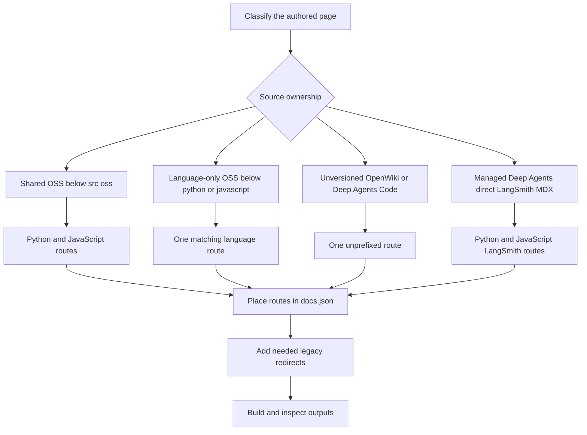

# Changing versioned content

Versioned documentation keeps shared prose in one source while the builder emits language-specific artifacts. Make three independent decisions: **source ownership** determines where an authored file belongs, **emitted routes** determine what the builder writes, and **navigation and redirects** determine how readers discover or reach routes. Work in `src/`, not `build/`: a full build clears and recreates generated output.



This flow separates authored ownership, generated routes, and Mintlify presentation.

## 1. Choose source ownership before writing

Choose an authored path for its build behavior, not for a desired sidebar label. The build uses `js` internally but exposes its route segment as `javascript`.

| Content class | Author in | Builder emits |
| --- | --- | --- |
| Shared OSS page | Most content below `src/oss/` | `/oss/python/...` and `/oss/javascript/...` |
| Language-specific OSS page | `src/oss/python/...` or `src/oss/javascript/...` | Only the matching language route; the source language directory is removed from the output path |
| Language-agnostic OSS product | `src/oss/openwiki/...` or `src/oss/deepagents/code/...` | One unprefixed `/oss/openwiki/...` or `/oss/deepagents/code/...` route |
| Managed Deep Agents page | A direct `src/langsmith/managed-deep-agents*.mdx` file | `/langsmith/python/...` and `/langsmith/javascript/...` |
| Other LangSmith page | `src/langsmith/...` | One unprefixed `/langsmith/...` route, rendered with the Python target |

Use a shared OSS file when the information is substantially the same and only examples, API names, install commands, or small implementation details differ. Use `src/oss/python/` or `src/oss/javascript/` when the page itself is genuinely language-specific; the current changed Python integration pages demonstrate this ownership boundary rather than an invitation to copy a shared guide into both trees. Do not create parallel authored copies merely to obtain both URLs.

`oss/deepagents/code` and `oss/openwiki` are intentional one-output exceptions. They select the Python conditional branch as a deterministic fallback, but that does not make those products Python documentation. Within those pages their own product routes remain unprefixed; an ordinary bare OSS destination still resolves as Python.

Managed Deep Agents is the LangSmith exception. A direct, correctly named `.mdx` file emits only language-prefixed variants during a full build; ordinary LangSmith generation excludes it, preventing an unversioned duplicate. Use `.mdx`: individual-file classification recognizes `.md` too, but full-build discovery glob-matches `managed-deep-agents*.mdx`.

For directory ownership details, see [Source directory map](/openwiki/architecture/source-map.md).

## 2. Put only differences in conditional blocks

Keep neutral headings, explanations, and concepts outside language branches. Use sequential `:::python` and `:::js` blocks only for material that actually differs. Versioned documentation uses conditional blocks to create separate Python and JavaScript outputs from a single source.

````markdown
Shared explanation.

:::python
```python
from langchain.agents import create_agent
```
:::

:::js
```typescript
import { createAgent } from "langchain";
```
:::
````

For a selected target, the matching supported block is emitted without its markers, the other supported block is removed, and text outside blocks remains. Only `python` and `js` are supported targets; an invalid target raises `ValueError`. Unsupported labels and unclosed supported blocks remain in the source-shaped output, so they are not validation constructs.

### Scope cross-references to their language branch

Autolinks are resolved **before** conditional rendering. `@[Name]`, `@[title][Name]`, and backticked forms use the active language scope established by `:::python` or `:::js`, outside ordinary code fences. A missing mapping is logged and left literal during preprocessing, so run the source-level validator after changing references.

````markdown
:::python
See @[StateGraph].
:::

:::js
See @[StateGraph].
:::
````

```bash
make check-cross-refs
```

A shared, unfenced OSS reference must resolve for both language maps; a language-specific source or fenced reference is checked in its applicable scope. See [Markdown preprocessing pipeline](/openwiki/concepts/preprocessing.md).

### Avoid conditional-parser traps

Conditional rendering is a whole-input regular-expression transform, not a code-fence-aware or nested-block parser. Do not nest conditionals and do not assume a normal Markdown code fence protects live conditional syntax. Escape literal markers in examples:

````markdown
\:::python
This is displayed literally.
\:::
````

Use matching indentation for readable source, but do not depend on indentation as a structural guard: the regex can retry from the opening marker and accept a differently indented close. The first eligible closing marker ends a match, so use ordinary prose or a separate escaped example rather than trying to express nesting.

## 3. Author links and reusable snippets for the active variant

### Links

For an ordinary OSS destination that should follow the active language, write an absolute unqualified route:

```mdx
<!-- openwiki: broken internal link [/oss/langgraph/overview] file "/oss/langgraph/overview" does not exist. Fix the href or restore the target, then delete this comment. -->
[LangGraph overview](/oss/langgraph/overview)
```

For a target-language render, the builder inserts `python` or `javascript` after `/oss/`. It preserves already-qualified paths, image paths, and the unversioned OpenWiki and Deep Agents Code roots. The same rule covers Markdown links and HTML `href` values. Use an explicitly qualified route only when a page must deliberately link to one language.

A bare Managed Deep Agents link similarly follows the selected target:

```mdx
<!-- openwiki: broken internal link [/langsmith/managed-deep-agents-quickstart] file "/langsmith/managed-deep-agents-quickstart" does not exist. Fix the href or restore the target, then delete this comment. -->
[Quickstart](/langsmith/managed-deep-agents-quickstart)
```

It becomes the Python or JavaScript LangSmith route; an already-qualified Managed Deep Agents URL stays fixed. This is why authored Managed Deep Agents links should normally be bare even though the built routes are language-prefixed.

### Markdown and MDX snippets

Store reusable Markdown or MDX fragments in `src/snippets/` and use an unqualified Markdown import from a versioned page:

```mdx
import RequiresLanggraphServer from '/snippets/oss/requires-langgraph-server.mdx';
```

The builder rewrites eligible `.md` and `.mdx` imports to `/snippets/python/` or `/snippets/javascript/`. Imports already scoped to either language and JSX or TSX component imports are unchanged. Shared Markdown snippets are independently preprocessed into Python and JavaScript copies plus a Python-targeted default copy. Write absolute `/oss/...` links inside a shared snippet: each copy then has a correct absolute language-prefixed destination even when a consumer is deeply nested.

When the reusable unit itself differs, import language-specific components and render each in its matching conditional branch. The shared Deep Agents quickstart follows this pattern for its Python and JavaScript code-sample components.

### Runnable samples

For executable examples, `src/code-samples/` is the source of truth. Delineate visible code with language-suffixed `:snippet-start:` and `:snippet-end:` markers. Put test-only setup and assertions in a trailing `:remove-start:` block; tests must execute the visible snippet before they exit.

```bash
make test-code-samples FILES="src/code-samples/langchain/return-a-string.py"
make code-snippets
```

`make code-snippets` extracts marked regions into the generated intermediate directory and generates MDX components in `src/snippets/code-samples/`. Do not hand-edit those components: update the sample, test it, regenerate, then import the generated Python and JavaScript components after page frontmatter and render them inside their corresponding branches.

## 4. Treat package-version claims as availability claims

A floor or pin is a reader-facing promise. First establish from the owning product or changelog that a release is the actual minimum for the feature. Then check that the exact written release was published:

```bash
uv run python scripts/check_version_claims.py --files src/path/to/page.mdx
```

The checker scans `.mdx` pages for `>=` floors and `==` pins. It chooses PyPI or npm from package syntax, nearby language labels, conditional fences, source paths, then a PyPI fallback; it checks publication availability only, not whether the release introduced the feature. This matters for unscoped package names whose Python and npm release lines differ.

Registry lookup failures and unsafe lookup inputs are reported as unresolved, not as unpublished-version failures. Exact releases and shortened series floors are accepted when a matching published release exists. Correct an inaccurate requirement rather than adding it to `scripts/version_claims_ignore.txt` unless it is a reviewed, intentional exception.

## 5. Configure navigation and redirects as separate contracts

A source file and emitted route do not create a visible navigation entry. After confirming the expected route, update the appropriate `src/docs.json` product, menu item, language dropdown, tab, and group. Use extensionless paths relative to `src` in navigation arrays, and locate a neighboring entry rather than inferring placement from a directory name.

For a shared OSS page, add its Python and JavaScript routes in their respective dropdowns. For a language-only page, add just the matching route. For OpenWiki or Deep Agents Code, add its one unprefixed route. Managed Deep Agents has parallel Python and JavaScript route entries in separate language dropdowns.

Redirects are independent of authored source and navigation. `docs.json` maps unprefixed and legacy Managed Deep Agents URLs to Python destinations because the builder does not emit unprefixed Managed Deep Agents pages. For any public route move, retain or add a redirect to the maintained canonical route; do not create an unversioned duplicate only to preserve an old URL.

When moving a page, explicitly decide all three outcomes:

1. Keep, move, or split the source according to ownership.
2. Confirm every Python, JavaScript, or unprefixed emitted route that must exist.
3. Update navigation and preserve required old public routes with redirects.

See [Adding and modifying documentation pages](/openwiki/operations/adding-pages.md) for the broader route-move procedure.

## 6. Build, inspect, and test the generated contract

Run a clean build after changing shared content, route rules, snippets, links, `docs.json`, or redirects:

```bash
make build
make broken-links
```

The full build clears `build/`, renders OSS Python and JavaScript variants, renders the unversioned OSS products and LangSmith content, produces Managed Deep Agents variants, copies shared inputs and npm snippet components, then generates LLM index artifacts. Generated output is verification material, not an editing surface. `make broken-links` builds first, asks Mint to validate redirects, and filters known deploy-time OpenAPI and standalone-snippet reports.

Inspect the relevant output contract:

1. Every expected route exists, and forbidden language siblings do not.
2. Each language artifact keeps shared prose and only its matching conditional content, with no selected-block markers.
3. Conditional API references resolve in the intended scope.
4. Bare OSS links, bare Managed Deep Agents links, and Markdown snippet imports acquire the expected language route.
5. Fixed-language links, image paths, and unversioned product paths remain unchanged.
6. Every new route appears in the intended `docs.json` location, and every retired public route has either a deliberate redirect or a documented removal decision.

When changing builder behavior, add a focused regression in `tests/unit_tests/test_builder.py`: assert final content as well as all expected and absent paths. Existing tests cover OSS prefix insertion and exemptions, unversioned product routes, language-scoped snippets, and Managed Deep Agents dual routes. Changes to version-claim parsing belong in `tests/unit_tests/test_check_version_claims.py`, including registry-selection precedence and lookup failures. See [Builder tests](/openwiki/testing/builder-tests.md).

## Completion checklist

- [ ] Select shared, language-specific, unversioned-product, or Managed Deep Agents ownership before choosing a URL or sidebar location.
- [ ] Keep shared prose outside sequential `:::python` and `:::js` branches.
- [ ] Scope language-dependent autolinks to their branch; run `make check-cross-refs` when references change.
- [ ] Do not nest conditionals or rely on a Markdown code fence to protect live conditional markers.
- [ ] Use an unqualified `/oss/...` or Managed Deep Agents link only when it should follow the active language.
- [ ] Import shared Markdown snippets without a language prefix and use absolute OSS links inside them.
- [ ] Test and regenerate runnable samples from `src/code-samples/`; do not hand-edit generated snippet MDX.
- [ ] Confirm every package floor semantically, then run `check_version_claims.py` for changed MDX specifiers.
- [ ] Update `src/docs.json` navigation and redirects separately from authored source placement.
- [ ] Run `make build` and `make broken-links`, then inspect all relevant generated routes without editing `build/`.

## See also

- [Language versioning strategy](/openwiki/concepts/versioning.md)
- [Markdown preprocessing pipeline](/openwiki/concepts/preprocessing.md)
- [Source directory map](/openwiki/architecture/source-map.md)
- [Builder tests](/openwiki/testing/builder-tests.md)
- [Code sample lifecycle](/openwiki/workflows/code-sample-lifecycle.md)
- [Adding and modifying documentation pages](/openwiki/operations/adding-pages.md)
