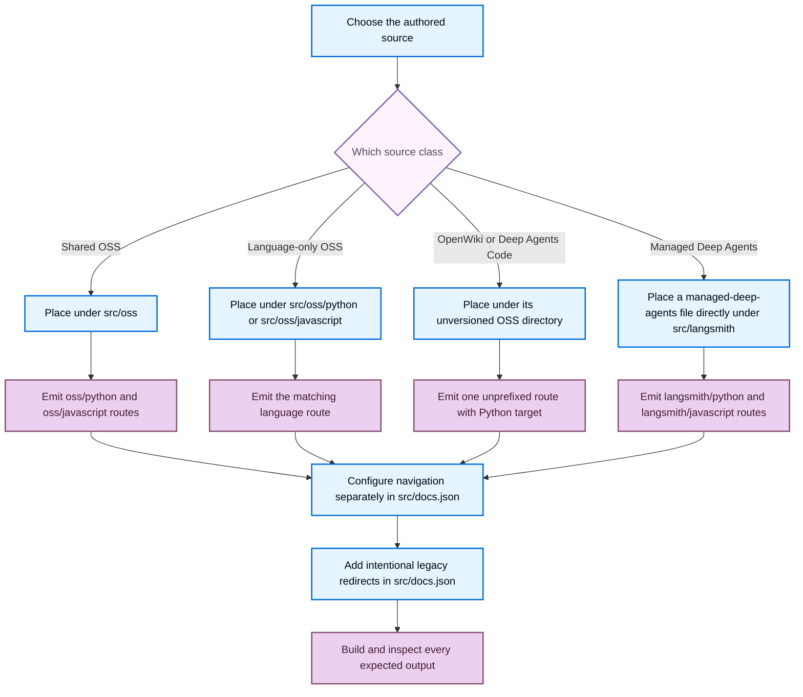

# Writing Versioned Content

Versioned documentation keeps shared prose in one source while the build emits language-specific artifacts. Make three independent decisions: **source ownership** determines where the authored file belongs, **emitted routes** determine what the builder writes, and **visible navigation and redirects** determine how readers discover or reach those routes. Never edit `build/`; it is regenerated by `make build`.



This flow separates where you write a page from the routes the builder produces and the entries readers see.

## Select source ownership and routes

Choose the authored path based on ownership, not on a desired URL. The builder maps `js` to `javascript` in public paths.

| Source ownership | Authored location | Emitted route or routes |
| --- | --- | --- |
| Shared OSS page | Most content below `src/oss/`, such as `langchain/`, `langgraph/`, and `deepagents/` | `/oss/python/...` and `/oss/javascript/...` |
| Language-only OSS page | `src/oss/python/...` or `src/oss/javascript/...` | The matching `/oss/python/...` or `/oss/javascript/...` route only |
| Language-agnostic product | `src/oss/openwiki/...` or `src/oss/deepagents/code/...` | One unprefixed `/oss/openwiki/...` or `/oss/deepagents/code/...` route |
| Managed Deep Agents page | A `managed-deep-agents*.md` or `.mdx` file directly in `src/langsmith/` | `/langsmith/python/...` and `/langsmith/javascript/...` |
| Other LangSmith page | `src/langsmith/...` | Its ordinary unprefixed LangSmith route, processed with the Python target |

Most OSS sources are emitted into Python and JavaScript route trees, while `oss/deepagents/code` and `oss/openwiki` are deliberate single-output exceptions rendered with the Python conditional target. For those exceptions, an ordinary unqualified OSS link still resolves to Python, while links within the unversioned product stay unprefixed.

Do not make copies under generated `python` or `javascript` paths. For ownership guidance, see [Source directory map](/openwiki/architecture/source-map.md).

## Write conditional content

Use one shared source for common text and sequential `:::python` and `:::js` blocks only where the content differs. The selected supported-language block is emitted without its markers, the other supported block is removed, and content outside both blocks remains in each artifact.

````markdown
Shared explanation.

:::python
```python
from langchain.agents import create_agent
```
:::

:::js
```typescript
import { createAgent } from "langchain";
```
:::
````

Keep a neutral heading and shared explanation outside the branches so both rendered pages remain coherent. Conditional rendering accepts only the `python` and `js` target keys; it emits the matching supported-language block without its fences, removes the nonmatching supported block, preserves unsupported labels, and raises ValueError for an invalid target.

### Scope API references to the branch

`@[Name]`, `@[title][Name]`, and backticked forms are resolved before conditional rendering. Autolink replacement tracks the active `:::language` scope outside ordinary code fences, resolves known references from that scope, and logs rather than fails when a reference is absent. Put language-dependent references inside their matching branches:

````markdown
:::python
See @[StateGraph].
:::

:::js
See @[StateGraph].
:::
````

Run `make check-cross-refs` after adding or changing an API reference. It is the source-level gate for unresolved names; a rendered page can hide an error in the branch excluded from one artifact. See [Markdown preprocessing pipeline](/openwiki/concepts/preprocessing.md).

### Avoid parser traps

Conditional rendering is regex-based rather than code-fence-aware or nested-block-aware, so literal conditional syntax must be escaped and nested conditionals are unsafe. Do not put live conditional markers inside a normal code fence, and do not nest branches. Escape both literal markers when documenting the syntax:

````markdown
\:::python
This is displayed literally.
\:::
````

The matching indentation of opening and closing markers matters. Unsupported labels and unmatched eligible openings remain unchanged, so do not use them as validation or nesting constructs.

## Author links and snippets for the active variant

For a destination that should follow the current OSS language, author an absolute, unqualified `/oss/...` link:

```mdx
<!-- openwiki: broken internal link [/oss/langgraph/overview] file "/oss/langgraph/overview" does not exist. Fix the href or restore the target, then delete this comment. -->
[LangGraph overview](/oss/langgraph/overview)
```

For a target-language build, unqualified absolute `/oss/` links receive the target route segment, but already-qualified routes, image paths, and the OpenWiki and Deep Agents Code roots are preserved. This applies to Markdown links and HTML `href` attributes. Use a qualified route only when the destination must remain fixed to that language.

Bare Managed Deep Agents links behave similarly: a `/langsmith/managed-deep-agents...` reference is rewritten to the selected `/langsmith/python/...` or `/langsmith/javascript/...` route. Keep an already-qualified Managed Deep Agents route when it is intentional.

Store reusable Markdown or MDX fragments under `src/snippets/` and import them without a language prefix from a versioned page:

```mdx
import RequiresLanggraphServer from '/snippets/oss/requires-langgraph-server.mdx';
```

Versioned-page imports of unqualified Markdown snippets are rewritten to `/snippets/python/` or `/snippets/javascript/`, while already scoped imports and JSX or TSX component imports are unchanged. Write absolute `/oss/...` links inside a shared snippet, rather than fixed relative paths.

Markdown snippets are independently preprocessed and emitted in Python and JavaScript copies plus a Python-targeted default copy, allowing their absolute links to work from consumers at arbitrary nesting depths. Use separate language-specific snippet components only when the reusable unit itself differs. The shared Deep Agents quickstart demonstrates language-specific reusable units by importing Python and JavaScript snippet components separately and rendering each invocation inside its matching conditional branch.

## Configure navigation and redirects separately

A source file and a built route do not create a visible navigation entry. For a new or moved page, update the appropriate `src/docs.json` product, menu, language dropdown, tab, and group after choosing source ownership and confirming the output route. The Managed Deep Agents tab explicitly lists parallel Python and JavaScript route entries in its respective dropdowns.

A redirect is also independent from source placement and navigation. Add or retain a `redirects` entry in `src/docs.json` only for a supported legacy or alias URL, and point it to the intended canonical route. For example, the unprefixed Managed Deep Agents overview and other legacy Managed Deep Agents URLs redirect to Python routes; the builder does not emit orphaned unprefixed Managed Deep Agents pages. Do not create an unversioned source copy merely to serve an old URL.

When a page moves, decide all three outcomes explicitly:

1. Keep, move, or split the authored source according to ownership.
2. Confirm every emitted Python, JavaScript, or unprefixed route that must exist.
3. Update navigation entries and add redirects for old public routes when readers need continuity.

For the navigation procedure, see [Adding and modifying documentation pages](/openwiki/operations/adding-pages.md).

## Build and inspect outputs

Run a clean build after changing a shared source, link, snippet, route rule, navigation entry, or redirect:

```bash
make build
```

Inspect generated output as verification only. Do not edit it. For a shared OSS or Managed Deep Agents page, inspect both language variants. For a language-only or unversioned product page, inspect the one expected route and confirm that unexpected language duplicates do not exist.

Check the following:

1. The expected route exists, with the matching conditional content and without the opposite supported branch or selected-block markers.
2. Shared prose appears in every expected variant.
3. Conditional API references resolve in the correct scope.
4. Unqualified OSS links, Managed Deep Agents links, and Markdown snippet imports have the expected language prefix.
5. Intentional fixed-language links, image paths, and unversioned OpenWiki or Deep Agents Code paths remain unchanged.
6. Each new route appears in the intended navigation location, and each old route has either a deliberate redirect or a documented removal decision.

When changing builder behavior, add a focused regression in `tests/unit_tests/test_builder.py`. Existing coverage exercises OSS prefix insertion and exemptions, unversioned product output, language-scoped snippets, and Managed Deep Agents dual routes. For fence-focused tests, see [Conditional rendering tests](/openwiki/testing/conditional-rendering.md).

## Checklist

- [ ] Choose the authored source class before choosing navigation or redirects.
- [ ] Keep shared prose outside sequential `:::python` and `:::js` branches.
- [ ] Do not nest conditionals or rely on code fences to protect live markers.
- [ ] Use unqualified `/oss/...` links only when the destination should follow the active language.
- [ ] Import Markdown snippets unprefixed and use absolute OSS links in shared snippets.
- [ ] Configure navigation and redirects in `src/docs.json` separately from source and output routes.
- [ ] Run `make build`, then inspect every expected output without modifying generated artifacts.

## See also

- [Language versioning strategy](/openwiki/concepts/versioning.md)
- [Markdown preprocessing pipeline](/openwiki/concepts/preprocessing.md)
- [Source directory map](/openwiki/architecture/source-map.md)
- [Conditional rendering tests](/openwiki/testing/conditional-rendering.md)
- [Adding and modifying documentation pages](/openwiki/operations/adding-pages.md)
