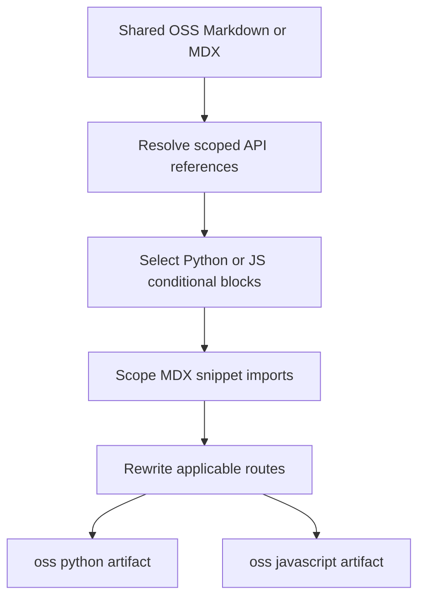

# Writing Versioned Content

Shared OSS sources normally produce two artifacts: a Python route and a JavaScript route. Author common prose once, and isolate only the material that actually differs. The builder renders shared OSS content for the `python` and `js` targets; `js` becomes `javascript` in public URLs.



This shows the transformation sequence for a versioned Markdown artifact; API-reference resolution occurs while language fences are still present.

## Choose the right source model

| Authoring location | Output model | What to do |
| --- | --- | --- |
| Most `src/oss/` content, including `langchain/`, `langgraph/`, and `deepagents/` | Both `/oss/python/...` and `/oss/javascript/...` | Share one source and use conditional blocks for divergent content. |
| `src/oss/python/` or `src/oss/javascript/` | Only the matching language route | Use this for a page that genuinely exists for one language only. |
| `src/oss/openwiki/` and `src/oss/deepagents/code/` | One unprefixed product route | These are exceptions. They render conditional content with the Python target; they are not duplicated. |
| Direct `src/langsmith/managed-deep-agents*.mdx` files | `/langsmith/python/...` and `/langsmith/javascript/...` | Share the source, but use the Managed Deep Agents route model rather than ordinary LangSmith output. |

Do not create copies that mirror generated `python` or `javascript` paths. `build/` is generated output; edit the source under `src/` and maintain navigation separately in `src/docs.json` when adding or moving pages. See [Source directory map](/openwiki/architecture/source-map.md) and [Adding and modifying documentation pages](/openwiki/operations/adding-pages.md).

## Write conditional content

Use only `python` and `js` labels. The selected branch is emitted without its `:::` markers; the other supported branch is removed. Content outside a block remains in both artifacts.

````markdown
Shared explanation.

:::python
```python
from langchain.agents import create_agent
```
:::

:::js
```typescript
import { createAgent } from "langchain";
```
:::
````

Keep a neutral heading and shared explanation outside the branches. This makes both artifacts coherent and reduces drift. The repository's LangChain, LangGraph, and Deep Agents quickstarts use this pattern for installation commands, imports, executable examples, and language-specific components.

### Scope API-reference links with the branch

`@[Name]`, `@[title][Name]`, and backticked forms are resolved before conditional rendering. The preprocessor tracks the active conditional label when resolving those references, so place a language-dependent API reference inside its matching branch:

````markdown
:::python
See @[StateGraph].
:::

:::js
See @[StateGraph].
:::
````

An unknown reference is left in the output and logged rather than causing this preprocessing step to fail. Run `make check-cross-refs` to make unresolved references an authoring failure. For syntax and map details, see [Markdown preprocessing pipeline](/openwiki/concepts/preprocessing.md).

### Literal fences and parser limits

Conditional rendering is a whole-document regular-expression pass, not a nested Markdown parser. Do not nest conditional blocks: the first eligible closing marker ends the current match. It is also **not code-fence-aware**. A literal `:::python ... :::` example inside a normal triple-backtick fence can therefore still be rendered.

Escape **both** literal markers with a backslash when teaching this syntax. The final pass removes the backslashes and leaves the markers visible:

````markdown
\:::python
This is displayed literally.
\:::
````

Use matching indentation for opening and closing markers, especially inside components or lists. Do not rely on indentation as a nesting mechanism. Unsupported labels and an opening marker without an eligible close are retained unchanged, rather than validated or normalized.

## Let links follow the current variant

For a link to normally versioned OSS content, use an absolute, unqualified `/oss/...` route. The builder inserts the current target route segment in Markdown links and HTML `href` attributes:

```mdx
<!-- openwiki: broken internal link [/oss/langgraph/overview] file "/oss/langgraph/overview" does not exist. Fix the href or restore the target, then delete this comment. -->
[LangGraph overview](/oss/langgraph/overview)
```

The Python artifact links to `/oss/python/langgraph/overview`; the JavaScript artifact links to `/oss/javascript/langgraph/overview`.

Do **not** apply that rule blindly:

- Already-qualified `/oss/python/...` and `/oss/javascript/...` links are preserved. Use one only when the destination must be a particular language rather than the current one.
- `/oss/openwiki/...` and `/oss/deepagents/code/...` are language-agnostic exceptions and remain unprefixed.
- Paths containing `images` are not rewritten.
- An unversioned page is processed with the Python target. Its unqualified link to ordinary OSS content therefore goes to Python unless you explicitly qualify it.
- Bare `/langsmith/managed-deep-agents...` links follow a target-language render and become `/langsmith/python/...` or `/langsmith/javascript/...`; a pre-qualified destination remains intentional.

This distinction matters in reusable prose: do not hard-code a language prefix merely because the source happens to be viewed from one variant, and do not add one to an intentional unversioned product URL.

## Import reusable snippets

Store reusable Markdown/MDX fragments under `src/snippets/`. In a versioned page, import an MDX snippet from its unprefixed source path:

```mdx
import RequiresLanggraphServer from '/snippets/oss/requires-langgraph-server.mdx';
```

The Python artifact imports `/snippets/python/oss/requires-langgraph-server.mdx`; the JavaScript artifact imports `/snippets/javascript/oss/requires-langgraph-server.mdx`. Already scoped `python/` or `javascript/` MDX imports are left unchanged, as are JSX and TSX component imports.

The builder preprocesses each snippet separately for both targets, including conditional blocks and applicable OSS and Managed Deep Agents links, then also writes a Python-targeted copy at the original snippet path. That default copy serves unversioned consumers. This prevents a nested page from resolving a snippet's OSS link relative to the wrong directory; write absolute `/oss/...` links in shared snippets rather than fixed `../` paths.

The Deep Agents quickstart illustrates a related authoring choice: it imports distinct `*Py` and `*Js` snippet components, then places each component invocation in its respective conditional branch. Use this when the reusable units themselves are language-specific; use one conditional snippet when the fragment can share surrounding structure.

## Verify the complete artifact boundary

After changing a shared source, run a clean build and inspect both emitted variants:

```bash
make build
```

For each variant, verify all of the following:

1. The matching conditional text and code are present, and the opposite branch and all selected-block markers are absent.
2. Shared prose is present in both artifacts.
3. Conditional API references resolve to the correct language map.
4. Unqualified OSS links and MDX snippet imports have the correct `python` or `javascript` segment.
5. Unversioned OpenWiki and Deep Agents Code links remain unprefixed, and explicitly qualified links were not rewritten again.

When modifying pipeline behavior, add or update a focused builder regression in `tests/unit_tests/test_builder.py`; existing coverage exercises OSS prefix insertion and exemptions, unversioned OSS products, language-scoped snippets, and Managed Deep Agents dual routes. For regex fence edge cases and focused test commands, see [Conditional rendering tests](/openwiki/testing/conditional-rendering.md).

## Authoring checklist

- [ ] The file belongs to a shared, language-specific, or deliberate unversioned source domain.
- [ ] Shared prose and headings are outside `:::python` / `:::js` blocks; only true differences are fenced.
- [ ] Conditional blocks are sequential, use supported labels, and do not rely on code fences or nesting for safety.
- [ ] Literal conditional syntax escapes both `:::` markers.
- [ ] Unqualified `/oss/...` links are used only when the destination should follow the active language; unversioned product and intentional fixed-language links are exceptions.
- [ ] MDX snippets are imported unprefixed in versioned pages and use absolute OSS links internally.
- [ ] Both generated language artifacts have been inspected after `make build`.

## Related documentation

- [Language versioning strategy](/openwiki/concepts/versioning.md)
- [Markdown preprocessing pipeline](/openwiki/concepts/preprocessing.md)
- [Source directory map](/openwiki/architecture/source-map.md)
- [Conditional rendering tests](/openwiki/testing/conditional-rendering.md)
- [Adding and modifying documentation pages](/openwiki/operations/adding-pages.md)
