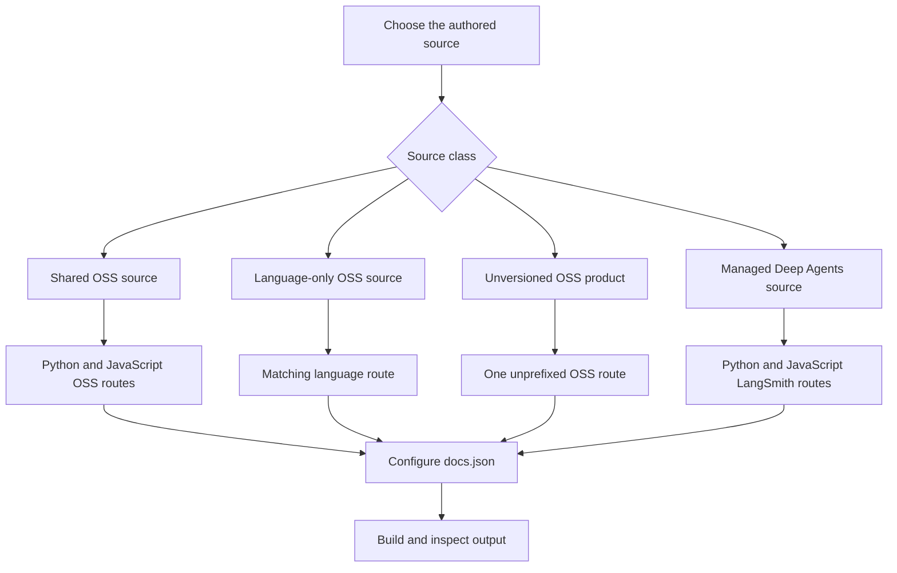

# Versioned Content

Versioned documentation keeps shared prose in one source while the builder writes language-specific artifacts. Treat **source ownership**, **emitted routes**, and **reader-facing navigation and redirects** as separate decisions. Edit `src/`, never `build/`: a full build deletes and regenerates the output tree.



This flow distinguishes authored location, generated route families, and navigation configuration.

## Select ownership before writing routes

The builder maps its internal `js` target to `javascript` in public routes.

| Source class | Authored location | Generated output |
| --- | --- | --- |
| Shared OSS page | Most content below `src/oss/`, including `langchain/`, `langgraph/`, and `deepagents/` outside `code/` | `/oss/python/...` and `/oss/javascript/...` |
| Language-only OSS page | `src/oss/python/...` or `src/oss/javascript/...` | Only the matching `/oss/python/...` or `/oss/javascript/...` route; the source-language directory is removed |
| Language-agnostic product | `src/oss/openwiki/...` or `src/oss/deepagents/code/...` | One unprefixed `/oss/openwiki/...` or `/oss/deepagents/code/...` route |
| Managed Deep Agents page | A direct `managed-deep-agents*.mdx` file in `src/langsmith/` | `/langsmith/python/...` and `/langsmith/javascript/...` |
| Other LangSmith page | `src/langsmith/...` | One unprefixed `/langsmith/...` route, rendered with the Python target |

Most OSS sources are emitted into Python and JavaScript route trees, while `oss/deepagents/code` and `oss/openwiki` are deliberate single-output exceptions rendered with the Python conditional target. That target is a deterministic rendering fallback, not a declaration that either product is Python-only. Links within those product roots remain unprefixed, while an ordinary unqualified OSS link from one of them resolves to Python.

Managed Deep Agents classification recognizes direct `.md` and `.mdx` files whose name begins `managed-deep-agents`, but the full-build discovery pass glob-matches `managed-deep-agents*.mdx`. Use `.mdx` for these pages; a `.md` file can work through an individual-file build but is not found by that full-build pass.

Do not create duplicate authored copies below generated `python` or `javascript` locations. See [Source directory map](/openwiki/architecture/source-map.md) for the broader source layout.

## Write one shared page with conditional branches

Use `:::python` and `:::js` only for material differences. Keep shared prose, headings, and explanations outside branches so both artifacts are complete.

````markdown
Shared explanation.

:::python
```python
from langchain.agents import create_agent
```
:::

:::js
```typescript
import { createAgent } from "langchain";
```
:::
````

Versioned documentation uses conditional blocks to create separate Python and JavaScript outputs from a single source. Conditional rendering accepts only the `python` and `js` target keys; it emits the matching supported-language block without its fences, removes the nonmatching supported block, preserves unsupported labels, and raises `ValueError` for an invalid target.

### Scope API references where they appear

`@[Name]`, `@[title][Name]`, and backticked forms are resolved before conditional rendering. Autolink replacement tracks the active `:::language` scope outside ordinary code fences, resolves known references from that scope, and logs rather than fails when a reference is absent. Put a language-dependent reference in its matching branch:

````markdown
:::python
See @[StateGraph].
:::

:::js
See @[StateGraph].
:::
````

Run `make check-cross-refs` after changing API references. Resolution happens before the other branch is removed, so reviewing just one rendered artifact cannot establish that the excluded branch is valid. See [Markdown preprocessing pipeline](/openwiki/concepts/preprocessing.md).

### Do not rely on Markdown fences as protection

Conditional rendering is regex-based rather than code-fence-aware or nested-block-aware, so literal conditional syntax must be escaped and nested conditionals are unsafe. Do not put active conditional markers inside an ordinary code fence and do not nest branches. Escape literal opening and closing markers:

````markdown
\:::python
This is displayed literally.
\:::
````

Opening and closing markers need matching indentation. Unsupported labels and unmatched supported openings remain in the text; they are not validation mechanisms.

## Let links and snippets follow the selected variant

For an OSS destination that should follow the current reader language, author an absolute unqualified route:

```mdx
<!-- openwiki: broken internal link [/oss/langgraph/overview] file "/oss/langgraph/overview" does not exist. Fix the href or restore the target, then delete this comment. -->
[LangGraph overview](/oss/langgraph/overview)
```

For a target-language build, unqualified absolute `/oss/` links receive the target route segment, but already-qualified routes, image paths, and the OpenWiki and Deep Agents Code roots are preserved. Use an already-qualified path only when the destination must intentionally stay on that language.

Managed Deep Agents links follow the same rule: a bare `/langsmith/managed-deep-agents...` reference becomes the selected `/langsmith/python/...` or `/langsmith/javascript/...` route. A qualified Managed Deep Agents route remains fixed.

Store reusable Markdown or MDX fragments below `src/snippets/` and import them without a language prefix from a versioned page:

```mdx
import RequiresLanggraphServer from '/snippets/oss/requires-langgraph-server.mdx';
```

Versioned-page imports of unqualified Markdown snippets are rewritten to `/snippets/python/` or `/snippets/javascript/`, while already scoped imports and JSX or TSX component imports are unchanged. Markdown snippets are independently preprocessed and emitted in Python and JavaScript copies plus a Python-targeted default copy, allowing their absolute links to work from consumers at arbitrary nesting depths. Use absolute `/oss/...` links in shared snippets, not nesting-sensitive relative links.

Use separate language-specific snippet components only when the reusable unit differs. The shared Deep Agents quickstart demonstrates language-specific reusable units by importing Python and JavaScript snippet components separately and rendering each invocation inside its matching conditional branch.

## Generate executable examples from their source

Runnable documentation examples originate in `src/code-samples/`; the code-snippet target extracts marked regions to a generated intermediate directory and generates MDX components under `src/snippets/code-samples/`, after authors test the source sample.

Mark the reader-visible region with a language-suffixed `:snippet-start:` and `:snippet-end:` ID. Put test-only setup or assertions in a trailing `:remove-start:` block. The whole source file runs during testing, so the visible snippet must execute before any `SystemExit`, `process.exit`, or equivalent early exit.

```bash
make test-code-samples FILES="src/code-samples/langchain/return-a-string.py"
make code-snippets
```

`make code-snippets` runs extraction and then MDX generation. The intermediate `src/code-samples-generated/` directory is gitignored; `src/snippets/code-samples/` is derived output. Change the runnable sample, test it, regenerate, and review the MDX diff rather than hand-editing the generated component. Keep related Python snippets in one source file when practical; split TypeScript examples when top-level imports or bindings would collide during execution. For the complete lifecycle, including targeted regeneration and trace links, see [Code sample lifecycle](/openwiki/workflows/code-sample-lifecycle.md).

## Validate package-version claims

A package floor or pin is a promise that a reader can resolve the named release. First establish from the owning product source or changelog that the release is actually the minimum. Then check publication:

```bash
uv run python scripts/check_version_claims.py --files src/path/to/page.mdx
```

The version-claim checker scans `.mdx` pages for `>=` floors and `==` pins, determines PyPI or npm from package syntax, nearby language labels, conditional fences, source paths, and a PyPI fallback, and checks only whether the written release was published. A passing result proves availability, not that the release introduced the feature.

For ambiguous unscoped names, make the intended ecosystem clear. The resolver gives scoped npm syntax and Python extras highest priority; then nearby same-line labels, the enclosing conditional fence, and a language-specific source path; otherwise it defaults to PyPI. This matters for `deepagents`, whose PyPI and npm releases use different version lines.

Registry lookup failures and invalid lookup inputs are unresolved rather than unpublished-version failures, while exact version matches and shortened version-series floors are accepted when a corresponding published release exists. Correct a bad requirement rather than adding it to `scripts/version_claims_ignore.txt` unless the exception is reviewed and intentional. See [Language versioning strategy](/openwiki/concepts/versioning.md) for the distinction between route rendering and package-claim validation.

## Configure navigation and redirects independently

A source file and generated artifact do not make a visible navigation entry. Update the appropriate `src/docs.json` product, menu, language dropdown, tab, and group after confirming the route. Managed Deep Agents navigation has parallel Python and JavaScript route entries in separate language dropdowns, while `docs.json` maps unprefixed and legacy Managed Deep Agents URLs to Python destinations.

A redirect is independent of source placement and navigation. Retain or add a `redirects` entry only for a supported legacy or alias URL, pointing to the canonical route. The builder deliberately emits no unprefixed Managed Deep Agents page; redirects serve old unprefixed URLs. Do not create an unversioned source duplicate to preserve an old URL.

For a move, decide explicitly:

1. Whether the authored source stays shared, becomes language-only, or belongs to an unversioned product.
2. Every generated Python, JavaScript, or unprefixed route that must exist.
3. The navigation entries and legacy redirects readers need.

See [Adding and modifying documentation pages](/openwiki/operations/adding-pages.md) for navigation mechanics.

## Build, inspect, and test the contract

```bash
make build
```

The full build clears the build directory, generates OSS Python and JavaScript variants, builds unversioned OSS products and LangSmith content, emits Managed Deep Agents variants, and then copies shared files. It subsequently copies npm snippet components and creates the `llms.txt` artifacts. Inspect output as verification only; do not edit it.

For a shared OSS or Managed Deep Agents page, inspect both language variants. For a language-only or unversioned page, inspect the one expected route and verify that unexpected duplicates do not exist. Check that:

1. Matching conditional content appears without its selected markers, and the opposite supported branch is absent.
2. Shared prose and branch-scoped autolinks resolve in each expected variant.
3. Unqualified OSS, Managed Deep Agents, and Markdown-snippet references acquired the expected language prefix.
4. Intentionally fixed-language links, image paths, and unversioned OpenWiki or Deep Agents Code paths did not change.
5. Every new route is in its intended navigation location and old public routes have a deliberate redirect or removal decision.

When changing builder behavior, add a focused regression in `tests/unit_tests/test_builder.py`; its existing coverage protects prefix insertion and exemptions, unversioned product output, language-scoped snippets, and Managed Deep Agents dual routes. Test package-claim parser or registry-resolution changes in `tests/unit_tests/test_check_version_claims.py`, including precedence and lookup failures.

## Checklist

- [ ] Choose the source class before choosing navigation or redirects.
- [ ] Keep common material outside sequential `:::python` and `:::js` blocks.
- [ ] Do not nest conditionals or rely on a code fence to protect active markers.
- [ ] Use unqualified `/oss/...` links only when the destination should follow the active language.
- [ ] Import Markdown snippets unprefixed and use absolute OSS links inside shared snippets.
- [ ] Test executable source samples and regenerate their derived snippet MDX.
- [ ] Confirm a package floor is semantically correct and run `check_version_claims.py` for changed MDX specifiers.
- [ ] Configure `src/docs.json` navigation and redirects separately from generated routes.
- [ ] Run `make build` and inspect every expected artifact without modifying `build/`.

## See also

- [Language versioning strategy](/openwiki/concepts/versioning.md)
- [Markdown preprocessing pipeline](/openwiki/concepts/preprocessing.md)
- [Source directory map](/openwiki/architecture/source-map.md)
- [Code sample lifecycle](/openwiki/workflows/code-sample-lifecycle.md)
- [Adding and modifying documentation pages](/openwiki/operations/adding-pages.md)
