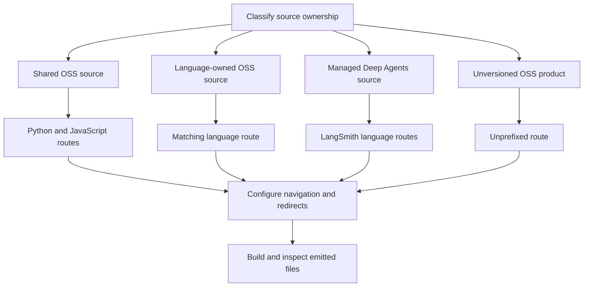

# Changing Versioned Content

Changing a page safely means maintaining four independent contracts: authored source, emitted routes, navigation, and redirects. A route in `src/docs.json` does not cause the builder to emit a page; conversely, an emitted page is not automatically navigable or reachable from a retired public URL. Author under `src/`; `build/` is regenerated output and must not be edited.


```mermaid
flowchart TD
    Start["Classify source ownership"] --> Shared["Shared OSS source"]
    Start --> Owned["Language-owned OSS source"]
    Start --> MDA["Managed Deep Agents source"]
    Start --> Product["Unversioned OSS product"]
    Shared --> Dual["Python and JavaScript routes"]
    Owned --> Single["Matching language route"]
    MDA --> MDADual["LangSmith language routes"]
    Product --> Plain["Unprefixed route"]
    Dual --> Configure["Configure navigation and redirects"]
    Single --> Configure
    MDADual --> Configure
    Plain --> Configure
    Configure --> Verify["Build and inspect emitted files"]
```

This flow shows build emission first, then the separately owned navigation and redirect decisions.

## 1. Choose the source owner

The builder target keys are `python` and `js`; their URL segments are `python` and `javascript`.

| Content | Author in | Emitted route or routes |
| --- | --- | --- |
| Shared OSS page | Most of `src/oss/` | `/oss/python/...` and `/oss/javascript/...` |
| Language-owned OSS page | `src/oss/python/...` or `src/oss/javascript/...` | Only the matching language route, with the source-language directory removed |
| Deep Agents Code or OpenWiki | `src/oss/deepagents/code/...` or `src/oss/openwiki/...` | One unprefixed product route |
| Managed Deep Agents page | Direct `src/langsmith/managed-deep-agents*.mdx` file | `/langsmith/python/...` and `/langsmith/javascript/...` |
| Other LangSmith page | `src/langsmith/...` | One unprefixed `/langsmith/...` route, processed with the Python target |

Use a shared page when its explanation is common but SDK names, package strings, filenames, API spellings, or examples differ. `src/oss/python/` and `src/oss/javascript/` indicate a guide owned by one SDK; they are not a sidebar-placement mechanism. In a full OSS build, a language-owned source is processed only for its matching target and its ownership directory is removed from the output path.

Deep Agents Code and OpenWiki are deliberately single-output products. Their conditional content is rendered with the Python target as a deterministic fallback; that does not make them Python documentation. Their product paths remain unprefixed. An ordinary bare `/oss/...` link from one of these pages, however, resolves to the Python OSS route.

Managed Deep Agents is the LangSmith exception. The ordinary LangSmith pass excludes Managed Deep Agents files, while a dedicated pass discovers direct `managed-deep-agents*.mdx` files and emits both variants. Use a direct `.mdx` filename matching that pattern: individual-file classification accepts `.md`, but the full-build glob does not discover it. Do not add an unversioned source copy merely to support an old URL.

## 2. Branch only the language-specific unit

Keep shared headings, explanation, and behavior outside branches. Use adjacent `:::python` and `:::js` blocks for the unit that actually differs:

````markdown
Shared explanation.

:::python
```python
from langchain.agents import create_agent
```
:::

:::js
```typescript
import { createAgent } from "langchain";
```
:::
````

For a selected target, conditional rendering removes the matching supported-block markers and keeps its content; it removes the other supported block. Only `python` and `js` are valid targets, and another target raises `ValueError`. An unsupported label is preserved rather than validated or removed.

Branch a coherent unit—such as a table, setup command plus filename, or component invocation—rather than only a code fence. The Managed Deep Agents agent-definition and runtime pages use parallel branches for Python and JavaScript filenames, APIs, types, and nullability conventions while retaining product explanation outside the branches. This prevents an import, type, or filename for one SDK from accompanying an example for the other.

### Conditional syntax is not structural parsing

Conditional rendering is a whole-document regex transformation. It is not code-fence-aware and cannot safely model nested conditionals. To show literal syntax, escape it:

````markdown
\:::python
This is displayed literally.
\:::
````

Do not nest conditionals and do not rely on indentation or a Markdown code fence to protect live conditional syntax. The opener pattern can retry with an empty indentation capture, and the first eligible closing marker ends the non-greedy match.

### Scope autolinks deliberately

Markdown preprocessing resolves `@[Name]`, `@[title][Name]`, and backticked forms before it renders conditionals. Outside ordinary Markdown code fences, an active `:::python` or `:::js` fence selects the autolink map; otherwise the build target is the default scope. An unknown reference is logged and left unchanged rather than failing the build. After changing references, run:

```bash
make check-cross-refs
```

A reference outside a branch in a shared page must make sense in both outputs. Put an SDK-specific autolink inside its branch. Escaped autolinks are preserved literally after their escape is removed.

## 3. Author links and snippets for the target output

### OSS and Managed Deep Agents links

For an ordinary OSS destination that should follow the active language, author an absolute, unqualified OSS route:

```mdx
<!-- openwiki: broken internal link [/oss/deepagents/overview] file "/oss/deepagents/overview" does not exist. Fix the href or restore the target, then delete this comment. -->
[Deep Agents overview](/oss/deepagents/overview)
```

A targeted build inserts `python` or `javascript` after `/oss/`. It does not rewrite an already-qualified route, a path containing `images`, or an OpenWiki or Deep Agents Code root/path. Explicitly qualify a route only when it must remain fixed to one SDK.

Use the same approach for a Managed Deep Agents link that should follow the selected variant:

```mdx
<!-- openwiki: broken internal link [/langsmith/managed-deep-agents-deploy] file "/langsmith/managed-deep-agents-deploy" does not exist. Fix the href or restore the target, then delete this comment. -->
[Deploy](/langsmith/managed-deep-agents-deploy)
```

The builder rewrites it to `/langsmith/python/...` or `/langsmith/javascript/...`. An already language-qualified Managed Deep Agents route remains fixed. Thus bare source links are correct even though no unprefixed Managed Deep Agents page is emitted.

### Markdown snippets

Store reusable Markdown or MDX fragments below `src/snippets/`, and import an unqualified Markdown fragment from a versioned page:

```mdx
import RequiresLanggraphServer from '/snippets/oss/requires-langgraph-server.mdx';
```

The builder rewrites eligible `.md` and `.mdx` imports to `/snippets/python/` or `/snippets/javascript/`; already scoped imports and JSX or TSX component imports are unchanged. It independently preprocesses Markdown snippets into Python and JavaScript copies plus a Python-targeted default copy. Use absolute `/oss/...` links inside a shared fragment so each emitted copy works from consumers at arbitrary nesting depths.

## 4. Change navigation and redirects separately

Creating a source file does not create a sidebar entry. After confirming emitted paths, edit `src/docs.json` in the appropriate product, menu, tab, or group. Navigation entries use extensionless paths relative to `src`.

For shared OSS pages, add Python and JavaScript paths in their respective navigation. A language-owned page belongs only in its matching navigation, and an unversioned product page has one unprefixed entry. Managed Deep Agents has parallel Python and JavaScript Managed Deep Agents tabs with mirrored language-prefixed page paths.

Redirects are a separate public-URL contract. `docs.json` maps unprefixed and legacy Managed Deep Agents URLs to Python destinations because the builder deliberately emits no unprefixed Managed Deep Agents page. When moving or versioning a public page, decide whether the retired URL needs a redirect to its maintained canonical route; do not generate an orphaned unversioned duplicate for compatibility.

For every route change, explicitly review:

1. The source owner and every route that must exist.
2. Sidebar placement for every reader-facing output.
3. Existing public URLs and required redirects.
4. Links from shared, language-specific, and unversioned pages.

See [Adding and Maintaining Documentation Pages](/openwiki/operations/adding-pages.md) for the general page-move procedure.

## 5. Build and inspect the generated contract

Run a clean build when changing shared pages, links, snippets, builder rules, navigation, or redirects:

```bash
make build
make broken-links
```

`build_all()` removes the old build directory, builds both OSS variants, builds the two unversioned OSS products and ordinary LangSmith content, emits Managed Deep Agents variants, then copies shared files. `make broken-links` builds first and invokes Mint with redirect checking; use `make broken-links-with-anchors` when anchor changes matter. The broken-link task filters standalone snippet reports because their absolute language-prefixed OSS links are valid after inlining, not when Mint evaluates a fragment by itself.

Inspect generated files but never modify them:

1. Required routes exist and prohibited language siblings do not.
2. Each variant retains shared prose and its own branch only, without selected-branch markers.
3. SDK-scoped autolinks resolve in the intended branch.
4. Bare OSS links, bare Managed Deep Agents links, and Markdown imports point to the expected target path.
5. Already-qualified links, image paths, and unversioned product paths remain unchanged.
6. `docs.json` exposes every new route and redirects every retired public route deliberately.

When changing build behavior, add a focused regression to `tests/unit_tests/test_builder.py` that asserts content plus route presence or absence. The existing tests cover OSS-link exemptions, single-output products, snippet variants, and Managed Deep Agents route and link rewriting.

## Completion checklist

- [ ] Select source ownership before deciding sidebar placement or redirects.
- [ ] Put common prose outside sequential `:::python` and `:::js` branches.
- [ ] Do not nest conditionals or trust indentation or code fences to protect conditional markers.
- [ ] Put language-specific autolinks in their branch and run `make check-cross-refs` after reference changes.
- [ ] Use bare `/oss/...` and Managed Deep Agents links only when they should track the active language.
- [ ] Import shared Markdown snippets without a language prefix and use absolute OSS paths inside them.
- [ ] Update navigation and redirects in `src/docs.json` independently of source placement.
- [ ] Run `make build` and link validation, then inspect generated routes without editing `build/`.

## See also

- [Source Map](/openwiki/architecture/source-map.md)
- [Versioned Documentation and Routes](/openwiki/concepts/versioning.md)
- [Adding and Maintaining Documentation Pages](/openwiki/operations/adding-pages.md)
- [Conditional Rendering Tests](/openwiki/testing/conditional-rendering.md)
- [Quickstart](/openwiki/quickstart.md)
