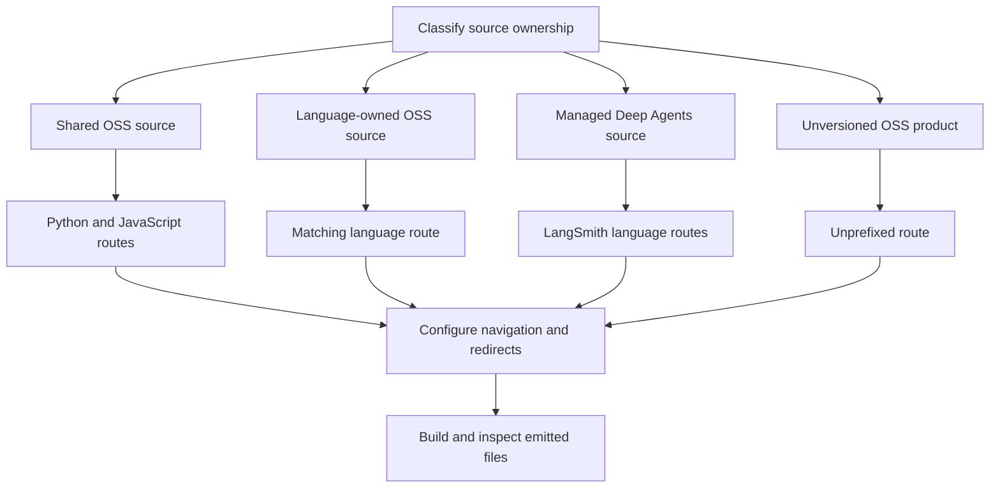

# Changing Versioned Content

Versioned documentation has four independent contracts: the authored source, emitted routes, navigation, and redirects. Choose and verify each one. Author under `src/`; `build/` is regenerated output and must never be edited.


```mermaid
flowchart TD
    Start["Classify source ownership"] --> Shared["Shared OSS source"]
    Start --> Owned["Language-owned OSS source"]
    Start --> MDA["Managed Deep Agents source"]
    Start --> Product["Unversioned OSS product"]
    Shared --> Dual["Python and JavaScript routes"]
    Owned --> Single["Matching language route"]
    MDA --> MDADual["LangSmith language routes"]
    Product --> Plain["Unprefixed route"]
    Dual --> Configure["Configure navigation and redirects"]
    Single --> Configure
    MDADual --> Configure
    Plain --> Configure
    Configure --> Verify["Build and inspect emitted files"]
```

This workflow separates source ownership from the public-route, sidebar, and backwards-compatibility decisions.

## 1. Choose the source owner

The builder uses `python` and `js` internally; the JavaScript URL segment is `javascript`.

| Content | Author in | Emitted route(s) |
| --- | --- | --- |
| Shared OSS page | Most of `src/oss/` | `/oss/python/...` and `/oss/javascript/...` |
| Language-owned OSS page | `src/oss/python/...` or `src/oss/javascript/...` | Only the matching language route, with that source directory removed |
| Deep Agents Code or OpenWiki | `src/oss/deepagents/code/...` or `src/oss/openwiki/...` | One unprefixed product route |
| Managed Deep Agents page | Direct `src/langsmith/managed-deep-agents*.mdx` file | `/langsmith/python/...` and `/langsmith/javascript/...` |
| Other LangSmith page | `src/langsmith/...` | One unprefixed `/langsmith/...` route, processed with the Python target |

Use a shared page when the explanation and structure are common but SDK names, package strings, files, API spellings, or examples differ. `src/oss/python/` and `src/oss/javascript/` are for a guide owned by one SDK, not a way to make a shared guide appear in a particular sidebar. During a full OSS build, language-owned sources are processed only for their matching target and their ownership directory disappears from the route.

Deep Agents Code and OpenWiki are intentionally single-output products. They render conditional content using the Python target as a deterministic fallback; this does not make them Python documentation. Their product links remain unprefixed, while an ordinary bare `/oss/...` link in such a page resolves to its Python route.

Managed Deep Agents is a LangSmith exception. The full build discovers direct `managed-deep-agents*.mdx` files in a dedicated pass and emits both variants. The normal LangSmith pass excludes these files, preventing unversioned duplicate pages. Use a direct `.mdx` filename matching that pattern: although individual-file classification accepts `.md`, the full-build glob does not discover it.

## 2. Branch only the language-specific unit

Keep shared headings, conceptual prose, and behavior outside branches. Use adjacent `:::python` and `:::js` blocks for content that actually differs:

````markdown
Shared explanation.

:::python
```python
from langchain.agents import create_agent
```
:::

:::js
```typescript
import { createAgent } from "langchain";
```
:::
````

For the selected target, the preprocessor removes matching supported-block markers and keeps their content; it removes the other supported block. Only `python` and `js` are valid rendering targets, and another target raises `ValueError`. Unsupported labels are preserved rather than validated or removed.

Branch an entire coherent unit—such as a table, setup command plus filename, or sample-component invocation—rather than only a code fence. For example, the Managed Deep Agents overview uses separate capability tables for `agent.py`/`memory.py` and `agent.ts`/`memory.ts`; the Deep Agents model and RAG pages pair target-specific imports and snippets with matching branches. This prevents a Python filename or import from accompanying a JavaScript example.

### Conditional syntax is not structural parsing

Conditional rendering is a whole-document regex transformation. It is not code-fence-aware and cannot safely model nested conditionals. Literal syntax must be escaped:

````markdown
\:::python
This is displayed literally.
\:::
````

Do not nest conditional blocks and do not rely on indentation or a Markdown code fence to protect live conditional syntax. The pattern may retry an opener with an empty indentation capture, and the first eligible closer terminates its non-greedy match.

### Scope autolinks deliberately

Markdown preprocessing resolves `@[Name]`, `@[title][Name]`, and backticked forms before it renders conditionals. Outside normal Markdown code fences, an active `:::python` or `:::js` fence selects the autolink map; otherwise the build target is the default scope. An unknown reference is logged and left unchanged rather than failing the build. After changing references, run:

```bash
make check-cross-refs
```

A reference outside a branch in a shared page must make sense for both outputs. Put an SDK-specific autolink inside its branch. Escaped autolinks are preserved literally after their escape is removed.

## 3. Author links and snippets for the target output

### OSS and Managed Deep Agents links

For an ordinary OSS destination that should follow the active language, author an absolute, unqualified OSS route:

```mdx
<!-- openwiki: broken internal link [/oss/deepagents/overview] file "/oss/deepagents/overview" does not exist. Fix the href or restore the target, then delete this comment. -->
[Deep Agents overview](/oss/deepagents/overview)
```

A targeted build inserts `python` or `javascript` after `/oss/`. It does not rewrite an already-qualified route, a path containing `images`, or an OpenWiki or Deep Agents Code root/path. Explicitly qualify a route only when the link must remain fixed to one SDK.

Use the same approach for a Managed Deep Agents link that should follow the selected variant:

```mdx
<!-- openwiki: broken internal link [/langsmith/managed-deep-agents-deploy] file "/langsmith/managed-deep-agents-deploy" does not exist. Fix the href or restore the target, then delete this comment. -->
[Deploy](/langsmith/managed-deep-agents-deploy)
```

The builder rewrites this to the target's `/langsmith/python/...` or `/langsmith/javascript/...` route. An already-language-qualified Managed Deep Agents route remains fixed. This makes bare source links correct even though no unprefixed Managed Deep Agents page is emitted.

### Markdown snippets

Store reusable Markdown/MDX fragments below `src/snippets/`, and import an unqualified Markdown fragment from a versioned page:

```mdx
import RequiresLanggraphServer from '/snippets/oss/requires-langgraph-server.mdx';
```

The builder rewrites eligible `.md` and `.mdx` imports to `/snippets/python/` or `/snippets/javascript/`; already-scoped imports and JSX/TSX component imports are unchanged. It independently preprocesses Markdown snippets into Python and JavaScript copies plus a Python-targeted default copy. Use absolute `/oss/...` links inside a shared fragment so each emitted copy works from consumers at arbitrary nesting depths.

For runnable example ownership, testing, extraction markers, and regeneration of components under `src/snippets/code-samples/`, follow [Code Sample Lifecycle](/openwiki/workflows/code-sample-lifecycle.md). Import language-specific generated components in their matching conditional branch.

## 4. Change navigation and redirects separately

Creating a source file does not create a sidebar entry. After confirming emitted paths, edit `src/docs.json` in the appropriate product/menu/dropdown/tab/group. Navigation entries use extensionless paths relative to `src`.

For shared OSS pages, add the Python and JavaScript paths in their respective dropdowns. A language-owned page belongs only in its matching navigation. An unversioned product page has its one unprefixed entry. Managed Deep Agents has parallel Python and JavaScript entries in its separate language dropdowns.

Redirects are a separate public-URL contract. `docs.json` redirects unprefixed and older Managed Deep Agents URLs to Python destinations because the builder deliberately emits no unprefixed Managed Deep Agents page. When moving or versioning a public page, decide whether the retired URL needs a redirect to the maintained canonical route; do not generate an orphaned unversioned duplicate merely for compatibility.

For every route change, explicitly review:

1. The source owner and all routes that must exist.
2. Sidebar placement for every reader-facing output.
3. Existing public URLs and required redirects.
4. Links from shared, language-specific, and unversioned pages.

See [Adding and Maintaining Documentation Pages](/openwiki/operations/adding-pages.md) for the general page-move procedure.

## 5. Build and inspect the generated contract

Run a clean build when changing shared pages, links, snippets, builder rules, navigation, or redirects:

```bash
make build
make broken-links
```

`build_all()` removes the old build directory, builds both OSS variants, builds the two unversioned OSS products, builds ordinary LangSmith pages, then emits Managed Deep Agents variants before copying shared files. `make broken-links` builds first and invokes Mint with redirect checking; use `make broken-links-with-anchors` when anchor changes matter.

Inspect the relevant generated files; do not modify them:

1. Required routes exist and prohibited language siblings do not.
2. Each variant retains shared prose and its own branch only, without selected-branch markers.
3. SDK-scoped autolinks resolve in the intended branch.
4. Bare OSS links, bare Managed Deep Agents links, and Markdown imports point at the expected target path.
5. Already-qualified links, image paths, and unversioned product paths remain unchanged.
6. `docs.json` exposes each new route and redirects each retired public route deliberately.

When changing build behavior, add a focused regression to `tests/unit_tests/test_builder.py` that asserts both content and route presence or absence. Existing tests cover OSS link exemptions, single-output products, snippet variants, and Managed Deep Agents route and link rewriting.

## Completion checklist

- [ ] Select source ownership before deciding sidebar placement or redirects.
- [ ] Put common prose outside sequential `:::python` and `:::js` branches.
- [ ] Do not nest conditionals or trust indentation/code fences to protect conditional markers.
- [ ] Put language-specific autolinks in their branch and run `make check-cross-refs` after reference changes.
- [ ] Use bare `/oss/...` and Managed Deep Agents links only when they should track the active language.
- [ ] Import shared Markdown snippets without a language prefix and use absolute OSS paths inside them.
- [ ] Update navigation and redirects in `src/docs.json` independently of source placement.
- [ ] Run `make build` and link validation, then inspect generated routes without editing `build/`.

## See also

- [Source Map](/openwiki/architecture/source-map.md)
- [Markdown Preprocessing](/openwiki/concepts/preprocessing.md)
- [Versioned Documentation and Routes](/openwiki/concepts/versioning.md)
- [Adding and Maintaining Documentation Pages](/openwiki/operations/adding-pages.md)
- [Code Sample Lifecycle](/openwiki/workflows/code-sample-lifecycle.md)
