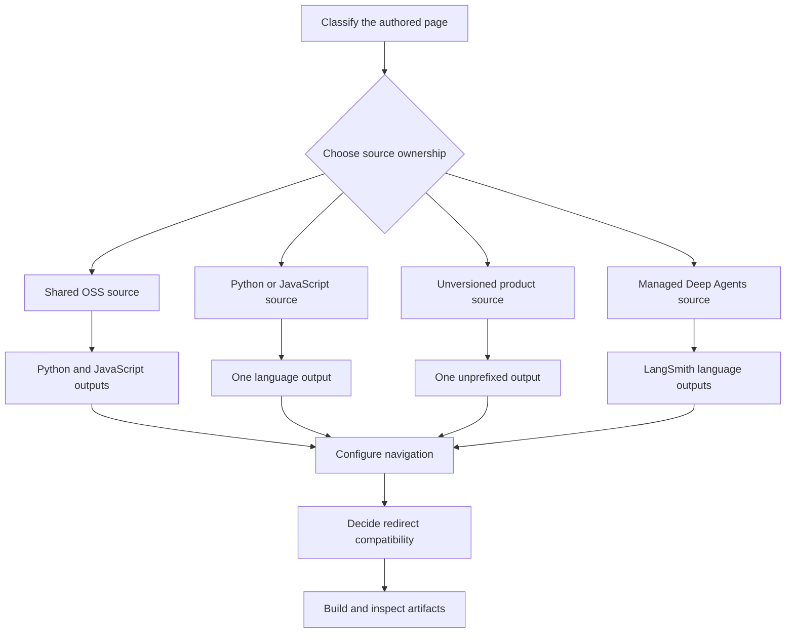

# Changing Versioned Content

Versioned documentation keeps common material in one authored source while the builder emits language-specific artifacts. Treat **source ownership**, **output routes**, **navigation**, and **redirect compatibility** as separate decisions. Edit `src/`, never `build/`: a full build removes and recreates generated output.


```mermaid
flowchart TD
    Start["Classify the authored page"] --> Ownership{"Choose source ownership"}
    Ownership --> Shared["Shared OSS source"]
    Ownership --> Specific["Python or JavaScript source"]
    Ownership --> Product["Unversioned product source"]
    Ownership --> Managed["Managed Deep Agents source"]
    Shared --> Dual["Python and JavaScript outputs"]
    Specific --> Single["One language output"]
    Product --> Plain["One unprefixed output"]
    Managed --> ManagedDual["LangSmith language outputs"]
    Dual --> Navigation["Configure navigation"]
    Single --> Navigation
    Plain --> Navigation
    ManagedDual --> Navigation
    Navigation --> Redirects["Decide redirect compatibility"]
    Redirects --> Verify["Build and inspect artifacts"]
```

This flow separates the durable source owner, emitted route contract, reader navigation, and legacy URL compatibility.

## 1. Choose source ownership before writing

Choose a source path for its build behavior, not for a desired sidebar label. The build uses `js` internally and exposes `javascript` in URLs.

| Content class | Author in | Builder emits |
| --- | --- | --- |
| Shared OSS page | Most content below `src/oss/` | `/oss/python/...` and `/oss/javascript/...` |
| Language-specific OSS page | `src/oss/python/...` or `src/oss/javascript/...` | Only the matching language route, with the source language directory removed |
| Language-agnostic OSS product | `src/oss/openwiki/...` or `src/oss/deepagents/code/...` | One unprefixed product route |
| Managed Deep Agents page | A direct `src/langsmith/managed-deep-agents*.mdx` file | `/langsmith/python/...` and `/langsmith/javascript/...` |
| Other LangSmith page | `src/langsmith/...` | One unprefixed `/langsmith/...` route, rendered with the Python target |

Use a shared OSS page when concepts and structure are the same and only examples, package names, or API spelling vary. Use `src/oss/python/` or `src/oss/javascript/` when the guide itself belongs to one SDK. The MCP Toolbox pages illustrate this boundary: the Python guide contains local database setup and a Python client workflow, while the JavaScript guide documents the Node client and its own installation and API use. Similarly, the Ollama embeddings guide is Python-owned. Do not duplicate a shared guide just to obtain both URLs.

`oss/deepagents/code` and `oss/openwiki` are deliberate single-output exceptions. They select the Python conditional target as a deterministic fallback; that does not make them Python documentation. Their own product routes remain unprefixed, while a bare link to ordinary OSS resolves to Python from these outputs.

Managed Deep Agents is the LangSmith exception. Direct, correctly named `.mdx` files emit language-prefixed variants, and the ordinary LangSmith pass excludes them to prevent an unversioned duplicate. Although individual-file classification recognizes `.md`, the full-build discovery glob accepts only `managed-deep-agents*.mdx`; use `.mdx` for these pages.

## 2. Put only actual differences in conditional blocks

Keep neutral headings, explanations, and product behavior outside branches. Use sequential `:::python` and `:::js` blocks for content that differs. Versioned documentation uses conditional blocks to create separate Python and JavaScript outputs from a single source.

````markdown
Shared explanation.

:::python
```python
from langchain.agents import create_agent
```
:::

:::js
```typescript
import { createAgent } from "langchain";
```
:::
````

For a selected target, the matching supported block is emitted without its markers and the nonmatching supported block is removed. Only `python` and `js` are valid targets; another target raises `ValueError`. Unsupported labels and unclosed supported blocks remain source-shaped, so fences are not a validation mechanism.

### Scope cross-references to the language branch

Autolinks are resolved before conditional rendering. `@[Name]`, `@[title][Name]`, and backticked forms use the active `:::python` or `:::js` scope outside ordinary code fences. A missing mapping is logged and left literal, rather than failing preprocessing. Run the validator after changing references:

```bash
make check-cross-refs
```

A shared, unfenced OSS reference must resolve for both language maps; a language-specific source or fenced reference is checked only in its applicable scope. See [Markdown preprocessing](/openwiki/concepts/preprocessing.md).

### Avoid conditional-parser traps

Conditional rendering is a whole-input regex transform, not a code-fence-aware or nested-block parser. Do not nest conditionals or assume a normal Markdown code fence protects live conditional syntax. Escape literal markers instead:

````markdown
\:::python
This is displayed literally.
\:::
````

Use matching indentation for readable source, but do not rely on indentation as a structural guard. The regex can retry from an opening marker and accept a differently indented close; the first eligible closing marker ends the non-greedy match.

### Follow the shape of the difference

Branch an entire language-specific unit, not merely the code fence. Current Managed Deep Agents pages are a useful model. The deployment page keeps the deployment lifecycle and secret-routing rules shared, but branches dependency installation and `mda deploy` invocation. Its Python-version configuration is intentionally Python-only. The identity page keeps provider choice and privacy behavior shared while branching project filenames, imports, declaration APIs, and request examples. This avoids a Python filename or command next to a JavaScript-only example.

For reusable code examples that differ, import the Python and JavaScript components separately and render each in its matching branch. The shared Deep Agents quickstart follows this pattern.

## 3. Author links and reusable snippets for the selected variant

### Links

For an ordinary OSS destination that should follow the current target, write an absolute unqualified route:

```mdx
<!-- openwiki: broken internal link [/oss/langgraph/overview] file "/oss/langgraph/overview" does not exist. Fix the href or restore the target, then delete this comment. -->
[LangGraph overview](/oss/langgraph/overview)
```

For a language-targeted build, the builder inserts `python` or `javascript` after `/oss/`. It preserves already-qualified routes, image paths, and the OpenWiki and Deep Agents Code roots. This applies to Markdown links and HTML `href` values. Explicitly qualify a route only when the link must remain fixed to one language.

Likewise, author a Managed Deep Agents link without a language segment when it should follow the target:

```mdx
<!-- openwiki: broken internal link [/langsmith/managed-deep-agents-deploy] file "/langsmith/managed-deep-agents-deploy" does not exist. Fix the href or restore the target, then delete this comment. -->
[Deploy](/langsmith/managed-deep-agents-deploy)
```

The artifact links to the matching Python or JavaScript LangSmith route; already-qualified Managed Deep Agents routes remain fixed. Bare source links are therefore normally correct even though generated pages are language-prefixed.

### Markdown and MDX snippets

Store reusable Markdown or MDX fragments in `src/snippets/` and use an unqualified Markdown import from a versioned page:

```mdx
import RequiresLanggraphServer from '/snippets/oss/requires-langgraph-server.mdx';
```

The builder rewrites eligible `.md` and `.mdx` imports to `/snippets/python/` or `/snippets/javascript/`. Already scoped imports and JSX or TSX component imports are unchanged. A shared Markdown snippet is independently preprocessed into Python and JavaScript copies plus a Python-targeted default copy. Use absolute `/oss/...` links inside such a snippet so every copy works for consumers at arbitrary nesting depths.

### Runnable samples

For executable examples, `src/code-samples/` is the source of truth. Mark visible code with language-suffixed `:snippet-start:` and `:snippet-end:` markers. Put test-only setup and assertions in a trailing `:remove-start:` block so the test executes the visible snippet before exiting.

```bash
make test-code-samples FILES="src/code-samples/langchain/return-a-string.py"
make code-snippets
```

The generation command extracts marked regions to its generated intermediate directory and produces MDX components in `src/snippets/code-samples/`. Do not hand-edit those components: update and test the sample, regenerate, then import the generated components and place language-specific invocations in their corresponding branches.

## 4. Treat package-version claims as availability claims

A package floor or pin is a reader-facing promise. First establish that the release is the real minimum for the feature. Then check that the written release was published:

```bash
uv run python scripts/check_version_claims.py --files src/path/to/page.mdx
```

The checker scans `.mdx` for `>=` floors and `==` pins. It determines PyPI or npm from package syntax, nearby language labels, conditional fences, source paths, and finally a PyPI fallback. It checks publication availability, not whether the release introduced the feature. This matters when Python and npm have divergent version lines for the same package name.

Registry lookup failures and invalid lookup inputs are unresolved rather than unpublished-version failures. Exact versions and shortened version-series floors are accepted when a corresponding published release exists. Correct an inaccurate claim rather than suppressing it in `scripts/version_claims_ignore.txt` unless it is a reviewed intentional exception.

## 5. Configure navigation and redirects as separate contracts

A source file and emitted route do not create a visible navigation entry. After confirming the output route, update the appropriate `src/docs.json` product, menu item, language dropdown, tab, and group. Use extensionless paths relative to `src` in navigation arrays, and place the entry by locating a neighboring route in the current configuration.

For shared OSS, enter Python and JavaScript routes in their respective dropdowns. For a language-only integration, enter only its matching route. For OpenWiki or Deep Agents Code, enter its single unprefixed route. Managed Deep Agents has parallel route entries in separate Python and JavaScript dropdowns, including its deployment and identity pages.

Redirects are independent of source ownership and navigation. `docs.json` maps unprefixed and legacy Managed Deep Agents URLs to Python destinations because the build does not emit unprefixed Managed Deep Agents pages. When a public route moves, preserve a required old URL with a redirect to the maintained canonical route; do not create an unversioned duplicate merely for compatibility.

For a move or a newly versioned page, explicitly decide:

1. Whether to keep, move, or split source according to ownership.
2. Every Python, JavaScript, or unprefixed route that must be emitted.
3. Navigation placement for each reader-facing route.
4. Redirect coverage for retired or previously public routes.

See [Adding and Maintaining Documentation Pages](/openwiki/operations/adding-pages.md) for the broader move procedure.

## 6. Build, inspect, and test the generated contract

Run a clean build after changing shared content, route rules, snippets, links, `docs.json`, or redirects:

```bash
make build
make broken-links
```

The full build clears `build/`, emits OSS variants, the two unversioned OSS products, ordinary LangSmith content, and Managed Deep Agents variants; it then copies shared files and npm snippet components and generates LLM index artifacts. Generated output is verification material, not an editing surface. `make broken-links` builds first, asks Mint to validate redirects, and filters known deploy-time OpenAPI and standalone-snippet reports.

Inspect the relevant output contract:

1. Every required route exists, and forbidden language siblings do not.
2. Each versioned artifact retains shared prose and only its matching conditional content, with no selected-block markers.
3. Conditional API references resolve in the intended scope.
4. Bare OSS links, bare Managed Deep Agents links, and Markdown snippet imports acquire the expected language route.
5. Fixed-language links, image paths, and unversioned product paths remain unchanged.
6. Every new route has the intended `docs.json` placement, and every retired public route has a deliberate redirect or removal decision.

When changing builder behavior, add a focused regression in `tests/unit_tests/test_builder.py`. Assert final content as well as expected and absent paths. Existing coverage includes OSS prefix insertion and exemptions, unversioned products, language-scoped snippets, and Managed Deep Agents dual routes. Changes to version-claim parsing belong in `tests/unit_tests/test_check_version_claims.py`, including registry-selection precedence and lookup failures. See [Builder Tests](/openwiki/testing/builder-tests.md).

## Completion checklist

- [ ] Decide source ownership before choosing an output URL, sidebar location, or redirect.
- [ ] Keep shared prose outside sequential `:::python` and `:::js` branches.
- [ ] Scope language-dependent autolinks to their branch and run `make check-cross-refs` when references change.
- [ ] Do not nest conditionals or rely on a Markdown code fence to protect live conditional markers.
- [ ] Use bare `/oss/...` and Managed Deep Agents links only when they should follow the active language.
- [ ] Import shared Markdown snippets without a language prefix and use absolute OSS links inside them.
- [ ] Test and regenerate runnable samples from `src/code-samples/`; do not hand-edit generated snippet MDX.
- [ ] Confirm package floors semantically, then run `check_version_claims.py` for changed MDX specifiers.
- [ ] Update `src/docs.json` navigation and redirects independently of source placement.
- [ ] Run `make build` and `make broken-links`, then inspect all relevant generated routes without editing `build/`.

## See also

- [Versioned Documentation and Routes](/openwiki/concepts/versioning.md)
- [Markdown preprocessing](/openwiki/concepts/preprocessing.md)
- [Adding and Maintaining Documentation Pages](/openwiki/operations/adding-pages.md)
- [Builder Tests](/openwiki/testing/builder-tests.md)
