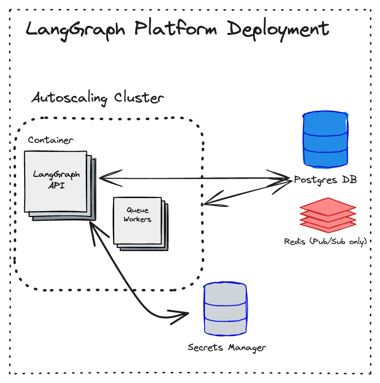

To deploy a [LangGraph Server](langgraph_server), follow the how-to guide for [how to deploy a Standalone Container](standalone_container).

## Overview

The Standalone Container deployment option is the least restrictive model for deployment. There is no [control plane](langgraph_control_plane). [Data plane](langgraph_data_plane) infrastructure is managed by you.

|                   | [Control plane](langgraph_control_plane) | [Data plane](langgraph_data_plane) |
|-------------------|-------------------|------------|
| **What is it?** | n/a | <ul><li>LangGraph Servers</li><li>Postgres, Redis, etc</li></ul> |
| **Where is it hosted?** | n/a | Your cloud |
| **Who provisions and manages it?** | n/a | You |

<Warning>
  LangGraph Platform should not be deployed in serverless environments. Scale to zero may cause task loss and scaling up will not work reliably.
</Warning>

## Architecture

## Compute Platforms

### Kubernetes

The Standalone Container deployment option supports deploying data plane infrastructure to a Kubernetes cluster.

### Docker

The Standalone Container deployment option supports deploying data plane infrastructure to any Docker-supported compute platform.

## Lite vs. Enterprise

The Standalone Container deployment option supports both of the [server versions](langgraph_server#langgraph-server):

* The `Lite` version is free, but has limited features.
* The `Enterprise` version has custom pricing and is fully featured.

For more details on feature difference, see [LangGraph Server](langgraph_server#server-versions).
