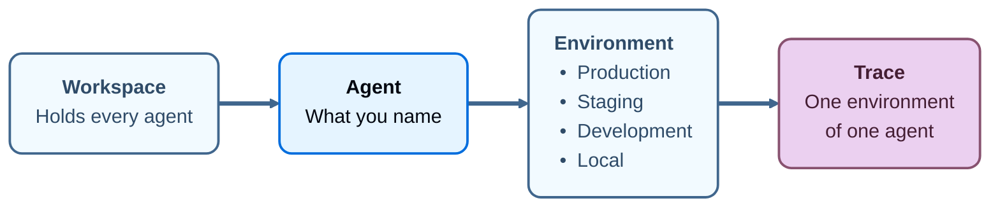

import AgentBetaNote from '/snippets/langsmith/agent-beta-note.mdx';

An _agent_ is the unit a LangSmith workspace is organized around. Name it once, and LangSmith records what that agent does under that name, divided across four [environments](/langsmith/agent-environments). A trace, a dashboard, an alert, and an evaluator each belong to one environment of one agent. A [dataset](/langsmith/evaluation-concepts#datasets) is the exception, attaching to one or more agents and to no environment.

Every trace carries its agent and one of that agent's environments, so what produced a trace and where it ran are recorded as it arrives. LangSmith can then act on that context: an alert watches production and stays quiet about local runs, each environment gets its own prebuilt dashboard, and [Insights](/langsmith/insights) reads production traffic alone.

<AgentBetaNote />

Given a trace, you already know which agent produced it and which environment it ran in.

## Environments

An _environment_ records where an agent was running when it produced a trace. The names are fixed: Production, Staging, Development, and Local.

For what the set contains, how to select one, and which parts of it are fixed, see [Agent environments](/langsmith/agent-environments).

## Identifiers and display names

Every agent has two names, and they do different work:

- **Identifier**: Set when the agent is created, and not editable afterwards. How you supply it depends on the path: the **Create a new agent** dialog takes it in an **Agent ID** field beside the display name, and tracing to an identifier that does not exist yet creates the agent under the value you sent. LangSmith uses it to address traces, so it stays stable even when the display name changes.
- **Display name**: Shown wherever the agent appears in the UI. Edit it at any time. Editing it does not move existing traces or change where new traces land.

The identifier is also what the browser address bar carries, so you can read it from there or copy it from the **ID** field on the agent's Overview.

## Why an agent rather than a project with environments

In a [project-based workspace](/langsmith/migrate-to-agent-based-workspaces), a [tracing project](/langsmith/observability-concepts#tracing-projects) holds whatever traces you send to that project, so LangSmith has no way to know what a project contains. Two projects named `checkout-prod` and `checkout-staging` are unrelated containers as far as the platform is concerned, and keeping them related is a naming convention you maintain by hand.

Both arrangements group resources with [resource tags](/langsmith/administration-overview#resource-tags), and the difference is who applies them. In a project-based workspace you group resources yourself, by applying the `Application` tag to each one. In an agent-based workspace the agent and the environment arrive with the trace, so no tagging convention is required.

The agent and the environment are recorded as their own fields rather than encoded in a project name, so LangSmith can filter, compare, and alert on them directly.

Existing tracing setup keeps working. `LANGSMITH_PROJECT` remains supported, and tracing projects remain in the API. See [Log traces to a specific project](/langsmith/log-traces-to-project).

## Next steps

<CardGroup cols={2}>

<Card
  title="Environments"
  cta="Learn more"
  href="/langsmith/agent-environments"
  icon="stack"
>
The deployments an agent's traces divide into, and the tracing project behind each one.
</Card>

<Card
  title="Navigate agents"
  cta="Learn more"
  href="/langsmith/navigate-agents"
  icon="compass"
>
The agent switcher, the agent list, the agent Overview, and where creation starts.
</Card>

<Card
  title="Log traces to an agent"
  cta="Learn more"
  href="/langsmith/log-traces-to-agent"
  icon="target"
>
How agent addressing sends traces to an agent and an environment, and why it cannot be combined with project addressing.
</Card>

<Card
  title="Observability concepts"
  cta="Learn more"
  href="/langsmith/observability-concepts"
  icon="book"
>
Runs, traces, threads, trace containers, and how LangSmith structures the data behind them.
</Card>

</CardGroup>
