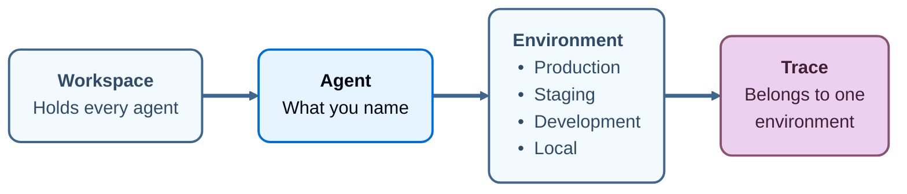

import AgentBetaNote from '/snippets/langsmith/agent-beta-note.mdx';

An _agent_ is an AI system that completes tasks end to end using tools, skills, and subagents. In LangSmith, an agent is also the unit a workspace is organized around. Name it once, and LangSmith records what that agent does under that name, divided across four [environments](/langsmith/agent-environments): Production, Staging, Development, and Local. A trace, a dashboard, an alert, and an evaluator each belong to one environment of one agent. A [dataset](/langsmith/evaluation-concepts#datasets) is the exception, attaching to one or more agents and to no environment.

Every trace carries its agent and one of that agent's environments, so what produced a trace and where it ran are recorded as it arrives. LangSmith can then act on that context: an alert watches production and stays quiet about local runs, each environment gets its own prebuilt dashboard, and [Insights](/langsmith/insights) reads production traffic alone.

<AgentBetaNote />

Every trace maps to the agent that produced it and the environment it ran in.

## Environments

An _environment_ records where an agent was running when it produced a trace. The names are fixed: Production, Staging, Development, and Local.

For more information, see [Agent environments](/langsmith/agent-environments).

## Identifiers and display names

Every agent has two names, and they do different work:

- **Identifier**: Set when the agent is created, and not editable afterwards. Whether you supply it or LangSmith generates it depends on [how the agent was created](/langsmith/create-an-agent). LangSmith uses it to address traces, so it stays stable even when the display name changes.
- **Display name**: Shown wherever the agent appears in the UI. Edit it at any time. Editing it does not move existing traces or change where new traces land.

The identifier is also what the browser address bar carries, so you can read it from there or copy it from the **ID** field on the agent's Overview.

## Next steps

<CardGroup cols={2}>

<Card
  title="Environments"
  cta="Learn more"
  href="/langsmith/agent-environments"
  icon="stack"
>
The four environments an agent's traces divide into, and how to switch between them.
</Card>

<Card
  title="Navigate agents"
  cta="Learn more"
  href="/langsmith/navigate-agents"
  icon="compass"
>
The agent switcher, the agent list, and the agent Overview.
</Card>

<Card
  title="Log traces to an agent"
  cta="Learn more"
  href="/langsmith/log-traces-to-agent"
  icon="target"
>
How agent addressing sends traces to an agent and an environment, and why it cannot be combined with project addressing.
</Card>

<Card
  title="Create an agent"
  cta="Learn more"
  href="/langsmith/create-an-agent"
  icon="plus"
>
The four ways to create an agent, what each route decides about it, and the rules an identifier must follow.
</Card>

</CardGroup>
