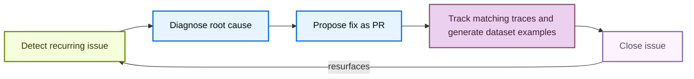

LangSmith Engine is the LangSmith agent for agent engineering. Working from your production traces, it surfaces recurring issues, diagnoses their root cause, and proposes fixes, so you can ship more reliable agents without searching through traces by hand. To start, [set up Engine](/langsmith/engine-setup) for a tracing project.

## Engine across the lifecycle

For each issue, Engine surfaces the contributing traces, proposes a fix, keeps the issue current by attaching new traces that match the same failure pattern, and creates ground truth dataset examples from the production trace inputs.

<CardGroup cols={3}>
  <Card title="Build: Open a pull request" icon="git-pull-request" href="/langsmith/engine-issues#open-a-pull-request">
    Apply the proposed fix by opening a pull request in your connected repository. Engine can propose code changes to agents built with Deep Agents, LangChain, and LangGraph.
  </Card>
  <Card title="Test: Generate datasets" icon="database" href="/langsmith/engine-issues#add-offline-examples">
    Create ground truth dataset examples from production traces for offline evaluation, so you can verify a fix before it ships.
  </Card>
  <Card title="Monitor: Track recurring issues" icon="chart-line" href="/langsmith/engine-issues#filter-and-sort-issues">
    Scan your tracing projects on a schedule to surface, prioritize, and diagnose recurring issues, and add new matching traces to each issue as they appear.
  </Card>
</CardGroup>

## How Engine differs from Insights

Engine and [Insights](/langsmith/insights) both analyze your traces, but they answer different questions:

- **Insights** is an analytics tool. It groups traces into categories, which it generates automatically or which you define, and reports metrics for each category so you can see usage patterns and how they shift.
- **Engine** looks for concrete problems to fix. Each issue it opens comes with a diagnosis, the traces that support it, and a proposed fix.

Use Insights to understand how people use your agent. Use Engine to find out what is going wrong and what to change.

## How Engine works

### The issue lifecycle

Each issue moves through a closed loop in which Engine:

1. Detects a recurring issue in your traces.
2. Diagnoses the root cause against your traces and connected source code.
3. Proposes a fix as a pull request.
4. Tracks the issue over time, automatically adding new traces that match the same pattern, and generates ground truth [dataset examples](/langsmith/manage-datasets) so you can verify a fix. See [Find and fix issues](/langsmith/engine-issues).
5. Reopens the issue automatically if it resurfaces after being closed.

### How Engine selects traces

Engine analyzes both trace content and run feedback when selecting and ranking traces for each scan. It treats feedback, including online evaluator scores, annotation queue scores, and user feedback submitted via the SDK, as a high-priority signal, not supplementary data.

To apply this signal, Engine:

- Reads the feedback keys present in your project and performs a dedicated pull of low-scoring traces for each key, so the sample includes traces with poor evaluator scores rather than leaving them to recency.
- Prioritizes traces with non-empty feedback scores ahead of other traces when screening the sample.
- Preserves feedback scores on every trace in the analysis context, even when trace payloads are compacted to fit within context limits.

Any source that writes feedback to a run contributes to this prioritization automatically. Engine requires no setup beyond evaluators or annotation queues.

### How Engine learns from your feedback

Engine gets more accurate as you work through issues. On each scheduled scan, it reviews the actions you took on issues since the last scan and turns each one into a general rule in the **User Preferences** section of the project's [agent overview](/langsmith/engine-setup#give-context-on-your-agent). Later scans use those rules to decide what to flag and how to prioritize it.

Engine learns from these actions, including any reason you give with them:

- **Closing an issue** or marking it **Incorrectly Flagged**: Engine treats that kind of issue as lower priority.
- **Changing an issue's priority**: Engine records how severe that category of issue is for your agent.
- **Opening a pull request**: Engine records that the category is real and worth a proposed fix.

For example, suppose your agent processes payments, and Engine flags a trace that contains a full credit card number as unredacted personally identifiable information (PII). Your agent handles card numbers by design, so you mark the issue **Incorrectly Flagged** with the reason "This agent processes card numbers as part of checkout." Engine records that card numbers in the payment flow are expected. If you keep dismissing issues in the same category, Engine lowers that category's severity one level at a time. It does not go below low, so the pattern stays visible without crowding out urgent issues.

Changes that come from automation, such as a pull request merging, and actions taken through [LangSmith Chat](/langsmith/chat#engine) do not count as feedback. To review or correct what Engine has learned, edit the **User Preferences** section of the agent overview.

## Why connect GitHub

Connecting a GitHub repository is optional, but Engine finds more issues, and more useful ones, when it can read your source code. With source access, Engine locates the code path behind a failing trace and grounds its diagnosis and proposed fix in your actual implementation. That holds even if you never merge an Engine pull request: you can apply the fix yourself or copy the fix context into your coding assistant.

Engine's GitHub access is fixed. Through the GitHub App, Engine can:

- **Read** the repositories you select when you install the app.
- **Open pull requests** from new branches it creates.

Engine never merges a pull request. Every change it proposes goes through your review and branch protection rules, and you can revoke access at any time by uninstalling the app. For token lifetimes, sandboxing, and retention, see [Engine security](/langsmith/engine-security#github-integration). To connect a repository, see [Connect Engine to GitHub](/langsmith/engine-github).

## Manage Engine costs

### Understand LSU costs

<Note>
On LangSmith Cloud, Engine uses **LangChain-managed inference** exclusively. Self-hosted installations can use their [own model providers](/langsmith/engine-self-hosted-model-providers), with API keys or cloud identity.
</Note>

Engine charges in **LangChain Standard Units (LSUs)**, a normalized unit of work combining compute, storage, memory, and LLM spend. LSU consumption scales with the number of traces analyzed, the number and complexity of the LLM calls Engine makes to diagnose and fix issues, and the size of any connected repository. LSUs cost **$1 USD each**. For an estimate of your expected LSU usage, see the [LangSmith Usage Calculator](https://www.langchain.com/pricing#pricing-calc).

Engine runs in two phases:

| Phase | Trigger | Typical LSU usage |
|---|---|---|
| **Initialization** | First time you enable Engine on a project | 45-60 LSUs |
| **Recurring scans** | Automatically, on a dynamic schedule | 15-22.5 LSUs |

On initialization, Engine audits past traces, clusters and prioritizes issues by severity, and proposes fixes to your prompts or code (if a repository is connected). Recurring scans run on a dynamic schedule tuned to balance cost and performance, whether or not new issues are found, and surface new issues not previously detected.

### Set the analysis level

The analysis level controls how many of your project's traces Engine analyzes, and so how many LSUs it uses. Choose it when you [turn on Engine for a project](/langsmith/engine-setup#turn-on-engine-for-a-tracing-project), and change it later under **Analysis level** in the [**Engine settings**](/langsmith/engine-setup#configure-engine) panel:

- **Reduced**: Monitors fewer traces at a lower cost.
- **Standard** (default): Analyzes more of your eligible traces for fuller coverage.
- **Expanded**: Maximum coverage for high-volume projects. Available only for projects with enough tracing volume.

The setup dialog shows an estimated monthly cost range that updates with the level you choose.

### Set spend limits and monitor usage

Organization Admins can set spend limits at two levels:

- **Org-wide limit**: Open **Settings** and select **Engine** under **Engine**. On the month-to-date spend card, click the limit chip and set a limit in the popover.
- **Project or environment limit**: Open the **Engine** tab in a tracing project or agent environment and click the **Configure Engine** <Icon icon="settings"/> icon. Under **Spend limit**, click the limit chip (the chip reads **None** when no limit is set) and set a limit in the popover.

You can enter limits in LSU or USD (1 LSU = $1). When a limit is reached, LangSmith pauses new Engine runs until the limit is raised or the next monthly billing period begins.

The two levels default differently:

- **Org-wide limit**: Choose **Default**, **No limit**, or a custom cap. Until an admin chooses, the default applies (750 LSU per month, $750), so Engine spend is capped even though no one has set a limit. The **Engine** settings page names the enforced limit and its source.
- **Project or environment limit**: Leave the popover's field blank for no limit. Use **Remove limit** to clear a cap you set earlier.

To stop Engine for a project or for the whole organization, see [Pause Engine or delete its issues](/langsmith/engine-setup#pause-engine-or-delete-its-issues).

To monitor usage, you can view your organization's monthly LSU spend on the **Engine** page in **Settings**, or view the spend for a tracing project or agent environment in its [**Engine settings**](/langsmith/engine-setup#configure-engine) panel.

## Get started

<CardGroup cols={2}>
  <Card title="Set up Engine" icon="settings" href="/langsmith/engine-setup">
    Enable Engine for your organization and turn it on for a tracing project or agent environment.
  </Card>
  <Card title="Find and fix issues" icon="bug" href="/langsmith/engine-issues">
    Review the issues Engine detects, open pull requests, and create dataset examples.
  </Card>
  <Card title="Connect Engine to GitHub" icon="brand-github" href="/langsmith/engine-github">
    Let Engine read your source code and open pull requests with proposed fixes.
  </Card>
  <Card title="Engine notifications" icon="bell" href="/langsmith/engine-notifications">
    Send detected issues to Slack, Jira, or your incident-management and paging tools.
  </Card>
</CardGroup>

## See also

- [Validate fixes by running your agent](/langsmith/engine-fix-validation): Replay an issue's traces to confirm it reproduces and that Engine's fix resolves it (beta).
- [Proactively detect issues with Red Teaming](/langsmith/engine-red-teaming): Probe a deployed agent with synthetic requests before failures reach production (beta).
- [Engine security](/langsmith/engine-security): How Engine handles your data, and its GitHub and model subprocessor controls.
- [Engine on self-hosted](/langsmith/engine-self-hosted): Install and run Engine on a self-hosted LangSmith instance.
