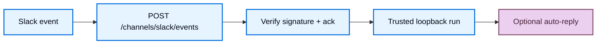

import ManagedDeepAgentsPrivateBetaNote from '/snippets/langsmith/managed-deep-agents-private-beta-note.mdx';
import ManagedDeepAgentsTestAndDeploy from '/snippets/langsmith/managed-deep-agents-test-and-deploy.mdx';

The Slack channel lets workspace members talk to your Managed Deep Agent from Slack. You declare triggers under `channels/`, and `mda deploy` creates and installs the Slack app through your workspace's Slack connection in LangSmith—there is no app to make by hand and no bot token or signing secret to copy. The runtime verifies signatures, runs the agent, and can auto-reply in the same thread or DM.

<Note>
<ManagedDeepAgentsPrivateBetaNote />
</Note>

For the channel model and current limits, see [Channels](/langsmith/managed-deep-agents-channels).

## Prerequisites

- A Managed Deep Agents project with a root [identity](/langsmith/managed-deep-agents-identity) declaration (`channels/` requires identity).
- Slack connected for your LangSmith workspace (**Settings → Integrations**). `mda deploy` provisions the channel's Slack app through that connection.
- `MDA_TRIGGER_SERVER_URL` set to the trigger server origin so deploy can reach the provisioning API.

## Add a Slack channel

Add `channels/slack.py` or `channels/slack.ts` next to your agent entry. The file name becomes the channel name (`slack` → `POST /channels/slack/events`). Export a named `channel` created with `channels.slack`:

<CodeGroup>

```python channels/slack.py
from managed_deepagents import channels

channel = channels.slack(
    on=["app_mention", "direct_message", "thread_reply"],
    auto_reply=True,
    mention_behavior="strip",
)
```

```ts channels/slack.ts
import { channels } from "managed-deepagents";

export const channel = channels.slack({
  on: ["app_mention", "direct_message", "thread_reply"],
  autoReply: true,
  mentionBehavior: "strip",
});
```

</CodeGroup>

Pair this with an identity declaration that matches your product:

<CodeGroup>

```python identity.py
from managed_deepagents import define_identity

# Shared Slack bot: one Slack conversation maps to one thread
identity = define_identity(scope={"threads": "conversation"})
```

```ts identity.ts
import { defineIdentity } from "managed-deepagents";

// Shared Slack bot: one Slack conversation maps to one thread
export const identity = defineIdentity({
  scope: { threads: "conversation" },
});
```

</CodeGroup>

For browser + Slack account linking (same user across web and Slack), use [validated-token auth](/langsmith/managed-deep-agents-identity#validated-token-browser-direct) with user-owned threads and [Connect-with-Slack](#optional-connect-with-slack) instead of a bare shared bot install.

## How Slack Events work



1. Slack POSTs to `https://<agent-server>/channels/slack/events` (the file stem `slack` becomes the path segment).
2. The runtime verifies the Slack signing secret against the raw body and returns HTTP 200 within Slack’s ack window.
3. In the background it invokes the graph over trusted loopback, stamping user and source-thread identity (`source.provider: "slack"`).
4. When `autoReply` is enabled, it posts the agent response back with the Slack Web API (and can set assistant loading status while the run is in progress).

LangGraph auth is bypassed only on `POST /channels/{name}/events` so Slack can deliver without an ingress secret; the loopback invoke still uses `MDA_INGRESS_SECRET`.

## Channel options

| Option (Python / TypeScript) | Default | Meaning |
| --- | --- | --- |
| `on` | _(required)_ | Triggers to handle: `app_mention`, `direct_message`, `thread_reply` |
| `auto_reply` / `autoReply` | `true` | Post the agent response back to Slack via the Web API |
| `mention_behavior` / `mentionBehavior` | `"strip"` | `"strip"` removes the bot `@mention` from the model input; `"preserve"` keeps it |
| `conversation.app_mention` / `conversation.appMention` | `"thread"` | How `@mentions` map to agent threads: `thread`, `conversation`, or `message` |
| `conversation.direct_message` / `conversation.directMessage` | `"conversation"` | How DMs map to agent threads |
| `filters` | shared conversations off | Optional include/exclude lists for conversations and users (`slack:T…:U…`). Slack Connect shared conversations are not supported (`allow_shared_conversations: true` is rejected) |
| `app` | deployment name | Optional branding for the Slack app deploy creates: `name`, `description`, `icon` (project-relative path to a 512×512 PNG), `background_color` / `backgroundColor` (`"#RRGGBB"`) |

### Triggers and Slack bot events

| Trigger | When it fires | Bot events deploy subscribes | Typical bot scopes |
| --- | --- | --- | --- |
| `app_mention` | Someone `@mentions` the bot in a channel | `app_mention` | `app_mentions:read`, `chat:write` |
| `direct_message` | Someone DMs the bot | `message.im` | `im:history`, `chat:write` |
| `thread_reply` | Someone replies in a thread the bot already joined (no new mention required) | `message.channels`, `message.groups` | `channels:history`, `groups:history`, `chat:write` |

The app's event subscriptions follow your `on` list: `thread_reply` is what asks for the channel message events it needs. `mda deploy` pushes the subscriptions (and OAuth scopes) to the app on every deploy, so changing `on` and redeploying is the whole update—there is no reinstall step.

## The Slack app

A Slack channel needs a Slack app, but the app is not something your project supplies. `mda deploy` creates and installs one through the Slack connection your workspace configured in LangSmith:

1. Creates the app (branded with your `app` config, or the deployment name), installs it into the connected workspace, and reinstalls it when scopes change.
2. Points its Events Request URL at `https://<agent-server>/channels/slack/events` and subscribes it to the bot events your `on` triggers need.
3. Writes the bot token, signing secret, app id, team id, and bot user id onto the deployment as secrets.

Those keys—`SLACK_BOT_TOKEN`, `SLACK_SIGNING_SECRET`, `SLACK_API_APP_ID`, `SLACK_TEAM_ID`, `SLACK_BOT_USER_ID`—are **deploy-owned**. Deploy writes and overwrites them, and a value left in `.env` no longer shadows the real connection, so there is nothing Slack-specific to author before the first deploy.

Two limits follow from how Slack apps work:

- **One Slack app per deployment**, so a project may declare at most one Slack channel.
- Slack needs a public Events URL, which a first deploy only learns at the end: the first `mda deploy` warns and skips the app, and the **next deploy connects it**. Re-running deploy on an existing deployment connects or updates the same app instead of making another.

## Required secrets

| Variable | Required | Role |
| --- | --- | --- |
| `MDA_TRIGGER_SERVER_URL` | Yes | Trigger server origin deploy asks to create and install the Slack app |
| `MDA_INGRESS_SECRET` | Yes when identity uses trusted loopback / `backend` auth | Trusted invoke from the Events path into the graph |
| `SLACK_CLIENT_ID` / `SLACK_CLIENT_SECRET` | Optional | Connect-with-Slack OIDC (copy from the app deploy created) |
| `MDA_PUBLIC_APP_URL` | Optional (required for Connect-with-Slack) | Browser UI origin shown in connect prompts and post-OAuth return |
| `MDA_PUBLIC_API_URL` | Optional (recommended on Host) | Public Agent Server URL used as Slack OAuth `redirect_uri` |
| `MDA_GUEST_SIGNING_KEY` | Optional (required for Connect-with-Slack / guest) | Signs guest tokens and OAuth state |

`SLACK_BOT_TOKEN` and `SLACK_SIGNING_SECRET` are no longer on this list: deploy provisions them from the workspace's Slack connection and writes them onto the deployment itself.

## Deploy and smoke-test

1. Connect Slack for your LangSmith workspace (**Settings → Integrations**) and ensure [identity](/langsmith/managed-deep-agents-identity) is declared.
2. Run `mda deploy`. On the first deploy the CLI warns that the Slack app was skipped—the deployment had no public URL yet.
3. Run `mda deploy` again. Deploy creates and installs the app, points its Events URL at the deployment, and subscribes it to your triggers' bot events.
4. In Slack, invite the bot to a channel and `@mention` it (or DM it if `direct_message` is enabled).
5. Confirm the bot shows a loading status (when supported) and posts a reply when `autoReply` is `true`.

<ManagedDeepAgentsTestAndDeploy />

## Optional: Connect-with-Slack

Connect-with-Slack maps a Slack user (`slack:T…:U…`) to a web/guest user so the same person keeps one thread history across browser and Slack when `scope.threads` is `"user"`. The OAuth routes mount automatically when a Slack channel is declared on a user-scoped deployment—you do not list the provider in `identity`.

When OIDC is configured (`SLACK_CLIENT_ID`, `SLACK_CLIENT_SECRET`, `MDA_PUBLIC_APP_URL`, and a signing key such as `MDA_GUEST_SIGNING_KEY`):

- **Linked users** — Events remap to the web user and the agent runs.
- **Unlinked users** — The bot replies with a connect link; no agent run until they finish OAuth.

Shared-bot projects without OIDC keep Slack users as-is (`slack:T…:U…`).

The client id and secret come from the Slack app deploy created: open the app in your Slack workspace settings and copy them into `.env` (or LangSmith workspace secrets).

### Slack OAuth redirect URLs

| Slack setting | Value |
| --- | --- |
| Sign in with Slack redirect URL | `https://<agent-server>/identity/slack/callback` |
| Connect prompt / post-OAuth return | `MDA_PUBLIC_APP_URL` (your browser UI origin) |

On LangGraph Host, set `MDA_PUBLIC_API_URL` to the public Agent Server URL so Slack’s `redirect_uri` is not an internal loopback. `mda deploy` can inject `MDA_PUBLIC_API_URL` when the deployment already has a runtime URL; set it in `.env` after the first deploy if needed. Deploy also derives `CORS_ALLOW_ORIGINS` from `MDA_PUBLIC_APP_URL` (add more hosts with `MDA_CORS_ORIGINS` or an explicit `CORS_ALLOW_ORIGINS`).

Managed connect routes on the Agent Server:

| Path | Purpose |
| --- | --- |
| `/identity/slack/connect` | Start Connect-with-Slack |
| `/identity/slack/callback` | OAuth callback |
| `/identity/slack/status` | Link status for the signed-in web user |
| `/identity/slack/link` | Link helpers used by the connect flow |

## Troubleshooting

| Symptom | Likely cause |
| --- | --- |
| First deploy warns that the Slack app was skipped | Expected—the deployment had no public URL yet. Deploy again to connect the app. |
| Bot never responds in Slack | Slack not connected for the workspace (**Settings → Integrations**), `MDA_TRIGGER_SERVER_URL` unset, or the app was not connected yet (redeploy) |
| Mentions work, plain thread replies do not | `thread_reply` missing from `on`, the bot is not in the channel, or the reply was a new top-level message instead of a thread reply |
| Signature verification fails | Redeploy so deploy writes the current app's signing secret onto the deployment; remove any stale `SLACK_SIGNING_SECRET` from `.env` |
| Connect OAuth redirects to `localhost` | Set `MDA_PUBLIC_API_URL` to the public Agent Server URL and redeploy |
| Double replies on Host | Event dedupe is process-local; Slack retries can double-invoke on multi-replica Host |

## Next steps

<CardGroup cols={2}>
  <Card title="Channels" icon="messages" href="/langsmith/managed-deep-agents-channels">
    See how channel discovery and Events ingress work.
  </Card>
  <Card title="Identity" icon="fingerprint" href="/langsmith/managed-deep-agents-identity">
    Choose a shared bot vs linked validated-token auth for Slack callers.
  </Card>
  <Card title="Deploy an agent" icon="upload" href="/langsmith/managed-deep-agents-deploy">
    Route secrets and deploy the channel-enabled agent.
  </Card>
  <Card title="CLI reference" icon="terminal" href="/langsmith/managed-deep-agents-cli">
    Look up `channels/` packaging and deploy behavior.
  </Card>
</CardGroup>
