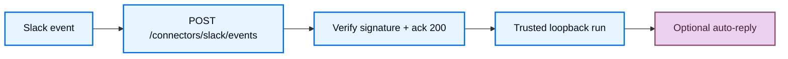

import ManagedDeepAgentsPrivateBetaNote from '/snippets/langsmith/managed-deep-agents-private-beta-note.mdx';
import ManagedDeepAgentsTestAndDeploy from '/snippets/langsmith/managed-deep-agents-test-and-deploy.mdx';

The Slack connector lets workspace members talk to your Managed Deep Agent from Slack. You declare triggers under `connectors/`, and `mda deploy` provisions the Slack app for you: the runtime verifies signatures, runs the agent, and can auto-reply in the same thread or DM.

<Note>
<ManagedDeepAgentsPrivateBetaNote />
</Note>

Unlike the manual Slack app setup used before, `mda deploy` creates and installs the Slack app through the workspace's Slack connection in LangSmith, points its Events Request URL at `/connectors/slack/events`, and writes the bot token and signing secret onto the deployment. You do not create an app or put `SLACK_BOT_TOKEN` / `SLACK_SIGNING_SECRET` in `.env`.

## Prerequisites

- A Managed Deep Agents project with a root [identity](/langsmith/managed-deep-agents-identity) declaration (Slack events require identity).
- A Slack connection in LangSmith (**Settings → Workspace → Integrations**). `mda deploy` uses this connection to create and install the app.

## Add the Slack connector

Add `connectors/slack.py` or `connectors/slack.ts` next to your agent entry. The connector name becomes the ingress path (`slack` → `POST /connectors/slack/events`). Export a named `connector` created with `connectors.slack(...)`.

<CodeGroup>

```python connectors/slack.py
from managed_deepagents import connectors

connector = connectors.slack(
    on=["app_mention", "direct_message", "thread_reply"],
    auto_reply=True,
    mention_behavior="strip",
    app={
        "name": "Deep Agent",
        "description": "Answers in Slack with your linked identity",
    },
)
```

```ts connectors/slack.ts
import { connectors } from "managed-deepagents";

export const connector = connectors.slack({
  on: ["app_mention", "direct_message", "thread_reply"],
  autoReply: true,
  mentionBehavior: "strip",
  app: {
    name: "Deep Agent",
    description: "Answers in Slack with your linked identity",
  },
});
```

</CodeGroup>

Pair the connector with an identity declaration that matches your product:

<CodeGroup>

```python identity.py
from managed_deepagents import define_identity

# Shared Slack bot: conversations scoped by Slack source thread
identity = define_identity(scope={"threads": "conversation"})
```

```ts identity.ts
import { defineIdentity } from "managed-deepagents";

// Shared Slack bot: conversations scoped by Slack source thread
export const identity = defineIdentity({ scope: { threads: "conversation" } });
```

</CodeGroup>

For browser and Slack account linking (the same user across web and Slack), use validated-token [auth](/langsmith/managed-deep-agents-identity#auth-identify-the-caller) and [Connect-with-Slack](#optional-connect-with-slack) instead of a bare shared install.

## The `app` branding

`app` controls how the app that `mda deploy` creates presents itself in Slack:

| Field (Python / TypeScript) | Purpose |
| --- | --- |
| `name` | Display name of the Slack app. |
| `description` | Short description shown in Slack. |
| `icon` | App icon. |
| `background_color` / `backgroundColor` | App background color. |

The connector rebuilds `app` at runtime only to preserve the authored config; deploy uses it when it provisions the app.

## How Slack Events work



1. Slack POSTs to `https://<agent-server>/connectors/slack/events` (the connector name becomes the path segment).
2. The runtime verifies the Slack signing secret against the raw body and returns HTTP 200 within Slack's ack window.
3. In the background it invokes the graph over trusted loopback, stamping user and source-thread identity (`source.provider: "slack"`).
4. When `autoReply` is enabled, it posts the agent response with the Slack Web API (and can set assistant loading status while the run is in progress).

LangGraph auth is bypassed only on `POST /connectors/{name}/events` so Slack can deliver without an ingress secret; the loopback invoke still uses `MDA_INGRESS_SECRET`.

## Connector options

| Option (Python / TypeScript) | Default | Meaning |
| --- | --- | --- |
| `on` | _(required)_ | Triggers to handle: `app_mention`, `direct_message`, `thread_reply` |
| `auto_reply` / `autoReply` | `true` | Post the agent response back to Slack via the Web API |
| `mention_behavior` / `mentionBehavior` | `"strip"` | `"strip"` removes the bot `@mention` from the model input; `"preserve"` keeps it |
| `conversation.app_mention` / `conversation.appMention` | `"thread"` | How `@mentions` map to agent threads: `thread`, `conversation`, or `message` |
| `conversation.direct_message` / `conversation.directMessage` | `"conversation"` | How DMs map to agent threads |
| `filters` | shared conversations off | Optional include/exclude lists for conversations and users (`slack:T…:U…`). Slack Connect shared conversations are not supported (`allow_shared_conversations: true` is rejected) |
| `app` | _(none)_ | Branding for the app that `mda deploy` provisions (see [The `app` branding](#the-app-branding)) |
| `contribute_tools` / `contributeTools` | `false` | Also load the Slack tool server tools for the agent, in addition to Events ingress |

### Triggers and Slack bot events

| Trigger | When it fires | Subscribe to bot events | Typical bot scopes |
| --- | --- | --- | --- |
| `app_mention` | Someone `@mentions` the bot in a channel | `app_mention` | `app_mentions:read`, `chat:write` |
| `direct_message` | Someone DMs the bot | `message.im` | `im:history`, `chat:write` |
| `thread_reply` | Someone replies in a thread the bot already joined (no new mention required) | `message.channels`, `message.groups` | `channels:history`, `groups:history`, `chat:write` |

`mda` derives the required OAuth scopes and event subscriptions from the `on` list at compile time, and `mda deploy` pushes them to the provisioned app. When you change `on`, redeploy so the subscriptions and scopes update. Invite the bot to each channel where you will `@mention` it.

## Required secrets

The bot itself needs no Slack secrets in `.env`: `mda deploy` writes the bot token and signing secret onto the deployment when it provisions the app. Set these only for the features you use:

| Variable | Required | Role |
| --- | --- | --- |
| `MDA_INGRESS_SECRET` | Yes when identity uses trusted loopback / `trusted_backend` | Trusted invoke from the Events path into the graph |
| `SLACK_CLIENT_ID` / `SLACK_CLIENT_SECRET` | Required for Connect-with-Slack | Connect-with-Slack OIDC |
| `MDA_PUBLIC_APP_URL` | Required for Connect-with-Slack | Browser UI origin shown in connect prompts and post-OAuth return |
| `MDA_PUBLIC_API_URL` | Recommended on Host | Public Agent Server URL used as the Slack OAuth `redirect_uri` |
| `MDA_GUEST_SIGNING_KEY` | Required for Connect-with-Slack / guest | Signs guest tokens and OAuth state |

## Deploy and smoke-test

1. Connect Slack in LangSmith (**Settings → Workspace → Integrations**) and ensure [identity](/langsmith/managed-deep-agents-identity) is declared.
2. Run `mda deploy`. Deploy creates and installs the Slack app, sets its Events Request URL to `https://<agent-server>/connectors/slack/events`, and writes the bot token and signing secret onto the deployment.
3. In Slack, `@mention` the bot in a channel where it is invited (or DM it if `direct_message` is enabled).
4. Confirm the bot shows a loading status (when supported) and posts a reply when `autoReply` is `true`.

<ManagedDeepAgentsTestAndDeploy />

## Optional: Connect-with-Slack

Connect-with-Slack maps a Slack user (`slack:T…:U…`) to a web or guest user so the same person keeps one thread history across browser and Slack when threads are user-owned.

When OIDC is configured (`SLACK_CLIENT_ID`, `SLACK_CLIENT_SECRET`, `MDA_PUBLIC_APP_URL`, and a signing key such as `MDA_GUEST_SIGNING_KEY`):

- **Linked users**: Events remap to the web user and the agent runs.
- **Unlinked users**: The bot replies with a connect link; no agent run until they finish OAuth.

Deployments without OIDC keep Slack users as-is (`slack:T…:U…`).

Set the **Sign in with Slack** redirect URL to `https://<agent-server>/identity/slack/callback`. On LangGraph Host, set `MDA_PUBLIC_API_URL` to the public Agent Server URL so Slack's `redirect_uri` is not an internal loopback. `mda deploy` injects `MDA_PUBLIC_API_URL` when the deployment already has a runtime URL; set it in `.env` after the first deploy if needed. Deploy also derives `CORS_ALLOW_ORIGINS` from `MDA_PUBLIC_APP_URL` (add more hosts with `MDA_CORS_ORIGINS` or an explicit `CORS_ALLOW_ORIGINS`).

## Troubleshooting

| Symptom | Likely cause |
| --- | --- |
| Mentions work, plain thread replies do not | Bot is not in the channel, or you replied as a new top-level message instead of inside the thread. Confirm `thread_reply` is in `on`, then redeploy to re-push subscriptions |
| Connect OAuth redirects to `localhost` | Set `MDA_PUBLIC_API_URL` to the public Agent Server URL and redeploy |
| Double replies on Host | Event dedupe is process-local; Slack retries can double-invoke on multi-replica Host |

## Next steps

<CardGroup cols={2}>
  <Card title="Connectors" icon="plug" href="/langsmith/managed-deep-agents-connectors">
    Compare connector types.
  </Card>
  <Card title="GitHub connector" icon="brand-github" href="/langsmith/managed-deep-agents-connectors/github">
    Prepare sandboxes, load tools, and receive GitHub App webhooks.
  </Card>
  <Card title="Identity" icon="fingerprint" href="/langsmith/managed-deep-agents-identity">
    Scope Slack callers and link accounts with Connect-with-Slack.
  </Card>
  <Card title="Deploy an agent" icon="upload" href="/langsmith/managed-deep-agents-deploy">
    Deploy the connector-enabled agent.
  </Card>
</CardGroup>
