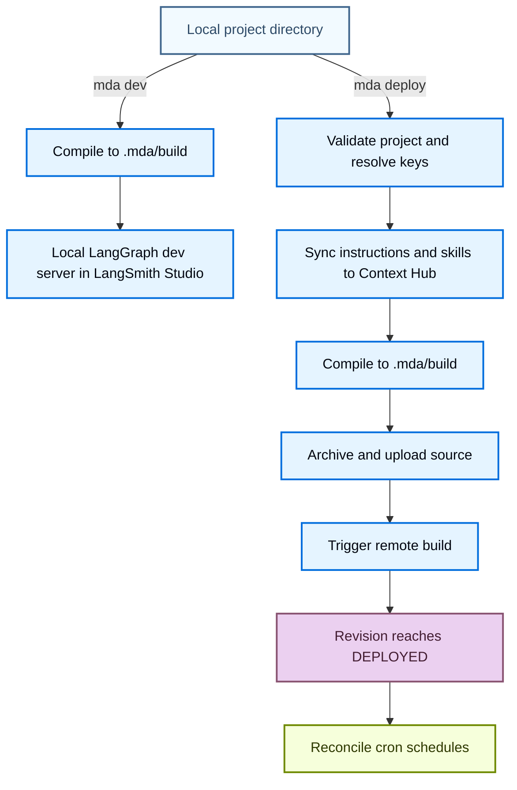

import ManagedDeepAgentsPrivateBetaNote from '/snippets/langsmith/managed-deep-agents-private-beta-note.mdx';

Managed Deep Agents turns a local [project directory](/langsmith/managed-deep-agents-overview#structure-your-agent-project) into a hosted LangGraph deployment. Understanding what the `mda` CLI compiles, what a deploy creates, and which parts the runtime owns helps you reason about behavior, secrets, and state.

<Note>
<ManagedDeepAgentsPrivateBetaNote />
</Note>

## Compilation

`mda dev` and `mda deploy` compile the project into a `.mda/build` directory. The compiler:

- **Copies project files verbatim.** Your `agent` entry, `tools/`, `middleware/`, and other imported modules are copied without rewriting, so imports behave the same as in a normal Python or TypeScript project.
- **Generates a managed LangGraph entrypoint.** The build wraps your named `agent` export in a managed entry and its LangGraph configuration, so the runtime can serve the agent without custom server code.
- **Injects managed dependencies when needed.** When `connectors/mcp.*` declares MCP servers, the compiler adds `@langchain/mcp-adapters` or `langchain-mcp-adapters` to the build and appends the loaded MCP tools to your authored tools.
- **Excludes generated, dependency, and secret paths.** The loader skips `node_modules`, `.git`, `.mda`, `.deepagents`, `memories`, `dist`, and `build`, and does not copy `.env` or `.env.*` into the archive.

`mda dev` starts the language-specific LangGraph dev server from `.mda/build` and stages the project `.env` into `.mda/build/.env` for local credentials. `mda deploy` uploads the compiled build instead. For the ignored-path list and dev server commands, see the [CLI reference](/langsmith/managed-deep-agents-cli#project-file-reference).

## Deploy lifecycle

`mda deploy` validates the project, syncs deploy-owned context to [Context Hub](#context-hub), uploads the compiled source, triggers a hosted build, and reconciles cron schedules once the deployment is live.

Deploy routes local inputs to different managed surfaces:

- **`instructions.md` and `skills/**`** sync to the deployment's Context Hub repo.
- **`memories/**`** is left untouched, so runtime-created memory is preserved.
- **Non-reserved `.env` values** (model provider keys, MCP tokens, database URLs) are forwarded as hosted deployment secrets. The `.env` file itself is never archived. For the list of reserved keys, see [Authentication](/langsmith/managed-deep-agents-cli#authentication).
- **Project source files** are archived from `.mda/build` and uploaded for the hosted build.
- **`schedules/**`** becomes LangSmith cron jobs after the deployment reaches `DEPLOYED`.

When you pass `--no-wait`, the CLI triggers the build and exits before the deployment reaches `DEPLOYED`, so schedule reconciliation is skipped for that invocation. After you deploy, you can find the deployment page, traces, and Context Hub repo in LangSmith. For more details, see [Created resources](/langsmith/managed-deep-agents-overview#created-resources). [Deploy an agent](/langsmith/managed-deep-agents-deploy) and the [CLI reference](/langsmith/managed-deep-agents-cli#deploy-projects) document every command flag and the full step list.

## What the managed runtime owns

The managed runtime owns infrastructure so the agent definition can focus on behavior, and so you write less server and persistence code. Do not set the fields owned by the managed runtime in the agent definition.

| Concern | Owner | Where you configure it |
| --- | --- | --- |
| `backend`, `store`, `checkpointer` | Managed runtime | Not configurable. |
| `memory` | Managed runtime, backed by Context Hub | `disableMemory` / `disable_memory` to turn off agent-scoped memory. |
| `skills` | Managed runtime, backed by Context Hub | `skills/**` in the project. |
| System prompt | Managed runtime, backed by Context Hub | `instructions.md` in the project. |
| Model, tools, middleware, subagents, interrupts | You | The agent definition and imported modules. |

For the full field list, see the [agent definition reference](/langsmith/managed-deep-agents-cli#agent-definition-reference).

## Context Hub

Each deployment has a [Context Hub](/langsmith/use-the-context-hub) agent repo that stores deploy-owned context and runtime-created memory:

- **`/instructions.md`** holds the managed system prompt. Deploy overwrites it from the local `instructions.md`.
- **`/skills/**`** holds deploy-owned skills. Deploy syncs every UTF-8 file under the local `skills/**` and deletes deployed skills that no longer exist locally.
- **`/memories/AGENTS.md`** holds durable agent memory. Deploy creates this file when memory is enabled, and preserves existing memory instead of overwriting it.

Because instructions and skills are deploy-owned, edit them in the project and redeploy. Because memory is runtime-owned, the agent reads and writes it during runs and deploy leaves it in place.

## Threads and memory

The managed runtime owns the checkpointer and store, so each thread's state persists across runs without any setup. Durable memory persists in [Context Hub](#context-hub) and is available to the agent across threads.

Scheduled runs choose their thread behavior explicitly. An ephemeral thread is cleaned up after the run, while a persistent thread reuses a stable thread ID so state accumulates. For the thread modes and when to use each, see [Schedules](/langsmith/managed-deep-agents-schedules).

## Sandboxes

A [sandbox](/langsmith/sandboxes) gives the agent an isolated environment for code execution and filesystem work. Configure one by exporting `sandbox` from `sandbox/index.ts` or `sandbox/__init__.py`.

- **Scope.** Sandboxes are scoped per thread, so each durable thread or conversation gets its own sandbox.
- **Lifecycle.** Options such as `idle_ttl_seconds` and `default_timeout` control how long a sandbox is retained and how long commands can run.
- **Provisioning.** When `sandbox/setup.sh` exists, Managed Deep Agents runs it once when a new managed sandbox is provisioned. Use it to install packages, seed files, or prepare workspace state.
- **Local development.** During `mda dev`, the runtime tries the configured provider and falls back to a local temp-directory sandbox when provider credentials are unavailable. The local fallback is intended only for development.

## See also

- [Overview](/langsmith/managed-deep-agents-overview): the project model and when to use Managed Deep Agents.
- [Deploy an agent](/langsmith/managed-deep-agents-deploy): the full deploy workflow, secrets, and troubleshooting.
- [CLI reference](/langsmith/managed-deep-agents-cli): every `mda` command, flag, and project file rule.
