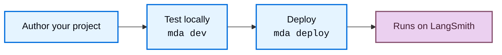

import ManagedDeepAgentsPrivateBetaNote from '/snippets/langsmith/managed-deep-agents-private-beta-note.mdx';
import ManagedDeepAgentsRuntimeOwnership from '/snippets/langsmith/managed-deep-agents-runtime-ownership.mdx';

Managed Deep Agents turns a local [project directory](/langsmith/managed-deep-agents-cli#project-file-reference) into a hosted LangGraph deployment. Knowing what the `mda` CLI compiles, what a deploy creates, and which parts the runtime owns helps you reason about behavior, secrets, and state.

<Note>
<ManagedDeepAgentsPrivateBetaNote />
</Note>

## Compilation

`mda dev` and `mda deploy` compile your project into a runnable LangGraph app in a `.mda/build` directory. Your agent entry and the modules it imports are copied without rewriting, so imports behave the same as in a normal Python or TypeScript project. The build leaves out secrets and generated files such as `.env` and `node_modules`. For the full ignored-path list, see the [CLI reference](/langsmith/managed-deep-agents-cli#project-file-reference).

## Deploy lifecycle

You author and test your project locally, then deploy it to LangSmith with one command.

`mda dev` runs the compiled app in LangSmith Studio so you can test it. `mda deploy` validates the project, syncs deploy-owned context to Context Hub, uploads the build, triggers a hosted build, and reconciles any cron schedules once the deployment is live. For secrets routing, deploy flags, and operational tips, see [Deploy an agent](/langsmith/managed-deep-agents-deploy). For the full step list and flags, see the [CLI reference](/langsmith/managed-deep-agents-cli#deploy-projects).

When you deploy a Managed Deep Agent, LangSmith creates or updates a hosted LangGraph deployment, creates a Context Hub agent repo for managed context, and reconciles any managed cron schedules declared under `schedules/`. Open the deployment page in LangSmith to inspect build status and revisions. Open traces to inspect user inputs, final responses, model calls, tool calls, sandbox activity, files, and runtime state created during runs.

## What the managed runtime owns

<ManagedDeepAgentsRuntimeOwnership />

## Context Hub

Each deployment has a [Context Hub](/langsmith/use-the-context-hub) repo that stores deploy-owned context:

- **`/instructions.md`**: the managed system prompt, synced from your project on deploy.
- **`/skills/**`**: deploy-owned skills, synced from your project on deploy.

Edit instructions and skills in your project and redeploy.

Durable memory is optional through a project-root `memory.py` or `memory.ts` declaration and is shared across the deployment when enabled. Shared memory is visible to all callers, so do not store personal data or secrets. See [Memory](/langsmith/managed-deep-agents-memory).

## Threads

The managed runtime owns the checkpointer and store, so each thread's state persists across runs without any setup.

Scheduled runs choose their thread behavior explicitly. An ephemeral thread is cleaned up after the run, while a persistent thread reuses a stable thread ID so state accumulates. For the thread modes and when to use each, see [Schedules](/langsmith/managed-deep-agents-schedules).

## Sandboxes

A sandbox gives the agent an isolated environment for code execution and filesystem work. Configure one by exporting `sandbox` from `sandbox/index.ts` or `sandbox/__init__.py`. Sandboxes default to one per thread; set `scope` to `agent` to share one across the agent process. Connectors can also provision files, CLIs, and credentials when a sandbox starts. For configuration options and examples, see [Sandboxes](/langsmith/managed-deep-agents-sandboxes).

## Connectors

Optional modules directly under `connectors/` extend the agent with external tools and capabilities. Discovery is name-agnostic: each file is a connector, and you do not register connectors in the agent entry. The runtime loads each connector when it compiles and starts the deployment:

- **MCP** (`connectors/mcp.{py,ts}`): the runtime creates the MCP client, loads tools from the declared remote servers, and appends them to the authored tools at runtime.
- **LangSmith** (`connectors/langsmith.{py,ts}`): the runtime mounts one HTTP route per capability on the Agent Server and runs each call server-side with the workspace key, so untrusted callers never receive `LANGSMITH_API_KEY`. Requires a root identity declaration.
- **GitHub** (`connectors/github.{py,ts}`): when the project declares a sandbox, the runtime clones the configured repositories, installs the `gh` CLI, and injects credentials as the sandbox starts.

For authoring, defaults, and provider setup, see [Connectors](/langsmith/managed-deep-agents-connectors).

## Provider events

The Slack and GitHub connectors can mount public provider Events URLs on the Agent Server (for example Slack at `POST /connectors/slack/events`, or GitHub at `POST /connectors/github/events`). The runtime verifies provider signatures, acknowledges delivery, then invokes the graph over trusted loopback with identity stamps and optional auto-reply. Provider events require a root identity declaration. For authoring and provider setup, see [Connectors](/langsmith/managed-deep-agents-connectors).

## See also

- [Overview](/langsmith/managed-deep-agents-overview): when to use Managed Deep Agents and beta limits.
- [Identity](/langsmith/managed-deep-agents-identity): authenticate callers and scope threads and store access.
- [Memory](/langsmith/managed-deep-agents-memory): configure optional deployment-shared durable memory.
- [Sandboxes](/langsmith/managed-deep-agents-sandboxes): configure isolated filesystem and shell access.
- [Evals](/langsmith/managed-deep-agents-evals): compile a Harbor handoff and run Harbor-style tasks.
- [Connectors](/langsmith/managed-deep-agents-connectors): load MCP tools, expose LangSmith capabilities, prepare GitHub sandboxes, and receive Slack or GitHub events.
- [Deploy an agent](/langsmith/managed-deep-agents-deploy): the full deploy workflow, secrets, and troubleshooting.
- [CLI reference](/langsmith/managed-deep-agents-cli): every `mda` command, flag, and project file rule.
