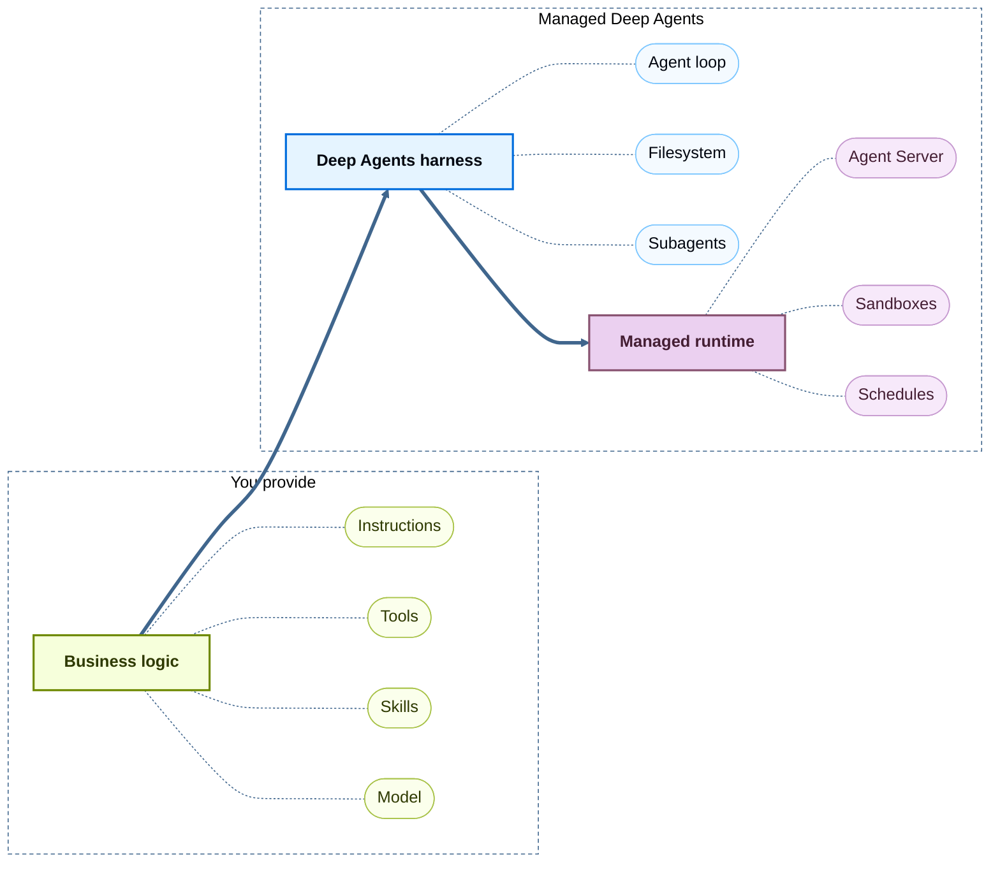

Managed Deep Agents (MDA) is the simplest way to build and deploy production agents. You focus on what your agent does. MDA runs it. There are no servers to run and no infrastructure to wire together.

You write the agent's intelligence: its instructions, the tools it can call, the skills it follows, and you select the model that drives it. MDA provides everything underneath:

- **The Deep Agents harness**: The agent loop that plans, calls tools, manages a filesystem, and delegates to subagents. See [Deep Agents](/oss/deepagents/overview).
- **A managed runtime**: [LangSmith Deployment's Agent Server](/langsmith/agent-server-overview) hosts and operates the agent, and keeps sessions running across restarts.

## Example agent

TRUNCATED PLACEHOLDER