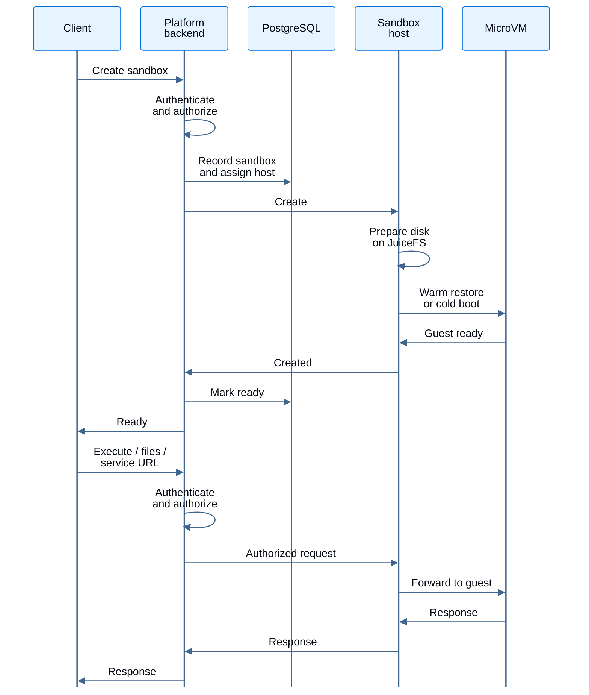
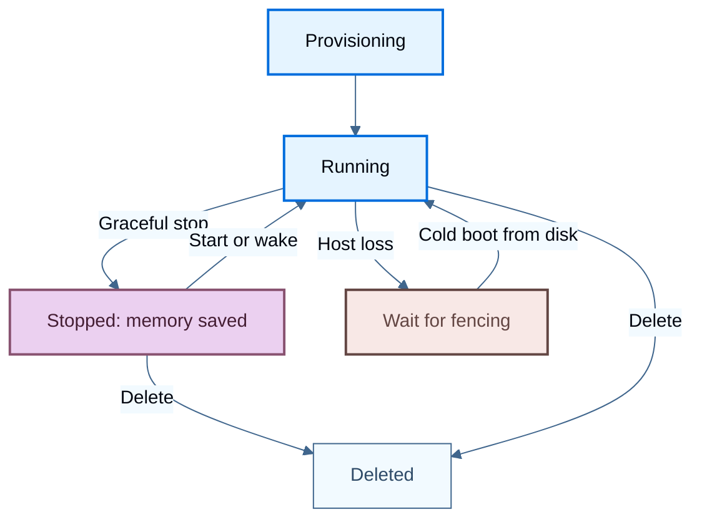

[LangSmith Sandboxes](/langsmith/sandboxes) run code in isolated microVMs on a dedicated pool of Kubernetes nodes. This guide explains where the components run, how requests reach a sandbox, and which state survives a host restart.

For supported platforms, prerequisites, and installation instructions, see [Enable Sandboxes](/langsmith/deploy-self-hosted-full-platform#enable-sandboxes). The architecture below describes the `sandbox-host` runtime. Storage mounting and configuration options can differ across Helm releases.

<CardGroup cols={2}>
  <Card title="Scaling and capacity" icon="arrows-maximize" href="/langsmith/self-host-sandbox-scaling">
    Size the host pool, configure autoscaling, and plan memory and cache capacity.
  </Card>
  <Card title="Upgrades and operations" icon="server" href="/langsmith/self-host-sandbox-operations">
    Understand host draining, failure recovery, and production monitoring.
  </Card>
</CardGroup>

## Understand the deployment model

A sandbox is a Firecracker microVM, not a Kubernetes pod. Each `sandbox-host` pod manages multiple microVMs, each with its own guest kernel. Kubernetes schedules the hosts; LangSmith places sandboxes onto them.

The host Deployment uses required pod anti-affinity to place at most one host pod on each node. Its node selector and tolerations target a dedicated, KVM-capable node pool. Adding a sandbox does not create another pod.

<Frame caption="The platform backend manages sandbox placement and traffic. Hosts run microVMs; shared storage keeps persistent state independent of a node.">
  
  
</Frame>

### Understand component failure impact

Each component has a different failure scope. Distinguish temporary unavailability from loss of its stored data when planning recovery.

| Component | Where it runs and what it holds | If unavailable or lost |
| --- | --- | --- |
| `platform-backend` | Existing LangSmith node pool. Authenticates and authorizes requests, chooses hosts, and proxies traffic. Holds no durable sandbox state. | API unavailable Sandbox API and proxied traffic fail while the service is unavailable. Restarting it does not delete sandbox disks. |
| PostgreSQL | Existing LangSmith database. Holds sandbox records, the host registry, and placement. | API unavailable An outage blocks operations that need sandbox records or placement.  Persistent data at risk Losing database contents requires restoring those records, not just restarting hosts. |
| `sandbox-host` | Dedicated sandbox node pool, one pod per node. Holds running microVMs and their memory. | One host affected Abrupt loss stops that host's sandboxes and loses running memory. Persistent disks remain on shared storage. |
| JuiceFS client | Host-owned mount inside each host pod. Connects the VMs to shared storage and manages a local cache. | One host affected Mount failure fences the host and stops its VMs. Restart requires working shared storage. |
| Kubernetes API | Kubernetes control plane. Holds host Leases and the host Deployment. | Pool-wide disruption Hosts that cannot renew Leases eventually fence themselves. A prolonged cluster-wide outage can stop the entire pool. |
| JuiceFS Redis | Dedicated metadata store. Holds the file tree, file sizes, and the mapping to data chunks. | Pool-wide disruption An outage stalls or fails filesystem operations across hosts.  Persistent data at risk Lost metadata requires recovery from backup. Object storage alone cannot reconstruct the filesystem. |
| Object storage | Shared bucket or container. Holds data blocks for disk images, saved memory, and snapshots. | Pool-wide disruption An outage blocks uncached reads and uploads. New hosts may fail readiness.  Persistent data at risk Deleted data blocks require recovery from backup for the affected disks and snapshots. |
| Node-local cache | Each sandbox node. Holds disposable copies of JuiceFS data blocks. | Cache rebuild only Persisted data remains on shared storage. Hosts fetch cached copies again, with slower I/O while the cache warms. |

For fencing, recovery behavior, and storage protection, see [Understand failure impact](/langsmith/self-host-sandbox-operations#understand-failure-impact).

One elected host observes pool health and runs the [host autoscaler](/langsmith/self-host-sandbox-scaling#understand-the-two-scaling-layers). Other hosts continue serving sandboxes without holding leadership.

### Inspect one sandbox node

A host pod runs the sandbox daemon and Firecracker processes. In deployments with a host-owned JuiceFS mount, it also runs the JuiceFS client. The daemon connects to the agent inside each guest through `vsock`.

<Frame caption="One Kubernetes pod contains multiple microVMs. The host needs KVM access; guest memory and node-local caches consume the node's resources.">
  
  
</Frame>

The host uses host networking on port `19190`. The platform backend connects to the host's node address; clients use the LangSmith API or [service URLs](/langsmith/sandbox-service-urls), not the host listener directly. Keep host listeners on private networks.

Host pods require privileged access for virtualization, networking, and mounts. Use dedicated nodes and restrict administrative access to them. Guest isolation does not make the host pod an unprivileged workload.

## Follow a request

Creating a sandbox passes through the platform backend before reaching a host. Subsequent command, file, and service requests follow the same authorization boundary.

Placement considers committed CPU and prefers the sandbox's previous host when its load is close to the least-loaded candidate. Returning to that host can reuse cached data. It is a preference, not a guarantee that a sandbox stays on one node.

<Note>
The utilization target controls scaling, not admission. A busy pool can still place work on an existing host. With no ready hosts, creation fails with `NoSandboxHostsAvailable` rather than waiting in a capacity queue. See [Plan for bursts](/langsmith/self-host-sandbox-scaling#plan-for-bursts).
</Note>

## Track persistent state

JuiceFS separates a filesystem's metadata from its contents:

- **Redis metadata**: Directory entries, file sizes, and the mapping from files to data chunks.
- **Object storage**: Data chunks for disk images, saved memory images, and snapshots.
- **Local cache**: Copies of data blocks on individual nodes. A node replacement loses that cache, not the shared filesystem.

<Warning>
JuiceFS Redis is durable storage, not the LangSmith cache Redis. Object storage alone cannot reconstruct the filesystem without its metadata. Protect both stores, use `noeviction` for metadata Redis, and test recovery. See [Protect sandbox storage](/langsmith/self-host-sandbox-operations#protect-sandbox-storage).
</Warning>

### Distinguish suspend from a crash

A persistent sandbox can resume on a different compatible host because its disk and successfully saved memory live on shared storage.

- **Graceful stop**: The host saves VM memory and stops the VM. A later start or wake request can restore running processes from that image.
- **Host loss**: Running memory is lost. Recovery waits for the fencing window before another host can start the sandbox from persisted disk.
- **Deletion**: Removes the sandbox rather than moving it to another host. A separately captured [snapshot](/langsmith/sandbox-snapshots) has its own lifecycle.

Restoring memory requires a complete, compatible memory image. It is not live migration and does not preserve an open client connection. Unflushed writes and in-memory work can be lost after an abrupt failure. These persistence guarantees do not apply to ephemeral sandbox storage.

## See also

- [Enable Sandboxes](/langsmith/deploy-self-hosted-full-platform#enable-sandboxes)
- [Scale self-hosted Sandboxes](/langsmith/self-host-sandbox-scaling)
- [Operate self-hosted Sandboxes](/langsmith/self-host-sandbox-operations)
- [Sandbox permissions](/langsmith/sandbox-permissions)
