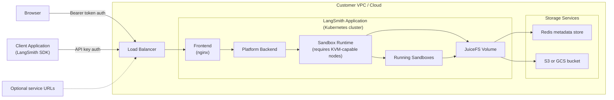

LangSmith Sandboxes let users run code, expose temporary services, and create memory snapshots from the LangSmith UI and APIs. On self-hosted Kubernetes, Sandboxes are disabled by default and must be enabled explicitly in your Helm values.

<Note>
Self-hosted Sandboxes require LangSmith Helm chart `0.16.0` or later.
</Note>

For user workflows after installation, see [LangSmith Sandboxes](/langsmith/sandboxes).

## Supported platforms

Self-hosted Sandboxes are currently supported on:

- Amazon Elastic Kubernetes Service (EKS)
- Google Kubernetes Engine (GKE)

Azure Kubernetes Service (AKS) is supported by the base LangSmith chart, but self-hosted Sandboxes are not supported on AKS yet.

## Deployment overview

The following diagram shows the logical components added when you enable Sandboxes in a self-hosted LangSmith deployment.



In the Helm-rendered Kubernetes resources, **Sandbox Runtime** corresponds to the `sandbox-host` Deployment.

## Prerequisites

Before enabling Sandboxes, verify the following requirements.

### Install LangSmith on Kubernetes

Install the base LangSmith platform first. See [Self-host LangSmith on Kubernetes](/langsmith/kubernetes).

Sandboxes run in the same Kubernetes cluster and namespace as the LangSmith release.

### Add sandbox-capable nodes

Your cluster must include dedicated nodes that can run nested workloads with Linux KVM available at `/dev/kvm`.

- On AWS, use x86_64 EC2 bare-metal instance types.
- On GCP, use Standard GKE with a machine type that supports nested virtualization. GKE Autopilot is not supported for Sandboxes.

The default Helm scheduling values expect the dedicated nodes to have:

```yaml
label:
  sandbox.langsmith.com/host: "true"
taint:
  key: sandbox.langsmith.com/host
  value: "true"
  effect: NoSchedule
```

If your nodes use different labels or taints, override `config.sandboxes.sandboxHost.deployment.nodeSelector` and `config.sandboxes.sandboxHost.deployment.tolerations`.

### Configure storage for sandbox files and snapshots

Sandboxes require JuiceFS-backed shared storage. You must provide:

- A Redis-compatible metadata store.
- An object storage bucket or bucket root.
- A JuiceFS CSI configuration Secret, or enough Helm values for the chart to create one.

<Warning>
Enabling Sandboxes installs the JuiceFS CSI driver. The CSI driver includes cluster-scoped Kubernetes resources. Only one sandbox-enabled LangSmith release should manage the JuiceFS CSI driver in a cluster unless you have verified resource ownership.
</Warning>

Supported object storage backends:

| Platform | `config.sandboxes.juicefs.storage` | `config.sandboxes.juicefs.bucket` format |
| --- | --- | --- |
| AWS | `s3` | Region-explicit HTTPS S3 endpoint, such as `https://bucket-name.s3.us-west-2.amazonaws.com` |
| GCP | `gs` | GCS URL, such as `gs://bucket-name` |

Do not use object-store subpaths in `config.sandboxes.juicefs.name`. Use a flat name, such as `sandbox-juicefs`. JuiceFS stores objects under that name inside the configured bucket.

<Tip>
For the Redis metadata store, we recommend setting `maxmemory-policy` to `noeviction`. This avoids evicting JuiceFS metadata under memory pressure. Monitor Redis capacity and scale it before it reaches memory limits.
With `noeviction`, Redis writes can fail when the instance reaches max memory, so keep enough memory headroom for sandbox metadata growth.
</Tip>

### Configure secrets

Sandboxes need additional secret material for service-to-service authentication and callback signing.

If the Helm chart manages your LangSmith app Secret, set these values:

```yaml
config:
  sandboxes:
    xServiceAuthJwtSecret: "<stable-random-secret>"
    callbackSigningJwk: '<ed25519-private-jwk>'
```

If you use `config.existingSecretName`, do not set those values directly in Helm. Add the following keys to the existing LangSmith app Secret instead:

```yaml
stringData:
  sandbox_x_service_auth_jwt_secret: "<stable-random-secret>"
  sandbox_callback_signing_jwk: '<ed25519-private-jwk>'
  # Optional, only during service-auth secret rotation:
  sandbox_x_service_auth_jwt_secret_previous: "<previous-stable-random-secret>"
```

The callback signing value must be an Ed25519 private JWK. Keep it stable across upgrades.

### Choose a proxy CA mode

The chart supports three proxy CA modes:

| Mode | Use when |
| --- | --- |
| `generatedSecret` | You want Helm to create a self-signed CA Secret. This is the default. |
| `certManager` | You already run cert-manager and want cert-manager to manage the CA Secret. |
| `existingSecret` | You manage the CA Secret outside the LangSmith chart. |

In GitOps workflows that render manifests without live cluster access, prefer `certManager` or `existingSecret`. The `generatedSecret` mode uses Helm's live `lookup` behavior to reuse the generated Secret on upgrades; pure render workflows cannot read the live Secret and may produce new cert material on each render.

## Enable with Helm

Add the following values to your `langsmith_config.yaml`, along with the secret values from [Configure secrets](#configure-secrets). Replace placeholders with your deployment-specific values.

```yaml
images:
  sandboxHostImage:
    tag: "<same-release-tag-as-your-langsmith-images>"

config:
  sandboxes:
    enabled: true
    clusterName: "<cluster-name>"
    juicefs:
      name: "sandbox-juicefs"
      storage: "s3"
      bucket: "https://bucket-name.s3.us-west-2.amazonaws.com"
      redis:
        metaURL: "redis://redis-host:6379/1"
    proxyCa:
      mode: "generatedSecret"
```

If you create the JuiceFS CSI config Secret yourself, set `config.sandboxes.juicefs.csi.existingSecretName` and omit `config.sandboxes.juicefs.name`, `storage`, `bucket`, and `redis.metaURL` from the Helm values:

```yaml
config:
  sandboxes:
    enabled: true
    clusterName: "<cluster-name>"
    juicefs:
      csi:
        existingSecretName: "juicefs-csi-config"
```

The existing Secret must be in the LangSmith release namespace and contain these keys:

```yaml
stringData:
  name: "sandbox-juicefs"
  metaurl: "redis://redis-host:6379/1"
  storage: "s3"
  bucket: "https://bucket-name.s3.us-west-2.amazonaws.com"
```

Apply the updated chart:

```bash
helm upgrade -i langsmith langchain/langsmith \
  --values langsmith_config.yaml \
  --version <version> \
  --namespace <namespace> \
  --wait
```

## Enable with Terraform

The LangSmith Terraform modules can provision the required AWS and GCP infrastructure and generate the corresponding Helm values.

### AWS

In `modules/aws/infra/terraform.tfvars`, enable Sandboxes and configure the sandbox node capacity:

```hcl
enable_sandboxes = true
redis_source = "external"

sandbox_host_node_count = 1
sandbox_host_instance_types = ["m5d.metal"]
sandbox_host_configure_instance_store = true

sandbox_host_image_tag = "<same-release-tag-as-your-langsmith-images>"
```

AWS Sandboxes require `redis_source = "external"`. The Terraform module reuses the managed Redis and S3 bucket from the LangSmith installation, configures Redis with the recommended `noeviction` policy, creates the JuiceFS CSI config Secret, and adds the expected node label and taint.

Run the normal AWS flow:

```bash
make apply
make init-values
CHART_VERSION="~0.16.0" make deploy
```

### GCP

In `modules/gcp/infra/terraform.tfvars`, enable Sandboxes and configure a Standard GKE node pool:

```hcl
enable_sandboxes = true
redis_source = "external"

gke_use_autopilot = false
enable_gcp_iam_module = true

sandbox_host_node_count = 1
sandbox_host_min_node_count = 1
sandbox_host_max_node_count = 5
sandbox_host_machine_type = "n2-standard-8"

sandbox_host_image_tag = "<same-release-tag-as-your-langsmith-images>"
```

GCP Sandboxes require `redis_source = "external"`. The Terraform module reuses Memorystore and the GCS bucket from the LangSmith installation, configures Redis with the recommended `noeviction` policy, creates the JuiceFS CSI config Secret, and adds the expected node label and taint.

Run the normal GCP flow:

```bash
make apply
make init-values
CHART_VERSION="~0.16.0" make deploy
```

## Optional: enable service URLs

Set `config.sandboxes.serviceUrlBaseUrl` when users need browser or programmatic access to HTTP services running inside Sandboxes.

```yaml
config:
  sandboxes:
    serviceUrlBaseUrl: "https://sandbox-services.example.com"
```

This requires wildcard DNS and TLS for `*.sandbox-services.example.com`. When `ingress.enabled` is `true`, the chart also adds a wildcard ingress rule that routes these service URLs to the LangSmith platform backend.

## Verify the installation

After the upgrade completes, verify that the sandbox runtime pods and JuiceFS volumes are ready:

```bash
kubectl rollout status deployment/sandbox-host -n <namespace>
kubectl get pods,pvc -n <namespace>
```

Then run a sandbox smoke test:

1. Create a sandbox from a public image, such as a Python image.
2. Start a Python HTTP server inside the sandbox.
3. Snapshot the sandbox with memory enabled.
4. Create a new sandbox from the snapshot.
5. Verify that the HTTP server is still running in the restored sandbox.

## Upgrade notes

Sandbox runtime image changes roll out through the `sandbox-host` Kubernetes Deployment. After changing the image tag, use the normal Helm upgrade flow and check the Deployment rollout before running sandbox smoke tests.

The JuiceFS persistent volumes use `Retain`. If you uninstall Sandboxes, review the retained PVs, PVCs, Redis metadata, and object storage data before deleting anything.
