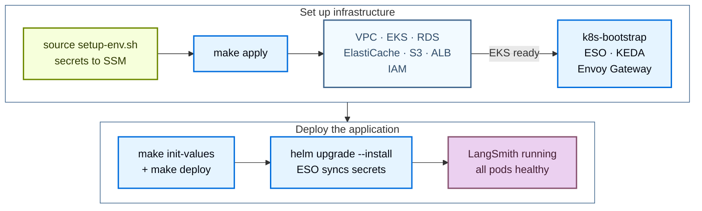

Deploy LangSmith to AWS with the public [Terraform modules](https://github.com/langchain-ai/terraform/tree/v0.16.101/modules/aws). Managing the deployment as code lets you version, review, and reproduce your LangSmith environment across accounts instead of clicking through the AWS Console.

The install runs in two stages:

1. **Infrastructure**: Terraform provisions VPC, EKS, RDS, ElastiCache, S3, the ALB, and IAM, then bootstraps the cluster add-ons.
2. **Application**: Helm installs the LangSmith chart against the cluster.

After the base install, enable optional add-ons by setting flags and redeploying.



## Prerequisites

### Required tools

| Tool | Version | Purpose |
|---|---|---|
| AWS CLI | v2 | Authenticate, query AWS resources, manage EKS kubeconfig |
| Terraform | 1.11 or later | Run the infrastructure modules |
| `kubectl` | 1.34 or later | Inspect the EKS cluster |
| Helm | 3.12 or later | Install and manage the LangSmith chart |
| `eksctl` | latest | Optional, handy for kubeconfig and debugging |

Install on macOS:

```bash
brew install awscli kubectl helm eksctl
brew tap hashicorp/tap && brew install hashicorp/tap/terraform
```

Verify each tool is on `PATH`:

```bash
aws --version
terraform version
kubectl version --client
helm version
```

For Linux, follow the [AWS CLI install guide](https://docs.aws.amazon.com/cli/latest/userguide/getting-started-install.html) and use your distribution's package manager for the remaining tools.

### Required AWS IAM permissions

The IAM user or role running Terraform needs `AdministratorAccess`, or `PowerUserAccess` plus `IAMFullAccess`. The module creates IAM roles and policies for IRSA, so `PowerUserAccess` alone is not enough. For a scoped-down policy, refer to [`PERMISSIONS.md`](https://github.com/langchain-ai/terraform/blob/v0.16.101/modules/aws/PERMISSIONS.md) in the module.

<Tip>
Run `make preflight` from `modules/aws/` after authenticating. The read-only checks confirm the active credentials, the region, and the CLI tools, and stop at the first failure. To also test that the credentials can create resources, run `make preflight ARGS="--create-test-resources"`.
</Tip>

### Authenticate

Configure AWS credentials with the CLI:

```bash
aws configure
```

Or export environment variables:

```bash
export AWS_ACCESS_KEY_ID="..."
export AWS_SECRET_ACCESS_KEY="..."
export AWS_DEFAULT_REGION="us-west-2"
```

Confirm the credentials work and the target region is enabled in the account:

```bash
aws sts get-caller-identity
aws ec2 describe-availability-zones --query 'AvailabilityZones[].ZoneName' --output table
```

### License key and domain

- **LangSmith license key.** [Contact our sales team](https://www.langchain.com/contact-sales) to request one. The setup script stores the key in AWS SSM Parameter Store, not in `tfvars`.
- **Domain (optional).** Set `langsmith_domain` to serve LangSmith on your own hostname. With a domain and no `acm_certificate_arn`, Terraform creates a Route 53 hosted zone, requests an ACM certificate, and creates the ALB alias record. To use an existing hosted zone instead, set `dns_create_zone = false` and `dns_existing_zone_id`. To bring your own certificate, set `acm_certificate_arn`. Leave `langsmith_domain` empty to reach LangSmith on the ALB hostname. Without a domain, set `acm_certificate_arn`, or set `tls_certificate_source = "none"` to serve plain HTTP.

### Cluster sizing reference

Two independent settings control capacity:

- **Infrastructure capacity** sets instance types and node counts directly through the infra variables `eks_managed_node_groups`, `postgres_instance_type`, and `redis_instance_type`. The module defaults are one `m5.4xlarge` node group (min 3, max 10), `db.t3.large` for RDS, and `cache.m6g.xlarge` for ElastiCache. The `infra/terraform.tfvars.dev`, `terraform.tfvars.minimum`, and `terraform.tfvars.production` templates set smaller or larger values.
- **`sizing_profile`** selects the Helm sizing overlay (pod resource requests and limits). `init-values.sh` and `deploy.sh` read it; Terraform does not.

Size the infrastructure for your target tier before deploying. For per-tier recommendations, refer to [Scaling guidance](/langsmith/self-host-scale).

<Note>
For production workloads, also plan to provision external [LangChain Managed ClickHouse](/langsmith/langsmith-managed-clickhouse) or a self-managed external ClickHouse cluster. In-cluster ClickHouse is supported for dev/POC only.
</Note>

## Quickstart

<Tip>
For a condensed cheat sheet of `make` targets, required variables, and common constraints, see the [AWS quick reference](/langsmith/self-host-terraform-aws-quick-reference).
</Tip>

For the fastest path from zero to a running LangSmith instance, run these commands in order:

```bash
# 1. Clone the public modules
git clone https://github.com/langchain-ai/terraform.git
cd terraform/modules/aws

# 2. Generate terraform.tfvars interactively (Enter accepts current values)
make quickstart

# 3. Load secrets into SSM Parameter Store
#    Must be sourced, not executed
source infra/scripts/setup-env.sh

# 4. Provision infrastructure
make init
make plan
make apply

# 5. Configure kubectl
source infra/scripts/set-kubeconfig.sh
kubectl get nodes

# 6. Deploy LangSmith with Helm
make init-values
make deploy

# 7. Confirm
kubectl get pods -n langsmith
kubectl get httproute -n langsmith
```

`make deploy` prints the LangSmith URL when it finishes.

To chain infrastructure and application in one command, first run `make quickstart` and `source infra/scripts/setup-env.sh` in the same shell, then:

```bash
make quickdeploy          # interactive, prompts before terraform apply
make quickdeploy-auto     # non-interactive, auto-approves terraform
```

`make quickdeploy` runs `terraform apply`, sources `set-kubeconfig.sh`, then runs `init-values` and `deploy.sh`. It stops if the `setup-env.sh` exports are missing. If `terraform apply` fails, fix the issue and re-run `make quickdeploy`. If a later step fails, the command prints the `make` target to retry.

The following sections cover each stage in detail.

## Provision infrastructure

Terraform provisions the following AWS resources:

| Resource | Purpose |
|---|---|
| VPC + subnets + NAT | Private network for the cluster and managed services |
| EKS cluster + node groups | Kubernetes compute |
| RDS PostgreSQL | LangSmith operational data |
| ElastiCache Redis | Queue and cache |
| S3 bucket + VPC endpoint | Trace payload blob storage |
| ALB + listeners | Entry point; terminates TLS with `acm` |
| IRSA roles + IAM policies | Per-service AWS access |
| KEDA, External Secrets Operator, Envoy Gateway | Bootstrap workloads installed alongside infrastructure. Envoy Gateway is the default ingress. cert-manager is added only for Let's Encrypt. |

Application secrets live in SSM Parameter Store. `setup-env.sh` writes them, not Terraform, and External Secrets Operator syncs them into the cluster.

### Clone and configure

```bash
git clone https://github.com/langchain-ai/terraform.git
cd terraform/modules/aws
```

All subsequent commands run from `modules/aws/`. Run `make help` for the full target list.

Generate `terraform.tfvars` with the interactive wizard:

```bash
make quickstart
```

The wizard walks through 13 sections, including naming, region, networking, EKS sizing, data sources, TLS and DNS, ingress, and the optional add-on flags. It writes `infra/terraform.tfvars`. When the file already exists, the wizard offers to update it with the existing values preselected, start fresh, or cancel, and it backs up the original file first. Some settings, such as the bring-your-own security group variables (`*_existing_security_group_id`), are not in the wizard; set them in `terraform.tfvars` by hand.

Prefer to edit by hand? Copy the example and fill in the required fields:

```bash
cp infra/terraform.tfvars.example infra/terraform.tfvars
vi infra/terraform.tfvars
```

The minimum required variables:

```hcl
name_prefix = "acme"
environment = "prod"
region      = "us-west-2"

eks_cluster_version = "1.34"
eks_managed_node_groups = {
  default = {
    name           = "node-group-default"
    instance_types = ["m5.4xlarge"]
    min_size       = 3
    max_size       = 10
  }
}

postgres_source = "external"
redis_source    = "external"

tls_certificate_source = "acm"
langsmith_domain       = "langsmith.example.com"
# acm_certificate_arn  = "arn:aws:acm:us-west-2:<account-id>:certificate/<cert-id>"  # optional with a domain
```

See the [AWS variables reference](/langsmith/self-host-terraform-aws-variables) for every input variable.

<Tip>
Configure a remote state backend before applying. Copy `infra/backend.tf.example` to `infra/backend.tf` and set the S3 bucket, key, region, and DynamoDB lock table. Without it, Terraform keeps state locally.
</Tip>

### Load secrets into SSM Parameter Store

```bash
source infra/scripts/setup-env.sh
```

The script reads `terraform.tfvars`, derives the SSM path `/langsmith/{name_prefix}-{environment}/`, then for each secret either reuses an exported value, reads the existing SSM parameter, auto-generates one, or prompts you. You supply three values interactively: the license key, the admin password, and the admin email. The script must be sourced (not executed) because `make` cannot export environment variables back to the parent shell.

The script manages the following SSM parameters:

| SSM key | How it is set | Notes |
|---|---|---|
| `postgres-password` | Auto-generated (`openssl rand -hex 32`) | RDS master password |
| `redis-auth-token` | Auto-generated (hex) | ElastiCache auth token |
| `sandbox-juicefs-redis-auth-token` | Auto-generated (hex) | Only when `enable_sandboxes = true` |
| `langsmith-api-key-salt` | Auto-generated (`openssl rand -base64 32`) | Never rotate, breaks all API keys |
| `langsmith-jwt-secret` | Auto-generated (`openssl rand -base64 32`) | Never rotate, invalidates all sessions |
| `sandbox-callback-signing-jwk` | Auto-generated Ed25519 key | Only when `enable_sandboxes = true` |
| `langsmith-license-key` | Prompt | From [our sales team](https://www.langchain.com/contact-sales) |
| `langsmith-admin-password` | Prompt | At least 12 characters, with lowercase, uppercase, and a symbol |
| `langsmith-admin-email` | Prompt | Initial organization admin |
| `deployments-encryption-key` | Auto-generated Fernet key | LangSmith Deployment add-on |
| `agent-builder-encryption-key` | Auto-generated Fernet key | Used by Fleet; the name predates the rename |
| `insights-encryption-key` | Auto-generated Fernet key | Insights add-on |
| `polly-encryption-key` | Auto-generated Fernet key | LangSmith Chat (formerly Polly) add-on |

If you turn on `enable_sandboxes` later, source `setup-env.sh` again before `make apply` so it creates the sandbox secrets.

Verify the secrets are present and the `TF_VAR_*` environment variables are exported:

```bash
make secrets
```

### Apply

```bash
make init
make plan
make apply
```

`make plan` shows the proposed diff. Review the output before applying. `make apply` runs a single `terraform apply` across all modules; Terraform orders the resources by dependency. Pass `ARGS="-auto-approve"` to skip the confirmation prompt.

### Configure kubectl

```bash
source infra/scripts/set-kubeconfig.sh
kubectl get nodes
kubectl get pods -A
```

`set-kubeconfig.sh` writes a dedicated `~/.kube/langsmith-<cluster>` file and exports `KUBECONFIG`, so it leaves `~/.kube/config` untouched. `make kubeconfig` only prints this command.

All nodes should report `Ready`. The core add-ons should be `Running`: CoreDNS, kube-proxy, and the VPC CNI in `kube-system`, KEDA in `keda`, External Secrets Operator in `external-secrets`, and Envoy Gateway in `envoy-gateway-system`. cert-manager runs only when `tls_certificate_source = "letsencrypt"` or `create_cert_manager_irsa = true`.

## Deploy LangSmith

```bash
make init-values
make deploy
```

`make init-values` reads `sizing_profile` and the `enable_*` flags from `terraform.tfvars`, writes `helm/values/langsmith-values-overrides.yaml` from the Terraform outputs, and copies the matching values files from `helm/values/examples/` into `helm/values/`. It reuses the admin email from the existing overrides file, or takes it from `LANGSMITH_ADMIN_EMAIL` (set by `setup-env.sh`), or prompts for it. On re-runs it refreshes the Terraform outputs and copies an add-on values file only when it is missing, so your edits to existing files survive.

`make deploy` runs `helm/scripts/deploy.sh`, which:

1. Resolves the chart version and confirms it is on the 0.16 line.
2. Refreshes the kubeconfig with `aws eks update-kubeconfig`.
3. Runs preflight checks (AWS credentials, cluster reachability, the `langchain` Helm repo).
4. Applies the External Secrets Operator `ClusterSecretStore` and `ExternalSecret` so the cluster reads secrets directly from SSM.
5. Runs `helm upgrade --install` with the layered values files and waits for the core pods.
6. Upgrades once more when no `langsmith_domain` is set and the load balancer hostname changed, then prints the LangSmith URL.

### Chart version

`deploy.sh` installs the latest patch on the LangSmith chart 0.16 line (`~0.16.0`) by default. To pin an exact patch, set `langsmith_helm_chart_version = "0.16.x"` in `terraform.tfvars`, or run `CHART_VERSION=0.16.x make deploy`. The environment variable wins over the `tfvars` setting. `deploy.sh` rejects versions off the 0.16 line, and it rejects values files that still use chart 0.15 keys (`config.insights`, `config.polly`, `backend.agentBootstrap`).

### Verify

```bash
kubectl get pods -n langsmith
kubectl get httproute -n langsmith
```

When all pods are `Running`, open the URL that `make deploy` printed. It uses `langsmith_domain` when set, or the ALB hostname. Run `make status` at any time for a summary of every layer and the next step to run.

## Enable add-ons

Each add-on is gated by a flag in `infra/terraform.tfvars`. Set the flag, run `make apply`, re-run `make init-values` to copy the matching values file, then re-run `make deploy`. `make apply` is required for add-ons that Terraform provisions: Fleet with external storage (the default), LangSmith Chat or Insights with external storage, sandboxes, and SmithDB. Sandboxes and SmithDB create AWS resources. External storage creates a database on the existing RDS instance and the matching Kubernetes secrets. For the rest, `make apply` makes no changes.

```hcl
enable_deployments     = true            # LangSmith Deployment (listener, operator, host-backend)
enable_fleet           = true            # Fleet (formerly Agent Builder)
fleet_storage          = "external"      # default; "in-cluster" uses chart StatefulSets
enable_polly           = true            # LangSmith Chat (formerly Polly)
polly_storage          = "in-cluster"    # default; "external" uses RDS and ElastiCache
enable_insights        = true            # AI-powered trace analysis
insights_storage       = "in-cluster"    # default; "external" uses RDS and ElastiCache
enable_sandboxes       = false           # LangSmith Sandboxes
enable_smithdb         = false           # SmithDB
enable_usage_telemetry = false           # Extended usage telemetry
```

```bash
make apply
make init-values
make deploy
```

`enable_agent_builder` was removed with chart 0.16. Setting it to `true` fails validation, so delete it from existing `tfvars` files and use `enable_fleet`. `enable_standalone_polly` and `enable_standalone_insights` remain as legacy shorthand for `polly_storage = "external"` and `insights_storage = "external"`.

For details on agent deployment, see [LangSmith Deployment](/langsmith/deploy-self-hosted-full-platform).

### Fleet

<Note>
Fleet is the current form of the feature formerly called Agent Builder. It requires the LangSmith Helm chart 0.16 line and the Fleet entitlement in your license.
</Note>

Enable Fleet with `enable_fleet = true`. Fleet installs the host-backend it needs, so `enable_deployments` is optional.

With `fleet_storage = "external"` (the default), Fleet requires external Postgres and Redis (`postgres_source = "external"` and `redis_source = "external"`). Terraform creates a dedicated `langsmith_fleet` database on RDS and wires the `langsmith-fleet-postgres` and `langsmith-fleet-redis` secrets to the existing RDS and ElastiCache instances. Set `fleet_storage = "in-cluster"` to use the PostgreSQL and Redis StatefulSets in the chart instead.

Fleet reuses the `agent-builder-encryption-key` SSM parameter, so deployments that migrate from Agent Builder keep the same key and data.

### LangSmith Chat and Insights

`enable_polly` turns on LangSmith Chat (formerly Polly), and `enable_insights` turns on Insights. Neither requires `enable_deployments`. Both default to in-cluster storage. Set `polly_storage = "external"` or `insights_storage = "external"` to use dedicated databases on the shared RDS and ElastiCache instances; this requires `postgres_source = "external"` and `redis_source = "external"`. Each add-on needs its entitlement in your license.

### Sandboxes

`enable_sandboxes = true` adds a sandbox-host node group on bare-metal x86_64 instances with KVM (`m5d.metal` by default) and a dedicated ElastiCache instance for JuiceFS metadata. Sandboxes require the LangSmith Helm chart 0.16 line.

To enable sandboxes on an existing deployment:

```bash
# After setting enable_sandboxes = true in infra/terraform.tfvars
source infra/scripts/setup-env.sh
make apply
make init-values
make deploy
```

Sourcing `setup-env.sh` again creates the JuiceFS Redis auth token and the sandbox callback signing key. The `sandbox_*` variables control the node count, instance types, and JuiceFS settings; see the [variables reference](/langsmith/self-host-terraform-aws-variables#sandboxes).

### SmithDB

`enable_smithdb = true` provisions the SmithDB dependencies: a metastore PostgreSQL instance, an S3 bucket, an IRSA role, and Karpenter node pools on local NVMe instances. `make init-values` then writes `langsmith-values-smithdb.yaml` and `langsmith-values-smithdb-overrides.yaml`, and `make deploy` stops if either file is missing.

Three gates move traffic to SmithDB after the services are healthy:

- `smithdb_ingestion_enabled` routes new writes to SmithDB.
- `smithdb_migration_enabled` migrates historical ClickHouse data. It requires ingestion.
- `smithdb_query_enabled` serves queries from SmithDB. It requires ingestion.

All three require `enable_smithdb = true`. Keep `smithdb_karpenter_chart_version` (default `1.6.3`) compatible with `eks_cluster_version` per the [Karpenter compatibility matrix](https://karpenter.sh/docs/upgrading/compatibility/). See the [variables reference](/langsmith/self-host-terraform-aws-variables#smithdb) for the full list.

## Optional: private EKS cluster with bastion

For deployments that must run a fully private EKS API endpoint, the modules ship a bastion host pattern:

1. First, run from your workstation with `create_bastion = true` and `enable_public_eks_cluster = true` so the bastion can be created.
2. After the initial deployment, set `enable_public_eks_cluster = false` and re-apply. The EKS API endpoint becomes private only.
3. All subsequent Terraform work happens on the bastion. SSM into it, clone the repo, copy your `terraform.tfvars` and SSM secrets, then run the deployment from there.

```hcl
enable_public_eks_cluster = false
create_bastion            = true

# Optional SSH access (SSM is the default and requires no key):
# bastion_key_name          = "my-keypair"
# bastion_enable_ssh        = true
# bastion_ssh_allowed_cidrs = ["203.0.113.0/24"]
```

Connect through SSM Session Manager:

```bash
make tf ARGS="output bastion_ssm_command"
aws ssm start-session --target <instance-id> --region us-west-2
```

<Note>
The bastion runs in a private subnet with no public IP and reaches SSM through the NAT gateway. Setting `bastion_enable_ssh = true` moves it to a public subnet with a public IP. Set `bastion_existing_security_group_id` to attach your own security group. The bastion comes preinstalled with `kubectl`, `helm`, `terraform`, `git`, and `jq`, with kubeconfig already configured for the EKS cluster. Install the [Session Manager plugin](https://docs.aws.amazon.com/systems-manager/latest/userguide/session-manager-working-with-install-plugin.html) for the AWS CLI on your workstation.
</Note>

## Ingress, DNS, and TLS

The ALB is always the entry point. With `acm`, it terminates TLS. Behind it, [Envoy Gateway](https://gateway.envoyproxy.io/) is the default ingress: the ALB forwards to the Envoy pods through a TargetGroupBinding, and the LangSmith chart creates `HTTPRoute` resources instead of an `Ingress`.

| Setting in `terraform.tfvars` | Ingress |
|---|---|
| None of the flags set | Envoy Gateway behind the ALB (default) |
| `enable_envoy_gateway = false` | ALB Ingress created by the AWS Load Balancer Controller |
| `enable_istio_gateway = true` | Istio gateway behind the ALB |
| `enable_nginx_ingress = true` | NGINX ingress controller behind the ALB (legacy) |

Terraform rejects a configuration that turns on more than one of these.

<Warning>
Deployments created before Envoy Gateway became the default, with no gateway flag set, switch to Envoy Gateway on the next `make apply`. To keep ALB Ingress, set `enable_envoy_gateway = false` before applying.
</Warning>

`tls_certificate_source` selects the certificate:

- `acm` (default): An ACM certificate on the ALB, either created by Terraform for `langsmith_domain` or supplied with `acm_certificate_arn`. Works with every ingress option.
- `letsencrypt`: cert-manager with Let's Encrypt. Requires `letsencrypt_email`.
- `none`: Plain HTTP with no certificate.

For Let's Encrypt DNS-01 through Route 53, which Istio requires, set `create_cert_manager_irsa = true` and `cert_manager_hosted_zone_id`. Terraform creates the DNS-01 issuer when `langsmith_domain` is set. `create_cert_manager_irsa` and `tls_certificate_source = "letsencrypt"` are mutually exclusive.

To add an ACM certificate and a Route 53 alias record after deployment, run `make tls`. It requires `langsmith_domain` in `terraform.tfvars`, requests and DNS-validates a certificate unless `acm_certificate_arn` is already set, and writes the certificate ARN to `terraform.tfvars`. Then run `make apply`, `make init-values`, and `make deploy`.

### Split dataplane namespace

Envoy Gateway supports routing to a `langgraph-dataplane` chart that runs in its own namespace. Apply the RBAC manifest once per dataplane namespace:

```bash
kubectl apply -f helm/values/examples/dataplane-rbac.yaml
```

The manifest targets the `langsmith-agents` namespace; edit it for a different namespace. It grants the `langsmith-host-backend` ServiceAccount read access to pods, pod logs, deployments, and ReplicaSets in the dataplane namespace. Without it, agent run logs do not stream in the LangSmith UI.

## Next steps

- Reference the [AWS variables](/langsmith/self-host-terraform-aws-variables) and the [quick reference](/langsmith/self-host-terraform-aws-quick-reference).
- Review the [AWS architecture](/langsmith/self-host-terraform-aws-architecture) for platform layers, IRSA, and module dependencies.
- When something breaks, check the [AWS troubleshooting guide](/langsmith/self-host-terraform-aws-troubleshooting).
- Enable agent deployment in the UI with [LangSmith Deployment](/langsmith/deploy-self-hosted-full-platform).
