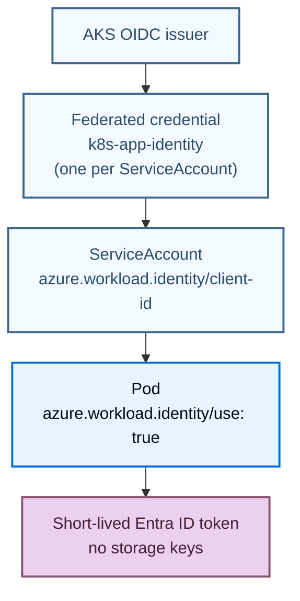
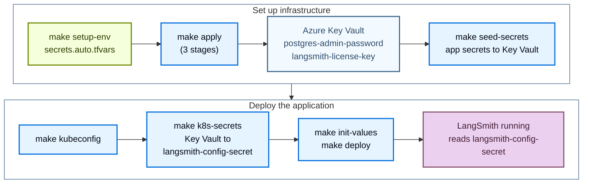

Understand what the [Azure Terraform modules](https://github.com/langchain-ai/terraform/tree/main/modules/azure) provision and how the pieces fit together, so you can size, secure, and customize your LangSmith deployment before running `make apply`.

Use this page as a reference while planning a rollout or troubleshooting an existing one. It covers:

- Platform layers and deployment tiers (minimum, dev, and production).
- Networking, Workload Identity, and secret flow.
- Add-ons: LangSmith Deployment, Fleet, Insights, Polly, and the LLM Gateway.
- Ingress controllers, resource sizing, and optional modules.

If you are ready to install, start with the [deployment walkthrough](/langsmith/self-host-terraform-azure-deploy).

## Platform layers

LangSmith on Azure deploys in stages. Each stage adds a capability layer on top of the previous. All layers share the same AKS cluster and `langsmith` namespace.


| Stage | Layer | What it adds |
|---|---|---|
| Infrastructure | Azure infrastructure | VNet, AKS, Postgres, Redis, Blob, Key Vault, cert-manager, KEDA, ingress controller, optional SmithDB metastore |
| Application | LangSmith base | frontend, backend, platform-backend, queue, ingest-queue, ace-backend, clickhouse, playground |
| LangSmith Deployment add-on | LangSmith Deployment | host-backend, listener, operator + per-deployment pods |
| Fleet add-on | Fleet | fleet-tool-server, fleet-trigger-server, in-cluster Fleet Redis |
| Insights + Polly add-on | Insights + Polly | Insights analytics (ClickHouse-backed), Polly eval agent (static `standalone-polly` pods) |
| LLM Gateway add-on | LLM Gateway (beta) | agent-gateway, plus presidio-analyzer with PII redaction |

Terraform provisions the infrastructure layer with `make apply`. The application and add-on layers deploy through Helm with `make init-values` and `make deploy`.

## Deployment tiers

Each tier starts from a template in `infra/`, and each template sets the matching `sizing_profile`:

| Template | Tier | `sizing_profile` |
|---|---|---|
| `terraform.tfvars.minimum` | Light deploy, all in-cluster | `minimum` |
| `terraform.tfvars.dev` | External Postgres and Redis, smaller node pools | `dev` |
| `terraform.tfvars.production` | Production, external managed services | `production` |

### Light deploy (all in-cluster)

```txt
AKS Cluster
├── langsmith namespace
│   ├── frontend, backend, platform-backend, playground, queue, ace-backend
│   ├── clickhouse (in-cluster pod)
│   ├── postgres   (in-cluster pod)
│   └── redis      (in-cluster pod)
├── Envoy Gateway (Azure Load Balancer → Envoy)
└── cert-manager  (Let's Encrypt TLS)

Azure
├── Azure Blob Storage  (trace payloads, always external)
└── Azure Key Vault     (secrets)
```

`terraform.tfvars.minimum` sets:

```hcl
postgres_source   = "in-cluster"
redis_source      = "in-cluster"
clickhouse_source = "in-cluster"
```

### Production (external managed services)

```txt
AKS Cluster
├── langsmith namespace
│   └── frontend, backend, platform-backend, playground, queue, ingest-queue, ace-backend
└── Envoy Gateway + cert-manager

Azure Managed Services
├── Azure DB for PostgreSQL Flexible Server (private VNet)
├── Azure Managed Redis (private VNet)
├── Azure Blob Storage (Workload Identity, no static keys)
└── Azure Key Vault

External ClickHouse
└── LangChain Managed ClickHouse or a self-managed cluster
```

## Networking

### Light deploy

The VNet is named `ls-vnet-<name_prefix>` when `unique_resource_names = true`, which every template sets. Each subnet name starts with the VNet name.

```txt
ls-vnet-<name_prefix>
└── subnet-0    (AKS nodes only)
    No Postgres/Redis subnets; chart-managed pods handle both
```

### Production

```txt
ls-vnet-<name_prefix>
├── subnet-0              (AKS nodes)
├── subnet-postgres       (Azure DB for PostgreSQL Flexible Server, SmithDB metastore)
└── subnet-redis          (Azure Managed Redis)
```

Terraform also creates `subnet-postgres` when `enable_smithdb = true`, `subnet-bastion` when `create_bastion = true`, and `subnet-agic` when `ingress_controller = "agic"`. It creates the bastion and AGIC subnets only in a VNet it creates; with `create_vnet = false`, supply `bastion_subnet_id` and `agic_subnet_id`. Network security groups attach to the subnets only when `enable_subnet_nsgs = true`.

AKS nodes get no public IPs. By default, they egress through an outbound public IP on the AKS-managed load balancer. To send egress through your own firewall or a NAT gateway, supply the AKS subnet and set `aks_outbound_type` (see [Networking variables](/langsmith/self-host-terraform-azure-variables#networking)). The module README's "Egress through your network" section lists the destinations the egress path must allow. The AKS API server is publicly reachable unless you restrict it with `aks_authorized_ip_ranges` or make it private with `aks_private_cluster_enabled`. Postgres and Redis have no public endpoints; both are accessible only from within the VNet via private DNS resolution. Terraform creates the private DNS zones in the deployment resource group and links them to the VNet. In a hub-and-spoke network, supply the central zones with `postgres_private_dns_zone_id`, `storage_private_dns_zone_id`, and `keyvault_private_dns_zone_id`, and the zones' owner links them.

## Application core services

| Service | Purpose | Port | HPA | Workload Identity |
|---|---|---|---|---|
| `langsmith-frontend` | React UI | 3000 | 2 to 10 | No |
| `langsmith-backend` | Main API (traces, runs, projects, API keys, feedback) | 1984 | 3 to 10 | Yes (Blob) |
| `langsmith-platform-backend` | Org and user management, auth, billing, settings | 1986 | 2 to 10 | Yes (Blob) |
| `langsmith-playground` | LLM prompt playground UI | 3001 | 1 to 5 | No |
| `langsmith-queue` | Trace ingestion worker (Redis → ClickHouse + Blob) | None | 3 to 10 + KEDA | Yes |
| `langsmith-ingest-queue` | Dedicated high-throughput ingestion worker | None | 3 to 10 + KEDA | Yes |
| `langsmith-ace-backend` | Async compute (dataset runs, evaluations, background jobs) | None | 1 to 5 | No |
| `langsmith-clickhouse` | Columnar store (trace spans, run metadata, eval results) | 8123, 9000 | StatefulSet, single replica, 500Gi PVC | No |

<Warning>
In-cluster ClickHouse is dev/POC only (single pod, no replication, no backups). For production use [LangChain Managed ClickHouse](/langsmith/langsmith-managed-clickhouse) or a self-managed external cluster.
</Warning>

<Note>
[SmithDB](https://www.langchain.com/blog/introducing-smithdb?utm_source=docs) is LangSmith's purpose-built observability backend, available for self-hosted LangSmith starting with version 0.16.0 (see [self-hosted support](/langsmith/smithdb-sdk-migration#about-self-hosted)). These Terraform modules provision ClickHouse by default, so the guidance in the previous sections applies to most deployments. Set `enable_smithdb = true` to add the SmithDB infrastructure: a dedicated PostgreSQL 18 metastore, a storage account and Blob container, Workload Identity, and Premium SSD v2 cache volumes. On Azure, SmithDB requires a stable release on the LangSmith Helm chart 0.17 line, which the `v0.17.*` module tags deploy. On the `v0.16.*` line, SmithDB needs module tag v0.16.56 or later and `langsmith_helm_chart_version = "~0.17.0"`.
</Note>

### One-time jobs

| Job | Purpose |
|---|---|
| `langsmith-backend-migrations` | PostgreSQL schema migrations |
| `langsmith-backend-ch-migrations` | ClickHouse schema migrations |
| `langsmith-backend-auth-bootstrap` | Creates the initial org and admin account from `initial_org_admin_password` in `langsmith-config-secret` |

## LangSmith Deployment add-on

| Service | Purpose | Workload Identity |
|---|---|---|
| `langsmith-host-backend` | LangSmith Deployment control plane API. Manages deployment lifecycle, serves deployment metadata. | Yes |
| `langsmith-listener` | Watches host-backend for state changes, creates and updates `LangGraphPlatform` CRDs. | Yes |
| `langsmith-operator` | Kubernetes operator. Azure-specific: injects `azure.workload.identity/use: "true"` + `langsmith-ksa` so every agent pod accesses Blob Storage via Workload Identity. | No |

## Fleet add-on

Fleet replaces the legacy Agent Builder add-on. Set `enable_fleet = true`, which requires `enable_deployments = true` and `postgres_source = "external"`. `enable_fleet` and `enable_agent_builder` are mutually exclusive.

| Pod | Type | Role | Workload Identity |
|---|---|---|---|
| `langsmith-fleet-tool-server` | Static | MCP tool execution server | Yes |
| `langsmith-fleet-trigger-server` | Static | Webhook receiver and scheduled trigger engine (single replica) | Yes |
| `langsmith-standalone-fleet-redis` | StatefulSet | Fleet's in-cluster Redis, bundled by the chart | No |

Fleet stores its data in a dedicated `langsmith_fleet` database on the Azure PostgreSQL server. Terraform creates the database and the `langsmith-fleet-postgres` Kubernetes secret.

## Insights and Polly add-on

**Insights**: Runs as static `standalone-insights` api-server and queue pods. Reads `insights_encryption_key` from `langsmith-config-secret`. Never rotate this key: it permanently breaks existing Insights data.

**Polly**: Runs as static `standalone-polly` api-server and queue pods, and needs `enable_deployments = true`. Reads `polly_encryption_key` from `langsmith-config-secret`. Same rotation warning as Insights.

## Azure managed services

When `postgres_source = "external"` and `redis_source = "external"` (the recommended production setting), Terraform provisions:

### Azure DB for PostgreSQL Flexible Server

- Holds orgs, users, projects, API keys, settings.
- PostgreSQL 14 or later required. `postgres_version` defaults to `16`.
- Extensions enabled automatically by the `postgres` module: `btree_gin`, `btree_gist`, `pgcrypto`, `citext`, `pg_trgm`, `ltree`.
- Private VNet only (`subnet-postgres`), SSL port 5432.
- Secret: `langsmith-postgres-secret`, created by the `k8s-bootstrap` Terraform module.

### Azure Managed Redis

- Trace ingestion queue, pub/sub, short-lived cache.
- Azure Managed Redis manages the engine version; there is no version variable to set.
- Each LangSmith installation must use its own dedicated Redis. Shared instances cause deployment tasks to route incorrectly.
- Private VNet only (`subnet-redis`), TLS port 10000.
- Secret: `langsmith-redis-secret`, created by the `k8s-bootstrap` Terraform module.

### Azure Blob Storage

- Trace payloads: large inputs and outputs, attachments.
- Workload Identity (no static keys) via the `k8s-app-identity` Managed Identity.
- Always required. Disabling blob storage breaks the cluster on large payloads.
- Prefixes: `ttl_s/` (14-day TTL), `ttl_l/` (400-day TTL).

### Azure Key Vault

- Centralized secret store for all LangSmith secrets.
- Public endpoint behind the vault firewall by default. `keyvault_private_endpoint_enabled = true` moves the vault to a Private Endpoint and turns public access off, so Terraform and the secret scripts must run from inside the network.
- Secret flow: `make seed-secrets` writes the app secrets to Key Vault, then `make k8s-secrets` builds `langsmith-config-secret` from them. See [Secret flow](#secret-flow).

## Workload Identity

Microsoft Entra ID token exchange happens via the AKS OIDC issuer. Pods access Blob Storage without static keys.



Workload Identity is centralized in `infra/modules/k8s-cluster/` alongside the managed identity and OIDC issuer, which avoids circular dependencies and simplifies adding new ServiceAccounts.

### Which pods need Workload Identity

Every pod that reads blob storage env vars must have:

1. A federated credential registered in Terraform (`infra/modules/k8s-cluster/main.tf`).
2. The `azure.workload.identity/use: "true"` label on the Deployment.
3. The `azure.workload.identity/client-id` annotation on the ServiceAccount.

| Pod | Stage | Needs WI |
|---|---|---|
| `langsmith-backend` | Application | Yes |
| `langsmith-platform-backend` | Application | Yes |
| `langsmith-queue` | Application | Yes |
| `langsmith-ingest-queue` | Application | Yes |
| `langsmith-host-backend` | LangSmith Deployment add-on | Yes |
| `langsmith-listener` | LangSmith Deployment add-on | Yes |
| `langsmith-fleet-tool-server` | Fleet add-on | Yes |
| `langsmith-fleet-trigger-server` | Fleet add-on | Yes |
| `langsmith-agent-gateway` | LLM Gateway add-on | Yes |
| `langsmith-presidio-analyzer` | LLM Gateway PII redaction | Yes |
| `langsmith-frontend` | Application | No |
| `langsmith-playground` | Application | No |
| `langsmith-ace-backend` | Application | No |
| `langsmith-clickhouse` | Application | No |
| `langsmith-operator` | LangSmith Deployment add-on | No |

All federated credentials are registered in `infra/modules/k8s-cluster/main.tf` under `service_accounts_for_workload_identity`. Each name is `<release>-<component>`, where `<release>` is the chart fullname (`langsmith` by default). Terraform registers the two LLM Gateway credentials whether or not `enable_llm_gateway` is set. The `v0.16.*` module tags register all except the two LLM Gateway credentials. SmithDB uses its own ServiceAccount and identity. Adding a new pod that accesses blob storage requires adding its ServiceAccount name to that list and running `make apply`.

If a pod's ServiceAccount has no registered federated credential, Microsoft Entra ID rejects the token exchange and the pod panics on startup:

```txt
panic: blob-storage health-check failed: get container properties failed:
DefaultAzureCredential: failed to acquire a token.
WorkloadIdentityCredential authentication failed.
  AADSTS700213: No matching federated identity record found for presented assertion subject
```

## Secret flow



The secrets flow runs in this order. `make deploy-all` runs steps 2 through 5, and `make apply` runs `make setup-env` first when `secrets.auto.tfvars` is missing:

1. `make setup-env` writes `secrets.auto.tfvars`, which is gitignored and read by Terraform automatically. It prompts for the PostgreSQL admin password, the license key, and the initial org admin email. Set `LANGSMITH_PG_PASSWORD`, `LANGSMITH_LICENSE_KEY`, and `LANGSMITH_ADMIN_EMAIL` to skip the prompts. It never writes to Key Vault.
1. `make apply` creates Key Vault. Terraform writes only `postgres-admin-password` and `langsmith-license-key` to it, and only when `keyvault_manage_secrets = true` (the default). The `k8s-bootstrap` module creates `langsmith-license`, plus `langsmith-postgres-secret` and `langsmith-redis-secret` for external Postgres and Redis.
1. `make seed-secrets` writes the app secrets straight to Key Vault: the admin password (prompted, or `LANGSMITH_ADMIN_PASSWORD`), the API key salt, the JWT secret, and four Fernet encryption keys. With `keyvault_manage_secrets = false`, it also writes the two secrets Terraform skipped.
1. `make kubeconfig` fetches the AKS credentials. `make k8s-secrets` then reads Key Vault and creates `langsmith-config-secret` with all eight keys, plus `oauth_client_id`, `oauth_client_secret`, and `oauth_issuer_url` when the `langsmith-oauth-*` secrets exist in Key Vault.
1. `make init-values` and `make deploy` install the chart with `config.existingSecretName = "langsmith-config-secret"`. No secret appears inline in any values file.

**Key rule:** `secrets.auto.tfvars` is never committed. Re-run `make setup-env` on any machine to restore it. The app secrets never pass through Terraform state. `make seed-secrets` never overwrites an existing secret, because a new API key salt, JWT secret, or Fernet key breaks a running deployment. Rotate a secret deliberately with `make keyvault`.

## Ingress options

| Controller | Variable | DNS label support | Notes |
|---|---|---|---|
| `nginx` | `ingress_controller = "nginx"` | Yes | NGINX via Helm, standard Kubernetes Ingress. |
| `istio-addon` | `ingress_controller = "istio-addon"` | Yes | AKS managed Istio service mesh. Use `istio_addon_revision` to pin revision. |
| `istio` | `ingress_controller = "istio"` | Yes | Self-managed Istio via Helm. Full control over revision and config. |
| `agic` | `ingress_controller = "agic"` | Yes | Azure Application Gateway v2 + AKS-managed `ingress_application_gateway` add-on. The gateway runs `Standard_v2`; `create_waf = true` moves it to `WAF_v2` and attaches the WAF policy. HTTP-only, `dns01` with a custom domain, or `existing` with your own certificate. |
| `envoy-gateway` _(default)_ | `ingress_controller = "envoy-gateway"` | Yes | Gateway API native. Uses `envoyproxy/gateway-helm`. |
| `none` | `ingress_controller = "none"` | No | Bring your own ingress. |

Azure Public IP DNS labels (`dns_label`) work with every controller except `none`. For `nginx`, `istio`, and `istio-addon`, `deploy.sh` applies the `service.beta.kubernetes.io/azure-dns-label-name` annotation to the controller's LoadBalancer service. For `envoy-gateway`, the EnvoyProxy resource carries the label. For `agic`, Terraform sets the label on the Application Gateway public IP.

For the full TLS compatibility matrix and per-controller setup, see `INGRESS_CONTROLLERS.md` in the [Azure module repo](https://github.com/langchain-ai/terraform/blob/main/modules/azure/INGRESS_CONTROLLERS.md).

## Resource sizing

Four sizing profiles are available.

| Profile | Use case | Set via |
|---|---|---|
| `minimum` | Cost parking, CI smoke tests, single-user demos | `sizing_profile = "minimum"` in `terraform.tfvars` |
| `dev` | Developer use, integration tests, POCs | `sizing_profile = "dev"` |
| `production` | Real traffic, multi-replica + HPA | `sizing_profile = "production"` _(recommended)_ |
| `production-large` | ~50 users, ~1000 traces/sec | `sizing_profile = "production-large"` |

### AKS node pools

| Pool | VM Size | vCPU | RAM | Min | Max | Purpose |
|---|---|---|---|---|---|---|
| default | `Standard_D8s_v5` | 8 | 32 GB | 1 | 10 | Core LangSmith, system pods (set min 3 for production) |
| large | `Standard_D16s_v5` | 16 | 64 GB | 0 | 2 | ClickHouse (in-cluster), LangSmith Deployment agent pods |

<Note>
ClickHouse (when in-cluster) requests 1 to 4 CPU and 2 to 16 GB RAM depending on profile. With [LangChain Managed ClickHouse](/langsmith/langsmith-managed-clickhouse), the `large` pool is only needed for agent pods that the LangSmith Deployment operator spawns.
</Note>

## Optional modules

Each module is count-controlled (`0` disabled, `1` enabled). Enable any combination; the core deployment works without them.

| Module | Variable | Use case |
|---|---|---|
| `waf` | `create_waf = true` | Azure WAF policy (OWASP 3.2 + bot protection), in `Detection` mode by default (`waf_mode`). With `ingress_controller = "agic"`, Terraform attaches it to the Application Gateway. With any other controller, the policy stays unattached until an Application Gateway you own references it. Azure Front Door cannot use this policy type. |
| `diagnostics` | `create_diagnostics = true` | Log Analytics workspace + diagnostic settings for AKS, Key Vault, PostgreSQL, and the Application Gateway when `ingress_controller = "agic"`. Recommended for production observability. |
| `bastion` | `create_bastion = true` | Jump VM with a static public IP for private AKS access via `az ssh vm` and Entra ID SSH. |
| `dns` | `create_dns_zone = true` | Azure DNS zone + A record. Required for DNS-01 cert issuance with a custom domain. |
| `smithdb` | `enable_smithdb = true` | SmithDB infrastructure: PostgreSQL 18 metastore, storage account and Blob container, and Workload Identity. Requires the chart 0.17 line. |
