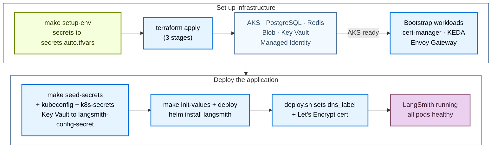

Deploy LangSmith to Azure with the public [Terraform modules](https://github.com/langchain-ai/terraform/tree/main/modules/azure). Managing the deployment as code lets you version, review, and reproduce your LangSmith environment across subscriptions instead of clicking through the Azure Portal.

The install runs in two stages:

1. **Infrastructure**: Terraform provisions AKS, Postgres, Redis, Blob Storage, Key Vault, cert-manager, KEDA, and ingress.
2. **Application**: Helm installs the LangSmith chart against the cluster.

After the base install, enable optional add-ons (LangSmith Deployment, Fleet, Insights, Polly, SmithDB, and the LLM Gateway) and SSO by setting flags and redeploying.

<Note>
These pages follow the module's `v0.17.*` release tags, which deploy the LangSmith Helm chart 0.17 line. In a module tag, the first two numbers name the chart line and the last number is the module revision, so `v0.17.4` still deploys the newest 0.17 chart patch. The `v0.16.*` tags deploy chart 0.16. They have no LLM Gateway or SSO flags and federate 8 Workload Identity ServiceAccounts instead of 10. From v0.16.56, they deploy SmithDB only with `langsmith_helm_chart_version` set to `~0.17.0`. A deployment that has run chart 0.17 cannot return to 0.16.
</Note>



## Prerequisites

### Required tools

| Tool | Version | Purpose |
|---|---|---|
| Azure CLI (`az`) | 2.50 or later | Authenticate, query Azure resources, manage AKS credentials |
| Terraform | 1.11.0 or later | Run the infrastructure modules |
| `kubectl` | 1.34 or later | Inspect the AKS cluster |
| Helm | 3.12 or later | Install and manage the LangSmith chart |
| `kubelogin` | latest | Sign in to a cluster with Entra ID integration (`aks_entra_only`, or an attached cluster with Entra ID). Not needed otherwise |

```bash
brew install azure-cli kubectl helm
brew tap hashicorp/tap && brew install hashicorp/tap/terraform

az --version
terraform version
kubectl version --client
helm version

# Only for a cluster with Entra ID integration
brew install Azure/kubelogin/kubelogin
kubelogin --version
```

With `aks_private_cluster_enabled = true`, run Terraform and the `make` targets from a host with a network path to the API server's private endpoint, such as a jump host in the cluster VNet or a peered network, with DNS that resolves the private zone. With `keyvault_private_endpoint_enabled = true`, `make apply`, `make seed-secrets`, and `make k8s-secrets` need a host that resolves the vault's private endpoint. See [Key Vault variables](/langsmith/self-host-terraform-azure-variables#key-vault).

### Required Azure RBAC

The identity running Terraform needs the following roles on the subscription:

| Role | Purpose |
|---|---|
| `Contributor` | Create and manage all Azure resources |
| `User Access Administrator` or `Role Based Access Control Administrator` | Create role assignments for Key Vault, Blob, cert-manager managed identities |

`Owner` includes both. `Contributor` alone is insufficient because it cannot create role assignments.

A user-assigned control-plane identity (`aks_control_plane_identity = "user"`) and private DNS zones you supply need further grants, listed in [PERMISSIONS.md](https://github.com/langchain-ai/terraform/blob/main/modules/azure/PERMISSIONS.md).

### Authenticate

```bash
az login
az account set --subscription <your-subscription-id>
az account show
```

You also need a LangSmith license key ([contact the LangChain sales team](https://www.langchain.com/contact-sales)) and either a `dns_label` (Azure subdomain, no DNS setup needed) or a custom `langsmith_domain`.

## Quickstart

<Tip>
For a condensed cheat sheet of `make` targets, required variables, and common constraints, see the [Azure quick reference](/langsmith/self-host-terraform-azure-quick-reference).
</Tip>

For the fastest path from zero to a running LangSmith instance:

```bash
# 1. Clone the public modules and check out the newest v0.17 release
git clone https://github.com/langchain-ai/terraform.git
cd terraform/modules/azure
git checkout "$(git tag -l 'v0.17.*' --sort=-v:refname | head -1)"

# 2. Generate terraform.tfvars interactively
make quickstart

# 3. Bootstrap secrets (writes infra/secrets.auto.tfvars, chmod 600, gitignored)
make setup-env

# 4. Validate environment
make preflight

# 5. Provision infrastructure (~15 to 20 min; each of the three stages prompts)
make init
make apply

# 6. Seed app secrets into Key Vault, get cluster credentials, push secrets into the cluster
make seed-secrets
make kubeconfig
make k8s-secrets

# 7. Deploy LangSmith via Helm (~10 min)
make init-values
make deploy
```

Or, after `make init`, run the rest of steps 5 through 7 in one shot:

```bash
make deploy-all   # apply → seed-secrets → kubeconfig → k8s-secrets → init-values → deploy
```

`make deploy-all` stops at each `make apply` stage prompt. To skip the prompts, run `make deploy-all ARGS="-auto-approve"`. The `make seed-secrets` step also prompts for the initial admin password, so export `LANGSMITH_ADMIN_PASSWORD` for an unattended run.

The following sections cover each phase in detail.

## Provision infrastructure

Terraform provisions the following Azure resources:

| Resource | Type | Purpose |
|---|---|---|
| Resource Group | `azurerm_resource_group` | Container for all resources |
| Virtual Network | `azurerm_virtual_network` | Isolated network (10.0.0.0/17 by default) |
| AKS Cluster | `azurerm_kubernetes_cluster` | Kubernetes, all workloads run here |
| Ingress Controller | Helm | External load balancer + TLS termination (Envoy Gateway by default) |
| PostgreSQL Flexible Server | `azurerm_postgresql_flexible_server` | Org config, run metadata (external tier) |
| Azure Managed Redis | `azapi_resource` (Microsoft.Cache/redisEnterprise) | Trace ingestion queue, pub/sub (external tier) |
| Blob Storage | `azurerm_storage_account` | Raw trace objects, always required |
| Managed Identity | `azurerm_user_assigned_identity` | Workload Identity for pod-to-Blob auth |
| Azure Key Vault | `azurerm_key_vault` | Stores all LangSmith secrets |
| cert-manager | Helm | Automated TLS certificate management |
| KEDA | Helm | Event-driven autoscaling for workers |

### Clone and configure

Clone the modules and check out the newest `v0.17.*` release tag:

```bash
git clone https://github.com/langchain-ai/terraform.git
cd terraform/modules/azure
git checkout "$(git tag -l 'v0.17.*' --sort=-v:refname | head -1)"
```

To deploy chart 0.16 instead, replace `v0.17.*` with `v0.16.*`.

All subsequent commands run from `modules/azure/`. Run `make help` for the full target list.

Generate `terraform.tfvars` with the interactive wizard:

```bash
make quickstart
```

The wizard runs a 10-section questionnaire covering profile, subscription and naming, networking, AKS sizing, ingress controller, DNS/TLS, backend services, Key Vault, sizing profile, and security add-ons. Each section includes explanatory context, cost estimates, and trade-offs. Re-running is safe; existing values are preselected at each prompt. Press Enter to keep them.

Prefer manual editing:

```bash
cp infra/terraform.tfvars.example infra/terraform.tfvars
vi infra/terraform.tfvars
```

Minimum required values:

```hcl
# Identity
subscription_id = "<your-azure-subscription-id>"

# Location
location = "eastus"

# Naming
name_prefix           = "prod"   # appended to resource names, for example ls-rg-prod
unique_resource_names = true     # new deployments only; see the following warning

# Deployment tier, production recommended
postgres_source   = "external"   # Azure DB for PostgreSQL
redis_source      = "external"   # Azure Managed Redis
clickhouse_source = "in-cluster" # use "external" + LangChain Managed for production

# DNS + TLS (HTTPS via Let's Encrypt on a free Azure subdomain)
dns_label              = "langsmith-prod"   # → langsmith-prod.eastus.cloudapp.azure.com
tls_certificate_source = "letsencrypt"
letsencrypt_email      = "ops@example.com"

# Sizing
sizing_profile = "production"   # minimum | dev | production | production-large
```

`environment` defaults to `name_prefix`. Set it only to tag resources with a different value.

<Warning>
`name_prefix` replaces `identifier`. If an existing `terraform.tfvars` sets `identifier = "-prod"`, change it to `name_prefix = "prod"`. Resource names do not change.

Leave `unique_resource_names` unset on an existing deployment. Turning it on renames every resource, which Terraform runs as destroy and recreate. You lose the PostgreSQL and Blob Storage data.
</Warning>

<Warning>
In-cluster ClickHouse runs as a single pod with no replication or backups, dev/POC only. For production, use [LangChain Managed ClickHouse](/langsmith/langsmith-managed-clickhouse).
</Warning>

<Info>
Blob Storage is always required, regardless of tier. Trace payloads must go to Azure Blob, never to ClickHouse.
</Info>

For all variables, see the [Azure variables reference](/langsmith/self-host-terraform-azure-variables).

### Bootstrap secrets

```bash
make setup-env
```

`setup-env.sh` writes `infra/secrets.auto.tfvars` (gitignored, `chmod 600`). Terraform picks this file up automatically; no shell exports needed.

- **First run**: Prompts for the PostgreSQL admin password (press Enter to generate one), the LangSmith license key, and the admin email.
- **Subsequent runs**: Each prompt offers the previous value as its default. To skip a prompt, set `LANGSMITH_PG_PASSWORD`, `LANGSMITH_LICENSE_KEY`, or `LANGSMITH_ADMIN_EMAIL` in the environment.

The admin password and the generated application secrets are not in this file. `make seed-secrets` writes them to Key Vault after `make apply`.

<Warning>
Never commit `secrets.auto.tfvars`. It is gitignored. Regenerate on any machine by running `make setup-env`.
</Warning>

### Preflight

```bash
make preflight
```

Validates Azure CLI auth, the active subscription, the required resource providers, and permission to create role assignments. It also checks the subscription offer type, regional vCPU quota, and whether the region offers your PostgreSQL version and SKU. It confirms that globally unique names are free, that `terraform.tfvars` and `secrets.auto.tfvars` exist, and that `terraform`, `kubectl`, and `helm` are on PATH.

The subscription must register 11 resource providers: `Microsoft.ContainerService`, `Microsoft.DBforPostgreSQL`, `Microsoft.Cache`, `Microsoft.KeyVault`, `Microsoft.Storage`, `Microsoft.Network`, `Microsoft.Compute`, `Microsoft.Authorization`, `Microsoft.ManagedIdentity`, `Microsoft.OperationalInsights`, and `Microsoft.Insights`.

### Apply

<Note>
Provisioning the Azure cloud foundation takes 15 to 20 minutes on a clean subscription. Do not interrupt the apply.
</Note>

```bash
make init
make apply   # ~15 to 20 min on first run
```

`make init` runs `terraform init` in `infra/`, which downloads the providers, including AzureRM, and initializes the backend. Run it once per clone. After you check out a new module tag, run `make init ARGS=-upgrade`.

<Note>
`make apply` runs in three stages: Azure infrastructure including AKS → Kubernetes bootstrap (namespace, secrets, cert-manager, KEDA) → remaining resources such as the DNS zone and WAF. Each stage prompts for confirmation. To skip all three prompts, run `make apply ARGS="-auto-approve"`.
</Note>

### Cluster credentials and Kubernetes Secrets

After `make apply` completes, seed the application secrets into Key Vault, get cluster credentials, and push secrets into the cluster:

```bash
make seed-secrets  # admin password + generated secrets → Key Vault (never overwrites)
make kubeconfig    # fetches AKS credentials, merges into ~/.kube/config
make k8s-secrets   # Key Vault → langsmith-config-secret in the langsmith namespace
```

`make seed-secrets` prompts for the LangSmith admin password, or reads `LANGSMITH_ADMIN_PASSWORD`. It generates the API key salt, the JWT secret, and four Fernet encryption keys. It writes only the secrets that are missing, so it is safe to re-run.

`make k8s-secrets` reads 8 secrets from Key Vault, plus the three `langsmith-oauth-*` secrets when they exist, and creates or updates `langsmith-config-secret`. Safe to re-run; uses `--dry-run=client | kubectl apply` to update in place.

On a cluster with Entra ID integration, `make kubeconfig` converts the context to sign in through `kubelogin` as your `az` identity.

### Verify infrastructure

```bash
# All nodes Ready
kubectl get nodes

# Bootstrap components, all Running
kubectl get pods -n cert-manager           # 3 pods
kubectl get pods -n keda                   # 3 pods
kubectl get pods -n envoy-gateway-system   # Envoy Gateway controller (default ingress_controller)

# Workload Identity ServiceAccount, should have client-id annotation
kubectl get sa langsmith-ksa -n langsmith \
  -o jsonpath='{.metadata.annotations}'

# Terraform outputs
terraform -chdir=infra output

# Key outputs consumed by Helm scripts
terraform -chdir=infra output -raw keyvault_name
terraform -chdir=infra output -raw storage_account_name
terraform -chdir=infra output -raw storage_container_name
terraform -chdir=infra output -raw storage_account_k8s_managed_identity_client_id
```

## Deploy LangSmith

`make init-values` generates the Helm values, and `make deploy` installs the LangSmith Helm chart. Use the same two commands for first-time deploys and day-2 re-deploys.

### Deploy with Helm

#### Generate Helm values

```bash
cd terraform/modules/azure
make init-values
```

`make init-values` reads `terraform output` and `terraform.tfvars` and generates `helm/values/values-overrides.yaml` with all fields populated:

- `config.hostname`, your FQDN (from `dns_label` or `langsmith_domain`).
- `config.initialOrgAdminEmail`, the first org admin account.
- `config.existingSecretName: langsmith-config-secret`, secrets reference.
- `config.blobStorage`, storage account name + container + Workload Identity client ID.
- Workload Identity annotations for 8 ServiceAccounts (backend, platform-backend, queue, ingest-queue, host-backend, listener, fleet-tool-server, fleet-trigger-server).
- Ingress + TLS block: the `langsmith-tls` secret name for `letsencrypt`, `dns01`, and `existing`, plus the cert-manager annotation for `letsencrypt` and `dns01`. With `envoy-gateway`, the chart creates Gateway API routes instead of an Ingress.
- Postgres and Redis external secret references (when `postgres_source = "external"` / `redis_source = "external"`).
- `insights.enabled` and `polly.enabled`, set from `enable_insights` and `enable_polly`.

With `clickhouse_source = "external"`, `make init-values` also prompts for the ClickHouse connection details and creates the `langsmith-clickhouse` secret.

`make init-values` also writes the sizing overlay and any enabled add-on overlays into `helm/values/`. It copies most of them from `helm/values/examples/` and generates the Insights, LLM Gateway, and PII overlays.

<Info>
The admin email is read from the `langsmith_admin_email` Terraform output (set during `make setup-env`) and written into `values-overrides.yaml` automatically. No manual editing needed.
</Info>

#### Deploy

```bash
make deploy   # ~10 min
```

`make deploy` does the following:

1. Validates `values-overrides.yaml` exists and was generated from the current `terraform.tfvars`.
2. Refreshes kubeconfig via `az aks get-credentials`.
3. Applies `dns_label` to the public IP for `nginx`, `istio`, and `istio-addon` by annotating the LoadBalancer service with `service.beta.kubernetes.io/azure-dns-label-name`.
4. Creates the `letsencrypt-prod` cert-manager `ClusterIssuer` if `tls_certificate_source` is `letsencrypt` or `dns01` (idempotent). For `existing`, checks that the `langsmith-tls` Secret exists with type `kubernetes.io/tls`.
5. Runs preflight checks (tools, cluster connectivity, Helm repo).
6. Verifies `langsmith-config-secret` exists; auto-creates from Key Vault if it is missing. With external ClickHouse, checks the `langsmith-clickhouse` secret.
7. Validates the add-on flags. Agent Builder and Fleet need `enable_deployments = true`, Fleet needs external PostgreSQL, and the two cannot run together.
8. Builds and logs the values chain, and rejects values files still on the chart 0.15 schema.
9. Auto-recovers any stuck `pending-upgrade` Helm release before proceeding.
10. For `envoy-gateway`, creates the `EnvoyProxy` (which carries the `dns_label`), `GatewayClass`, and `langsmith-gateway` Gateway.
11. Runs `helm upgrade --install langsmith langchain/langsmith --timeout 20m`. The chart version is `~0.17.0`, the newest 0.17 patch, unless `langsmith_helm_chart_version` or the `CHART_VERSION` environment variable names a 0.17 patch. The script rejects any other chart line.
12. Waits for core deployments to roll out.
13. Annotates the `langsmith-ksa` ServiceAccount with the Workload Identity client ID.
14. With `enable_llm_gateway = true` and `ingress_controller` set to `nginx` or `agic`, applies the `<release>-llm-gateway` Ingress for `/gateway/`, where `<release>` is the chart fullname (`langsmith` by default), with a 900-second timeout. With the gateway off, it removes a leftover one.
15. Prints the access URL and login credentials location.

<Info>
Why `--timeout 20m`? The `langsmith-backend-auth-bootstrap` Job runs DB migrations and org initialization as a post-install hook. This takes up to 5 minutes on first install. Without a long timeout, Helm may report failure even though the install eventually succeeds.
</Info>

<Tip>
**Watch pods in a second terminal:**

```bash
# macOS
brew install watch
watch kubectl get pods -n langsmith

# Without watch
while true; do clear; kubectl get pods -n langsmith; sleep 3; done
```
</Tip>

### Verify the deployment

```bash
# All pods Running or Completed (~17 pods)
kubectl get pods -n langsmith

# Routes: HTTPRoutes for envoy-gateway, an Ingress for nginx, istio, and agic
kubectl get httproute -n langsmith
kubectl get ingress -n langsmith

# TLS certificate issued
kubectl get certificate -n langsmith   # READY: True

# Helm release status
helm list -n langsmith
```

Expected pod state (all Running after ~5 minutes):

```txt
langsmith-ace-backend-xxxxx              1/1   Running     0   5m
langsmith-backend-xxxxx                  1/1   Running     0   5m
langsmith-backend-auth-bootstrap-xxxxx   0/1   Completed   0   5m
langsmith-backend-ch-migrations-xxxxx    0/1   Completed   0   5m
langsmith-backend-migrations-xxxxx       0/1   Completed   0   5m
langsmith-clickhouse-0                   1/1   Running     0   5m
langsmith-frontend-xxxxx                 1/1   Running     0   5m
langsmith-ingest-queue-xxxxx             1/1   Running     0   5m
langsmith-platform-backend-xxxxx         1/1   Running     0   5m
langsmith-playground-xxxxx               1/1   Running     0   5m
langsmith-queue-xxxxx                    1/1   Running     0   5m
```

Open `https://<HOSTNAME>` and log in with the admin email and password from Key Vault:

```bash
az keyvault secret show \
  --vault-name $(terraform -chdir=infra output -raw keyvault_name) \
  --name langsmith-admin-password \
  --query value -o tsv
```

### Values chain

`make deploy` applies Helm values files in this order (last file wins on conflicts):

```txt
1. helm/values/values.yaml                              ← Azure base values (committed)
2. helm/values/values-overrides.yaml                    ← hostname, WI client-id, auth, postgres/redis
3. (add-on files when enable_* flags are set)           ← agent-deploys, agent-builder, fleet, insights, polly, llm-gateway, gateway-pii
4. helm/values/langsmith-values-sizing-<profile>.yaml   ← resource requests + HPA settings
5. helm/values/langsmith-values-smithdb*.yaml           ← when enable_smithdb = true
```

The generated files in `helm/values/`, `values-overrides.yaml` and the `langsmith-values-*.yaml` overlays, are gitignored because they contain live secrets. `make init-values` writes them, copying most overlays from `helm/values/examples/`.

### Day-2 operations

```bash
make status         # 9-section health check
make status-quick   # skip the Key Vault, kubeconfig, Kubernetes, and Helm checks (faster)
make deploy         # re-deploy after any Helm value changes
make init-values    # re-generate values after Terraform changes
make kubeconfig     # refresh cluster credentials
make k8s-secrets    # re-create langsmith-config-secret from Key Vault
```

### Upgrade from chart 0.16

<Warning>
Back up the database before you upgrade. LangSmith database migrations are forward-only, so a deployment cannot return to chart 0.16 after it runs 0.17. For more information, see [Upgrade an installation](/langsmith/self-host-upgrades).
</Warning>

To move a deployment from chart 0.16 to 0.17:

1. Check out the newest `v0.17.*` module tag:

   ```bash
   git fetch --tags
   git checkout "$(git tag -l 'v0.17.*' --sort=-v:refname | head -1)"
   ```

1. Run `make init ARGS=-upgrade` to update the providers and modules for the new tag.
1. Check that `infra/variables.tf` on the new tag declares every variable that your `terraform.tfvars` sets.

   <Warning>
   Variables added on the `v0.16.*` line reach the `v0.17.*` line in a later tag. v0.17.0 does not declare `ingress_load_balancer`, `ingress_load_balancer_subnet_id`, `ingress_load_balancer_ip`, `ingress_load_balancer_manage_subnet_assignment`, `envoy_gateway_image_registry`, or `envoy_gateway_image_pull_secret_name`, which v0.17.1 adds. `aks_network_owner_checks` reaches the `v0.17.*` line in a later tag. Terraform only warns about an undeclared variable in `terraform.tfvars`, so a deployment that sets one on a tag that lacks it loses that setting without an error.
   </Warning>

1. Run `make apply`. It adds the two LLM Gateway federated credentials.
1. Run `make init-values` to regenerate the values files in the chart 0.17 shape.
1. Run `make deploy`.

Beyond the two federated credentials, the upgrade on Azure only moves the chart pin. An installation still on chart 0.15 must first follow [`MIGRATION-0.15-to-0.16.md`](https://github.com/langchain-ai/terraform/blob/main/MIGRATION-0.15-to-0.16.md). For the full list of chart changes, see [`MIGRATION-0.16-to-0.17.md`](https://github.com/langchain-ai/terraform/blob/main/MIGRATION-0.16-to-0.17.md).

## Enable add-ons

Each add-on is gated by a flag in `infra/terraform.tfvars`. Set the flag, re-run `make init-values` to regenerate values, then re-run `make deploy`.

### LangSmith Deployment

Enables [LangSmith Deployment](/langsmith/deploy-self-hosted-full-platform), which lets you deploy and manage agents as API servers directly from the [LangSmith UI](https://smith.langchain.com). This adds three new pods.

| Pod | Role | Workload Identity |
|---|---|---|
| `langsmith-host-backend` | LangSmith Deployment control plane API. Manages deployment lifecycle, stores state in shared PostgreSQL. | Yes |
| `langsmith-listener` | Watches host-backend, creates and updates `LangGraphPlatform` CRDs in Kubernetes. | Yes |
| `langsmith-operator` | Reconciles CRDs. Creates per-deployment Deployments, StatefulSets, and Services. | No |

#### Scale the node pool first

Before enabling, bump `default_node_pool_min_count` to at least 5. The operator spawns agent deployment pods on demand and needs node headroom:

```hcl
# infra/terraform.tfvars
default_node_pool_min_count = 5      # operator pods need headroom
enable_deployments          = true
```

<Warning>
Without sufficient node capacity, operator-spawned agent pods stay in `Pending` state indefinitely. Scale the node pool first, then enable.
</Warning>

#### Apply, regenerate values, deploy

```bash
cd terraform/modules/azure
make apply          # scale up node pool (~5 min)
make init-values    # picks up enable_deployments = true → generates add-on overlay
make deploy         # rolls out host-backend + listener + operator
```

`make init-values` appends the LangSmith Deployment add-on overlay (`langsmith-values-agent-deploys.yaml`) to the values chain. It automatically injects:

```yaml
config:
  deployment:
    enabled: true                          # REQUIRED, without this listener and operator are skipped silently
    url: "https://<your-hostname>"         # must match config.hostname (with protocol)
    tlsEnabled: true                       # set based on tls_certificate_source
```

<Warning>
**`config.deployment.url` must include `https://`.** Missing the protocol causes operator-deployed agents to stay stuck in `DEPLOYING` state indefinitely. The URL is injected automatically by `make init-values`. Do not set it manually in the overlay file; it is overwritten on the next run.
</Warning>

<Warning>
**`config.deployment.enabled: true` is required.** Setting only `config.deployment.url` without `enabled: true` causes the chart to silently skip creating `listener` and `operator`. No error, they never appear.
</Warning>

#### Verify

```bash
# All three pods Running
kubectl get pods -n langsmith | grep -E "host-backend|listener|operator"

# LangSmith Deployment CRDs registered
kubectl get crd | grep langchain

# List LangSmith Deployments (empty on first deploy, populated when you create a deployment)
kubectl get lgp -n langsmith
```

Expected: `langsmith-host-backend`, `langsmith-listener`, and `langsmith-operator` all Running. Total pod count: ~20 Running + 3 Completed jobs.

KEDA is already installed alongside infrastructure. With `enable_deployments = true`, the operator creates KEDA `ScaledObject` resources for each agent deployment's worker queue. Worker pods scale down to zero when idle and scale up based on Redis queue depth.

### Fleet

[Fleet](/langsmith/fleet) is the supported successor to Agent Builder. Unlike the other add-on flags, `enable_fleet` also drives Terraform. `make apply` creates a dedicated `langsmith_fleet` database on the external PostgreSQL server and the `langsmith-fleet-postgres` Kubernetes secret.

`make init-values` and `make deploy` enforce three requirements:

- `enable_deployments = true`
- `postgres_source = "external"`
- `enable_agent_builder = false`

```hcl
# infra/terraform.tfvars
enable_deployments = true    # required prerequisite
enable_fleet       = true
```

```bash
cd terraform/modules/azure
make apply          # creates the langsmith_fleet database and secret
make init-values    # appends langsmith-values-fleet.yaml to the values chain
make deploy
```

Fleet reuses the Agent Builder encryption key from `langsmith-config-secret`. Its Redis runs in the cluster as a chart-managed pod, because Azure Managed Redis cannot isolate Fleet in its own logical database.

The `langsmith-fleet-tool-server` and `langsmith-fleet-trigger-server` ServiceAccounts need Workload Identity to access Azure Blob Storage. Their federated credentials are pre-registered in `infra/modules/k8s-cluster/main.tf`; no additional setup is needed.

Verify:

```bash
kubectl get pods -n langsmith | grep fleet
```

### Agent Builder

`enable_agent_builder` is the legacy path. On chart 0.16 and later, it adds the Agent Builder UI navigation item and the Fleet tool and trigger servers, but no agent runtime. Use [Fleet](#fleet) instead. The two flags are mutually exclusive, and `make deploy` stops with an error when both are set.

**Prerequisite:** LangSmith Deployment enabled (`enable_deployments = true`). Without it, `make deploy` stops with an error.

```hcl
# infra/terraform.tfvars
enable_deployments   = true    # required prerequisite
enable_agent_builder = true
```

```bash
cd terraform/modules/azure
make init-values    # appends langsmith-values-agent-builder.yaml to values chain
make deploy
```

<Warning>
**Encryption key is read from `langsmith-config-secret`.** Do not set `config.agentBuilder.encryptionKey` inline in `values-overrides.yaml`. The chart reads it from `langsmith-config-secret` via `existingSecretName`. Setting it inline overrides the secret reference and creates a mismatch.
</Warning>

### Insights and Polly

Two features, independent of each other; enable either one without the other. Polly runs on LangSmith Deployment, so set `enable_deployments = true` with it. The deploy scripts do not check this.

- **Insights**: AI-powered trace analytics. Surfaces patterns and anomalies in LangSmith traces. Runs as static `standalone-insights` api-server and queue pods. The overlay sets top-level `insights.enabled: true`.
- **Polly**: AI-powered evaluation and monitoring agent. Runs as static `standalone-polly` api-server and queue pods. The overlay sets top-level `polly.enabled: true`.

No `terraform apply` needed; run `make init-values && make deploy`.

```hcl
# infra/terraform.tfvars
enable_deployments = true    # Polly runs on LangSmith Deployment
enable_insights    = true    # Insights analytics
enable_polly       = true    # Polly AI evaluation agent
```

Enable one:

```hcl
enable_insights = true    # Insights only
# or
enable_polly    = true    # Polly only
```

```bash
cd terraform/modules/azure
make init-values    # appends insights + polly add-on overlays to the values chain
make deploy         # rolling update, ~5 min
```

The Insights overlay only turns the feature on. The ClickHouse connection lives in `values-overrides.yaml`, driven by `clickhouse_source` in `terraform.tfvars`.

Verify:

```bash
# Static Insights and Polly pods
kubectl get pods -n langsmith | grep -E "clickhouse|standalone-insights|standalone-polly"

# Watch the pods come up
kubectl get pods -n langsmith -w

# Confirm Insights is enabled in Helm values
helm get values langsmith -n langsmith | grep -A3 insights
# Expected: enabled: true
```

<Warning>
**Encryption keys must never change after first enable.** Changing `insights_encryption_key` or `polly_encryption_key` permanently corrupts all existing encrypted data. There is no recovery path. These keys live in Key Vault and never rotate automatically.
</Warning>

<Warning>
**Roll the frontend after first Polly enable.** If the Polly UI shows "Unable to connect to LangGraph server" after enabling, the frontend started before the `langsmith-polly-config` ConfigMap was ready. Fix:

```bash
kubectl rollout restart deployment langsmith-frontend -n langsmith
```
</Warning>

### SmithDB

<Warning>
SmithDB on Azure requires a stable release on the LangSmith Helm chart 0.17 line, which the `v0.17.*` module tags deploy by default. A 0.17 release candidate is not a supported configuration. On a `v0.16.*` tag, SmithDB needs v0.16.56 or later and `langsmith_helm_chart_version = "~0.17.0"`.
</Warning>

`enable_smithdb = true` provisions the Azure infrastructure SmithDB needs: a dedicated PostgreSQL 18 metastore, a Blob container, a Workload Identity, and Premium SSD v2 cache volumes. It also requires a non-empty `availability_zones`, because Premium SSD v2 attaches only to zonal VMs in most regions. AKS applies zones only at cluster creation.

```hcl
# infra/terraform.tfvars
enable_smithdb     = true
availability_zones = ["1", "2", "3"]
```

```bash
cd terraform/modules/azure
make apply          # creates the SmithDB infrastructure
make init-values    # generates langsmith-values-smithdb.yaml and langsmith-values-smithdb-overrides.yaml
make deploy
```

For the version requirements and the ingestion, migration, and query flags, see `SMITHDB.md` in the [Azure module repo](https://github.com/langchain-ai/terraform/blob/main/modules/azure/SMITHDB.md).

### LLM Gateway

`enable_llm_gateway = true` deploys the [LLM Gateway](/langsmith/llm-gateway), which lets one LangSmith API key call models across the providers your organization configures. The LLM Gateway is in beta and requires chart 0.17.

```hcl
# infra/terraform.tfvars
enable_llm_gateway           = true
enable_gateway_pii_redaction = false   # true adds the Presidio analyzer for PII redaction
```

```bash
cd terraform/modules/azure
make init-values    # generates langsmith-values-llm-gateway.yaml
make deploy
```

Clients reach the gateway on the LangSmith hostname:

| Client format | Base URL |
|---|---|
| OpenAI Chat Completions and Responses | `https://<hostname>/gateway/v1` |
| Anthropic Messages | `https://<hostname>/gateway` |

After the deploy, an organization admin turns the gateway on for workspaces, adds provider secrets, and grants access. For more information, see [LLM Gateway admin setup](/langsmith/llm-gateway-admin-setup).

- **Workload Identity**: Terraform federates the `<release>-agent-gateway` and `<release>-presidio-analyzer` ServiceAccounts whether or not the flag is set, so a cluster applied from a `v0.17.*` tag needs no `make apply`. On a cluster last applied from an older tag, run `make apply` once first.
- **Timeouts**: Model calls can run for up to 900 seconds. With `ingress_controller` set to `nginx` or `agic`, `make deploy` gives `/gateway/` its own Ingress with a 900-second timeout, and `make uninstall` removes it. Istio sets no request timeout by default. With `envoy-gateway` or `none`, `make init-values` prints a warning, and you raise the timeout on that controller yourself.
- **PII redaction**: `enable_gateway_pii_redaction = true` adds the Presidio analyzer and turns redaction on for new organizations. It requires `enable_llm_gateway = true`. The analyzer image, `mcr.microsoft.com/presidio-analyzer`, comes from Microsoft's registry, so a private registry mirror must include it under that path.

### SSO with OIDC

`enable_sso_oidc = true` switches LangSmith login from basic auth to [SSO](/langsmith/self-host-sso) through a standard OIDC provider, such as Microsoft Entra ID, Okta, Auth0, or Google Workspace.

<Warning>
Enable SSO only after the initial install, once you have logged in as the org admin with basic auth. The flag disables basic auth, so enabling it before an admin account exists locks you out of the UI. If you use SCIM, set it up after SSO.
</Warning>

To enable SSO:

1. Store the OIDC client credentials in Key Vault:

   ```bash
   ./infra/scripts/manage-keyvault.sh set langsmith-oauth-client-id '<client-id>'
   ./infra/scripts/manage-keyvault.sh set langsmith-oauth-client-secret '<client-secret>'
   ./infra/scripts/manage-keyvault.sh set langsmith-oauth-issuer-url '<issuer-url>'
   ```

   For Entra ID, the issuer URL is `https://login.microsoftonline.com/<tenant-id>/v2.0`. The `/v2.0` suffix is required.
1. Set `enable_sso_oidc = true` in `infra/terraform.tfvars`.
1. Re-create the Kubernetes secret, regenerate the values, and deploy:

   ```bash
   make k8s-secrets
   make init-values
   make deploy
   ```

`make init-values` stops with an error when any of the three Key Vault secrets is missing.

### Add-on summary

| Phase | New pods | Total ~running |
|---|---|---|
| Base install | Core LangSmith (backend, frontend, queue, ingest-queue, clickhouse, etc.) | ~17 |
| LangSmith Deployment | `host-backend`, `listener`, `operator` | ~20 |
| Fleet | `fleet-tool-server`, `fleet-trigger-server`, and Fleet's in-cluster Redis | Varies |
| Insights and Polly | `standalone-insights` and `standalone-polly` api-server and queue pods | Varies |
| LLM Gateway | `agent-gateway`, plus `presidio-analyzer` with PII redaction | Varies |

## Ingress controllers

Set `ingress_controller` in `terraform.tfvars` before `make apply`. For the full TLS compatibility matrix, see `INGRESS_CONTROLLERS.md` in the [Azure module repo](https://github.com/langchain-ai/terraform/blob/main/modules/azure/INGRESS_CONTROLLERS.md).

| Value | What Terraform installs | Best for |
|---|---|---|
| `envoy-gateway` _(default)_ | `gateway-helm` OCI chart, Kubernetes Gateway API | Standard deployments. Gateway API native. |
| `nginx` | `ingress-nginx` Helm chart with Azure LB | Legacy Ingress compatibility. |
| `istio-addon` | AKS Service Mesh add-on (Azure-managed Istio) | Azure-managed Istio mesh, multi-dataplane, mTLS. |
| `istio` | `istio-base` + `istiod` + `istio-ingressgateway` | Self-managed Istio. Full mesh and sidecar injection. |
| `agic` | Azure Application Gateway v2 + AKS-managed `ingress_application_gateway` add-on | Enterprise Azure, native L7 WAF, HTTP-only, `dns01` with a custom domain, or `existing` with your own certificate. |
| `none` | No ingress controller | Clusters that already run their own controller. |

<Warning>
Changing `ingress_controller` on an existing deployment removes the old controller and its load balancer, and the public IP changes. If a deployment runs ingress-nginx and `ingress_controller` is unset, `make plan` and `make apply` stop with an error. Set `ingress_controller = "nginx"` to keep NGINX, or `ingress_controller = "envoy-gateway"` to move. To move, run `make apply`, `make init-values`, and `make deploy` back to back, then update any DNS A record that points at the old IP.
</Warning>

<Warning>
`letsencrypt` (HTTP-01) only works with `nginx`, `istio` (self-managed), and `envoy-gateway`. `istio-addon` does not create an IngressClass, so the ACME solver cannot receive traffic. With `agic`, the Application Gateway rewrites the ACME challenge path, so the HTTP-01 solver fails. For both, use `dns01` with a custom domain, `existing` with your own certificate, or `none` for HTTP-only.
</Warning>

## DNS and TLS

`dns_label` gives you a free Azure subdomain, `<label>.<region>.cloudapp.azure.com`, with no domain registration or DNS zone needed. `deploy.sh` annotates the correct LoadBalancer service automatically. For `envoy-gateway`, it sets the label on the EnvoyProxy resource instead.

The default `tls_certificate_source` is `letsencrypt`.

**HTTP only (demo or dev):**

```hcl
dns_label              = "langsmith-prod"
tls_certificate_source = "none"
```

**Add HTTPS with Let's Encrypt (nginx, self-managed istio, or envoy-gateway):**

```hcl
dns_label              = "langsmith-prod"
tls_certificate_source = "letsencrypt"
letsencrypt_email      = "you@example.com"
```

**Custom domain + DNS-01 (all controllers, works behind firewalls):**

```hcl
langsmith_domain       = "langsmith.mycompany.com"
tls_certificate_source = "dns01"
letsencrypt_email      = "you@example.com"
create_dns_zone        = true
install_cert_manager   = true # default; dns01 requires it
# After deploy: add ingress_ip = "<lb-ip>" and re-run make apply (creates A record)
```

**Your own certificate:**

```hcl
langsmith_domain       = "langsmith.mycompany.com"
tls_certificate_source = "existing"
```

Before `make deploy`, create a `kubernetes.io/tls` Secret named `langsmith-tls` in the `langsmith` namespace. Put the leaf certificate first, then the intermediates. `deploy.sh` stops if the Secret is missing or has the wrong type. Renewal is your responsibility.

```bash
kubectl -n langsmith create secret tls langsmith-tls --cert=fullchain.pem --key=privkey.pem
```

If a private CA signed endpoints that LangSmith calls, set `langsmith_custom_ca_secret_name` to a Secret in the `langsmith` namespace that holds the CA bundle. The bundle key defaults to `ca.crt`; override it with `langsmith_custom_ca_secret_key`.

```bash
kubectl -n langsmith create secret generic <secret-name> --from-file=ca.crt=ca-bundle.pem
```

**dns01 flow:**

1. `make apply` creates the Azure DNS zone and outputs 4 nameservers.
2. At your registrar, add NS records for the subdomain pointing to those 4 nameservers.
3. Verify: `dig NS langsmith.mycompany.com @8.8.8.8`.
4. `make deploy` issues the cert via DNS-01 automatically (Workload Identity writes the TXT record to Azure DNS).
5. Get the LB IP, add `ingress_ip = "<ip>"` to `terraform.tfvars`, then `make apply` (creates the A record). For `envoy-gateway`, run `kubectl get svc -n envoy-gateway-system -l gateway.envoyproxy.io/owning-gateway-name=langsmith-gateway`. For `nginx`, run `kubectl get svc -n ingress-nginx`.
6. `make status` shows exactly what NS and A records to add at each stage.

<Note>
**Why NS records, not CNAME:** cert-manager must write TXT records to the zone to prove ownership. That requires Azure DNS to be authoritative for the subdomain, and NS delegation grants that authority. A CNAME only aliases traffic and does not transfer DNS authority; the DNS-01 challenge fails.
</Note>

## Next steps

- Reference the [Azure variables](/langsmith/self-host-terraform-azure-variables) and the [quick reference](/langsmith/self-host-terraform-azure-quick-reference).
- Review the [Azure architecture](/langsmith/self-host-terraform-azure-architecture) for module structure, traffic flow, and Workload Identity.
- When something breaks, check the [Azure troubleshooting guide](/langsmith/self-host-terraform-azure-troubleshooting).
- Enable agent deployment in the UI with [LangSmith Deployment](/langsmith/deploy-self-hosted-full-platform).
