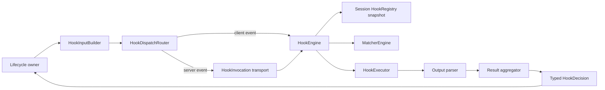

Hooks let external programs observe and control Deep Agents Code lifecycle events. Configure handlers in settings, and Deep Agents Code sends a JSON payload to each matching handler whenever an event fires.

<Warning>
    This page documents the **planned Claude Code-compatible hooks redesign**. It is a draft for design review and is **not** the behavior of the shipping CLI yet. Until the redesign lands, the live CLI still uses the [current fire-and-forget hooks](#current-fire-and-forget-hooks) described at the bottom of this page.
</Warning>

The redesign targets [Claude Code hooks](https://code.claude.com/docs/en/hooks) compatibility for a focused MVP event set: scripts written for Claude's JSON input/output contract should work for those events, with explicitly documented gaps where Deep Agents Code does not apply every Claude capability yet.

## Goals

- Support blocking decisions on the execution path (`PreToolUse`, `PermissionRequest`, `Stop`), not only side-effect notifications.
- Preserve Claude event names, matcher vocabulary, common input fields, exit-code semantics, and command-hook JSON output.
- Keep a shared engine that matches, executes, parses, and aggregates hooks, while lifecycle owners apply typed decisions at the correct seams.
- Snapshot hook configuration for the session so mid-session config edits cannot add or remove policy hooks.

## MVP event set

| Event | Owner | Can block? | Matcher field |
| --- | --- | --- | --- |
| `SessionStart` | Client | No | `source` (`startup`, `resume`, `clear`, `compact`) |
| `SessionEnd` | Client | No | `reason` |
| `PermissionRequest` | Client | Yes (allow/deny) | `tool_name` |
| `Notification` | Client | No | `notification_type` |
| `PreToolUse` | Server | Yes (allow/deny/ask) | `tool_name` |
| `PostToolUse` | Server | No (feedback only) | `tool_name` |
| `Stop` | Server | Yes (continue the turn) | none |
| `SubagentStart` | Server | No | `agent_type` |
| `SubagentStop` | Server | Context only in MVP | `agent_type` |

Client-owned events run in the CLI process. Server-owned events originate in the agent execution path and round-trip to the client so command hooks still execute where user configuration lives.

## Configuration shape

Claude-compatible hooks nest in three levels: event name → matcher group → handlers.

```json
{
  "hooks": {
    "PreToolUse": [
      {
        "matcher": "Bash",
        "hooks": [
          {
            "type": "command",
            "command": "/path/to/block-rm.sh",
            "timeout": 600
          }
        ]
      }
    ],
    "SessionStart": [
      {
        "matcher": "startup|resume",
        "hooks": [
          {
            "type": "command",
            "command": "/path/to/load-context.sh"
          }
        ]
      }
    ]
  }
}
```

### Matchers

A **matcher** filters whether a handler group runs for a given event invocation:

- Omitted, empty, or `*` matches all values for that event.
- Exact names match exactly (`Bash`).
- Alternation matches either side (`Edit|Write`).
- Otherwise the value is treated as a regular expression (`mcp__.*`).

Optional Claude-style `if` predicates (for example `Bash(git *)`) are a second-stage filter and apply only to tool-oriented events (`PreToolUse`, `PostToolUse`, `PermissionRequest`). On other events, an `if` predicate fails closed.

### Handler types in MVP

MVP focuses on `type: "command"` handlers: a subprocess receives event JSON on stdin and communicates through exit codes and stdout JSON.

Other Claude handler types (`http`, `prompt`, `agent`, `mcp_tool`) and Claude async acknowledgement (`{"async": true}`) are out of scope unless already supported. Unsupported configured types should fail validation visibly rather than being skipped silently.

## Common input fields

Every event includes Claude's common envelope fields (plus event-specific fields):

| Field | Description |
| --- | --- |
| `session_id` | Session identifier (Claude wire name; maps from Deep Agents Code thread/session id) |
| `transcript_path` | Path to conversation transcript JSON/JSONL when available |
| `cwd` | Working directory when the hook is invoked |
| `hook_event_name` | Event name that fired |
| `prompt_id` | Optional UUID for the current user prompt |
| `permission_mode` | Optional Claude permission-mode string when meaningful |
| `effort` | Optional `{ "level": "low" \| "medium" \| "high" \| "xhigh" \| "max" }` |

Example `PreToolUse` payload after tool-name adaptation:

```json
{
  "session_id": "abc123",
  "transcript_path": "/Users/you/.deepagents/.../transcript.jsonl",
  "cwd": "/Users/you/my-project",
  "permission_mode": "default",
  "hook_event_name": "PreToolUse",
  "tool_name": "Bash",
  "tool_input": {
    "command": "rm -rf /tmp/build"
  },
  "tool_use_id": "toolu_01ABC"
}
```

### Tool vocabulary adapter

Hook scripts see **Claude tool names and argument shapes**, not internal Deep Agents Code tool names. Planned mappings include:

| Internal tool | Claude wire name | Notable input fields |
| --- | --- | --- |
| Shell / execute | `Bash` | `command`, optional `description`, timeout, background |
| Write file | `Write` | `file_path`, `content` |
| Edit file | `Edit` | `file_path`, `old_string`, `new_string`, `replace_all` |
| MCP tools | `mcp__<server>__<tool>` | tool-specific JSON |

## Exit codes and JSON output

Command hooks follow Claude's exit-code contract:

| Exit code | Meaning |
| --- | --- |
| `0` | Success. Parse stdout as JSON when present. |
| `2` | Blocking/feedback path per event policy. Stdout JSON is ignored; stderr is the primary feedback channel. |
| Other nonzero | Non-blocking error for most events. Execution continues. |

JSON is only processed on exit `0`. Universal fields include:

```json
{
  "continue": true,
  "stopReason": "optional user-facing reason when continue is false",
  "suppressOutput": false,
  "systemMessage": "optional warning for the user",
  "terminalSequence": "optional allowlisted terminal escape sequence",
  "hookSpecificOutput": {
    "hookEventName": "PreToolUse"
  }
}
```

Event-specific control lives either in top-level `decision` / `reason` (for example `Stop`) or in `hookSpecificOutput` (for example `PreToolUse.permissionDecision`).

### Decision highlights

**`PreToolUse`**

```json
{
  "hookSpecificOutput": {
    "hookEventName": "PreToolUse",
    "permissionDecision": "deny",
    "permissionDecisionReason": "Destructive command blocked by hook"
  }
}
```

Aggregation precedence when multiple hooks match: `deny > defer > ask > allow > no decision`. MVP applies `deny`, `ask`, and `allow`. `defer` and `updatedInput` are parsed but not applied.

**`PermissionRequest`**

```json
{
  "hookSpecificOutput": {
    "hookEventName": "PermissionRequest",
    "decision": {
      "behavior": "deny",
      "message": "Not allowed in this environment"
    }
  }
}
```

Any deny wins. `updatedInput` and permission-rule persistence fields are parsed but not applied in MVP.

**`Stop`**

```json
{
  "decision": "block",
  "reason": "Tests are still failing; keep working"
}
```

A block continues the agent turn with feedback. Hooks should check `stop_hook_active` to avoid infinite loops; a hard continuation cap applies.

## Architecture overview



Design principles:

1. **Wire compatibility is an adapter boundary** — internal models do not leak into hook scripts.
2. **Capabilities are data** — matcher field, owner, exit-code policy, timeouts, and aggregation live in an event registry.
3. **Parse broadly, apply narrowly** — recognize Claude fields even when MVP cannot apply them; emit diagnostics instead of silent success.
4. **Lifecycle owners apply effects** — the engine returns typed decisions; it does not mutate the graph, permission UI, or transcript directly.
5. **Blocking happens before effects** — `PreToolUse` runs before HITL and tool execution; `Stop` runs before a terminal turn is committed.

## Known MVP compatibility gaps

| Capability | MVP behavior |
| --- | --- |
| `PreToolUse.updatedInput` | Parsed, ignored, diagnosed |
| `PreToolUse.defer` | Not supported; never treated as allow |
| `PostToolUse.updatedToolOutput` | Parsed, ignored, diagnosed |
| `PermissionRequest.updatedPermissions` | No permission-rules store yet |
| `SubagentStop` block / exit 2 resume | Context injection only |
| Non-command handler types | Configuration error unless an executor exists |
| Undocumented Claude quirks | Guaranteed only when covered by contract tests |

## Security

Hooks remain trusted configuration equivalent to shell aliases or Git hooks:

- Payload data flows to stdin as JSON, not interpolated into argv.
- Hook config is snapshotted at session start.
- Prefer explicit command argument arrays; avoid unnecessary shell wrappers.
- Only install hooks from sources you trust.

<Warning>
    A hook runs with your user permissions. Treat hook configuration as executable code.
</Warning>

## Current fire-and-forget hooks

Until the Claude-compatible redesign ships, Deep Agents Code still supports the existing observational hooks in `~/.deepagents/hooks.json`.

```json
{
  "hooks": [
    {
      "command": ["bash", "-c", "cat >> ~/deepagents-events.log"],
      "events": ["session.start", "session.end"]
    }
  ]
}
```

Current behavior:

- Commands receive a JSON object with an `"event"` key plus event-specific fields.
- Dispatch is fire-and-forget in a background thread and does **not** block the agent.
- Stdout/stderr are discarded; there is no decision channel yet.
- Each command has a short timeout (5 seconds).
- Matching is by `events` list (omit/empty = all events), not Claude matchers.

### Current events

| Event | When it fires | Notable fields |
| --- | --- | --- |
| `session.start` | Session begins | `thread_id` |
| `session.end` | Session exits | `thread_id` |
| `user.prompt` | Interactive prompt submit | — |
| `input.required` | HITL interrupt | — |
| `permission.request` | Before approval dialog | `tool_names` |
| `tool.error` | Tool error terminal state | `tool_names` |
| `task.complete` | Turn/task completes | `thread_id` |
| `context.compact` | Before compaction | — |

Also emitted by the current implementation: `tool.use` and `tool.result` (fire-and-forget; correlate by `tool_id`).

<Accordion title="Example: Python handler for current hooks">
```python title="my_handler.py"
import json
import sys


def handle_hook_payload(payload: dict) -> None:
    event = payload["event"]
    if event == "session.start":
        print(f"Session started: {payload['thread_id']}", file=sys.stderr)
    elif event == "permission.request":
        print(f"Approval needed for: {payload['tool_names']}", file=sys.stderr)


if __name__ == "__main__":
    handle_hook_payload(json.load(sys.stdin))
```
</Accordion>

## See also

- [Configuration](/oss/deepagents/code/configuration)
- [CLI reference](/oss/deepagents/code/cli-reference)
- [Claude Code hooks documentation](https://code.claude.com/docs/en/hooks)
