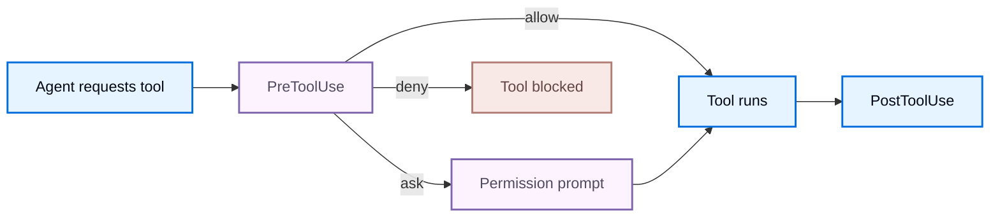

Hooks let external programs observe and control Deep Agents Code lifecycle events. Configure command handlers in `~/.deepagents/hooks.json`, and Deep Agents Code sends a JSON payload to each matching handler whenever an event fires. Some events also read the handler's response to allow, deny, or continue an action.

Hooks run with your user permissions and execute arbitrary code from your configuration. Treat hook configuration as executable code and only install hooks from sources you trust.

## Setup

Create `~/.deepagents/hooks.json`. Handlers nest in three levels: event name, matcher group, then the handlers that run for that group.

```json title="~/.deepagents/hooks.json"
{
  "hooks": {
    "PreToolUse": [
      {
        "matcher": "Bash",
        "hooks": [
          {
            "type": "command",
            "command": "~/.deepagents/hooks/block-rm.sh",
            "timeout": 600
          }
        ]
      }
    ],
    "SessionStart": [
      {
        "matcher": "startup|resume",
        "hooks": [
          {
            "type": "command",
            "command": "~/.deepagents/hooks/load-context.sh"
          }
        ]
      }
    ]
  }
}
```

Run `dcode config path` to confirm the resolved location of `hooks.json` and whether it exists.

Hook configuration is snapshotted when a session starts. Editing `hooks.json` mid-session does not add, remove, or weaken hooks until the next session, so an agent that edits settings during a turn cannot change the policy hooks that govern it.

### Handler fields

Each entry in a matcher group's `hooks` array is a command handler:

<ResponseField name="type" type="string" required>
    Handler type. Only `command` is supported. A command handler runs a subprocess that receives the event JSON on stdin.
</ResponseField>

<ResponseField name="command" type="string" required>
    Path to the executable or script to run. The event payload is written to stdin as JSON, never interpolated into arguments.
</ResponseField>

<ResponseField name="timeout" type="number" default="600" post={["optional"]}>
    Per-handler timeout in seconds. Handlers that exceed the timeout are cancelled and treated as a non-blocking failure.
</ResponseField>

<ResponseField name="statusMessage" type="string" post={["optional"]}>
    Message shown in the UI while the handler runs.
</ResponseField>

Configuring an unsupported handler type is a configuration error that fails validation visibly, rather than being skipped silently.

### Matchers

A matcher filters whether a handler group runs for a given event. Each event matches against one field (see [Events](#events)):

- Omitted, empty, or `*` matches all values for that event.
- A simple name matches exactly (`Bash`).
- Alternation matches either side (`Edit|Write`).
- Any other value is treated as a regular expression (`mcp__.*`).

Compile errors invalidate that group and produce a user-visible configuration diagnostic before the session runs.

Tool-oriented events (`PreToolUse`, `PostToolUse`, `PermissionRequest`) also accept an optional `if` predicate using permission-rule syntax, such as `Bash(git *)`, as a second-stage filter. On any other event, an `if` predicate fails closed and the handler does not run.

## Events

Deep Agents Code emits the following events. Client-owned events run in the CLI process. Server-owned events originate in the agent execution path and round-trip to the client so command handlers run where your configuration lives.

| Event | Owner | Can block? | Matches on |
| --- | --- | --- | --- |
| `SessionStart` | Client | No | `source` |
| `SessionEnd` | Client | No | `reason` |
| `PermissionRequest` | Client | Yes (allow, deny) | `tool_name` |
| `Notification` | Client | No | `notification_type` |
| `PreToolUse` | Server | Yes (allow, deny, ask) | `tool_name` |
| `PostToolUse` | Server | No (feedback only) | `tool_name` |
| `Stop` | Server | Yes (continue the turn) | none |
| `SubagentStart` | Server | No | `agent_type` |
| `SubagentStop` | Server | No (context only) | `agent_type` |

`PreToolUse` runs before the permission prompt and before tool execution, which makes it the primary enforcement seam. `Stop` runs before a terminal model response is committed.



## Input payload

Every handler receives a JSON object on stdin. All events share a common envelope, plus event-specific fields.

### Common fields

| Field | Description |
| --- | --- |
| `session_id` | Session identifier |
| `transcript_path` | Path to the conversation transcript when available |
| `cwd` | Working directory when the hook is invoked |
| `hook_event_name` | Name of the event that fired |
| `prompt_id` | UUID for the current user prompt, when available |
| `permission_mode` | Permission mode (`default`, `plan`, `acceptEdits`, `auto`, `dontAsk`, `bypassPermissions`), when meaningful |
| `effort` | Object such as `{ "level": "medium" }`, where level is `low`, `medium`, `high`, `xhigh`, or `max`, when available |

### Event-specific fields

| Event | Fields |
| --- | --- |
| `SessionStart` | `source` (`startup`, `resume`, `clear`, `compact`), and when available `model`, `agent_type`, `session_title` |
| `SessionEnd` | `reason` (`clear`, `resume`, `logout`, `prompt_input_exit`, `bypass_permissions_disabled`, `other`) |
| `PermissionRequest` | `tool_name`, `tool_input`, `permission_suggestions` |
| `Notification` | `message`, `notification_type`, and when available `title` |
| `PreToolUse` | `tool_name`, `tool_input`, `tool_use_id` |
| `PostToolUse` | `tool_name`, `tool_input`, `tool_response`, `tool_use_id`, and when available `duration_ms` |
| `Stop` | `stop_hook_active`, `last_assistant_message`, `background_tasks`, `session_crons` |
| `SubagentStart` | `agent_id`, `agent_type` |
| `SubagentStop` | `stop_hook_active`, `agent_id`, `agent_type`, `agent_transcript_path`, `last_assistant_message`, `background_tasks`, `session_crons` |

Example `PreToolUse` payload:

```json
{
  "session_id": "abc123",
  "transcript_path": "/Users/you/.deepagents/.../transcript.jsonl",
  "cwd": "/Users/you/my-project",
  "permission_mode": "default",
  "hook_event_name": "PreToolUse",
  "tool_name": "Bash",
  "tool_input": {
    "command": "rm -rf /tmp/build"
  },
  "tool_use_id": "toolu_01ABC"
}
```

### Tool names

Hook scripts see stable public tool names and argument shapes, not internal Deep Agents Code tool names. Match on and read these names in `PreToolUse`, `PostToolUse`, and `PermissionRequest`:

| Public tool name | Notable input fields |
| --- | --- |
| `Bash` | `command`, optional `description`, timeout, background flag |
| `Write` | `file_path`, `content` |
| `Edit` | `file_path`, `old_string`, `new_string`, `replace_all` |
| `mcp__<server>__<tool>` | Tool-specific JSON |

## Handler output

Command handlers communicate results through their exit code, stdout, and stderr.

| Exit code | Meaning |
| --- | --- |
| `0` | Success. When stdout contains JSON, it is parsed and applied. |
| `2` | Blocking or feedback path, per the event. Stdout JSON is ignored, and stderr is the primary feedback channel. |
| Other nonzero | Non-blocking error. Deep Agents Code logs a diagnostic and continues. |

JSON output is only processed on exit `0`, and a JSON response must be the only content on stdout. User-facing and model-facing output is capped at 10,000 characters.

### Universal output fields

Any handler may return these top-level fields:

```json
{
  "continue": true,
  "stopReason": "optional user-facing reason when continue is false",
  "suppressOutput": false,
  "systemMessage": "optional warning shown to the user",
  "hookSpecificOutput": {
    "hookEventName": "PreToolUse"
  }
}
```

Returning `"continue": false` stops all processing and takes precedence over event-specific decisions. When multiple hooks match, the first `stopReason` in configuration order is shown, and all `systemMessage` values are preserved in configuration order.

Event-specific control lives in `hookSpecificOutput` (for tool and permission events) or in top-level `decision` and `reason` (for `Stop`).

### Control tool execution with `PreToolUse`

Return a permission decision to allow, deny, or force a prompt before a tool runs:

```json
{
  "hookSpecificOutput": {
    "hookEventName": "PreToolUse",
    "permissionDecision": "deny",
    "permissionDecisionReason": "Destructive command blocked by hook"
  }
}
```

When multiple hooks match, decisions combine with the precedence `deny > ask > allow`. A deny short-circuits execution before the permission prompt and feeds its reason to the model. An ask forces the permission prompt. An allow suppresses the ordinary prompt but does not override a separate deny or ask. Any `additionalContext` values are passed through in configuration order.

You can also block with exit code `2` and write the reason to stderr.

### Allow or deny with `PermissionRequest`

Return a decision to answer a permission prompt on the user's behalf:

```json
{
  "hookSpecificOutput": {
    "hookEventName": "PermissionRequest",
    "decision": {
      "behavior": "deny",
      "message": "Not allowed in this environment"
    }
  }
}
```

Any deny wins. If no hook denies and at least one allows, the action is allowed. If no hook decides, the normal permission prompt is shown.

### Continue a turn with `Stop`

Return a block decision to keep the agent working instead of ending the turn:

```json
{
  "decision": "block",
  "reason": "Tests are still failing; keep working"
}
```

A block continues the agent turn with your feedback. To avoid infinite loops, check `stop_hook_active` in the payload and stop blocking once your condition is met. Deep Agents Code also enforces a hard cap of eight consecutive continuations.

### Inject context with start events

`SessionStart` and `SubagentStart` cannot block, but they can add context for the model:

```json
{
  "hookSpecificOutput": {
    "hookEventName": "SessionStart",
    "additionalContext": "Current sprint: ENG-1421. Prefer the staging database."
  }
}
```

`PostToolUse` and `SubagentStop` are also non-blocking: they can append `additionalContext` for the model but cannot undo an action that already ran.

## Unsupported output fields

Some fields defined by the hook output contract are recognized and validated, but not applied. When a handler returns one of these, Deep Agents Code emits a diagnostic and falls back to normal behavior rather than failing silently:

| Field or behavior | Result |
| --- | --- |
| `PreToolUse.updatedInput` | Parsed, not applied |
| `PreToolUse.defer` | Falls back to the normal permission flow, never treated as allow |
| `PostToolUse.updatedToolOutput` | Parsed, not applied |
| `PermissionRequest.updatedInput` | Parsed, not applied |
| `PermissionRequest.updatedPermissions` | Parsed, not applied (no permission-rule store) |
| `SubagentStop` block | Context only; a completed subagent cannot be resumed |

## Examples

<Accordion title="Block destructive Bash commands (PreToolUse)">
```bash title="~/.deepagents/hooks/block-rm.sh"
#!/usr/bin/env bash
command=$(jq -r '.tool_input.command // ""')

if printf '%s' "$command" | grep -Eq 'rm[[:space:]]+.*-[a-zA-Z]*[rf]'; then
  cat <<'JSON'
{
  "hookSpecificOutput": {
    "hookEventName": "PreToolUse",
    "permissionDecision": "deny",
    "permissionDecisionReason": "Recursive or forced rm is blocked by policy"
  }
}
JSON
fi
```

```json title="~/.deepagents/hooks.json"
{
  "hooks": {
    "PreToolUse": [
      {
        "matcher": "Bash",
        "hooks": [
          { "type": "command", "command": "~/.deepagents/hooks/block-rm.sh" }
        ]
      }
    ]
  }
}
```
</Accordion>

<Accordion title="Load project context on session start (SessionStart)">
```bash title="~/.deepagents/hooks/load-context.sh"
#!/usr/bin/env bash
context=$(git -C "$(jq -r '.cwd')" log --oneline -5 2>/dev/null)

jq -n --arg ctx "$context" '{
  hookSpecificOutput: {
    hookEventName: "SessionStart",
    additionalContext: ("Recent commits:\n" + $ctx)
  }
}'
```

```json title="~/.deepagents/hooks.json"
{
  "hooks": {
    "SessionStart": [
      {
        "matcher": "startup|resume",
        "hooks": [
          { "type": "command", "command": "~/.deepagents/hooks/load-context.sh" }
        ]
      }
    ]
  }
}
```
</Accordion>

<Accordion title="Desktop notification when the turn ends (Stop)">
```json title="~/.deepagents/hooks.json"
{
  "hooks": {
    "Stop": [
      {
        "hooks": [
          {
            "type": "command",
            "command": "osascript -e 'display notification \"Agent finished\" with title \"Deep Agents Code\"'"
          }
        ]
      }
    ]
  }
}
```
</Accordion>

<Accordion title="Python handler that reads the payload">
```python title="~/.deepagents/hooks/handler.py"
import json
import sys


def handle(payload: dict[str, object]) -> None:
    event = payload["hook_event_name"]
    if event == "PreToolUse":
        tool_name = payload["tool_name"]
        print(f"About to run {tool_name}", file=sys.stderr)


if __name__ == "__main__":
    handle(json.load(sys.stdin))
```
</Accordion>

## Security

Hooks follow the same trust model as Git hooks or shell aliases: any process that can write to `hooks.json` can run arbitrary commands with your permissions.

- Payload data flows to stdin as JSON, never interpolated into command arguments.
- Hook configuration is snapshotted at session start, so a mid-session settings change cannot alter the active policy hooks.
- Prefer explicit executables and argument arrays over shell wrappers.
- Only install hooks from sources you trust.

<Warning>
    A hook runs with your user permissions. Treat hook configuration as executable code.
</Warning>

## See also

- [Configuration](/oss/deepagents/code/configuration)
- [Data locations](/oss/deepagents/code/configuration#data-locations)
- [CLI reference](/oss/deepagents/code/cli-reference)
