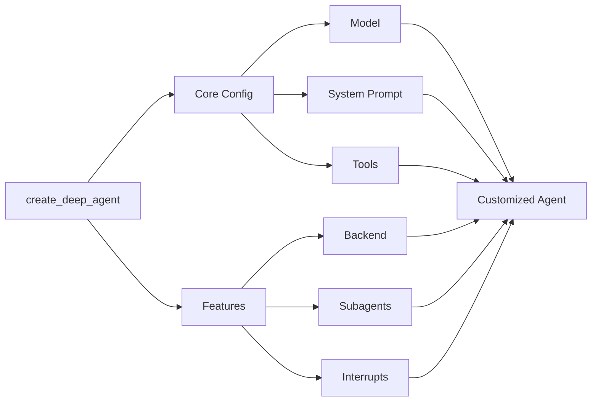

## Model

By default, `deepagents` uses [`claude-sonnet-4-5-20250929`](https://platform.claude.com/docs/en/about-claude/models/overview). You can change the model by passing any supported <Tooltip tip="A string that follows the format `provider:model` (e.g. openai:gpt-5)" cta="See mappings" href="https://reference.langchain.com/python/langchain/models/#langchain.chat_models.init_chat_model(model)">model identifier string</Tooltip> or [LangChain model object](/oss/integrations/chat):

:::python
<CodeGroup>
    ```python Model string
    from langchain.chat_models import init_chat_model
    from deepagents import create_deep_agent

    model = init_chat_model(model="gpt-5")
    agent = create_deep_agent(model=model)
    ```

    ```python LangChain model object
    from langchain_ollama import ChatOllama
    from langchain.chat_models import init_chat_model
    from deepagents import create_deep_agent

    model = init_chat_model(
        model=ChatOllama(
            model="llama3.1",
            temperature=0,
            # other params...
        )
    )
    agent = create_deep_agent(model=model)
    ```
</CodeGroup>
:::

:::js
```typescript
import { ChatAnthropic } from "@langchain/anthropic";
import { ChatOpenAI } from "@langchain/openai";
import { createDeepAgent } from "deepagents";

// Using Anthropic
const agent = createDeepAgent({
  model: new ChatAnthropic({
    model: "claude-sonnet-4-20250514",
    temperature: 0,
  }),
});

// Using OpenAI
const agent2 = createDeepAgent({
  model: new ChatOpenAI({
    model: "gpt-5",
    temperature: 0,
  }),
});
```
:::

## System prompt

Deep agents come with a built-in system prompt inspired by Claude Code's system prompt. The default system prompt contains detailed instructions for using the built-in planning tool, file system tools, and subagents.

Each deep agent tailored to a use case should include a custom system prompt specific to that use case which gets appended to the default system prompt.

Use custom system prompts to:
- Define domain-specific workflows (like research methodology or data analysis steps)
- Provide concrete examples for your use case
- Add specialized guidance (for example, "batch similar research tasks into a single TODO")
- Define stopping criteria and resource limits
- Explain how tools work together in your workflow without repeating what standard tools do, which is covered by the middleware

:::python
```python
from deepagents import create_deep_agent

research_instructions = """\
You are an expert researcher. Your job is to conduct \
thorough research, and then write a polished report. \
"""

agent = create_deep_agent(
    system_prompt=research_instructions,
)
```
:::

:::js
```typescript
import { createDeepAgent } from "deepagents";

const researchInstructions = `You are an expert researcher. Your job is to conduct thorough research, and then write a polished report.`;

const agent = createDeepAgent({
  systemPrompt: researchInstructions,
});
```
:::

For more examples, see the [Deepagents Quickstart repo](https://github.com/langchain-ai/deepagents-quickstarts).

## Tools

Deep agents have a number of default tools:

| Tool Name | Description | Provided By |
|-----------|-------------|-------------|
| [`write_todos`](/oss/deepagents/harness#to-do-list-tracking) | Create and manage structured task lists for tracking progress through complex workflows | `TodoListMiddleware` |
| `read_todos` | Read the current todo list state | `TodoListMiddleware` |
| [`ls`](/oss/deepagents/harness#file-system-access) | List all files in a directory in the agent's filesystem (requires absolute path) | `FilesystemMiddleware` |
| [`read_file`](/oss/deepagents/harness#file-system-access) | Read content from a file with optional pagination (offset/limit parameters) | `FilesystemMiddleware` |
| [`write_file`](/oss/deepagents/harness#file-system-access) | Create a new file or completely overwrite an existing file | `FilesystemMiddleware` |
| [`edit_file`](/oss/deepagents/harness#file-system-access) | Perform exact string replacements in files | `FilesystemMiddleware` |
| `glob` | Find files matching a pattern (e.g., `**/*.py`) | `FilesystemMiddleware` |
| `grep` | Search for text patterns within files | `FilesystemMiddleware` |
| `execute` | Run shell commands in a sandboxed environment. Only available if the backend implements `SandboxBackendProtocol`. By default, deep agents use the in-memory state backend which does not support command execution. | `FilesystemMiddleware` |
| [`task`](/oss/deepagents/harness#task-delegation-subagents) | Delegate tasks to specialized sub-agents with isolated context windows | `SubAgentMiddleware` |

On top of the default tools, you can add custom tools and MCP tools using the [`langchain-mcp-adapters`](https://github.com/langchain-ai/langchain-mcp-adapters).
The following is a custom tool for internet search:

:::python
```python
import os
from typing import Literal
from tavily import TavilyClient
from deepagents import create_deep_agent

tavily_client = TavilyClient(api_key=os.environ["TAVILY_API_KEY"])

def internet_search(
    query: str,
    max_results: int = 5,
    topic: Literal["general", "news", "finance"] = "general",
    include_raw_content: bool = False,
):
    """Run a web search"""
    return tavily_client.search(
        query,
        max_results=max_results,
        include_raw_content=include_raw_content,
        topic=topic,
    )

agent = create_deep_agent(
    tools=[internet_search]
)
```

To connect MCP tools, follow this pattern:

```python
from langchain_mcp_adapters.client import MultiServerMCPClient
from deepagents import create_deep_agent

async def main():
    mcp_client = MultiServerMCPClient(...)
    mcp_tools = await mcp_client.get_tools()
    agent = create_deep_agent(tools=mcp_tools)

    async for chunk in agent.astream({"messages": [{"role": "user", "content": "..."}]}):
        chunk["messages"][-1].pretty_print()
```

TODO(test)

:::

:::js
```typescript
import { tool } from "langchain";
import { TavilySearch } from "@langchain/tavily";
import { createDeepAgent } from "deepagents";
import { z } from "zod";

const internetSearch = tool(
  async ({
    query,
    maxResults = 5,
    topic = "general",
    includeRawContent = false,
  }: {
    query: string;
    maxResults?: number;
    topic?: "general" | "news" | "finance";
    includeRawContent?: boolean;
  }) => {
    const tavilySearch = new TavilySearch({
      maxResults,
      tavilyApiKey: process.env.TAVILY_API_KEY,
      includeRawContent,
      topic,
    });
    return await tavilySearch._call({ query });
  },
  {
    name: "internet_search",
    description: "Run a web search",
    schema: z.object({
      query: z.string().describe("The search query"),
      maxResults: z.number().optional().default(5),
      topic: z
        .enum(["general", "news", "finance"])
        .optional()
        .default("general"),
      includeRawContent: z.boolean().optional().default(false),
    }),
  },
);

const agent = createDeepAgent({
  tools: [internetSearch],
});
```
:::

## Middleware

Deep agents use some default [middleware](/oss/deepagents/middleware).
If you want to inject tools, modify prompts, or hook into the agent lifecycle, you can use custom middleware:

```python
from langchain_core.tools import tool
from deepagents import create_deep_agent
from langchain.agents.middleware import AgentMiddleware

@tool
def get_weather(city: str) -> str:
    """Get the weather in a city."""
    return f"The weather in {city} is sunny."

class WeatherMiddleware(AgentMiddleware):
    tools = [get_weather]

agent = create_deep_agent(middleware=[WeatherMiddleware()])
```

## Subagents

The main agent can delegate work to [sub-agents](/oss/deepagents/subagents).
You can supply custom sub-agents for context isolation and custom instructions:

```python
from deepagents import create_deep_agent

research_subagent = {
    "name": "research-agent",
    "description": "Used to research in-depth questions",
    "system_prompt": "You are an expert researcher",
    "tools": [internet_search],
    "model": "openai:gpt-4o",  # Optional, defaults to main agent model
}

agent = create_deep_agent(subagents=[research_subagent])
```

For complex cases, pass a pre-built LangGraph graph:

```python
from deepagents import CompiledSubAgent, create_deep_agent

custom_graph = create_agent(model=..., tools=..., system_prompt=...)

agent = create_deep_agent(
    subagents=[CompiledSubAgent(
        name="data-analyzer",
        description="Specialized agent for data analysis",
        runnable=custom_graph
    )]
)
```

## Interrupts

Some tools may be sensitive and require human approval before execution. Deepagents supports human-in-the-loop workflows through LangGraph’s interrupt capabilities. You can configure which tools require approval using a checkpointer.

These tool configs are passed to our prebuilt [HITL middleware](https://docs.langchain.com/oss/python/langchain/middleware#human-in-the-loop) so that the agent pauses execution and waits for feedback from the user before executing configured tools.

```python
from langchain_core.tools import tool
from deepagents import create_deep_agent

@tool
def get_weather(city: str) -> str:
    """Get the weather in a city."""
    return f"The weather in {city} is sunny."

agent = create_deep_agent(
    model="anthropic:claude-sonnet-4-20250514",
    tools=[get_weather],
    interrupt_on={
        "get_weather": {
            "allowed_decisions": ["approve", "edit", "reject"]
        },
    }
)
```

See the [human-in-the-loop documentation](https://docs.langchain.com/oss/python/deepagents/human-in-the-loop) for more details.

### `backend`

Deep agents use pluggable backends to control how filesystem operations work. By default, files are stored in the agent's ephemeral state. You can configure different backends for local disk access, persistent cross-conversation storage, or hybrid routing.

```python
from deepagents import create_deep_agent
from deepagents.backends import FilesystemBackend

agent = create_deep_agent(
    backend=FilesystemBackend(root_dir="/path/to/project"),
)
```

Available backends include:

- **`StateBackend`** (default): Ephemeral files stored in agent state
- **`FilesystemBackend`**: Real disk operations under a root directory
- **`StoreBackend`**: Persistent storage using LangGraph Store
- **`CompositeBackend`**: Route different paths to different backends

See the [backends documentation](https://docs.langchain.com/oss/python/deepagents/backends) for more details.

### Backend storage

Deep agents can maintain persistent memory across conversations using a `CompositeBackend` that routes specific paths to durable storage.

This enables hybrid memory where working files remain ephemeral while important data (like user preferences or knowledge bases) persists across threads.

```python
from deepagents import create_deep_agent
from deepagents.backends import CompositeBackend, StateBackend, StoreBackend
from langgraph.store.memory import InMemoryStore

agent = create_deep_agent(
    backend=CompositeBackend(
        default=StateBackend(),
        routes={"/memories/": StoreBackend(store=InMemoryStore())},
    ),
)
```

Files under `/memories/` will persist across all conversations, while other paths remain temporary. Use cases include:

- Preserving user preferences across sessions
- Building knowledge bases from multiple conversations
- Self-improving instructions based on feedback
- Maintaining research progress across sessions

See the [long-term memory documentation](https://docs.langchain.com/oss/python/deepagents/long-term-memory) for more details.

### Memory

Use [Agent.md files](https://agents.md/) to provide extra context to your deep agent.
You can pass one or more file paths to the `memory` parameter when creating your deep agent:

:::python
```python
from deepagents import create_deep_agent

agent = create_deep_agent(
    backend=FilesystemBackend(root_dir="/Users/user/{project}")
    memory=[
        "./agent.md"
    ],
)
```
:::
