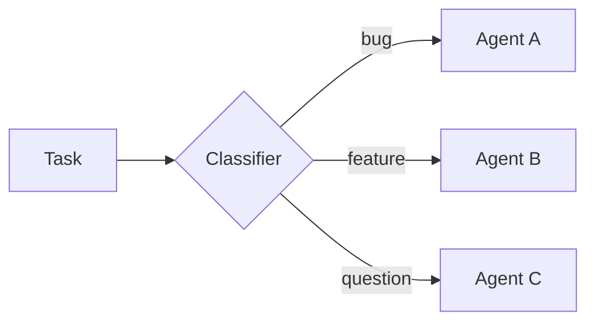
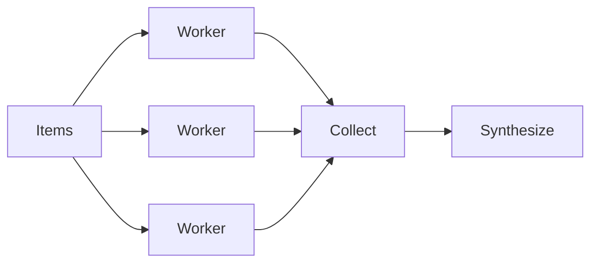
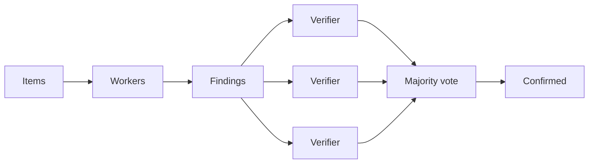

Programmatic subagents let an agent dispatch [subagents](/oss/deepagents/subagents) from interpreter code. Instead of asking the model to choose one subagent call at a time, the agent can use JavaScript loops, branches, and parallel batches to route work across configured subagents and synthesize the results.

Use this pattern when work spans many independent units, needs multiple perspectives, or benefits from recursive analysis. For general interpreter setup, see [Interpreters](/oss/deepagents/interpreters).

<Warning>
    Programmatic subagents use the interpreter runtime, which is in [**beta**](/oss/versioning). APIs and lifecycle behavior may change between releases.
</Warning>

:::python
<Note>
    Interpreters require `langchain-quickjs>=0.1.0` and Python `>=3.11`.
</Note>
:::

## How it works

When an agent has subagents and interpreter middleware, the interpreter exposes a built-in `task()` global. A `task()` dispatches a configured subagent, runs a full agentic loop, and resolves to the subagent result.

`task()` takes the following inputs:

- `description`: The prompt for the subagent
- `subagentType`: Which configured subagent to run
- `responseSchema` (optional): Structured output

```javascript
const review = await task({
  description: "Review src/auth/login.ts for auth issues. Cite line numbers.",
  subagentType: "reviewer",
  responseSchema: {
    type: "object",
    properties: {
      issues: { type: "array", items: { type: "object", properties: {
        file: { type: "string" }, line: { type: "number" },
        severity: { type: "string" }, description: { type: "string" },
      }}},
    },
  },
});

// With responseSchema, the result is already a typed value, so no JSON.parse is needed.
const critical = review.issues.filter((issue) => issue.severity === "high");
```

When you pass `responseSchema`, the resolved value is already a typed JavaScript object. Only call `JSON.parse` if a subagent intentionally returned a JSON string.

## Configure subagents for orchestration

Define the subagents you want the interpreter to dispatch, then add interpreter middleware. The agent uses each subagent's `name` and `description` to decide how to route work.

:::python
```python
from deepagents import create_deep_agent
from langchain_quickjs import CodeInterpreterMiddleware

agent = create_deep_agent(
    model="openai:gpt-5.5",
    subagents=[
        {
            "name": "reviewer",
            "description": "Reviews code for security issues, citing lines and severity",
            "system_prompt": "You are a security-focused code reviewer. Read the file carefully and report any authentication or authorization issues with line numbers and severity.",
        },
        {
            "name": "verifier",
            "description": "Independently verifies whether a reported vulnerability is real",
            "system_prompt": "You are a security verification specialist. Given a reported vulnerability, independently verify whether it is exploitable. Be skeptical. Only confirm real issues.",
        },
    ],
    middleware=[CodeInterpreterMiddleware()],
)

result = await agent.ainvoke({
    "messages": [{"role": "user", "content": "Do a thorough security audit of the payments module. I only want confirmed vulnerabilities, not maybes."}]
})
```
:::

:::js
```typescript
import { createDeepAgent } from "deepagents";
import { createCodeInterpreterMiddleware } from "@langchain/quickjs";

const agent = createDeepAgent({
  model: "openai:gpt-5.5",
  subagents: [
    {
      name: "reviewer",
      description: "Reviews code for security issues, citing lines and severity",
      systemPrompt: "You are a security-focused code reviewer. Read the file carefully and report any authentication or authorization issues with line numbers and severity.",
    },
    {
      name: "verifier",
      description: "Independently verifies whether a reported vulnerability is real",
      systemPrompt: "You are a security verification specialist. Given a reported vulnerability, independently verify whether it is exploitable. Be skeptical. Only confirm real issues.",
    },
  ],
  middleware: [createCodeInterpreterMiddleware()],
});

const result = await agent.invoke({
  messages: [{ role: "user", content: "Do a thorough security audit of the payments module. I only want confirmed vulnerabilities, not maybes." }],
});
```
:::

## Guide orchestration

The interpreter middleware ships orchestration guidance in the system prompt, so the agent already knows how to fan out in bounded batches, filter between passes, and synthesize results. You do not need to hand-write that logic or prompt for it turn by turn.

To shape what the agent orchestrates, work through the inputs it already responds to:

- **The subagents you configure.** Their `name` and `description` define the roles available. A `reviewer` paired with a `verifier` invites a two-pass check, and a single `analyzer` invites a straight fan-out.
- **The task message.** Phrasing like "I only want confirmed issues, not maybes" or "be exhaustive" nudges the agent toward verification or an open-ended sweep.
- **The system prompt.** Use `systemPrompt` or the agent's instructions to add standing guidance when you want a consistent strategy across runs.

## Patterns

Every pattern shares one model: hold work in JavaScript variables, dispatch subagents with `task()`, and combine results in code.

### Classify and act

Items are classified first, then each item is handled by a specialized subagent based on its classification. This lets you process mixed inputs where different items need different expertise.



**Use cases:** Triaging support tickets, error logs, user feedback, or any batch of items that need different handling depending on their type.

```javascript
const SPECIALIST = { bug: "bug-fixer", feature: "feature-analyst", question: "support-agent" };

const handled = await Promise.all(
  tickets.map((ticket) =>
    task({
      description: `Handle this ${ticket.category}:\n${ticket.text}`,
      subagentType: SPECIALIST[ticket.category],
    }),
  ),
);

handled;
```

### Fan out and synthesize

The agent dispatches the same kind of work across many items in parallel, then combines the results.



**Use cases:** Code review across a directory, analyzing a batch of documents, processing log files, and running the same check across many services.

```javascript
const files = (await tools.glob({ pattern: "src/routes/**/*.ts" }))
  .split("\n")
  .filter(Boolean);

const reviews = await Promise.all(
  files.map((file) =>
    task({
      description: `Review ${file} for authentication issues. Cite line numbers.`,
      subagentType: "reviewer",
      responseSchema: issuesSchema,
    }),
  ),
);

const issues = reviews.flatMap((r) => r.issues);
issues;
```

### Verify adversarially

A two-pass pattern. The first pass produces findings. The second pass sends each finding to independent verifiers, and only findings that survive agreement are kept. This reduces false positives when confidence matters more than speed.



**Use cases:** Security audits where false positives are costly, compliance checks, and any review where you need high confidence in findings.

```javascript
const { findings } = await task({
  description: "Audit the payments module for vulnerabilities.",
  subagentType: "auditor",
  responseSchema: findingsSchema,
});

const verdicts = await Promise.all(
  findings.map((f) =>
    task({
      description: `Verify ${f.file}:${f.line} (${f.description}). Confirm or refute.`,
      subagentType: "verifier",
      responseSchema: verdictSchema,
    }),
  ),
);

const confirmed = findings.filter((_, i) => verdicts[i]?.confirmed);
confirmed;
```

### Generate and filter

Multiple subagents generate independent solutions to the same problem. The agent compares, scores, and filters the results in code, keeping only the best.

```javascript
const proposals = await Promise.all(
  [1, 2, 3].map((n) =>
    task({
      description: `Approach ${n}: redesign the orders schema, with tradeoffs.`,
      subagentType: "architect",
      responseSchema: designSchema,
    }),
  ),
);

const best = proposals.sort((a, b) => score(b) - score(a))[0];
best;
```

### Loop until done

The agent runs a discovery loop, deduplicating against what it has already found, until no new results appear. Use this when the scope of the work is not known upfront.

```javascript
const seen = new Set();
const found = [];

while (true) {
  const { items } = await task({
    description: `Find dead code. Already found: ${[...seen].join(", ") || "(none)"}.`,
    subagentType: "analyzer",
    responseSchema: itemsSchema,
  });
  const fresh = items.filter((i) => !seen.has(i.id));
  if (fresh.length === 0) break;
  for (const i of fresh) { seen.add(i.id); found.push(i); }
}
found;
```

:::python
<Warning>
    `task()` dispatches from inside an already-running `eval` call. It does not go through the normal tool calling path, so `interrupt_on` approval workflows on the parent agent are not enforced per dispatch. Gate the `eval` tool itself if you need approval before subagent orchestration runs.
</Warning>
:::

:::js
<Warning>
    `task()` dispatches from inside an already-running `eval` call. It does not go through the normal tool calling path, so `interruptOn` approval workflows on the parent agent are not enforced per dispatch. Gate the `eval` tool itself if you need approval before subagent orchestration runs.
</Warning>
:::

## Disable programmatic subagents

Subagent dispatch is on by default whenever the agent has subagents. Disable it if you want subagents to be available only through the normal `task` tool path.

:::python
```python
from deepagents import create_deep_agent
from langchain_quickjs import CodeInterpreterMiddleware

agent = create_deep_agent(
    model="openai:gpt-5.5",
    subagents=[{"name": "reviewer", "description": "Reviews code", "system_prompt": "Review code."}],
    middleware=[CodeInterpreterMiddleware(subagents=False)],
)
```
:::

:::js
```typescript
import { createDeepAgent } from "deepagents";
import { createCodeInterpreterMiddleware } from "@langchain/quickjs";

const agent = createDeepAgent({
  model: "openai:gpt-5.5",
  subagents: [{ name: "reviewer", description: "Reviews code", systemPrompt: "Review code." }],
  middleware: [createCodeInterpreterMiddleware({ subagents: false })],
});
```
:::
