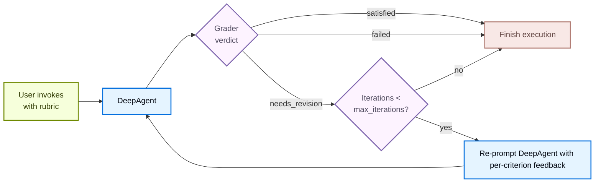

Some agent tasks have a clear definition of *done* that the model alone cannot reliably hit on the first try: a haiku in the right syllable pattern, a refactor with all tests passing, a report that hits every required section. `RubricMiddleware` lets you declare *what done looks like* as a rubric and have the agent **self-evaluate and iterate** until the rubric is satisfied (or a configured maximum iteration cap is hit).

It mounts two hooks. `before_agent` detects a new rubric and resets the iteration counter. `after_agent` runs a separate **grader sub-agent** that reviews the transcript against the rubric. If the grader returns `needs_revision`, the middleware injects the feedback as a `HumanMessage` and jumps back to the model. The loop terminates on `satisfied`, `max_iterations_reached`, `failed`, or a real interrupt.



When no `rubric` is supplied on input state, both hooks short-circuit and the middleware does not run, so it is safe to include unconditionally in a `create_deep_agent` stack.

<Note>
`RubricMiddleware` is in **beta**. The API may change in the future.
</Note>

## Rubric verdicts

Every grader pass produces one of four verdicts:

| Status | Meaning | Loops back? |
| --- | --- | --- |
| `satisfied` | Every criterion in the rubric passes. | No |
| `needs_revision` | At least one criterion fails; grader feedback is injected and the agent runs again. | Yes |
| `max_iterations_reached` | Grader still wants revisions, but `max_iterations` has been hit. | No |
| `failed` | The grader could not produce a verdict; either it judged the rubric un-gradable, or the grader call raised an exception. | No |

To exit the agent mid-run, press Ctrl+C. `KeyboardInterrupt` and `asyncio.CancelledError` are not caught, so keyboard interrupts and async cancellation propagate out of `agent.invoke()` as expected.

## Configuration

`RubricMiddleware` takes one required argument and four optional ones:

| Argument | Required | Default | Description |
| --- | --- | --- | --- |
| `model` | Yes | `None` | Chat model used by the grader sub-agent. Accepts a `"provider:model-id"` string or a `BaseChatModel` instance. |
| `system_prompt` | No | Built-in grader prompt | Custom grading instructions. Falls back to a default system prompt that teaches the grader the verdict format and what tools it has at its disposal. |
| `tools` | No | `None` | Tools the grader may call to gather evidence (run tests, count tokens, read files) before producing a verdict. With none, the grader reasons from the transcript alone. |
| `max_iterations` | No | `3` | Hard cap on grader iterations per rubric attempt. Maximum input value is 20. When the cap is reached without a `satisfied` verdict, the agent terminates with status `max_iterations_reached`. |
| `on_evaluation` | No | `None` | Optional callback invoked with each `RubricEvaluation` after grading. Useful for evals, observability, or persisting iteration history. |

If no rubric is passed on invocation state, the middleware no-ops — the agent runs once and returns as normal.

## Example: Grading a Haiku with a Custom Tool and Prompt:

The example below builds a deep agent that writes a haiku about the ocean. The rubric asks for a 5/7/5 syllable pattern, imagery that is specifically oceanic (not generic "water" or "beach"), and concrete sensory detail.

```python
from deepagents import RubricMiddleware, create_deep_agent
from langchain_core.messages import HumanMessage
from langchain_core.tools import tool
from langgraph.checkpoint.memory import InMemorySaver


@tool
def count_syllables(line: str) -> int:
    """Return the number of vowel groups in `line`, treating each as one syllable."""
    vowels = "aeiouy"
    count, prev_vowel = 0, False
    for ch in line.lower():
        is_vowel = ch in vowels
        if is_vowel and not prev_vowel:
            count += 1
        prev_vowel = is_vowel
    return max(count, 1)


HAIKU_GRADER_PROMPT = "You are a poetry editor grading haiku against a rubric."

agent = create_deep_agent(
    model="anthropic:claude-sonnet-4-6",
    middleware=[
        RubricMiddleware(
            model="anthropic:claude-haiku-4-5",
            system_prompt=HAIKU_GRADER_PROMPT,
            tools=[count_syllables],
            max_iterations=5,
            on_evaluation=lambda ev: print(ev["result"], ev["explanation"]),
        ),
    ],
    checkpointer=InMemorySaver(),
)

config = {"configurable": {"thread_id": "haiku-session"}}
result = agent.invoke(
    {
        "messages": [HumanMessage("Write a haiku about the ocean.")],
        "rubric": (
            "- 5/7/5 syllable pattern\n"
            "- imagery is specifically oceanic (waves, tide, salt, kelp, etc.).\n"
            "- uses concrete sensory detail (sight, sound, smell, touch)"
        ),
    },
    config=config,
)

print(result["messages"][-1].content)   # the final haiku
```

The `rubric` field on input state is the trigger. Each grader iteration is delivered to `on_evaluation` as a `RubricEvaluation` dictionary containing the verdict, explanation, and per-criterion gaps, which is useful for evals, dashboards, or persisting an audit trail.

## Rubric persistence

A single `agent.invoke()` call runs the rubric loop to completion and returns with a terminal verdict: `satisfied`, `failed`, or `max_iterations_reached`.

Whether the rubric carries over to a follow-up invocation depends on three things: is a checkpointer attached, was a `thread_id` supplied, and is it the same one? In each scenario below, the second `invoke` does not pass a `rubric`:

**No checkpointer.** State is not persisted, so the second call has no rubric and the middleware no-ops.

```python
agent = create_deep_agent(model=..., middleware=[RubricMiddleware(...)])

agent.invoke({
    "messages": [HumanMessage("Write a launch tweet for the v2.4 SDK release.")],
    "rubric": (
        "- Under 280 characters\n"
        "- Mentions the performance gains\n"
        "- No emojis"
    ),
})
agent.invoke({
    "messages": [HumanMessage("Draft the release-notes blog post for v2.4.")],
})  # no grading
```

**Checkpointer + same `thread_id`.** LangGraph rehydrates the thread's state, including the rubric from the prior invocation. The grader evaluates the new response against it. Pass a new `rubric` in the input dictionary to replace it.

```python
agent = create_deep_agent(..., checkpointer=InMemorySaver())
cfg = {"configurable": {"thread_id": "T1"}}

agent.invoke({
    "messages": [HumanMessage("Write a launch tweet for the v2.4 SDK release.")],
    "rubric": (
        "- Under 280 characters\n"
        "- Mentions the performance gains\n"
        "- No emojis"
    ),
}, config=cfg)
agent.invoke({
    "messages": [HumanMessage("Draft the release-notes blog post for v2.4.")],
}, config=cfg)  # graded against the tweet rubric
```

**Checkpointer + different `thread_id`.** A new thread starts empty, so the second call has no rubric and the middleware no-ops.

```python
agent = create_deep_agent(..., checkpointer=InMemorySaver())

agent.invoke({
    "messages": [HumanMessage("Write a launch tweet for the v2.4 SDK release.")],
    "rubric": (
        "- Under 280 characters\n"
        "- Mentions the performance gains\n"
        "- No emojis"
    ),
}, config={"configurable": {"thread_id": "T1"}})
agent.invoke({
    "messages": [HumanMessage("Draft the release-notes blog post for v2.4.")],
}, config={"configurable": {"thread_id": "T2"}})  # no grading
```

Interrupts (`KeyboardInterrupt`, `asyncio.CancelledError`) propagate out of `agent.invoke()` uncaught. On a checkpointed thread, the next invocation with the same rubric resumes the in-flight grading run.

Iteration history is available via the `on_evaluation` callback during a run, and via `agent.get_state(config).values` or the `rubric_evaluation_start` / `rubric_evaluation_end` stream events on a checkpointed thread.
