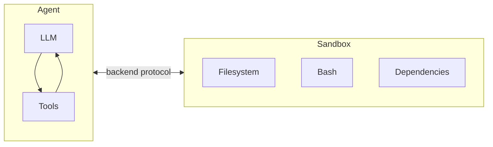

Agents generate code, interact with filesystems, and run shell commands. Because we can't predict what an agent might do, it's important that its environment is isolated so it can't access credentials, files, or the network. Sandboxes provide this isolation by creating a boundary between the agent's execution environment and your host system.

In deepagents, **sandboxes are [backends](/oss/deepagents/backends)** that define the environment where the agent operates. When you configure a sandbox backend, the agent gets:

- An isolated filesystem for reading/writing files
- The ability to execute shell commands via the `execute` tool
- A secure boundary that protects your host system



## Why use sandboxes?

| Benefit | Description |
|---------|-------------|
| **Security** | Code runs in isolation - can't access your credentials, files, or network |
| **Clean environments** | Use specific dependencies or OS configurations without local setup |
| **Reproducibility** | Consistent execution environments across teams |
| **Flexibility** | Switch between cloud providers or use local VFS for development |

:::js
## Available providers

<CardGroup cols={2}>
    <Card title="Modal" icon="/images/providers/modal-icon.svg" href="/oss/integrations/providers/modal">
        ML/AI workloads, GPU access, Python.
    </Card>
    <Card title="Daytona" icon="/images/providers/daytona-icon.svg" href="/oss/integrations/providers/daytona">
        TypeScript/Python development, fast cold starts.
    </Card>
    <Card title="Deno" icon="/images/providers/deno-icon.svg" href="/oss/integrations/providers/deno">
        Deno/JavaScript workloads, microVMs.
    </Card>
    <Card title="Node VFS" icon="/images/providers/nodejs-icon.svg" href="/oss/integrations/providers/node-vfs">
        Local development, testing, no cloud required.
    </Card>
</CardGroup>
:::

:::js
## Basic usage

```typescript
import { createDeepAgent } from "deepagents";
import { ChatAnthropic } from "@langchain/anthropic";
import { ModalSandbox } from "@langchain/modal";

// Create and initialize the sandbox
const sandbox = await ModalSandbox.create({
  imageName: "python:3.12-slim",
});

try {
  const agent = createDeepAgent({
    model: new ChatAnthropic({ model: "claude-sonnet-4-20250514" }),
    systemPrompt: "You are a coding assistant with sandbox access.",
    backend: sandbox,
  });

  const result = await agent.invoke({
    messages: [{ role: "user", content: "Install numpy and calculate pi" }],
  });
} finally {
  await sandbox.close();
}
```
:::

:::js
## Lifecycle management

All sandbox implementations follow the same lifecycle pattern:

```typescript
// Create and initialize
const sandbox = await ModalSandbox.create(options);

// Use the sandbox
const result = await sandbox.execute("echo hello");

// Clean up when done
await sandbox.close();

// Reconnect to an existing sandbox (if still running)
const reconnected = await ModalSandbox.fromId(sandbox.id);
```
:::

## Security considerations

<Warning>
Sandboxes isolate code execution, but agents remain vulnerable to prompt injection with untrusted inputs.

**Best practices:**
- Use [human-in-the-loop](/oss/deepagents/human-in-the-loop) approval for sensitive operations
- Use short-lived credentials and rotate them regularly
- Don't expose sandbox network access to untrusted code
- Review sandbox outputs before acting on them

Note that sandbox APIs are evolving rapidly, and we expect more providers to support proxies that help mitigate prompt injection and secrets management concerns.
</Warning>
