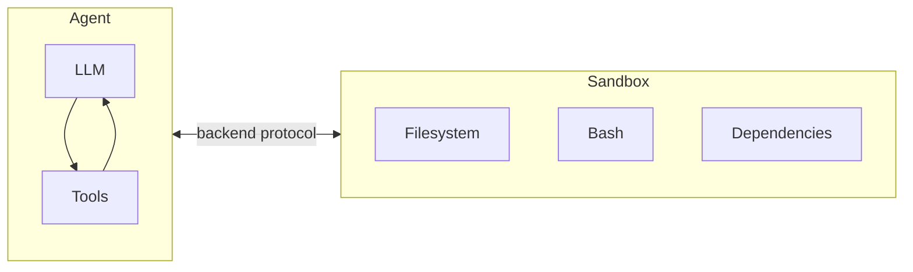

Agents generate code, interact with filesystems, and run shell commands. Because we can't predict what an agent might do, it's important that its environment is isolated so it can't access credentials, files, or the network. Sandboxes provide this isolation by creating a boundary between the agent's execution environment and your host system.

In deepagents, **sandboxes are [backends](/oss/deepagents/backends)** that define the environment where the agent operates. Unlike other backends (State, Filesystem, Store) which only expose file operations, sandbox backends also give the agent an `execute` tool for running shell commands. When you configure a sandbox backend, the agent gets:

- All standard filesystem tools (`ls`, `read_file`, `write_file`, `edit_file`, `glob`, `grep`)
- The `execute` tool for running arbitrary shell commands in the sandbox
- A secure boundary that protects your host system



## Why use sandboxes?

| Benefit | Description |
|---------|-------------|
| **Security** | Code runs in isolation - can't access your credentials, files, or network |
| **Clean environments** | Use specific dependencies or OS configurations without local setup |
| **Reproducibility** | Consistent execution environments across teams |
| **Flexibility** | Switch between cloud providers or use local VFS for development |

:::js
## Available providers

<CardGroup cols={2}>
    <Card title="Modal" icon="/images/providers/modal-icon.svg" href="/oss/integrations/providers/modal">
        ML/AI workloads, GPU access, Python.
    </Card>
    <Card title="Daytona" icon="/images/providers/daytona-icon.svg" href="/oss/integrations/providers/daytona">
        TypeScript/Python development, fast cold starts.
    </Card>
    <Card title="Deno" icon="/images/providers/deno-icon.svg" href="/oss/integrations/providers/deno">
        Deno/JavaScript workloads, microVMs.
    </Card>
    <Card title="Node VFS" icon="/images/providers/nodejs-icon.svg" href="/oss/integrations/providers/node-vfs">
        Local development, testing, no cloud required.
    </Card>
</CardGroup>
:::

:::js
## Basic usage

```typescript
import { createDeepAgent } from "deepagents";
import { ChatAnthropic } from "@langchain/anthropic";
import { ModalSandbox } from "@langchain/modal";

// Create and initialize the sandbox
const sandbox = await ModalSandbox.create({
  imageName: "python:3.12-slim",
});

try {
  const agent = createDeepAgent({
    model: new ChatAnthropic({ model: "claude-sonnet-4-20250514" }),
    systemPrompt: "You are a coding assistant with sandbox access.",
    backend: sandbox,
  });

  const result = await agent.invoke({
    messages: [{ role: "user", content: "Install numpy and calculate pi" }],
  });
} finally {
  await sandbox.close();
}
```
:::

## The `execute` tool

When a sandbox backend is configured, the agent automatically receives an `execute` tool alongside the standard filesystem tools. This tool runs a shell command inside the sandbox and returns the result.

The agent provides a single `command` string, and the tool returns:
- The combined stdout/stderr output
- The exit code (0 for success, non-zero for failure)
- A notice if the output was truncated due to size limits

For example, when the agent calls `execute({ command: "python -c \"print(2+2)\"" })`, it sees:

```
4
[Command succeeded with exit code 0]
```

If a command fails:

```
bash: foobar: command not found
[Command failed with exit code 127]
```

<Note>
If a command produces very large output, the result is automatically saved to a file and the agent is instructed to use `read_file` to access it incrementally. This prevents context window overflow.
</Note>

The `execute` tool is only available when the backend implements `SandboxBackendProtocol`. If you use a non-sandbox backend, the tool is automatically filtered out and the agent won't see it.

:::js
## Working with files

Sandboxes support three ways to move files between your application and the sandbox environment.

### Initial files

Populate the sandbox with files at creation time using the `initialFiles` option:

```typescript
const sandbox = await ModalSandbox.create({
  imageName: "python:3.12-slim",
  initialFiles: {
    "/app/main.py": 'print("Hello from Python!")',
    "/app/config.json": JSON.stringify({ debug: true }, null, 2),
  },
});
```

### Uploading files

Upload files to a running sandbox using `uploadFiles`. File contents are provided as `Uint8Array`:

```typescript
const encoder = new TextEncoder();
const responses = await sandbox.uploadFiles([
  ["src/index.js", encoder.encode("console.log('Hello')")],
  ["package.json", encoder.encode('{"name": "my-app"}')],
]);

// Each response indicates success or failure
for (const res of responses) {
  if (res.error) {
    console.error(`Failed to upload ${res.path}: ${res.error}`);
  }
}
```

### Downloading files

Retrieve files from the sandbox using `downloadFiles`:

```typescript
const results = await sandbox.downloadFiles(["src/index.js", "output.txt"]);

const decoder = new TextDecoder();
for (const result of results) {
  if (result.content) {
    console.log(`${result.path}: ${decoder.decode(result.content)}`);
  } else {
    console.error(`Failed to download ${result.path}: ${result.error}`);
  }
}
```

<Note>
The agent itself uses the filesystem tools (`read_file`, `write_file`) to interact with files inside the sandbox. `uploadFiles` and `downloadFiles` are for your **application code** to move files between your host environment and the sandbox - for example, seeding source code before the agent runs, or retrieving artifacts after it finishes.
</Note>
:::

:::js
## Lifecycle management

All sandbox implementations follow the same lifecycle pattern:

```typescript
// Create and initialize
const sandbox = await ModalSandbox.create(options);

// Use the sandbox
const result = await sandbox.execute("echo hello");

// Clean up when done
await sandbox.close();

// Reconnect to an existing sandbox (if still running)
const reconnected = await ModalSandbox.fromId(sandbox.id);
```
:::

## Security considerations

<Warning>
Sandboxes isolate code execution, but agents remain vulnerable to prompt injection with untrusted inputs.

**Best practices:**
- Use [human-in-the-loop](/oss/deepagents/human-in-the-loop) approval for sensitive operations
- Use short-lived credentials and rotate them regularly
- Don't expose sandbox network access to untrusted code
- Review sandbox outputs before acting on them

Note that sandbox APIs are evolving rapidly, and we expect more providers to support proxies that help mitigate prompt injection and secrets management concerns.
</Warning>
