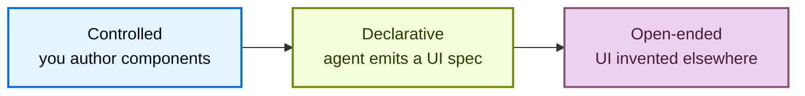

Generative UI is any pattern where an agent's output becomes interface, not only
text. Instead of streaming a paragraph into a chat bubble, the agent drives forms,
cards, dashboards, and interactive controls. This lets your UI communicate results
the way an application would, while the agent decides what to show and when.

Generative UI is not a single technique. It spans a spectrum defined by one
question: **who authors the interface?** At one end you write every component and
the agent only chooses among them. At the other end the interface is invented
outside your application entirely. Each position trades predictability for
expressive range.

## The generative UI spectrum

The spectrum runs from full control over every pixel to full agent autonomy, across
three positions:

  More control
  

  More autonomy

Moving left to right, predictability and per-capability engineering cost both fall,
while the agent's expressive range grows. Accessibility and visual consistency are
easiest to guarantee on the left and hardest to guarantee on the right.

### Controlled

You author the components, and the agent selects which one to render and what data
to pass. This gives the highest predictability and the tightest control over
branding and accessibility, at the cost of writing a component for every capability
you want to expose. It is the workhorse of generative UI and the right fit for
high-traffic, brand-critical surfaces where a layout must be exact, such as flight
tickets and booking confirmations. Your component library is the boundary: the agent
can only render what you shipped. Controlled generative UI covers components as
tools, tool-call rendering, state rendering, and reasoning.

For details, see [Controlled generative UI](/oss/langchain/frontend/controlled-generative-ui).

### Declarative

The agent emits a structured specification, and the frontend composes the interface
from a catalog of components you registered ahead of time. The catalog acts as a
guardrail and boundary: the agent can arrange and combine your components freely, but
cannot step outside the set you approved. This is where the long tail lives. It
trades pixel-perfection for breadth, which suits secondary interactions, internal
tools, and dashboards where showing something useful matters more than exact
control. LangChain's own approach uses [json-render](https://json-render.dev);
Google's A2UI, which integrates easily with CopilotKit, offers the same shape with
dynamic and fixed schema variants.

For details, see [Declarative generative UI](/oss/langchain/frontend/generative-ui).

### Open-ended

The agent owns the canvas. The interface is invented outside your application, for
example by an MCP server, and rendered in a sandbox. This gives the widest
expressive range and can add new interface capabilities with no frontend code on
your side, which suits one-off visualizations and bespoke answers where a result
that is surprising and good enough beats one that is predictable. It is also the most
experimental position: the least deterministic, and the hardest in which to
guarantee accessibility, consistency, and safety, so the UI must be isolated. The
sandbox and your prompt are the boundary.

For details, see [Open-ended generative UI](/oss/langchain/frontend/open-ended-generative-ui).

## Choosing an approach

Start from how much you need to constrain the interface:

| If you need to... | Choose |
| --- | --- |
| Guarantee branding, layout, and accessibility for a known set of outputs | [Controlled](/oss/langchain/frontend/controlled-generative-ui) |
| Let the agent compose novel layouts while staying inside approved components | [Declarative](/oss/langchain/frontend/generative-ui) |
| Surface interfaces authored by third parties without building them yourself | [Open-ended](/oss/langchain/frontend/open-ended-generative-ui) |

Choosing a single position for an entire product is the most common mistake. Real
applications mix positions and match each surface to its traffic: controlled
components for the high-traffic, brand-critical core, declarative composition for the
long tail of secondary interactions, and open-ended embeds for third-party
capabilities. A single session can move across all three.

The spectrum also applies beyond chat. The same three positions describe generative
interfaces on mobile, in Slack or email, and in voice or command-line surfaces, not
only in a chat transcript.

<Info>
This spectrum mirrors the framing in CopilotKit's [generative UI overview](https://docs.copilotkit.ai/concepts/generative-ui-overview),
which documents the same three positions and the techniques within each.
</Info>

## Explore the spectrum

<CardGroup cols={3}>
  <Card title="Controlled" icon="components" href="/oss/langchain/frontend/controlled-generative-ui">
    Author the components; the agent picks which to render and what data to pass.
  </Card>
  <Card title="Declarative" icon="schema" href="/oss/langchain/frontend/generative-ui">
    The agent emits a spec; the frontend composes from a registered catalog.
  </Card>
  <Card title="Open-ended" icon="world" href="/oss/langchain/frontend/open-ended-generative-ui">
    Render UI invented elsewhere, such as sandboxed MCP apps.
  </Card>
</CardGroup>

## See also

- [Frontend overview](/oss/langchain/frontend/overview)
- [Structured output](/oss/langchain/frontend/structured-output)
- [Tool calling](/oss/langchain/frontend/tool-calling)
