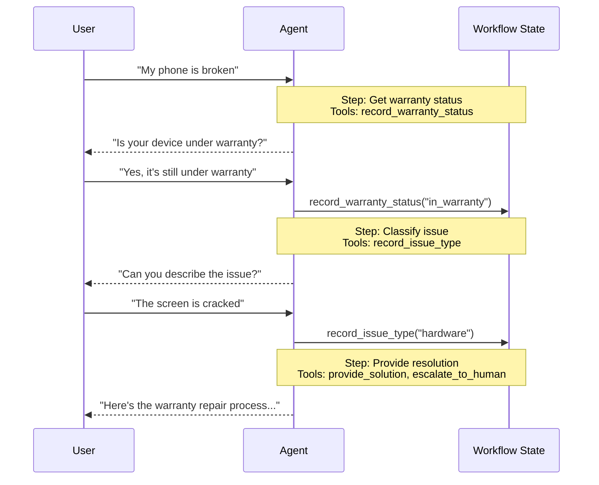

In the **handoffs** architecture, behavior changes dynamically based on state. The core mechanism: tools update a state variable (e.g., `current_step` or `active_agent`) that persists across turns, and the system reads this variable to adjust behavior—either applying different configuration (system prompt, tools) or routing to a different agent. This pattern supports both handoffs between distinct agents and dynamic configuration changes within a single agent.

<Tip>
The term **handoffs** was coined by [OpenAI](https://openai.github.io/openai-agents-python/handoffs/) for using tool calls (e.g., `transfer_to_sales_agent`) to transfer control between agents or states.
</Tip>



## Key characteristics

* State-driven behavior: Behavior changes based on a state variable (e.g., `current_step` or `active_agent`)
* Tool-based transitions: Tools update the state variable to move between states
* Direct user interaction: Each state's configuration handles user messages directly
* Persistent state: State survives across conversation turns

## When to use

Use the handoffs pattern when you need to enforce sequential constraints (unlock capabilities only after preconditions are met), the agent needs to converse directly with the user across different states, or you're building multi-stage conversational flows. This pattern is particularly valuable for customer support scenarios where you need to collect information in a specific sequence — for example, collecting a warranty ID before processing a refund.

<Card
    title="Tutorial: Build a customer support agent using handoffs"
    icon="people-arrows"
    href="/oss/langchain/customer-support-handoffs"
    arrow cta="Learn more"
>
    Learn how to build a customer support agent using the handoffs pattern, where a single agent transitions between different configurations.
</Card>

---

There are two ways to implement handoffs: **[single agent with middleware](#single-agent-with-middleware)** (one agent with dynamic configuration) or **[multiple agent subgraphs](#multiple-agent-subgraphs)** (distinct agents as graph nodes).

## Single agent with middleware

A single agent changes its behavior based on state. Middleware intercepts each model call and dynamically adjusts the system prompt and available tools. Tools update the state variable to trigger transitions:

:::python
```python
from langchain.tools import ToolRuntime, tool
from langchain.messages import ToolMessage
from langgraph.types import Command

@tool
def record_warranty_status(
    status: str,
    runtime: ToolRuntime[None, SupportState]
) -> Command:
    """Record warranty status and transition to next step."""
    return Command(
        update={
            "messages": [
                ToolMessage(
                    content=f"Warranty status recorded: {status}",
                    tool_call_id=runtime.tool_call_id
                )
            ],
            "warranty_status": status,
            "current_step": "specialist"  # Update state to trigger transition
        }
    )
```
:::
:::js
```typescript
import { tool } from "@langchain/core/tools";
import { Command } from "@langchain/langgraph";
import { ToolMessage } from "@langchain/core/messages";
import { z } from "zod";

const recordWarrantyStatus = tool(
  async ({ status }, config) => {
    return new Command({
      update: {
        messages: [
          new ToolMessage({
            content: `Warranty status recorded: ${status}`,
            tool_call_id: config.toolCall?.id!
          })
        ],
        warrantyStatus: status,
        currentStep: "specialist"  // Update state to trigger transition
      }
    });
  },
  {
    name: "record_warranty_status",
    description: "Record warranty status and transition to next step.",
    schema: z.object({
      status: z.string()
    })
  }
);
```
:::

<Accordion title="Complete example: Customer support with middleware">

:::python
```python
from langchain.agents import AgentState, create_agent
from langchain.agents.middleware import wrap_model_call, ModelRequest, ModelResponse
from langchain.tools import tool, ToolRuntime
from langchain.messages import ToolMessage
from langgraph.types import Command
from typing import Callable

# 1. Define state with current_step tracker
class SupportState(AgentState):  # [!code highlight]
    """Track which step is currently active."""
    current_step: str = "triage"  # [!code highlight]
    warranty_status: str | None = None

# 2. Tools update current_step via Command
@tool
def record_warranty_status(
    status: str,
    runtime: ToolRuntime[None, SupportState]
) -> Command:  # [!code highlight]
    """Record warranty status and transition to next step."""
    return Command(update={  # [!code highlight]
        "messages": [  # [!code highlight]
            ToolMessage(
                content=f"Warranty status recorded: {status}",
                tool_call_id=runtime.tool_call_id
            )
        ],
        "warranty_status": status,
        # Transition to next step
        "current_step": "specialist"    # [!code highlight]
    })

# 3. Middleware applies dynamic configuration based on current_step
@wrap_model_call  # [!code highlight]
def apply_step_config(
    request: ModelRequest,
    handler: Callable[[ModelRequest], ModelResponse]
) -> ModelResponse:
    """Configure agent behavior based on current_step."""
    step = request.state.get("current_step", "triage")  # [!code highlight]

    # Map steps to their configurations
    configs = {
        "triage": {
            "prompt": "Collect warranty information...",
            "tools": [record_warranty_status]
        },
        "specialist": {
            "prompt": "Provide solutions based on warranty: {warranty_status}",
            "tools": [provide_solution, escalate]
        }
    }

    config = configs[step]
    request = request.override(  # [!code highlight]
        system_prompt=config["prompt"].format(**request.state),  # [!code highlight]
        tools=config["tools"]  # [!code highlight]
    )
    return handler(request)

# 4. Create agent with middleware
agent = create_agent(
    model,
    tools=[record_warranty_status, provide_solution, escalate],
    state_schema=SupportState,
    middleware=[apply_step_config],  # [!code highlight]
    checkpointer=InMemorySaver()  # Persist state across turns  # [!code highlight]
)
```
:::
:::js
```typescript
import { tool, createAgent, AgentState } from "langchain";
import { wrapModelCall, ModelRequest, ModelResponse } from "langchain/agents/middleware";
import { Command } from "@langchain/langgraph";
import { ToolMessage } from "langchain/messages";
import * as z from "zod";

// 1. Define state with current_step tracker
const SupportState = z.object({  // [!code highlight]
  currentStep: z.string().default("triage"),  // [!code highlight]
  warrantyStatus: z.string().optional()
});

// 2. Tools update currentStep via Command
const recordWarrantyStatus = tool(
  async ({ status }, config) => {
    return new Command({  // [!code highlight]
      update: {  // [!code highlight]
        messages: [  // [!code highlight]
          new ToolMessage({
            content: `Warranty status recorded: ${status}`,
            tool_call_id: config.toolCall?.id!
          })
        ],
        warrantyStatus: status,
        // Transition to next step
        currentStep: "specialist",  // [!code highlight]
      }
    });
  },
  {
    name: "record_warranty_status",
    description: "Record warranty status and transition",
    schema: z.object({ status: z.string() })
  }
);

// 3. Middleware applies dynamic configuration based on currentStep
const applyStepConfig = wrapModelCall(  // [!code highlight]
  async (request: ModelRequest, handler) => {
    const step = request.state.currentStep || "triage";  // [!code highlight]

    // Map steps to their configurations
    const configs = {
      triage: {
        prompt: "Collect warranty information...",
        tools: [recordWarrantyStatus]
      },
      specialist: {
        prompt: `Provide solutions based on warranty: ${request.state.warrantyStatus}`,
        tools: [provideSolution, escalate]
      }
    };

    const config = configs[step];
    request = request.override({  // [!code highlight]
      systemPrompt: config.prompt,  // [!code highlight]
      tools: config.tools  // [!code highlight]
    });
    return handler(request);
  }
);

// 4. Create agent with middleware
const agent = createAgent({
  model,
  tools: [recordWarrantyStatus, provideSolution, escalate],
  stateSchema: SupportState,
  middleware: [applyStepConfig],  // [!code highlight]
  checkpointer: new InMemorySaver()  // Persist state across turns  // [!code highlight]
});
```
:::

</Accordion>

## Multiple agent subgraphs

Multiple distinct agents exist as separate nodes in a graph. Handoff tools navigate between agent nodes using `Command.PARENT` to specify which node to execute next:

:::python
```python
@tool
def transfer_to_sales():
    """Transfer to the sales agent."""
    return Command(
        # Navigate to the sales agent node
        goto="sales_agent",  # [!code highlight]
        # Update the state to indicate the sales agent is active
        update={"active_agent": "sales_agent"},  # [!code highlight]
        graph=Command.PARENT  # Navigate in parent graph
    )
```
:::
:::js
```typescript
const transferToSales = tool(
  async () => {
    return new Command({
      // Navigate to the sales agent node
      goto: "sales_agent",  // [!code highlight]
      // Update the state to indicate the sales agent is active
      update: { activeAgent: "sales_agent" },  // [!code highlight]
      // Navigate in parent graph
      graph: Command.PARENT  // Navigate in parent graph
    });
  },
  {
    name: "transfer_to_sales",
    description: "Transfer to the sales agent.",
    schema: z.object({})
  }
);
```
:::

<Accordion title="Complete example: Sales and support with handoffs">

This example shows a multi-agent system with separate sales and support agents. Each agent is a separate graph node, and handoff tools allow agents to transfer conversations to each other.

:::python
```python
from typing import Literal
from langchain.agents import AgentState, create_agent
from langchain.tools import tool
from langgraph.graph import StateGraph, START
from langgraph.types import Command

# 1. Define state with active_agent tracker
class MultiAgentState(AgentState):
    active_agent: str = "sales_agent"  # Track which agent is active

# 2. Create handoff tools
@tool
def transfer_to_sales():
    """Transfer to the sales agent."""
    return Command(
        goto="sales_agent",
        update={"active_agent": "sales_agent"},
        graph=Command.PARENT
    )

@tool
def transfer_to_support():
    """Transfer to the support agent."""
    return Command(
        goto="support_agent",
        update={"active_agent": "support_agent"},
        graph=Command.PARENT
    )

# 3. Create agents with handoff tools
sales_agent = create_agent(
    model="anthropic:claude-3-5-sonnet-latest",
    tools=[transfer_to_support],
    prompt="You are a sales agent. Help with sales inquiries."
)

support_agent = create_agent(
    model="anthropic:claude-3-5-sonnet-latest",
    tools=[transfer_to_sales],
    prompt="You are a support agent. Help with technical issues."
)

# 4. Create agent nodes that invoke the agents
def call_sales_agent(state: MultiAgentState):
    """Node that calls the sales agent."""
    response = sales_agent.invoke(state)
    return response

def call_support_agent(state: MultiAgentState):
    """Node that calls the support agent."""
    response = support_agent.invoke(state)
    return response

# 5. Create router node
def route_to_agent(state: MultiAgentState) -> Literal["sales_agent", "support_agent"]:
    """Route to the active agent based on state."""
    return state["active_agent"]

# 6. Build the graph
builder = StateGraph(MultiAgentState)
builder.add_node("sales_agent", call_sales_agent)
builder.add_node("support_agent", call_support_agent)

# Start with conditional routing based on initial active_agent
builder.add_conditional_edges(
    START,
    route_to_agent,
    ["sales_agent", "support_agent"]
)

# After each agent, route to the active agent (enables handoffs)
builder.add_conditional_edges(
    "sales_agent",
    route_to_agent,
    ["sales_agent", "support_agent"]
)
builder.add_conditional_edges(
    "support_agent",
    route_to_agent,
    ["sales_agent", "support_agent"]
)

graph = builder.compile()
```
:::

:::js
```typescript
import { StateGraph, START, MessagesAnnotation, Annotation } from "@langchain/langgraph";
import { createAgent } from "langchain";
import { tool } from "@langchain/core/tools";
import { Command } from "@langchain/langgraph";
import { z } from "zod";

// 1. Define state with active_agent tracker
const MultiAgentState = Annotation.Root({
  ...MessagesAnnotation.spec,
  activeAgent: Annotation<string>({
    reducer: (x, y) => y ?? x,
    default: () => "sales_agent"
  })
});

// 2. Create handoff tools
const transferToSales = tool(
  async () => {
    return new Command({
      goto: "sales_agent",
      update: { activeAgent: "sales_agent" },
      graph: Command.PARENT
    });
  },
  {
    name: "transfer_to_sales",
    description: "Transfer to the sales agent.",
    schema: z.object({})
  }
);

const transferToSupport = tool(
  async () => {
    return new Command({
      goto: "support_agent",
      update: { activeAgent: "support_agent" },
      graph: Command.PARENT
    });
  },
  {
    name: "transfer_to_support",
    description: "Transfer to the support agent.",
    schema: z.object({})
  }
);

// 3. Create agents with handoff tools
const salesAgent = createAgent({
  llm: model,
  tools: [transferToSupport],
  prompt: "You are a sales agent. Help with sales inquiries."
});

const supportAgent = createAgent({
  llm: model,
  tools: [transferToSales],
  prompt: "You are a support agent. Help with technical issues."
});

// 4. Create agent nodes that invoke the agents
const callSalesAgent = async (state: typeof MultiAgentState.State) => {
  const response = await salesAgent.invoke(state);
  return response;
};

const callSupportAgent = async (state: typeof MultiAgentState.State) => {
  const response = await supportAgent.invoke(state);
  return response;
};

// 5. Create router function
const routeToAgent = (state: typeof MultiAgentState.State): string => {
  return state.activeAgent;
};

// 6. Build the graph
const builder = new StateGraph(MultiAgentState)
  .addNode("sales_agent", callSalesAgent)
  .addNode("support_agent", callSupportAgent);

// Start with conditional routing based on initial activeAgent
builder.addConditionalEdges(
  START,
  routeToAgent,
  ["sales_agent", "support_agent"]
);

// After each agent, route to the active agent (enables handoffs)
builder.addConditionalEdges(
  "sales_agent",
  routeToAgent,
  ["sales_agent", "support_agent"]
);
builder.addConditionalEdges(
  "support_agent",
  routeToAgent,
  ["sales_agent", "support_agent"]
);

const graph = builder.compile();
```
:::

</Accordion>

<Tip>
Use **single agent with middleware** for most handoffs use cases—it's simpler. Only use **multiple agent subgraphs** when you need bespoke agent implementations (e.g., a node that's itself a complex graph with reflection or retrieval steps).
</Tip>

## Implementation considerations

* **Conversation history**: Decide what conversation history each agent/state receives—full history, filtered portions, or summaries.
* **Tool semantics**: Clarify whether handoff tools only update routing state or also perform actions (e.g., should `transfer_to_sales()` also create a ticket?).
