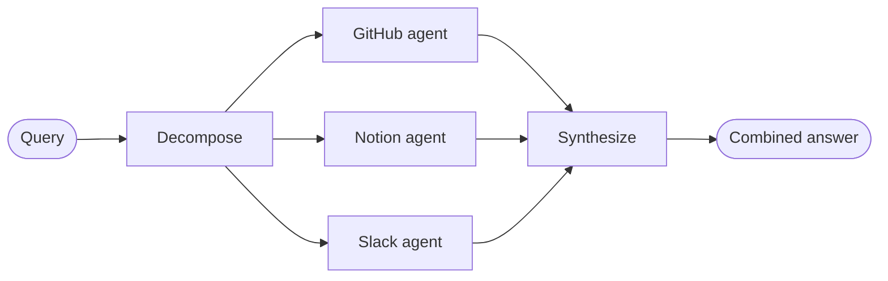

import ChatModelTabsPy from '/snippets/chat-model-tabs.mdx';
import ChatModelTabsJs from '/snippets/chat-model-tabs-js.mdx';

## Overview

The **router pattern** is a [multi-agent](/oss/langchain/multi-agent) architecture where a routing step classifies input and directs it to specialized agents, with results synthesized into a combined response. This pattern excels when your organization's knowledge lives across distinct **verticals**—separate knowledge domains that each require their own agent with specialized tools and prompts.

In this tutorial, you'll build a multi-source knowledge base router that demonstrates these benefits through a realistic enterprise scenario. The system will coordinate three specialists:

- A **GitHub agent** that searches code, issues, and pull requests.
- A **Notion agent** that searches internal documentation and wikis.
- A **Slack agent** that searches relevant threads and discussions.

When a user asks "How do I authenticate API requests?", the router decomposes the query into source-specific sub-questions, routes them to the relevant agents in parallel, and synthesizes results into a coherent answer.



### Why use a router?

The router pattern provides several advantages:

- **Parallel execution**: Query multiple sources simultaneously, reducing latency compared to sequential approaches.
- **Specialized agents**: Each vertical has focused tools and prompts optimized for its domain.
- **Selective routing**: Not every query needs every source—the router intelligently selects relevant verticals.
- **Targeted sub-questions**: Each agent receives a question tailored to its domain, improving result quality.
- **Clean synthesis**: Results from multiple sources are combined into a single, coherent response.

### Concepts

We will cover the following concepts:

- [Multi-agent systems](/oss/langchain/multi-agent)
- [StateGraph](/oss/langchain/graphs) for workflow orchestration
- [Send API](/oss/langchain/send) for parallel execution

<Tip>
**Router vs. Subagents**: The [subagents pattern](/oss/langchain/multi-agent/subagents) can also route to multiple agents. Use the router pattern when you need specialized preprocessing, custom routing logic, or want explicit control over parallel execution. Use the subagents pattern when you want the LLM to decide which agents to call dynamically.
</Tip>

## Setup

### Installation

This tutorial requires the `langchain` and `langgraph` packages:

:::python
<CodeGroup>
```bash pip
pip install langchain langgraph
```
```bash uv
uv add langchain langgraph
```
```bash conda
conda install langchain langgraph -c conda-forge
```
</CodeGroup>
:::

:::js
<CodeGroup>
```bash npm
npm install langchain @langchain/langgraph
```
```bash yarn
yarn add langchain @langchain/langgraph
```
```bash pnpm
pnpm add langchain @langchain/langgraph
```
</CodeGroup>
:::

For more details, see our [Installation guide](/oss/langchain/install).

### LangSmith

Set up [LangSmith](https://smith.langchain.com) to inspect what is happening inside your agent. Then set the following environment variables:

:::python
<CodeGroup>
```bash bash
export LANGSMITH_TRACING="true"
export LANGSMITH_API_KEY="..."
```
```python python
import getpass
import os

os.environ["LANGSMITH_TRACING"] = "true"
os.environ["LANGSMITH_API_KEY"] = getpass.getpass()
```
</CodeGroup>
:::

:::js
<CodeGroup>
```bash bash
export LANGSMITH_TRACING="true"
export LANGSMITH_API_KEY="..."
```
```typescript typescript
process.env.LANGSMITH_TRACING = "true";
process.env.LANGSMITH_API_KEY = "...";
```
</CodeGroup>
:::

### Select an LLM

Select a chat model from LangChain's suite of integrations:

:::python
<ChatModelTabsPy />
:::

:::js
<ChatModelTabsJs />
:::

## 1. Define state

First, define the state schema that will flow through your router workflow. This state tracks the original query, decomposed sub-questions for each source, results from each agent, and the final synthesized answer:

:::python
```python
from typing import TypedDict


class RouterState(TypedDict):
    query: str
    github_question: str | None
    notion_question: str | None
    slack_question: str | None
    github_result: str | None
    notion_result: str | None
    slack_result: str | None
    final_answer: str
```
:::

:::js
```typescript
import { Annotation } from "@langchain/langgraph";

const RouterState = Annotation.Root({
  query: Annotation<string>(),
  githubQuestion: Annotation<string | null>(),
  notionQuestion: Annotation<string | null>(),
  slackQuestion: Annotation<string | null>(),
  githubResult: Annotation<string | null>(),
  notionResult: Annotation<string | null>(),
  slackResult: Annotation<string | null>(),
  finalAnswer: Annotation<string>(),
});
```
:::

The `*_question` fields store decomposed sub-questions tailored to each knowledge source. This allows each agent to receive a question optimized for its domain rather than the raw user query.

## 2. Define tools for each vertical

Create tools for each knowledge domain. In a production system, these would call actual APIs. For this tutorial, we'll use stubs that demonstrate the pattern:

:::python
```python
from langchain.tools import tool


@tool
def search_code(query: str, repo: str = "main") -> str:
    """Search code in GitHub repositories."""
    return f"Found code matching '{query}' in {repo}: authentication middleware in src/auth.py"


@tool
def search_issues(query: str) -> str:
    """Search GitHub issues and pull requests."""
    return f"Found 3 issues matching '{query}': #142 (API auth docs), #89 (OAuth flow), #203 (token refresh)"


@tool
def search_prs(query: str) -> str:
    """Search pull requests for implementation details."""
    return f"PR #156 added JWT authentication, PR #178 updated OAuth scopes"


@tool
def search_notion(query: str) -> str:
    """Search Notion workspace for documentation."""
    return f"Found documentation: 'API Authentication Guide' - covers OAuth2 flow, API keys, and JWT tokens"


@tool
def get_page(page_id: str) -> str:
    """Get a specific Notion page by ID."""
    return f"Page content: Step-by-step authentication setup instructions"


@tool
def search_slack(query: str) -> str:
    """Search Slack messages and threads."""
    return f"Found discussion in #engineering: 'Use Bearer tokens for API auth, see docs for refresh flow'"


@tool
def get_thread(thread_id: str) -> str:
    """Get a specific Slack thread."""
    return f"Thread discusses best practices for API key rotation"
```
:::

:::js
```typescript
import { tool } from "langchain";
import { z } from "zod";

const searchCode = tool(
  async ({ query, repo }) => {
    return `Found code matching '${query}' in ${repo || "main"}: authentication middleware in src/auth.py`;
  },
  {
    name: "search_code",
    description: "Search code in GitHub repositories.",
    schema: z.object({
      query: z.string(),
      repo: z.string().optional().default("main"),
    }),
  }
);

const searchIssues = tool(
  async ({ query }) => {
    return `Found 3 issues matching '${query}': #142 (API auth docs), #89 (OAuth flow), #203 (token refresh)`;
  },
  {
    name: "search_issues",
    description: "Search GitHub issues and pull requests.",
    schema: z.object({
      query: z.string(),
    }),
  }
);

const searchPrs = tool(
  async ({ query }) => {
    return `PR #156 added JWT authentication, PR #178 updated OAuth scopes`;
  },
  {
    name: "search_prs",
    description: "Search pull requests for implementation details.",
    schema: z.object({
      query: z.string(),
    }),
  }
);

const searchNotion = tool(
  async ({ query }) => {
    return `Found documentation: 'API Authentication Guide' - covers OAuth2 flow, API keys, and JWT tokens`;
  },
  {
    name: "search_notion",
    description: "Search Notion workspace for documentation.",
    schema: z.object({
      query: z.string(),
    }),
  }
);

const getPage = tool(
  async ({ pageId }) => {
    return `Page content: Step-by-step authentication setup instructions`;
  },
  {
    name: "get_page",
    description: "Get a specific Notion page by ID.",
    schema: z.object({
      pageId: z.string(),
    }),
  }
);

const searchSlack = tool(
  async ({ query }) => {
    return `Found discussion in #engineering: 'Use Bearer tokens for API auth, see docs for refresh flow'`;
  },
  {
    name: "search_slack",
    description: "Search Slack messages and threads.",
    schema: z.object({
      query: z.string(),
    }),
  }
);

const getThread = tool(
  async ({ threadId }) => {
    return `Thread discusses best practices for API key rotation`;
  },
  {
    name: "get_thread",
    description: "Get a specific Slack thread.",
    schema: z.object({
      threadId: z.string(),
    }),
  }
);
```
:::

## 3. Create specialized agents

Create specialized agents for each vertical. Each agent has domain-specific tools and prompts optimized for its knowledge source:

:::python
```python
from langchain.agents import create_agent
from langchain.chat_models import init_chat_model

model = init_chat_model("openai:gpt-4o")

github_agent = create_agent(
    model,
    tools=[search_code, search_issues, search_prs],
    system_prompt=(
        "You are a GitHub expert. Answer questions about code, "
        "API references, and implementation details by searching "
        "repositories, issues, and pull requests."
    ),
)

notion_agent = create_agent(
    model,
    tools=[search_notion, get_page],
    system_prompt=(
        "You are a Notion expert. Answer questions about internal "
        "processes, policies, and team documentation by searching "
        "the organization's Notion workspace."
    ),
)

slack_agent = create_agent(
    model,
    tools=[search_slack, get_thread],
    system_prompt=(
        "You are a Slack expert. Answer questions by searching "
        "relevant threads and discussions where team members have "
        "shared knowledge and solutions."
    ),
)
```
:::

:::js
```typescript
import { createAgent } from "langchain";
import { ChatOpenAI } from "@langchain/openai";

const llm = new ChatOpenAI({ model: "gpt-4o" });

const githubAgent = createAgent({
  model: llm,
  tools: [searchCode, searchIssues, searchPrs],
  systemPrompt: `
You are a GitHub expert. Answer questions about code,
API references, and implementation details by searching
repositories, issues, and pull requests.
  `.trim(),
});

const notionAgent = createAgent({
  model: llm,
  tools: [searchNotion, getPage],
  systemPrompt: `
You are a Notion expert. Answer questions about internal
processes, policies, and team documentation by searching
the organization's Notion workspace.
  `.trim(),
});

const slackAgent = createAgent({
  model: llm,
  tools: [searchSlack, getThread],
  systemPrompt: `
You are a Slack expert. Answer questions by searching
relevant threads and discussions where team members have
shared knowledge and solutions.
  `.trim(),
});
```
:::

Each agent is focused on its specific domain, with tools and prompts tailored to that knowledge source.

## 4. Build the router workflow

Now build the router workflow using a StateGraph. The workflow has four main steps:

1. **Decompose**: Analyze the query and generate source-specific sub-questions
2. **Route**: Fan out to selected agents in parallel using `Send`
3. **Query agents**: Each selected agent searches its domain using its tailored sub-question
4. **Synthesize**: Combine results into a coherent response

:::python
```python
from langgraph.graph import StateGraph, START, END, Send

router_llm = init_chat_model("openai:gpt-4o-mini")


def decompose_query(state: RouterState) -> dict:
    """Decompose query into source-specific sub-questions."""
    response = router_llm.with_structured_output(dict).invoke([  # [!code highlight]
        {
            "role": "system",
            "content": """Analyze this query and determine which knowledge bases to consult.
For each relevant source, generate a targeted sub-question optimized for that source.

Available sources:
- github: Code, API references, implementation details, issues, pull requests
- notion: Internal documentation, processes, policies, team wikis
- slack: Team discussions, informal knowledge sharing, recent conversations

Return a JSON object with sub-questions ONLY for relevant sources:
{
  "github": "sub-question for GitHub (or null if not relevant)",
  "notion": "sub-question for Notion (or null if not relevant)",
  "slack": "sub-question for Slack (or null if not relevant)"
}

Example for "How do I authenticate API requests?":
{
  "github": "What authentication code exists? Search for auth middleware, JWT handling, OAuth implementation",
  "notion": "What authentication documentation exists? Look for API auth guides, security policies",
  "slack": null
}"""
        },
        {"role": "user", "content": state["query"]}
    ])

    return {
        "github_question": response.get("github"),
        "notion_question": response.get("notion"),
        "slack_question": response.get("slack"),
    }


def route_to_agents(state: RouterState) -> list[Send]:
    """Fan out to agents that have sub-questions assigned."""
    sends = []
    if state.get("github_question"):
        sends.append(Send("github", state))  # [!code highlight]
    if state.get("notion_question"):
        sends.append(Send("notion", state))  # [!code highlight]
    if state.get("slack_question"):
        sends.append(Send("slack", state))  # [!code highlight]
    return sends


def query_github(state: RouterState) -> dict:
    """Query the GitHub agent with its targeted sub-question."""
    result = github_agent.invoke({
        "messages": [{"role": "user", "content": state["github_question"]}]  # [!code highlight]
    })
    return {"github_result": result["messages"][-1].content}


def query_notion(state: RouterState) -> dict:
    """Query the Notion agent with its targeted sub-question."""
    result = notion_agent.invoke({
        "messages": [{"role": "user", "content": state["notion_question"]}]  # [!code highlight]
    })
    return {"notion_result": result["messages"][-1].content}


def query_slack(state: RouterState) -> dict:
    """Query the Slack agent with its targeted sub-question."""
    result = slack_agent.invoke({
        "messages": [{"role": "user", "content": state["slack_question"]}]  # [!code highlight]
    })
    return {"slack_result": result["messages"][-1].content}


def synthesize_results(state: RouterState) -> dict:
    """Combine results from multiple agents into a coherent answer."""
    results = []
    if state.get("github_result"):
        results.append(f"**From GitHub:**\n{state['github_result']}")
    if state.get("notion_result"):
        results.append(f"**From Notion:**\n{state['notion_result']}")
    if state.get("slack_result"):
        results.append(f"**From Slack:**\n{state['slack_result']}")

    if not results:
        return {"final_answer": "No results found from any knowledge source."}

    synthesis_response = router_llm.invoke([
        {
            "role": "system",
            "content": f"""Synthesize these search results to answer the original question: "{state['query']}"

- Combine information from multiple sources without redundancy
- Highlight the most relevant and actionable information
- Note any discrepancies between sources
- Keep the response concise and well-organized"""
        },
        {"role": "user", "content": "\n\n".join(results)}
    ])

    return {"final_answer": synthesis_response.content}
```
:::

:::js
```typescript
import { StateGraph, START, END, Send } from "@langchain/langgraph";

const routerLlm = new ChatOpenAI({ model: "gpt-4o-mini" });


async function decomposeQuery(state: typeof RouterState.State) {
  const response = await routerLlm.invoke([  // [!code highlight]
    {
      role: "system",
      content: `Analyze this query and determine which knowledge bases to consult.
For each relevant source, generate a targeted sub-question optimized for that source.

Available sources:
- github: Code, API references, implementation details, issues, pull requests
- notion: Internal documentation, processes, policies, team wikis
- slack: Team discussions, informal knowledge sharing, recent conversations

Return a JSON object with sub-questions ONLY for relevant sources:
{
  "github": "sub-question for GitHub (or null if not relevant)",
  "notion": "sub-question for Notion (or null if not relevant)",
  "slack": "sub-question for Slack (or null if not relevant)"
}

Example for "How do I authenticate API requests?":
{
  "github": "What authentication code exists? Search for auth middleware, JWT handling, OAuth implementation",
  "notion": "What authentication documentation exists? Look for API auth guides, security policies",
  "slack": null
}`
    },
    { role: "user", content: state.query }
  ]);

  const parsed = JSON.parse(response.content as string);
  return {
    githubQuestion: parsed.github || null,
    notionQuestion: parsed.notion || null,
    slackQuestion: parsed.slack || null,
  };
}


function routeToAgents(state: typeof RouterState.State): Send[] {
  const sends: Send[] = [];
  if (state.githubQuestion) sends.push(new Send("github", state));  // [!code highlight]
  if (state.notionQuestion) sends.push(new Send("notion", state));  // [!code highlight]
  if (state.slackQuestion) sends.push(new Send("slack", state));  // [!code highlight]
  return sends;
}


async function queryGithub(state: typeof RouterState.State) {
  const result = await githubAgent.invoke({
    messages: [{ role: "user", content: state.githubQuestion! }]  // [!code highlight]
  });
  return { githubResult: result.messages.at(-1)?.content };
}


async function queryNotion(state: typeof RouterState.State) {
  const result = await notionAgent.invoke({
    messages: [{ role: "user", content: state.notionQuestion! }]  // [!code highlight]
  });
  return { notionResult: result.messages.at(-1)?.content };
}


async function querySlack(state: typeof RouterState.State) {
  const result = await slackAgent.invoke({
    messages: [{ role: "user", content: state.slackQuestion! }]  // [!code highlight]
  });
  return { slackResult: result.messages.at(-1)?.content };
}


async function synthesizeResults(state: typeof RouterState.State) {
  const results: string[] = [];
  if (state.githubResult) results.push(`**From GitHub:**\n${state.githubResult}`);
  if (state.notionResult) results.push(`**From Notion:**\n${state.notionResult}`);
  if (state.slackResult) results.push(`**From Slack:**\n${state.slackResult}`);

  if (results.length === 0) {
    return { finalAnswer: "No results found from any knowledge source." };
  }

  const synthesisResponse = await routerLlm.invoke([
    {
      role: "system",
      content: `Synthesize these search results to answer the original question: "${state.query}"

- Combine information from multiple sources without redundancy
- Highlight the most relevant and actionable information
- Note any discrepancies between sources
- Keep the response concise and well-organized`
    },
    { role: "user", content: results.join("\n\n") }
  ]);

  return { finalAnswer: synthesisResponse.content };
}
```
:::

## 5. Compile the workflow

Now assemble the workflow by connecting nodes with edges. The key is using `add_conditional_edges` with the routing function to enable parallel execution:

:::python
```python
workflow = (
    StateGraph(RouterState)
    .add_node("decompose", decompose_query)
    .add_node("github", query_github)
    .add_node("notion", query_notion)
    .add_node("slack", query_slack)
    .add_node("synthesize", synthesize_results)
    .add_edge(START, "decompose")
    .add_conditional_edges("decompose", route_to_agents, ["github", "notion", "slack"])
    .add_edge("github", "synthesize")
    .add_edge("notion", "synthesize")
    .add_edge("slack", "synthesize")
    .add_edge("synthesize", END)
    .compile()
)
```
:::

:::js
```typescript
const workflow = new StateGraph(RouterState)
  .addNode("decompose", decomposeQuery)
  .addNode("github", queryGithub)
  .addNode("notion", queryNotion)
  .addNode("slack", querySlack)
  .addNode("synthesize", synthesizeResults)
  .addEdge(START, "decompose")
  .addConditionalEdges("decompose", routeToAgents, ["github", "notion", "slack"])
  .addEdge("github", "synthesize")
  .addEdge("notion", "synthesize")
  .addEdge("slack", "synthesize")
  .addEdge("synthesize", END)
  .compile();
```
:::

The `add_conditional_edges` call connects the decompose node to the agent nodes through the `route_to_agents` function. When `route_to_agents` returns multiple `Send` objects, those nodes execute in parallel.

## 6. Use the router

Test your router with queries that span multiple knowledge domains:

:::python
```python
result = workflow.invoke({
    "query": "How do I authenticate API requests?"
})

print("Original query:", result["query"])
print("\nDecomposed questions:")
if result.get("github_question"):
    print(f"  GitHub: {result['github_question']}")
if result.get("notion_question"):
    print(f"  Notion: {result['notion_question']}")
if result.get("slack_question"):
    print(f"  Slack: {result['slack_question']}")
print("\n" + "=" * 60 + "\n")
print("Final Answer:")
print(result["final_answer"])
```
:::

:::js
```typescript
const result = await workflow.invoke({
  query: "How do I authenticate API requests?"
});

console.log("Original query:", result.query);
console.log("\nDecomposed questions:");
if (result.githubQuestion) console.log(`  GitHub: ${result.githubQuestion}`);
if (result.notionQuestion) console.log(`  Notion: ${result.notionQuestion}`);
if (result.slackQuestion) console.log(`  Slack: ${result.slackQuestion}`);
console.log("\n" + "=".repeat(60) + "\n");
console.log("Final Answer:");
console.log(result.finalAnswer);
```
:::

Expected output:
```
Original query: How do I authenticate API requests?

Decomposed questions:
  GitHub: What authentication code exists? Search for auth middleware, JWT handling, OAuth implementation
  Notion: What authentication documentation exists? Look for API auth guides, security policies

============================================================

Final Answer:
To authenticate API requests, you have several options:

1. **JWT Tokens**: The recommended approach for most use cases.
   Implementation details are in `src/auth.py` (PR #156).

2. **OAuth2 Flow**: For third-party integrations, follow the OAuth2
   flow documented in Notion's 'API Authentication Guide'.

3. **API Keys**: For server-to-server communication, use Bearer tokens
   in the Authorization header.

For token refresh handling, see issue #203 and PR #178 for the latest
OAuth scope updates.
```

The router analyzed the query, decomposed it into targeted sub-questions for GitHub and Notion (but not Slack for this technical question), queried both agents in parallel with their tailored questions, and synthesized the results into a coherent answer.

## 7. Understanding the architecture

The router workflow follows a clear pattern:

### Decomposition phase

The `decompose_query` function analyzes the user's query and generates source-specific sub-questions. This is where the "routing" intelligence lives:

- Determines which sources are relevant to the query
- Generates tailored sub-questions optimized for each source's domain
- Skips sources that aren't relevant (by returning `null`)

This targeted approach improves result quality because each agent receives a question framed for its specific knowledge domain.

### Parallel execution

The `route_to_agents` function returns a list of `Send` objects, one for each source that has a sub-question assigned. LangGraph executes these in parallel:

```python
# If github_question and notion_question are set, this returns:
[Send("github", state), Send("notion", state)]
# Both agents execute simultaneously with their targeted sub-questions
```

### Synthesis phase

After all agents complete, the `synthesize_results` function combines their outputs. The synthesis step:

- Waits for all parallel branches to complete
- References the original query to ensure the answer addresses what the user actually asked
- Combines information without redundancy

<Note>
**Partial results**: In this tutorial, all selected agents must complete before synthesis. For more advanced patterns where you want to handle partial results or timeouts, see the [map-reduce guide](/oss/langchain/map-reduce).
</Note>

## 8. Complete working example

Here's everything together in a runnable script:

<Expandable title="View complete code" defaultOpen={false}>

:::python
```python
"""
Multi-Source Knowledge Router Example

This example demonstrates the router pattern for multi-agent systems.
A router decomposes queries into source-specific sub-questions, routes them
to specialized agents in parallel, and synthesizes results into a combined response.
"""

from typing import TypedDict

from langchain.agents import create_agent
from langchain.chat_models import init_chat_model
from langchain.tools import tool
from langgraph.graph import StateGraph, START, END, Send


class RouterState(TypedDict):
    query: str
    github_question: str | None
    notion_question: str | None
    slack_question: str | None
    github_result: str | None
    notion_result: str | None
    slack_result: str | None
    final_answer: str


@tool
def search_code(query: str, repo: str = "main") -> str:
    """Search code in GitHub repositories."""
    return f"Found code matching '{query}' in {repo}: authentication middleware in src/auth.py"


@tool
def search_issues(query: str) -> str:
    """Search GitHub issues and pull requests."""
    return f"Found 3 issues matching '{query}': #142 (API auth docs), #89 (OAuth flow), #203 (token refresh)"


@tool
def search_prs(query: str) -> str:
    """Search pull requests for implementation details."""
    return f"PR #156 added JWT authentication, PR #178 updated OAuth scopes"


@tool
def search_notion(query: str) -> str:
    """Search Notion workspace for documentation."""
    return f"Found documentation: 'API Authentication Guide' - covers OAuth2 flow, API keys, and JWT tokens"


@tool
def get_page(page_id: str) -> str:
    """Get a specific Notion page by ID."""
    return f"Page content: Step-by-step authentication setup instructions"


@tool
def search_slack(query: str) -> str:
    """Search Slack messages and threads."""
    return f"Found discussion in #engineering: 'Use Bearer tokens for API auth, see docs for refresh flow'"


@tool
def get_thread(thread_id: str) -> str:
    """Get a specific Slack thread."""
    return f"Thread discusses best practices for API key rotation"


model = init_chat_model("openai:gpt-4o")
router_llm = init_chat_model("openai:gpt-4o-mini")

github_agent = create_agent(
    model,
    tools=[search_code, search_issues, search_prs],
    system_prompt=(
        "You are a GitHub expert. Answer questions about code, "
        "API references, and implementation details by searching "
        "repositories, issues, and pull requests."
    ),
)

notion_agent = create_agent(
    model,
    tools=[search_notion, get_page],
    system_prompt=(
        "You are a Notion expert. Answer questions about internal "
        "processes, policies, and team documentation by searching "
        "the organization's Notion workspace."
    ),
)

slack_agent = create_agent(
    model,
    tools=[search_slack, get_thread],
    system_prompt=(
        "You are a Slack expert. Answer questions by searching "
        "relevant threads and discussions where team members have "
        "shared knowledge and solutions."
    ),
)


def decompose_query(state: RouterState) -> dict:
    """Decompose query into source-specific sub-questions."""
    response = router_llm.with_structured_output(dict).invoke([
        {
            "role": "system",
            "content": """Analyze this query and determine which knowledge bases to consult.
For each relevant source, generate a targeted sub-question optimized for that source.

Available sources:
- github: Code, API references, implementation details, issues, pull requests
- notion: Internal documentation, processes, policies, team wikis
- slack: Team discussions, informal knowledge sharing, recent conversations

Return a JSON object with sub-questions ONLY for relevant sources:
{
  "github": "sub-question for GitHub (or null if not relevant)",
  "notion": "sub-question for Notion (or null if not relevant)",
  "slack": "sub-question for Slack (or null if not relevant)"
}"""
        },
        {"role": "user", "content": state["query"]}
    ])

    return {
        "github_question": response.get("github"),
        "notion_question": response.get("notion"),
        "slack_question": response.get("slack"),
    }


def route_to_agents(state: RouterState) -> list[Send]:
    """Fan out to agents that have sub-questions assigned."""
    sends = []
    if state.get("github_question"):
        sends.append(Send("github", state))
    if state.get("notion_question"):
        sends.append(Send("notion", state))
    if state.get("slack_question"):
        sends.append(Send("slack", state))
    return sends


def query_github(state: RouterState) -> dict:
    """Query the GitHub agent with its targeted sub-question."""
    result = github_agent.invoke({
        "messages": [{"role": "user", "content": state["github_question"]}]
    })
    return {"github_result": result["messages"][-1].content}


def query_notion(state: RouterState) -> dict:
    """Query the Notion agent with its targeted sub-question."""
    result = notion_agent.invoke({
        "messages": [{"role": "user", "content": state["notion_question"]}]
    })
    return {"notion_result": result["messages"][-1].content}


def query_slack(state: RouterState) -> dict:
    """Query the Slack agent with its targeted sub-question."""
    result = slack_agent.invoke({
        "messages": [{"role": "user", "content": state["slack_question"]}]
    })
    return {"slack_result": result["messages"][-1].content}


def synthesize_results(state: RouterState) -> dict:
    """Combine results from multiple agents into a coherent answer."""
    results = []
    if state.get("github_result"):
        results.append(f"**From GitHub:**\n{state['github_result']}")
    if state.get("notion_result"):
        results.append(f"**From Notion:**\n{state['notion_result']}")
    if state.get("slack_result"):
        results.append(f"**From Slack:**\n{state['slack_result']}")

    if not results:
        return {"final_answer": "No results found from any knowledge source."}

    synthesis_response = router_llm.invoke([
        {
            "role": "system",
            "content": f"""Synthesize these search results to answer the original question: "{state['query']}"

- Combine information from multiple sources without redundancy
- Highlight the most relevant and actionable information
- Note any discrepancies between sources
- Keep the response concise and well-organized"""
        },
        {"role": "user", "content": "\n\n".join(results)}
    ])

    return {"final_answer": synthesis_response.content}


workflow = (
    StateGraph(RouterState)
    .add_node("decompose", decompose_query)
    .add_node("github", query_github)
    .add_node("notion", query_notion)
    .add_node("slack", query_slack)
    .add_node("synthesize", synthesize_results)
    .add_edge(START, "decompose")
    .add_conditional_edges("decompose", route_to_agents, ["github", "notion", "slack"])
    .add_edge("github", "synthesize")
    .add_edge("notion", "synthesize")
    .add_edge("slack", "synthesize")
    .add_edge("synthesize", END)
    .compile()
)


if __name__ == "__main__":
    result = workflow.invoke({
        "query": "How do I authenticate API requests?"
    })

    print("Original query:", result["query"])
    print("\nDecomposed questions:")
    if result.get("github_question"):
        print(f"  GitHub: {result['github_question']}")
    if result.get("notion_question"):
        print(f"  Notion: {result['notion_question']}")
    if result.get("slack_question"):
        print(f"  Slack: {result['slack_question']}")
    print("\n" + "=" * 60 + "\n")
    print("Final Answer:")
    print(result["final_answer"])
```
:::

:::js
```typescript
/**
 * Multi-Source Knowledge Router Example
 *
 * This example demonstrates the router pattern for multi-agent systems.
 * A router decomposes queries into source-specific sub-questions, routes them
 * to specialized agents in parallel, and synthesizes results into a combined response.
 */

import { tool, createAgent } from "langchain";
import { ChatOpenAI } from "@langchain/openai";
import { StateGraph, Annotation, START, END, Send } from "@langchain/langgraph";
import { z } from "zod";


const RouterState = Annotation.Root({
  query: Annotation<string>(),
  githubQuestion: Annotation<string | null>(),
  notionQuestion: Annotation<string | null>(),
  slackQuestion: Annotation<string | null>(),
  githubResult: Annotation<string | null>(),
  notionResult: Annotation<string | null>(),
  slackResult: Annotation<string | null>(),
  finalAnswer: Annotation<string>(),
});


const searchCode = tool(
  async ({ query, repo }) => {
    return `Found code matching '${query}' in ${repo || "main"}: authentication middleware in src/auth.py`;
  },
  {
    name: "search_code",
    description: "Search code in GitHub repositories.",
    schema: z.object({
      query: z.string(),
      repo: z.string().optional().default("main"),
    }),
  }
);

const searchIssues = tool(
  async ({ query }) => {
    return `Found 3 issues matching '${query}': #142 (API auth docs), #89 (OAuth flow), #203 (token refresh)`;
  },
  {
    name: "search_issues",
    description: "Search GitHub issues and pull requests.",
    schema: z.object({
      query: z.string(),
    }),
  }
);

const searchPrs = tool(
  async ({ query }) => {
    return `PR #156 added JWT authentication, PR #178 updated OAuth scopes`;
  },
  {
    name: "search_prs",
    description: "Search pull requests for implementation details.",
    schema: z.object({
      query: z.string(),
    }),
  }
);

const searchNotion = tool(
  async ({ query }) => {
    return `Found documentation: 'API Authentication Guide' - covers OAuth2 flow, API keys, and JWT tokens`;
  },
  {
    name: "search_notion",
    description: "Search Notion workspace for documentation.",
    schema: z.object({
      query: z.string(),
    }),
  }
);

const getPage = tool(
  async ({ pageId }) => {
    return `Page content: Step-by-step authentication setup instructions`;
  },
  {
    name: "get_page",
    description: "Get a specific Notion page by ID.",
    schema: z.object({
      pageId: z.string(),
    }),
  }
);

const searchSlack = tool(
  async ({ query }) => {
    return `Found discussion in #engineering: 'Use Bearer tokens for API auth, see docs for refresh flow'`;
  },
  {
    name: "search_slack",
    description: "Search Slack messages and threads.",
    schema: z.object({
      query: z.string(),
    }),
  }
);

const getThread = tool(
  async ({ threadId }) => {
    return `Thread discusses best practices for API key rotation`;
  },
  {
    name: "get_thread",
    description: "Get a specific Slack thread.",
    schema: z.object({
      threadId: z.string(),
    }),
  }
);


const llm = new ChatOpenAI({ model: "gpt-4o" });
const routerLlm = new ChatOpenAI({ model: "gpt-4o-mini" });

const githubAgent = createAgent({
  model: llm,
  tools: [searchCode, searchIssues, searchPrs],
  systemPrompt: `
You are a GitHub expert. Answer questions about code,
API references, and implementation details by searching
repositories, issues, and pull requests.
  `.trim(),
});

const notionAgent = createAgent({
  model: llm,
  tools: [searchNotion, getPage],
  systemPrompt: `
You are a Notion expert. Answer questions about internal
processes, policies, and team documentation by searching
the organization's Notion workspace.
  `.trim(),
});

const slackAgent = createAgent({
  model: llm,
  tools: [searchSlack, getThread],
  systemPrompt: `
You are a Slack expert. Answer questions by searching
relevant threads and discussions where team members have
shared knowledge and solutions.
  `.trim(),
});


async function decomposeQuery(state: typeof RouterState.State) {
  const response = await routerLlm.invoke([
    {
      role: "system",
      content: `Analyze this query and determine which knowledge bases to consult.
For each relevant source, generate a targeted sub-question optimized for that source.

Available sources:
- github: Code, API references, implementation details, issues, pull requests
- notion: Internal documentation, processes, policies, team wikis
- slack: Team discussions, informal knowledge sharing, recent conversations

Return a JSON object with sub-questions ONLY for relevant sources:
{
  "github": "sub-question for GitHub (or null if not relevant)",
  "notion": "sub-question for Notion (or null if not relevant)",
  "slack": "sub-question for Slack (or null if not relevant)"
}`
    },
    { role: "user", content: state.query }
  ]);

  const parsed = JSON.parse(response.content as string);
  return {
    githubQuestion: parsed.github || null,
    notionQuestion: parsed.notion || null,
    slackQuestion: parsed.slack || null,
  };
}

function routeToAgents(state: typeof RouterState.State): Send[] {
  const sends: Send[] = [];
  if (state.githubQuestion) sends.push(new Send("github", state));
  if (state.notionQuestion) sends.push(new Send("notion", state));
  if (state.slackQuestion) sends.push(new Send("slack", state));
  return sends;
}

async function queryGithub(state: typeof RouterState.State) {
  const result = await githubAgent.invoke({
    messages: [{ role: "user", content: state.githubQuestion! }]
  });
  return { githubResult: result.messages.at(-1)?.content };
}

async function queryNotion(state: typeof RouterState.State) {
  const result = await notionAgent.invoke({
    messages: [{ role: "user", content: state.notionQuestion! }]
  });
  return { notionResult: result.messages.at(-1)?.content };
}

async function querySlack(state: typeof RouterState.State) {
  const result = await slackAgent.invoke({
    messages: [{ role: "user", content: state.slackQuestion! }]
  });
  return { slackResult: result.messages.at(-1)?.content };
}

async function synthesizeResults(state: typeof RouterState.State) {
  const results: string[] = [];
  if (state.githubResult) results.push(`**From GitHub:**\n${state.githubResult}`);
  if (state.notionResult) results.push(`**From Notion:**\n${state.notionResult}`);
  if (state.slackResult) results.push(`**From Slack:**\n${state.slackResult}`);

  if (results.length === 0) {
    return { finalAnswer: "No results found from any knowledge source." };
  }

  const synthesisResponse = await routerLlm.invoke([
    {
      role: "system",
      content: `Synthesize these search results to answer the original question: "${state.query}"

- Combine information from multiple sources without redundancy
- Highlight the most relevant and actionable information
- Note any discrepancies between sources
- Keep the response concise and well-organized`
    },
    { role: "user", content: results.join("\n\n") }
  ]);

  return { finalAnswer: synthesisResponse.content };
}


const workflow = new StateGraph(RouterState)
  .addNode("decompose", decomposeQuery)
  .addNode("github", queryGithub)
  .addNode("notion", queryNotion)
  .addNode("slack", querySlack)
  .addNode("synthesize", synthesizeResults)
  .addEdge(START, "decompose")
  .addConditionalEdges("decompose", routeToAgents, ["github", "notion", "slack"])
  .addEdge("github", "synthesize")
  .addEdge("notion", "synthesize")
  .addEdge("slack", "synthesize")
  .addEdge("synthesize", END)
  .compile();


const result = await workflow.invoke({
  query: "How do I authenticate API requests?"
});

console.log("Original query:", result.query);
console.log("\nDecomposed questions:");
if (result.githubQuestion) console.log(`  GitHub: ${result.githubQuestion}`);
if (result.notionQuestion) console.log(`  Notion: ${result.notionQuestion}`);
if (result.slackQuestion) console.log(`  Slack: ${result.slackQuestion}`);
console.log("\n" + "=".repeat(60) + "\n");
console.log("Final Answer:");
console.log(result.finalAnswer);
```
:::

</Expandable>

## 9. Advanced: Stateful routers

The router we've built so far is **stateless**—each request is handled independently with no memory between calls. For multi-turn conversations, you need a **stateful** approach.

### Tool wrapper approach

The simplest way to add conversation memory is to wrap the stateless router as a tool that a conversational agent can call:

:::python
```python
from langgraph.checkpoint.memory import InMemorySaver


@tool
def search_knowledge_base(query: str) -> str:
    """Search across multiple knowledge sources (GitHub, Notion, Slack).

    Use this to find information about code, documentation, or team discussions.
    """
    result = workflow.invoke({"query": query})
    return result["final_answer"]


conversational_agent = create_agent(
    model,
    tools=[search_knowledge_base],
    system_prompt=(
        "You are a helpful assistant that answers questions about our organization. "
        "Use the search_knowledge_base tool to find information across our code, "
        "documentation, and team discussions."
    ),
    checkpointer=InMemorySaver(),
)
```
:::

:::js
```typescript
import { MemorySaver } from "@langchain/langgraph";

const searchKnowledgeBase = tool(
  async ({ query }) => {
    const result = await workflow.invoke({ query });
    return result.finalAnswer;
  },
  {
    name: "search_knowledge_base",
    description: `Search across multiple knowledge sources (GitHub, Notion, Slack).
Use this to find information about code, documentation, or team discussions.`,
    schema: z.object({
      query: z.string().describe("The search query"),
    }),
  }
);

const conversationalAgent = createAgent({
  model: llm,
  tools: [searchKnowledgeBase],
  systemPrompt: `
You are a helpful assistant that answers questions about our organization.
Use the search_knowledge_base tool to find information across our code,
documentation, and team discussions.
  `.trim(),
  checkpointer: new MemorySaver(),
});
```
:::

This approach keeps the router stateless while the conversational agent handles memory and context. The user can have a multi-turn conversation, and the agent will call the router tool as needed.

:::python
```python
config = {"configurable": {"thread_id": "user-123"}}

result = conversational_agent.invoke(
    {"messages": [{"role": "user", "content": "How do I authenticate API requests?"}]},
    config
)
print(result["messages"][-1].content)

result = conversational_agent.invoke(
    {"messages": [{"role": "user", "content": "What about rate limiting for those endpoints?"}]},
    config
)
print(result["messages"][-1].content)
```
:::

:::js
```typescript
const config = { configurable: { thread_id: "user-123" } };

let result = await conversationalAgent.invoke(
  { messages: [{ role: "user", content: "How do I authenticate API requests?" }] },
  config
);
console.log(result.messages.at(-1)?.content);

result = await conversationalAgent.invoke(
  { messages: [{ role: "user", content: "What about rate limiting for those endpoints?" }] },
  config
);
console.log(result.messages.at(-1)?.content);
```
:::

<Tip>
The tool wrapper approach is recommended for most use cases. It provides clean separation: the router handles multi-source querying, while the conversational agent handles context and memory.
</Tip>

### Full persistence approach

If you need the router itself to maintain state—for example, to use previous search results in routing decisions—use [persistence](/oss/langchain/short-term-memory) to store message history at the router level.

<Warning>
**Stateful routers add complexity.** When routing to different agents across turns, conversations may feel inconsistent if agents have different tones or prompts. Consider the [handoffs pattern](/oss/langchain/multi-agent/handoffs) or [subagents pattern](/oss/langchain/multi-agent/subagents) instead—both provide clearer semantics for multi-turn conversations with different agents.
</Warning>

## 10. Key takeaways

The router pattern excels when you have:

- **Distinct verticals**: Separate knowledge domains that each require specialized tools and prompts
- **Parallel query needs**: Questions that benefit from querying multiple sources simultaneously
- **Synthesis requirements**: Results from multiple sources need to be combined into a coherent response

The pattern has three phases: **decompose** (analyze the query and generate targeted sub-questions), **route** (execute queries in parallel), and **synthesize** (combine results).

<Tip>
**When to use the router pattern**

Use the router pattern when you have multiple independent knowledge sources, need low-latency parallel queries, and want explicit control over routing logic.

For simpler cases with dynamic tool selection, consider the [subagents pattern](/oss/langchain/multi-agent/subagents). For workflows where agents need to converse with users sequentially, consider [handoffs](/oss/langchain/multi-agent/handoffs).
</Tip>

## Next steps

- Learn about [handoffs](/oss/langchain/multi-agent/handoffs) for agent-to-agent conversations
- Explore the [subagents pattern](/oss/langchain/multi-agent/subagents-personal-assistant) for centralized orchestration
- Read the [multi-agent overview](/oss/langchain/multi-agent) to compare different patterns
- Use [LangSmith](https://smith.langchain.com) to debug and monitor your router
