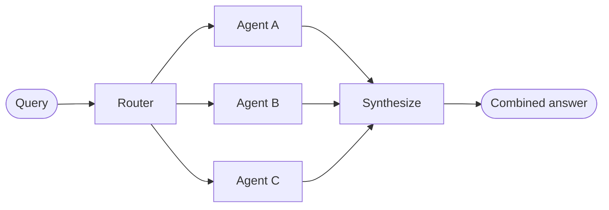

In the **router** architecture, a routing step classifies user input and directs it to specialized [agents](/oss/langchain/agents). This pattern works well when you have distinct **verticals**—separate knowledge domains that each require their own agent.

**Example:** A customer service bot with separate agents for terms & agreements, betting history, and account settings. User asks "What are the withdrawal terms?" → classifier selects the terms agent → that agent responds directly. Next question might land on a different agent.

## Two variations

The router pattern has two common implementations:

| Variation | Flow | Best for |
|-----------|------|----------|
| **Classifier (pass-through)** | Classify → single agent → agent responds directly to user | Single-intent questions, one at a time. Mimics a human conversation: user asks, specialist answers. Example: terms agent, betting history agent. |
| **Synthesis (fan-out)** | Classify → one or more agents in parallel → synthesize combined response | Queries that span multiple sources. Example: "Search GitHub, Notion, and Slack for X" → combine results. |

<Note>
**Classifier vs. Handoffs:** The classifier variation routes based on *user intent* (e.g., "this question is about terms"). [Handoffs](/oss/langchain/multi-agent/handoffs) routes based on *conversation state* (e.g., "we've collected warranty status, now move to resolution"). Classifier: "which agent handles this question?" Handoffs: "which step are we in this workflow?"
</Note>

### Simplified flow: classifier (pass-through)

```
User: "What are the withdrawal terms?"     →  Classifier  →  Terms Agent  →  User gets answer
User: "Show my betting history"           →  Classifier  →  Betting Agent →  User gets answer
```

### Synthesis (fan-out)



## Key characteristics

* Router classifies each request (LLM or rule-based)
* Zero or more specialized agents are invoked (parallel for synthesis)
* **Classifier**: Selected agent responds directly to user. **Synthesis**: Results are combined into a coherent response.

## When to use

Use the **classifier** variation when you have distinct verticals and users typically ask one question at a time—each question lands on one agent, which responds directly. Use the **synthesis** variation when queries span multiple domains and you need to combine answers (e.g., multi-source search).

## Basic implementation

The router classifies the query and directs it to the appropriate agent(s). Use [`Command`](/oss/langgraph/graph-api#command) for single-agent routing or [`Send`](/oss/langgraph/graph-api#send) for parallel fan-out to multiple agents.

<Tabs>
<Tab title="Single agent">

Use `Command` to route to a single specialized agent:

:::python
```python
from langgraph.types import Command

def classify_query(query: str) -> str:
    """Use LLM to classify query and determine the appropriate agent."""
    # Classification logic here
    ...

def route_query(state: State) -> Command:
    """Route to the appropriate agent based on query classification."""
    active_agent = classify_query(state["query"])

    # Route to the selected agent
    return Command(goto=active_agent)
```
:::
:::js
```typescript
import { z } from "zod";
import { Command } from "@langchain/langgraph";

const ClassificationResult = z.object({
  query: z.string(),
  agent: z.string(),
});

function classifyQuery(query: string): z.infer<typeof ClassificationResult> {
  // Use LLM to classify query and determine the appropriate agent
  // Classification logic here
  ...
}

function routeQuery(state: z.infer<typeof ClassificationResult>) {
  const classification = classifyQuery(state.query);

  // Route to the selected agent
  return new Command({ goto: classification.agent });
}
```
:::

</Tab>
<Tab title="Multiple agents (parallel)">

Use `Send` to fan out to multiple specialized agents in parallel:

:::python
```python
from typing import TypedDict
from langgraph.types import Send

class ClassificationResult(TypedDict):
    query: str
    agent: str

def classify_query(query: str) -> list[ClassificationResult]:
    """Use LLM to classify query and determine which agents to invoke."""
    # Classification logic here
    ...

def route_query(state: State):
    """Route to relevant agents based on query classification."""
    classifications = classify_query(state["query"])

    # Fan out to selected agents in parallel
    return [
        Send(c["agent"], {"query": c["query"]})
        for c in classifications
    ]
```
:::
:::js
```typescript
import { z } from "zod";
import { Command } from "@langchain/langgraph";

const ClassificationResult = z.object({
  query: z.string(),
  agent: z.string(),
});

function classifyQuery(query: string): z.infer<typeof ClassificationResult>[] {
  // Use LLM to classify query and determine the appropriate agent
  // Classification logic here
  ...
}

function routeQuery(state: typeof State.State) {
  const classifications = classifyQuery(state.query);

  // Fan out to selected agents in parallel
  return classifications.map(
    (c) => new Send(c.agent, { query: c.query })
  );
}
```
:::

</Tab>
</Tabs>

For a complete implementation, see the tutorial below.

<Card title="Tutorial: Build a multi-source knowledge base with routing" icon="book" href="/oss/langchain/multi-agent/router-knowledge-base">
Build a router that queries GitHub, Notion, and Slack in parallel, then synthesizes results into a coherent answer. Covers state definition, specialized agents, parallel execution with `Send`, and result synthesis.
</Card>

## Stateless vs. stateful

Two approaches:
* [**Stateless routers**](#stateless) address each request independently
* [**Stateful routers**](#stateful) maintain conversation history across requests

## Stateless

Each request is routed independently—no memory between calls. For multi-turn conversations, see [Stateful routers](#stateful).

<Tip>
**Router vs. Subagents**: Both patterns can dispatch work to multiple agents, but they differ in how routing decisions are made:

- **Router**: A dedicated routing step (often a single LLM call or rule-based logic) that classifies the input and dispatches to agents. The router itself typically doesn't maintain conversation history or perform multi-turn orchestration—it's a preprocessing step.
- **Subagents**: A main supervisor agent dynamically decides which [subagents](/oss/langchain/multi-agent/subagents) to call as part of an ongoing conversation. The main agent maintains context, can call multiple subagents across turns, and orchestrates complex multi-step workflows.

Use a **stateless router** when you have clear input categories, need custom routing or preprocessing (e.g., support ticket triage, document classification, parsing and validation before dispatch), or want deterministic/rule-based classification. Use a **supervisor** (subagents) when you need flexible, conversation-aware orchestration where the LLM decides what to do next based on evolving context.
</Tip>

<Note>
**Stateful router vs. Subagents**: When you wrap a router as a tool inside a conversational agent (see [Tool wrapper](#tool-wrapper)), you're effectively using the subagents pattern—the conversational agent is the supervisor, and the "router" becomes a specialized tool. If you need multi-turn context and conversation-aware routing, the [subagents pattern](/oss/langchain/multi-agent/subagents) often provides clearer semantics than trying to make a router stateful.
</Note>


## Stateful

For multi-turn conversations, you need to maintain context across invocations.

### Tool wrapper

The simplest approach: wrap the stateless router as a tool that a conversational agent can call. The conversational agent handles memory and context; the router stays stateless. This avoids the complexity of managing conversation history across multiple parallel agents.

:::python
```python
@tool
def search_docs(query: str) -> str:
    """Search across multiple documentation sources."""
    result = workflow.invoke({"query": query})  # [!code highlight]
    return result["final_answer"]

# Conversational agent uses the router as a tool
conversational_agent = create_agent(
    model,
    tools=[search_docs],
    prompt="You are a helpful assistant. Use search_docs to answer questions."
)
```
:::
:::js
```typescript
const searchDocs = tool(
  async ({ query }) => {
    const result = await workflow.invoke({ query }); // [!code highlight]
    return result.finalAnswer;
  },
  {
    name: "search_docs",
    description: "Search across multiple documentation sources",
    schema: z.object({
      query: z.string().describe("The search query"),
    }),
  }
);

// Conversational agent uses the router as a tool
const conversationalAgent = createAgent({
  model,
  tools: [searchDocs],
  systemPrompt: "You are a helpful assistant. Use search_docs to answer questions.",
});
```
:::

### Full persistence

If you need the router itself to maintain state, use [persistence](/oss/langchain/short-term-memory) to store message history. When routing to an agent, fetch previous messages from state and selectively include them in the agent's context—this is a lever for [context engineering](/oss/langchain/context-engineering).

<Warning>
**Stateful routers require custom history management.** If the router switches between agents across turns: (1) conversations may not feel fluid when agents have different tones or prompts; (2) cycling between agents with different system prompts breaks prompt caches—each switch invalidates cached prompt prefixes, increasing latency and cost. With parallel invocation, you'll need to maintain history at the router level (inputs and synthesized outputs) and leverage this history in routing logic. Consider the [handoffs pattern](/oss/langchain/multi-agent/handoffs) or [subagents pattern](/oss/langchain/multi-agent/subagents) instead—both provide clearer semantics for multi-turn conversations.
</Warning>
