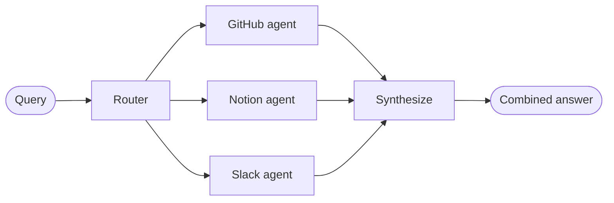

In the **router** architecture, a routing step classifies input and directs it to specialized agents. This is useful when you have distinct **verticals**—separate knowledge domains that each require their own agent.


## Key characteristics

* Router decomposes the query
* Zero or more specialized agents are invoked in parallel
* Results are synthesized into a coherent response

## When to use

Use the router pattern when you have distinct verticals (separate knowledge domains that each require their own agent), need to query multiple sources in parallel, and want to synthesize results into a combined response.

---

Two approaches:
* [**Stateless routers**](#stateless) address each request independently
* [**Stateful routers**](#stateful) maintain conversation history across requests

## Stateless

Each request is routed independently—no memory between calls. For multi-turn conversations, see [Stateful routers](#stateful).

<Tip>
**Stateless router vs. Subagents**: The [subagents pattern](/oss/langchain/multi-agent/subagents) can also route to multiple agents. Use the stateless router when you need specialized preprocessing or custom routing logic. Use the subagents pattern when you want the LLM to decide which agents to call dynamically.
</Tip>

<Accordion title="Building a multi-source knowledge base router">

Your organization's knowledge lives in multiple places: GitHub repositories, Notion wikis, and Slack conversations. These are three distinct verticals, each requiring specialized tools and context. When users ask questions like "How do I authenticate API requests?", the answer may require information from multiple sources. This example builds a router that decomposes queries, identifies which verticals to consult, queries them in parallel, and synthesizes results.



:::python
```python
from typing import TypedDict
from langgraph.graph import StateGraph, START, END, Send
from langchain.agents import create_agent
from langchain_openai import ChatOpenAI

class RouterState(TypedDict):
    query: str
    routes: list[str]  # Which knowledge bases to query
    github_result: str | None
    notion_result: str | None
    slack_result: str | None
    final_answer: str

# Specialized agents for each vertical
github_agent = create_agent(
    model="openai:gpt-4o",
    tools=[search_code, search_issues, search_prs],
    prompt="You are a GitHub expert. Answer questions about code, API references, and implementation details.",
    name="github_agent"
)

notion_agent = create_agent(
    model="openai:gpt-4o",
    tools=[search_notion, get_page],
    prompt="You are a Notion expert. Answer questions about internal processes, policies, and team documentation.",
    name="notion_agent"
)

slack_agent = create_agent(
    model="openai:gpt-4o",
    tools=[search_slack, get_thread],
    prompt="You are a Slack expert. Answer questions by searching relevant threads and discussions.",
    name="slack_agent"
)

router_llm = ChatOpenAI(model="gpt-4o-mini")

def decompose_query(state: RouterState) -> dict:  # [!code highlight]
    """Decompose query and determine which knowledge bases to consult."""  # [!code highlight]
    response = router_llm.invoke([
        {
            "role": "system",
            "content": "Analyze this query and determine which knowledge bases to consult. Return a JSON list with one or more of: 'github', 'notion', 'slack'."
        },
        {"role": "user", "content": state["query"]}
    ])
    # Parse LLM response to get routes (simplified for example)
    routes = ["github", "notion"]  # In practice, parse from LLM response
    return {"routes": routes}

# Route to multiple agents in parallel  # [!code highlight]
def route_to_agents(state: RouterState) -> list[Send]:  # [!code highlight]
    """Fan out to multiple agents in parallel."""  # [!code highlight]
    return [Send(route, state) for route in state["routes"]]  # [!code highlight]

def query_github(state: RouterState) -> dict:
    result = github_agent.invoke({
        "messages": [{"role": "user", "content": state["query"]}]
    })
    return {"github_result": result["messages"][-1].content}

def query_notion(state: RouterState) -> dict:
    result = notion_agent.invoke({
        "messages": [{"role": "user", "content": state["query"]}]
    })
    return {"notion_result": result["messages"][-1].content}

def query_slack(state: RouterState) -> dict:
    result = slack_agent.invoke({
        "messages": [{"role": "user", "content": state["query"]}]
    })
    return {"slack_result": result["messages"][-1].content}

def synthesize_results(state: RouterState) -> dict:  # [!code highlight]
    """Combine results from multiple agents into a coherent answer."""  # [!code highlight]
    results = []
    if state.get("github_result"):
        results.append(f"GitHub: {state['github_result']}")
    if state.get("notion_result"):
        results.append(f"Notion: {state['notion_result']}")
    if state.get("slack_result"):
        results.append(f"Slack: {state['slack_result']}")

    # Use LLM to synthesize
    synthesis_response = router_llm.invoke([
        {"role": "system", "content": "Synthesize these search results into a coherent answer."},
        {"role": "user", "content": "\n\n".join(results)}
    ])
    return {"final_answer": synthesis_response.content}

# Build workflow with parallel execution
workflow = (
    StateGraph(RouterState)
    .add_node("decompose", decompose_query)
    .add_node("github", query_github)
    .add_node("notion", query_notion)
    .add_node("slack", query_slack)
    .add_node("synthesize", synthesize_results)
    .add_edge(START, "decompose")
    .add_conditional_edges("decompose", route_to_agents, ["github", "notion", "slack"])  # [!code highlight]
    .add_edge("github", "synthesize")
    .add_edge("notion", "synthesize")
    .add_edge("slack", "synthesize")
    .add_edge("synthesize", END)
    .compile()
)

result = workflow.invoke({"query": "How do I authenticate API requests?"})
print(result["final_answer"])
```
:::
:::js
```typescript
import { StateGraph, Annotation, START, END, Send } from "@langchain/langgraph";
import { createAgent } from "langchain";
import { ChatOpenAI } from "@langchain/openai";

const RouterState = Annotation.Root({
  query: Annotation<string>(),
  routes: Annotation<string[]>(),
  githubResult: Annotation<string | null>(),
  notionResult: Annotation<string | null>(),
  slackResult: Annotation<string | null>(),
  finalAnswer: Annotation<string>()
});

// Specialized agents for each vertical
const githubAgent = createAgent({
  model: "openai:gpt-4o",
  tools: [searchCode, searchIssues, searchPrs],
  prompt: "You are a GitHub expert. Answer questions about code, API references, and implementation details.",
  name: "github_agent"
});

const notionAgent = createAgent({
  model: "openai:gpt-4o",
  tools: [searchNotion, getPage],
  prompt: "You are a Notion expert. Answer questions about internal processes, policies, and team documentation.",
  name: "notion_agent"
});

const slackAgent = createAgent({
  model: "openai:gpt-4o",
  tools: [searchSlack, getThread],
  prompt: "You are a Slack expert. Answer questions by searching relevant threads and discussions.",
  name: "slack_agent"
});

const routerLlm = new ChatOpenAI({ model: "gpt-4o-mini" });

async function decomposeQuery(state: typeof RouterState.State) {  // [!code highlight]
  // Decompose query and determine which knowledge bases to consult  // [!code highlight]
  const response = await routerLlm.invoke([
    {
      role: "system",
      content: "Analyze this query and determine which knowledge bases to consult. Return a JSON list with one or more of: 'github', 'notion', 'slack'."
    },
    { role: "user", content: state.query }
  ]);
  // Parse LLM response to get routes (simplified for example)
  const routes = ["github", "notion"];
  return { routes };
}

// Route to multiple agents in parallel  // [!code highlight]
function routeToAgents(state: typeof RouterState.State): Send[] {  // [!code highlight]
  // Fan out to multiple agents in parallel  // [!code highlight]
  return state.routes.map(route => new Send(route, state));  // [!code highlight]
}

async function queryGithub(state: typeof RouterState.State) {
  const result = await githubAgent.invoke({
    messages: [{ role: "user", content: state.query }]
  });
  return { githubResult: result.messages.at(-1)?.content };
}

async function queryNotion(state: typeof RouterState.State) {
  const result = await notionAgent.invoke({
    messages: [{ role: "user", content: state.query }]
  });
  return { notionResult: result.messages.at(-1)?.content };
}

async function querySlack(state: typeof RouterState.State) {
  const result = await slackAgent.invoke({
    messages: [{ role: "user", content: state.query }]
  });
  return { slackResult: result.messages.at(-1)?.content };
}

async function synthesizeResults(state: typeof RouterState.State) {  // [!code highlight]
  // Combine results from multiple agents into a coherent answer  // [!code highlight]
  const results: string[] = [];
  if (state.githubResult) results.push(`GitHub: ${state.githubResult}`);
  if (state.notionResult) results.push(`Notion: ${state.notionResult}`);
  if (state.slackResult) results.push(`Slack: ${state.slackResult}`);

  // Use LLM to synthesize
  const synthesisResponse = await routerLlm.invoke([
    { role: "system", content: "Synthesize these search results into a coherent answer." },
    { role: "user", content: results.join("\n\n") }
  ]);
  return { finalAnswer: synthesisResponse.content };
}

// Build workflow with parallel execution
const workflow = new StateGraph(RouterState)
  .addNode("decompose", decomposeQuery)
  .addNode("github", queryGithub)
  .addNode("notion", queryNotion)
  .addNode("slack", querySlack)
  .addNode("synthesize", synthesizeResults)
  .addEdge(START, "decompose")
  .addConditionalEdges("decompose", routeToAgents, ["github", "notion", "slack"])  // [!code highlight]
  .addEdge("github", "synthesize")
  .addEdge("notion", "synthesize")
  .addEdge("slack", "synthesize")
  .addEdge("synthesize", END)
  .compile();

const result = await workflow.invoke({ query: "How do I authenticate API requests?" });
console.log(result.finalAnswer);
```
:::

</Accordion>


## Stateful

For multi-turn conversations, you need to maintain context across invocations.

### Tool wrapper

The simplest approach: wrap the stateless router as a tool that a conversational agent can call. The conversational agent handles memory and context; the router stays stateless. This avoids the complexity of managing conversation history across multiple parallel agents.

:::python
```python
@tool
def search_docs(query: str) -> str:
    """Search across multiple documentation sources."""
    result = workflow.invoke({"query": query})  # [!code highlight]
    return result["final_answer"]

# Conversational agent uses the router as a tool
conversational_agent = create_agent(
    model,
    tools=[search_docs],
    prompt="You are a helpful assistant. Use search_docs to answer questions."
)
```
:::
:::js
```typescript
const searchDocs = tool(
  async ({ query }) => {
    const result = await workflow.invoke({ query });  // [!code highlight]
    return result.finalAnswer;
  },
  {
    name: "search_docs",
    description: "Search across multiple documentation sources",
    schema: z.object({
      query: z.string().describe("The search query")
    })
  }
);

// Conversational agent uses the router as a tool
const conversationalAgent = createAgent({
  model,
  tools: [searchDocs],
  prompt: "You are a helpful assistant. Use search_docs to answer questions."
});
```
:::

### Full persistence

If you need the router itself to maintain state, use [persistence](/oss/langchain/short-term-memory) to store message history. When routing to an agent, fetch previous messages from state and selectively include them in the agent's context—this is a lever for [context engineering](/oss/langchain/context-engineering).

<Warning>
**Stateful routers require custom history management.** If the router switches between agents across turns, conversations may not feel fluid to end users when agents have different tones or prompts. With parallel invocation, you'll need to maintain history at the router level (inputs and synthesized outputs) and leverage this history in routing logic. Consider the [handoffs pattern](/oss/langchain/multi-agent/handoffs) or [subagents pattern](/oss/langchain/multi-agent/subagents) instead—both provide clearer semantics for multi-turn conversations.
</Warning>
