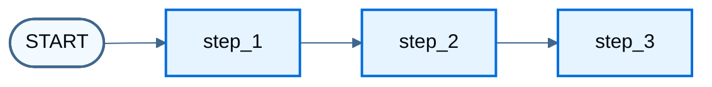
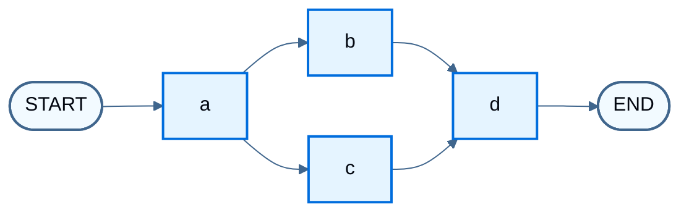
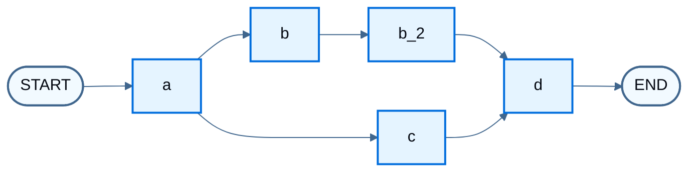
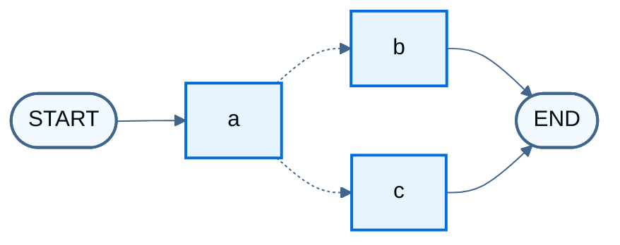
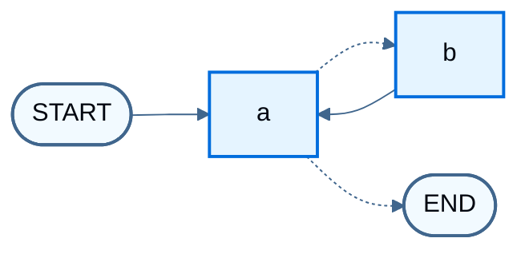
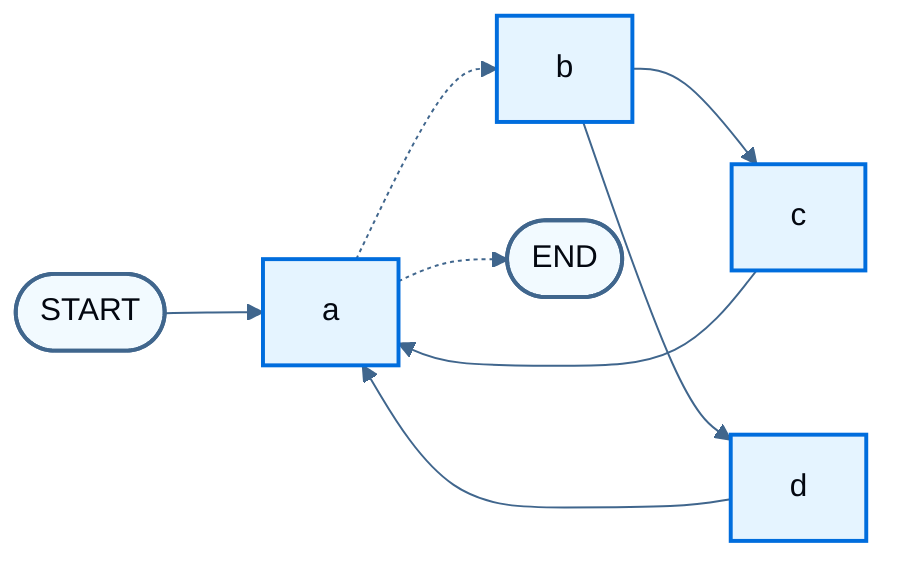

import LanggraphGraphApiControlFlowBranchesConditionalInvokeJs from '/snippets/code-samples/langgraph-graph-api-control-flow-branches-conditional-invoke-js.mdx';
import LanggraphGraphApiControlFlowBranchesConditionalInvokePy from '/snippets/code-samples/langgraph-graph-api-control-flow-branches-conditional-invoke-py.mdx';
import LanggraphGraphApiControlFlowBranchesConditionalJs from '/snippets/code-samples/langgraph-graph-api-control-flow-branches-conditional-js.mdx';
import LanggraphGraphApiControlFlowBranchesConditionalPy from '/snippets/code-samples/langgraph-graph-api-control-flow-branches-conditional-py.mdx';
import LanggraphGraphApiControlFlowBranchesDeferInvokeJs from '/snippets/code-samples/langgraph-graph-api-control-flow-branches-defer-invoke-js.mdx';
import LanggraphGraphApiControlFlowBranchesDeferInvokePy from '/snippets/code-samples/langgraph-graph-api-control-flow-branches-defer-invoke-py.mdx';
import LanggraphGraphApiControlFlowBranchesDeferJs from '/snippets/code-samples/langgraph-graph-api-control-flow-branches-defer-js.mdx';
import LanggraphGraphApiControlFlowBranchesDeferListEdgeJs from '/snippets/code-samples/langgraph-graph-api-control-flow-branches-defer-list-edge-js.mdx';
import LanggraphGraphApiControlFlowBranchesDeferListEdgePy from '/snippets/code-samples/langgraph-graph-api-control-flow-branches-defer-list-edge-py.mdx';
import LanggraphGraphApiControlFlowBranchesDeferPy from '/snippets/code-samples/langgraph-graph-api-control-flow-branches-defer-py.mdx';
import LanggraphGraphApiControlFlowBranchesMultiRouteJs from '/snippets/code-samples/langgraph-graph-api-control-flow-branches-multi-route-js.mdx';
import LanggraphGraphApiControlFlowBranchesMultiRoutePy from '/snippets/code-samples/langgraph-graph-api-control-flow-branches-multi-route-py.mdx';
import LanggraphGraphApiControlFlowBranchesParallelInvokeJs from '/snippets/code-samples/langgraph-graph-api-control-flow-branches-parallel-invoke-js.mdx';
import LanggraphGraphApiControlFlowBranchesParallelInvokePy from '/snippets/code-samples/langgraph-graph-api-control-flow-branches-parallel-invoke-py.mdx';
import LanggraphGraphApiControlFlowBranchesParallelJs from '/snippets/code-samples/langgraph-graph-api-control-flow-branches-parallel-js.mdx';
import LanggraphGraphApiControlFlowBranchesParallelPy from '/snippets/code-samples/langgraph-graph-api-control-flow-branches-parallel-py.mdx';
import LanggraphGraphApiControlFlowLoopsBranchesInvokeJs from '/snippets/code-samples/langgraph-graph-api-control-flow-loops-branches-invoke-js.mdx';
import LanggraphGraphApiControlFlowLoopsBranchesInvokePy from '/snippets/code-samples/langgraph-graph-api-control-flow-loops-branches-invoke-py.mdx';
import LanggraphGraphApiControlFlowLoopsBranchesJs from '/snippets/code-samples/langgraph-graph-api-control-flow-loops-branches-js.mdx';
import LanggraphGraphApiControlFlowLoopsBranchesLimitJs from '/snippets/code-samples/langgraph-graph-api-control-flow-loops-branches-limit-js.mdx';
import LanggraphGraphApiControlFlowLoopsBranchesLimitPy from '/snippets/code-samples/langgraph-graph-api-control-flow-loops-branches-limit-py.mdx';
import LanggraphGraphApiControlFlowLoopsBranchesPy from '/snippets/code-samples/langgraph-graph-api-control-flow-loops-branches-py.mdx';
import LanggraphGraphApiControlFlowLoopsDefineJs from '/snippets/code-samples/langgraph-graph-api-control-flow-loops-define-js.mdx';
import LanggraphGraphApiControlFlowLoopsDefinePy from '/snippets/code-samples/langgraph-graph-api-control-flow-loops-define-py.mdx';
import LanggraphGraphApiControlFlowLoopsImposeLimitJs from '/snippets/code-samples/langgraph-graph-api-control-flow-loops-impose-limit-js.mdx';
import LanggraphGraphApiControlFlowLoopsImposeLimitPy from '/snippets/code-samples/langgraph-graph-api-control-flow-loops-impose-limit-py.mdx';
import LanggraphGraphApiControlFlowLoopsInvokeJs from '/snippets/code-samples/langgraph-graph-api-control-flow-loops-invoke-js.mdx';
import LanggraphGraphApiControlFlowLoopsInvokePy from '/snippets/code-samples/langgraph-graph-api-control-flow-loops-invoke-py.mdx';
import LanggraphGraphApiControlFlowLoopsRecursionLimitJs from '/snippets/code-samples/langgraph-graph-api-control-flow-loops-recursion-limit-js.mdx';
import LanggraphGraphApiControlFlowLoopsRecursionLimitPy from '/snippets/code-samples/langgraph-graph-api-control-flow-loops-recursion-limit-py.mdx';
import LanggraphGraphApiControlFlowLoopsRemainingStepsPy from '/snippets/code-samples/langgraph-graph-api-control-flow-loops-remaining-steps-py.mdx';
import LanggraphGraphApiControlFlowLoopsStepCounterJs from '/snippets/code-samples/langgraph-graph-api-control-flow-loops-step-counter-js.mdx';
import LanggraphGraphApiControlFlowLoopsStepCounterPy from '/snippets/code-samples/langgraph-graph-api-control-flow-loops-step-counter-py.mdx';
import LanggraphGraphApiControlFlowLoopsTerminationJs from '/snippets/code-samples/langgraph-graph-api-control-flow-loops-termination-js.mdx';
import LanggraphGraphApiControlFlowLoopsTerminationPy from '/snippets/code-samples/langgraph-graph-api-control-flow-loops-termination-py.mdx';
import LanggraphGraphApiControlFlowMaxConcurrencyJs from '/snippets/code-samples/langgraph-graph-api-control-flow-max-concurrency-js.mdx';
import LanggraphGraphApiControlFlowSequenceAddSequenceCompilePy from '/snippets/code-samples/langgraph-graph-api-control-flow-sequence-add-sequence-compile-py.mdx';
import LanggraphGraphApiControlFlowSequenceAddSequencePy from '/snippets/code-samples/langgraph-graph-api-control-flow-sequence-add-sequence-py.mdx';
import LanggraphGraphApiControlFlowSequenceBuilderJs from '/snippets/code-samples/langgraph-graph-api-control-flow-sequence-builder-js.mdx';
import LanggraphGraphApiControlFlowSequenceBuilderPy from '/snippets/code-samples/langgraph-graph-api-control-flow-sequence-builder-py.mdx';
import LanggraphGraphApiControlFlowSequenceCompilePy from '/snippets/code-samples/langgraph-graph-api-control-flow-sequence-compile-py.mdx';
import LanggraphGraphApiControlFlowSequenceCustomNameJs from '/snippets/code-samples/langgraph-graph-api-control-flow-sequence-custom-name-js.mdx';
import LanggraphGraphApiControlFlowSequenceCustomNamePy from '/snippets/code-samples/langgraph-graph-api-control-flow-sequence-custom-name-py.mdx';
import LanggraphGraphApiControlFlowSequenceGraphJs from '/snippets/code-samples/langgraph-graph-api-control-flow-sequence-graph-js.mdx';
import LanggraphGraphApiControlFlowSequenceInvokeJs from '/snippets/code-samples/langgraph-graph-api-control-flow-sequence-invoke-js.mdx';
import LanggraphGraphApiControlFlowSequenceInvokePy from '/snippets/code-samples/langgraph-graph-api-control-flow-sequence-invoke-py.mdx';
import LanggraphGraphApiControlFlowSequenceMaxConcurrencyPy from '/snippets/code-samples/langgraph-graph-api-control-flow-sequence-max-concurrency-py.mdx';
import LanggraphGraphApiControlFlowSequenceNodesJs from '/snippets/code-samples/langgraph-graph-api-control-flow-sequence-nodes-js.mdx';
import LanggraphGraphApiControlFlowSequenceNodesPy from '/snippets/code-samples/langgraph-graph-api-control-flow-sequence-nodes-py.mdx';
import LanggraphGraphApiControlFlowSequenceStateJs from '/snippets/code-samples/langgraph-graph-api-control-flow-sequence-state-js.mdx';
import LanggraphGraphApiControlFlowSequenceStatePy from '/snippets/code-samples/langgraph-graph-api-control-flow-sequence-state-py.mdx';

Compose [sequences](#create-a-sequence-of-steps), [parallel branches](#create-branches), [conditional edges](#conditional-branching), and [loops](#create-and-control-loops) with the Graph API. For map-reduce fan-out and returning edges from nodes, see [Use Send and Command](/oss/langgraph/graph-api-send-command). For node-level retries, timeouts, and caching, see [Configure nodes](/oss/langgraph/graph-api-nodes).

## Create a sequence of steps

<Info>
**Prerequisites**
This guide assumes familiarity with [Define and update state](/oss/langgraph/graph-api-state).
</Info>

This section shows how to build a sequential graph. Python also has an `add_sequence` shorthand for the same pattern.



:::python
Add a sequence of nodes with @[`add_node`] and @[`add_edge`] on a [StateGraph](/oss/langgraph/graph-api#stategraph):

<LanggraphGraphApiControlFlowSequenceBuilderPy />

Or use the built-in shorthand `.add_sequence`:

<LanggraphGraphApiControlFlowSequenceAddSequencePy />
:::

:::js
Add a sequence of nodes with `.addNode` and `.addEdge` on a [StateGraph](/oss/langgraph/graph-api#stategraph):

<LanggraphGraphApiControlFlowSequenceBuilderJs />
:::

<Accordion title="Why split application steps into a sequence with LangGraph?">

LangGraph can add a persistence layer under the graph. State is checkpointed between nodes, so those nodes govern:

* How state updates are [checkpointed](/oss/langgraph/persistence)
* How interruptions resume in [human-in-the-loop](/oss/langgraph/interrupts) workflows
* How to rewind and branch executions with [time travel](/oss/langgraph/use-time-travel)

They also shape how steps are [streamed](/oss/langgraph/streaming), and how the app is visualized and debugged in [Studio](/langsmith/studio).

</Accordion>

The following end-to-end example builds a sequence of three steps:

1. Populate a value in a key of the state
2. Update the same value
3. Populate a different value

First define the [state](/oss/langgraph/graph-api#state). For how updates merge, see [Process state updates with reducers](/oss/langgraph/graph-api-state#process-state-updates-with-reducers).

This example tracks two values:

:::python
<LanggraphGraphApiControlFlowSequenceStatePy />
:::

:::js
<LanggraphGraphApiControlFlowSequenceStateJs />
:::

:::python
[Nodes](/oss/langgraph/graph-api#nodes) are Python functions that read graph state and return updates. The first argument is always the state:

<LanggraphGraphApiControlFlowSequenceNodesPy />
:::

:::js
[Nodes](/oss/langgraph/graph-api#nodes) are TypeScript functions that read graph state and return updates. The first argument is always the state:

<LanggraphGraphApiControlFlowSequenceNodesJs />
:::

<Note>
Each node update can name only the keys it changes.

By default, that **overwrites** the previous value for those keys. Use [reducers](/oss/langgraph/graph-api#reducers) when updates should append or combine instead. See [Process state updates with reducers](/oss/langgraph/graph-api-state#process-state-updates-with-reducers).
</Note>

Next, define a [StateGraph](/oss/langgraph/graph-api#stategraph) on that state and wire the nodes.

:::python
Use [`add_node`](/oss/langgraph/graph-api#nodes) and [`add_edge`](/oss/langgraph/graph-api#edges) to populate the graph and define its control flow.

<LanggraphGraphApiControlFlowSequenceBuilderPy />
:::

:::js
Use [addNode](/oss/langgraph/graph-api#nodes) and [addEdge](/oss/langgraph/graph-api#edges) to populate the graph and define its control flow.

<LanggraphGraphApiControlFlowSequenceGraphJs />
:::

:::python
<Tip>
**Specifying custom names**
Pass an explicit name as the first argument to @[`add_node`]:

<LanggraphGraphApiControlFlowSequenceCustomNamePy />
</Tip>
:::

:::js
<Tip>
**Specifying custom names**
Pass the node name as the first argument to `.addNode`:

<LanggraphGraphApiControlFlowSequenceCustomNameJs />
</Tip>
:::

Note that:

:::python
* @[`add_edge`] takes node names. For bare functions, the default name is `node.__name__`.
* The graph needs an entry point: add an edge from the [START node](/oss/langgraph/graph-api#start-node).
* The graph halts when there are no more nodes to execute.

Then [compile](/oss/langgraph/graph-api#compiling-your-graph) the graph. Compile runs basic structure checks (for example, orphaned nodes). Pass a [checkpointer](/oss/langgraph/persistence) here when the app needs persistence.

<LanggraphGraphApiControlFlowSequenceCompilePy />
:::

:::js
* `.addEdge` takes the node names you passed to `.addNode`.
* The graph needs an entry point: add an edge from the [START node](/oss/langgraph/graph-api#start-node).
* The graph halts when there are no more nodes to execute.

Then [compile](/oss/langgraph/graph-api#compiling-your-graph) the graph. Compile runs basic structure checks (for example, orphaned nodes). Pass a [checkpointer](/oss/langgraph/persistence) here when the app needs persistence.
:::

Invoke the graph:

:::python
<LanggraphGraphApiControlFlowSequenceInvokePy />

```
{'value_1': 'a b', 'value_2': 10}
```
:::

:::js
<LanggraphGraphApiControlFlowSequenceInvokeJs />

```
{ value1: 'a b', value2: 10 }
```
:::

Note that:

* This invoke passes a value for one state key. Nodes can also write keys that were not in the input.
* The first node overwrites the value that was passed in.
* The second node updates that value.
* The third node populates a different key.

:::python
<Tip>
**Built-in shorthand**
`langgraph>=0.2.46` includes a built-in short-hand `add_sequence` for adding node sequences. You can compile the same graph as follows:

<LanggraphGraphApiControlFlowSequenceAddSequenceCompilePy />
</Tip>
:::

## Create branches

Parallel node execution speeds up graph runs. LangGraph fans out and fans in with standard edges and @[conditional_edges][add_conditional_edges]. The following examples build branching dataflows. For map-reduce fan-out to dynamic targets, see [Use Send and Command](/oss/langgraph/graph-api-send-command).

### Run graph nodes in parallel

This example fans out from `Node A` to `B` and `C`, then fans in to `D`. The state uses a [reducer](/oss/langgraph/graph-api#reducers) so values accumulate for that key instead of overwriting. For lists, that means concatenating the new list onto the existing list. See [Process state updates with reducers](/oss/langgraph/graph-api-state#process-state-updates-with-reducers).



:::python
<LanggraphGraphApiControlFlowBranchesParallelPy />
:::

:::js
<LanggraphGraphApiControlFlowBranchesParallelJs />
:::

With the reducer, you can see that the values added in each node are accumulated.

:::python
<LanggraphGraphApiControlFlowBranchesParallelInvokePy />

```
Adding "A" to []
Adding "B" to ['A']
Adding "C" to ['A']
Adding "D" to ['A', 'B', 'C']
```
:::

:::js
<LanggraphGraphApiControlFlowBranchesParallelInvokeJs />

```
Adding "A" to []
Adding "B" to ['A']
Adding "C" to ['A']
Adding "D" to ['A', 'B', 'C']
{ aggregate: ['A', 'B', 'C', 'D'] }
```
:::

<Note>
In the above example, nodes `"b"` and `"c"` are executed concurrently in the same [superstep](/oss/langgraph/graph-api#super-steps). Because they are in the same step, node `"d"` executes after both `"b"` and `"c"` are finished.

Importantly, updates from a parallel superstep may not be ordered consistently. If you need a consistent, predetermined ordering of updates from a parallel superstep, you should write the outputs to a separate field in the state together with a value with which to order them.
</Note>

<Accordion title="Exception handling">
  LangGraph runs nodes in [supersteps](/oss/langgraph/graph-api#super-steps). Parallel branches in a superstep run concurrently, but the superstep is **transactional**: if any branch raises, **none** of that superstep's updates apply to state.

  With a [checkpointer](/oss/langgraph/persistence), results from successful nodes in a completed superstep are saved and do not repeat when the run resumes.

  For flaky work such as unreliable API calls, use either:

  :::python
  1. Ordinary `try` / `except` (or equivalent) inside the node.
  2. A **[`RetryPolicy`](https://reference.langchain.com/python/langgraph/types/#langgraph.types.RetryPolicy)** on the node so LangGraph retries selected exceptions. Only failing branches retry, so successful siblings are not re-run.
  :::

  :::js
  1. Ordinary `try` / `catch` (or equivalent) inside the node.
  2. A **[`RetryPolicy`](https://reference.langchain.com/javascript/types/_langchain_langgraph.index.RetryPolicy.html)** on the node so LangGraph retries selected exceptions. Only failing branches retry, so successful siblings are not re-run.
  :::

  Together, these keep parallel execution while you control how failures are handled. For a full guide, see [Fault tolerance](/oss/langgraph/fault-tolerance).
</Accordion>

:::python
<Tip>
**Set max concurrency**
Pass `max_concurrency` as a top-level config key (not under `configurable`) when invoking the graph. See [RunnableConfig](https://reference.langchain.com/python/langchain-core/runnables/config/RunnableConfig).

<LanggraphGraphApiControlFlowSequenceMaxConcurrencyPy />
</Tip>
:::

:::js
<Tip>
**Set max concurrency**
Pass `maxConcurrency` as a top-level config key (not under `configurable`) when invoking the graph. See [LangGraphRunnableConfig](https://reference.langchain.com/javascript/interfaces/_langchain_langgraph.index.LangGraphRunnableConfig.html).

<LanggraphGraphApiControlFlowMaxConcurrencyJs />
</Tip>
:::

### Defer node execution

Deferring node execution delays a node until all other pending tasks are completed. This matters when branches have different lengths, which is common in map-reduce workflows.

The parallel example above fans out and fans in when each path is one step. Add a node `"b_2"` on the `"b"` branch so the paths have unequal length. Node `d` uses `defer` so it waits for the longer branch:



:::python
<LanggraphGraphApiControlFlowBranchesDeferPy />

<LanggraphGraphApiControlFlowBranchesDeferInvokePy />

```
Adding "A" to []
Adding "B" to ['A']
Adding "C" to ['A']
Adding "B_2" to ['A', 'B', 'C']
Adding "D" to ['A', 'B', 'C', 'B_2']
```

Nodes `"b"` and `"c"` run concurrently in the same superstep. `defer=True` on node `d` keeps it from running until all pending tasks finish, so `"d"` waits for the full `"b"` branch.

When every branch always runs, you can wait with a list-form edge instead of `defer=True`. `add_edge` also accepts a list of start nodes. This is not shorthand for separate `add_edge` calls; the two forms behave differently:

<LanggraphGraphApiControlFlowBranchesDeferListEdgePy />

- **A list of start nodes** runs `d` once, after all of the listed nodes have completed. If one of them never runs (for example, a conditional edge does not select its branch), `d` never runs and no error is raised. State updates from branches that did complete remain in the graph state, but `d` does not consume them.
- **Separate edges** run `d` once per superstep in which any incoming branch completes. With branches of equal length, that is a single run; with branches of different lengths, `d` runs more than once.
- **Separate edges with `defer=True`** (the pattern in the example above) run `d` once, after every selected branch has completed, whether the fan-out selected all of the branches or only some of them.

`defer=True` postpones the node until no tasks are pending anywhere in the graph, not only in the branches that feed it. A [`Send`](/oss/langgraph/graph-api-send-command) addressed to the node still invokes it separately.
:::

:::js
<LanggraphGraphApiControlFlowBranchesDeferJs />

<LanggraphGraphApiControlFlowBranchesDeferInvokeJs />

```
Adding "A" to []
Adding "B" to []
Adding "C" to []
Adding "B_2" to [ 'A', 'B', 'C' ]
Adding "D" to [ 'A', 'B', 'C', 'B_2' ]
{ aggregate: [ 'A', 'B', 'C', 'B_2', 'D' ] }
```

Nodes `"b"` and `"c"` run concurrently in the same superstep. `{ defer: true }` on node `"d"` keeps it from running until all pending tasks finish, so `"d"` waits for the full `"b"` branch.

When every branch always runs, you can wait with a list-form edge instead of `{ defer: true }`. `addEdge` also accepts a list of start nodes. This is not shorthand for separate `addEdge` calls; the two forms behave differently:

<LanggraphGraphApiControlFlowBranchesDeferListEdgeJs />

- **A list of start nodes** runs `d` once, after all of the listed nodes have completed. If one of them never runs (for example, a conditional edge does not select its branch), `d` never runs and no error is raised. State updates from branches that did complete remain in the graph state, but `d` does not consume them.
- **Separate edges** run `d` once per superstep in which any incoming branch completes. With branches of equal length, that is a single run; with branches of different lengths, `d` runs more than once.
- **Separate edges with `{ defer: true }`** (the pattern in the example above) run `d` once, after every selected branch has completed, whether the fan-out selected all of the branches or only some of them.

`{ defer: true }` postpones the node until no tasks are pending anywhere in the graph, not only in the branches that feed it. A [`Send`](/oss/langgraph/graph-api-send-command) addressed to the node still invokes it separately.
:::

### Conditional branching

Route to different nodes at runtime from state. Node `a` updates state, then a conditional edge chooses `b` or `c`:



Dashed edges are conditional routes.

:::python
If your fan-out should vary at runtime based on the state, you can use @[`add_conditional_edges`] to select one or more paths using the graph state. See the following example, where node `a` generates a state update that determines the next node.

<LanggraphGraphApiControlFlowBranchesConditionalPy />

<LanggraphGraphApiControlFlowBranchesConditionalInvokePy />

```
Adding "A" to []
Adding "C" to ['A']
{'aggregate': ['A', 'C'], 'which': 'c'}
```
:::

:::js
If your fan-out should vary at runtime based on the state, you can use [`addConditionalEdges`](https://reference.langchain.com/javascript/classes/_langchain_langgraph.index.StateGraph.html#addconditionaledges) to select one or more paths using the graph state. See the following example, where node `a` generates a state update that determines the next node.

<LanggraphGraphApiControlFlowBranchesConditionalJs />

<LanggraphGraphApiControlFlowBranchesConditionalInvokeJs />

```
Adding "A" to []
Adding "C" to ['A']
{ aggregate: ['A', 'C'], which: 'c' }
```
:::

<Tip>
Your conditional edges can route to multiple destination nodes. For example:

:::python
<LanggraphGraphApiControlFlowBranchesMultiRoutePy />
:::

:::js
<LanggraphGraphApiControlFlowBranchesMultiRouteJs />
:::
</Tip>

## Create and control loops

A loop needs a way to stop. The usual pattern is a [conditional edge](/oss/langgraph/graph-api#conditional-edges) that routes to [END](/oss/langgraph/graph-api#end-node) when a termination condition is met.

You can also set a recursion limit when invoking or streaming. The limit is the number of [super-steps](/oss/langgraph/graph-api#super-steps) allowed before LangGraph raises an error. See the [recursion limit concept](/oss/langgraph/graph-api#recursion-limit).

The following examples use a simple looping graph. Node `a` either continues to `b` (which returns to `a`) or exits:



Dashed edges are conditional routes.

<Tip>
To catch `GraphRecursionError` after the limit is hit, see [Impose a recursion limit](#impose-a-recursion-limit). To route to a completion path before the limit, see [Handle recursion with RemainingSteps](#handle-recursion-with-remainingsteps) (Python).
</Tip>

Add a conditional edge that encodes the termination condition:

:::python
<LanggraphGraphApiControlFlowLoopsTerminationPy />
:::

:::js
<LanggraphGraphApiControlFlowLoopsTerminationJs />
:::

:::python
To control the recursion limit, specify `"recursion_limit"` in the config. This will raise a `GraphRecursionError`, which you can catch and handle:
<LanggraphGraphApiControlFlowLoopsRecursionLimitPy />
:::

:::js
To control the recursion limit, specify `"recursionLimit"` in the config. This will raise a `GraphRecursionError`, which you can catch and handle:
<LanggraphGraphApiControlFlowLoopsRecursionLimitJs />
:::

Define a graph with a simple loop. A conditional edge implements the termination condition.

:::python
<LanggraphGraphApiControlFlowLoopsDefinePy />
:::

:::js
<LanggraphGraphApiControlFlowLoopsDefineJs />
:::

This architecture is similar to a [ReAct agent](/oss/langgraph/workflows-agents) in which node `"a"` is a tool-calling model, and node `"b"` represents the tools.

The `route` conditional edge ends the run after the `"aggregate"` list passes a threshold length.

When you invoke the graph, it alternates between nodes `"a"` and `"b"` until that condition is met.

:::python
<LanggraphGraphApiControlFlowLoopsInvokePy />

```
Node A sees []
Node B sees ['A']
Node A sees ['A', 'B']
Node B sees ['A', 'B', 'A']
Node A sees ['A', 'B', 'A', 'B']
Node B sees ['A', 'B', 'A', 'B', 'A']
Node A sees ['A', 'B', 'A', 'B', 'A', 'B']
```
:::

:::js
<LanggraphGraphApiControlFlowLoopsInvokeJs />

```
Node A sees []
Node B sees ['A']
Node A sees ['A', 'B']
Node B sees ['A', 'B', 'A']
Node A sees ['A', 'B', 'A', 'B']
Node B sees ['A', 'B', 'A', 'B', 'A']
Node A sees ['A', 'B', 'A', 'B', 'A', 'B']
{ aggregate: ['A', 'B', 'A', 'B', 'A', 'B', 'A'] }
```
:::

### Impose a recursion limit

When a termination condition is not guaranteed, set the graph's [recursion limit](/oss/langgraph/graph-api#recursion-limit). LangGraph raises `GraphRecursionError` after that many [supersteps](/oss/langgraph/graph-api#super-steps). Catch and handle the exception:

:::python
<LanggraphGraphApiControlFlowLoopsImposeLimitPy />

```
Node A sees []
Node B sees ['A']
Node A sees ['A', 'B']
Node B sees ['A', 'B', 'A']
Node A sees ['A', 'B', 'A', 'B']
Recursion Error
```
:::

:::js
<LanggraphGraphApiControlFlowLoopsImposeLimitJs />

```
Node A sees []
Node B sees ['A']
Node A sees ['A', 'B']
Node B sees ['A', 'B', 'A']
Node A sees ['A', 'B', 'A', 'B']
Recursion Error
```
:::

<Accordion title="Extended example: loops with branches">
A more complex loop fans out one step into two nodes:



Dashed edges are conditional routes from `a`.

:::python
<LanggraphGraphApiControlFlowLoopsBranchesPy />
:::

:::js
<LanggraphGraphApiControlFlowLoopsBranchesJs />
:::

This graph is a loop of [supersteps](/oss/langgraph/graph-api#super-steps): Node A, then B, then C and D concurrent, then back to A. The list-form edge waits for both `"c"` and `"d"` before returning to `"a"`. For how list-form edges differ from separate edges into the same node, see [Defer node execution](#defer-node-execution).

Invoking without a recursion limit completes two full laps before the termination condition:

:::python
<LanggraphGraphApiControlFlowLoopsBranchesInvokePy />
:::

:::js
<LanggraphGraphApiControlFlowLoopsBranchesInvokeJs />
:::

```
Node A sees []
Node B sees ['A']
Node D sees ['A', 'B']
Node C sees ['A', 'B']
Node A sees ['A', 'B', 'C', 'D']
Node B sees ['A', 'B', 'C', 'D', 'A']
Node D sees ['A', 'B', 'C', 'D', 'A', 'B']
Node C sees ['A', 'B', 'C', 'D', 'A', 'B']
Node A sees ['A', 'B', 'C', 'D', 'A', 'B', 'C', 'D']
```

With the recursion limit set to four, only one lap completes because each lap is four supersteps:

:::python
<LanggraphGraphApiControlFlowLoopsBranchesLimitPy />
:::

:::js
<LanggraphGraphApiControlFlowLoopsBranchesLimitJs />
:::

```
Node A sees []
Node B sees ['A']
Node C sees ['A', 'B']
Node D sees ['A', 'B']
Node A sees ['A', 'B', 'C', 'D']
Recursion Error
```
</Accordion>

### Access and handle the recursion counter

Nodes can read the current step from run metadata. Use that to react before the limit is hit.

:::python
<LanggraphGraphApiControlFlowLoopsStepCounterPy />

#### Handle recursion with RemainingSteps

`RemainingSteps` is a Python-only managed value for how many steps remain before the recursion limit. Use it to route to a completion path before LangGraph raises `GraphRecursionError`:

<LanggraphGraphApiControlFlowLoopsRemainingStepsPy />

Handle the limit inside the graph with `RemainingSteps`, or catch `GraphRecursionError` outside the graph:

| Approach | Detection | Handling | Control flow |
| --- | --- | --- | --- |
| Proactive (`RemainingSteps`) | Before the limit | Inside the graph via conditional routing | Graph continues to a completion path |
| Reactive (`GraphRecursionError`) | After the limit | Outside the graph in `try` / `except` | Graph execution stops |

Related metadata keys include `langgraph_node`, `langgraph_triggers`, `langgraph_path`, and `langgraph_checkpoint_ns`.
:::

:::js
<LanggraphGraphApiControlFlowLoopsStepCounterJs />

Related metadata keys include `langgraph_node`, `langgraph_triggers`, `langgraph_path`, and `langgraph_checkpoint_ns`. Prefer explicit termination conditions in the graph. Catching `GraphRecursionError` outside the graph is a safety net. There is no TypeScript equivalent of Python `RemainingSteps`.
:::

## Async

:::python
Async helps when [IO-bound](https://en.wikipedia.org/wiki/I/O_bound) work can run concurrently. To convert a sync graph to async:

1. Define nodes with `async def` instead of `def`.
2. Use `await` for async calls inside those nodes.
3. Invoke with `.ainvoke` or `.astream`.

Many LangChain objects implement the [Runnable Protocol](https://python.langchain.com/docs/expression_language/interface/), which has async variants of the sync methods. See the [streaming guide](/oss/langgraph/streaming) for async streaming examples.
:::

:::js
TypeScript graph nodes and `graph.invoke` / `graph.stream` are already async. Use `await` at the call site; there is no separate `.ainvoke` API.
:::

## See also

- [Graph API overview](/oss/langgraph/graph-api)
- [Use Send and Command](/oss/langgraph/graph-api-send-command)
- [Configure nodes](/oss/langgraph/graph-api-nodes)
- [Visualize your graph](/oss/langgraph/graph-api-visualize)
- [Streaming](/oss/langgraph/streaming)

