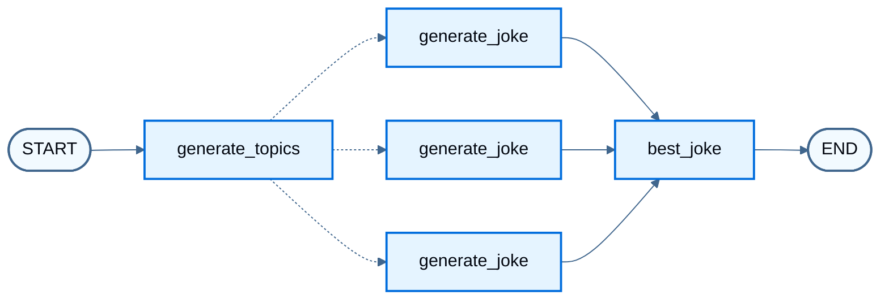
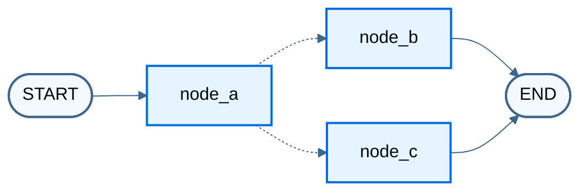
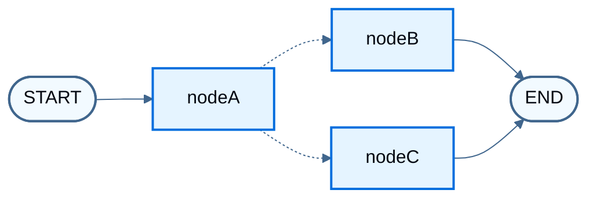

import LanggraphGraphApiSendCommandCommandGraphBuildJs from '/snippets/code-samples/langgraph-graph-api-send-command-command-graph-build-js.mdx';
import LanggraphGraphApiSendCommandCommandGraphBuildPy from '/snippets/code-samples/langgraph-graph-api-send-command-command-graph-build-py.mdx';
import LanggraphGraphApiSendCommandCommandGraphInvokeJs from '/snippets/code-samples/langgraph-graph-api-send-command-command-graph-invoke-js.mdx';
import LanggraphGraphApiSendCommandCommandGraphInvokePy from '/snippets/code-samples/langgraph-graph-api-send-command-command-graph-invoke-py.mdx';
import LanggraphGraphApiSendCommandCommandGraphNodesJs from '/snippets/code-samples/langgraph-graph-api-send-command-command-graph-nodes-js.mdx';
import LanggraphGraphApiSendCommandCommandGraphNodesPy from '/snippets/code-samples/langgraph-graph-api-send-command-command-graph-nodes-py.mdx';
import LanggraphGraphApiSendCommandCommandParentGraphJs from '/snippets/code-samples/langgraph-graph-api-send-command-command-parent-graph-js.mdx';
import LanggraphGraphApiSendCommandCommandParentGraphPy from '/snippets/code-samples/langgraph-graph-api-send-command-command-parent-graph-py.mdx';
import LanggraphGraphApiSendCommandCommandParentInvokeJs from '/snippets/code-samples/langgraph-graph-api-send-command-command-parent-invoke-js.mdx';
import LanggraphGraphApiSendCommandCommandParentInvokePy from '/snippets/code-samples/langgraph-graph-api-send-command-command-parent-invoke-py.mdx';
import LanggraphGraphApiSendCommandCommandParentShapeJs from '/snippets/code-samples/langgraph-graph-api-send-command-command-parent-shape-js.mdx';
import LanggraphGraphApiSendCommandCommandParentShapePy from '/snippets/code-samples/langgraph-graph-api-send-command-command-parent-shape-py.mdx';
import LanggraphGraphApiSendCommandCommandShapeJs from '/snippets/code-samples/langgraph-graph-api-send-command-command-shape-js.mdx';
import LanggraphGraphApiSendCommandCommandShapePy from '/snippets/code-samples/langgraph-graph-api-send-command-command-shape-py.mdx';
import LanggraphGraphApiSendCommandCommandToolJs from '/snippets/code-samples/langgraph-graph-api-send-command-command-tool-js.mdx';
import LanggraphGraphApiSendCommandCommandToolPy from '/snippets/code-samples/langgraph-graph-api-send-command-command-tool-py.mdx';
import LanggraphGraphApiSendCommandSendJs from '/snippets/code-samples/langgraph-graph-api-send-command-send-js.mdx';
import LanggraphGraphApiSendCommandSendPy from '/snippets/code-samples/langgraph-graph-api-send-command-send-py.mdx';
import LanggraphGraphApiSendCommandSendStreamJs from '/snippets/code-samples/langgraph-graph-api-send-command-send-stream-js.mdx';
import LanggraphGraphApiSendCommandSendStreamPy from '/snippets/code-samples/langgraph-graph-api-send-command-send-stream-py.mdx';

@[`Send`] runs the same node once per item with a custom input when the item count is known only at runtime (map-reduce). @[`Command`] updates state and chooses the next node in one return. For ordinary sequences, branches, and loops, see [Control flow](/oss/langgraph/graph-api-control-flow). For concepts, see [Send](/oss/langgraph/graph-api#send) and [Command](/oss/langgraph/graph-api#command) on the Graph API overview.

## Use Send for map-reduce

Return one or more `Send` objects from a [conditional edge](/oss/langgraph/graph-api#conditional-edges). Each `Send` names a target node and passes that invocation's input. LangGraph runs those invocations in parallel. When workers write the same state key, use a [reducer](/oss/langgraph/graph-api#reducers) so updates merge (for example, concatenating lists).

The worker below does not receive the full graph state. `Send` passes `{ "subject": ... }` as that run's input, so the worker schema includes `subject` even though the overall state does not.

:::python

<LanggraphGraphApiSendCommandSendPy />

```python
from IPython.display import Image, display

display(Image(graph.get_graph().draw_mermaid_png()))
```



Dashed edges are `Send` fan-out: one `generate_joke` invocation per subject.

Stream node updates (this example has no chat model, so there are no message tokens to iterate):

<LanggraphGraphApiSendCommandSendStreamPy />

```
{'generate_topics': {'subjects': ['lions', 'elephants', 'penguins']}}
{'generate_joke': {'jokes': ["Why don't lions like fast food? Because they can't catch it!"]}}
{'generate_joke': {'jokes': ["Why don't elephants use computers? They're afraid of the mouse!"]}}
{'generate_joke': {'jokes': ["Why don't penguins like talking to strangers at parties? Because they find it hard to break the ice."]}}
{'best_joke': {'best_selected_joke': 'penguins'}}
```
:::

:::js

<LanggraphGraphApiSendCommandSendJs />

```typescript
import * as fs from "node:fs/promises";

const drawableGraph = await graph.getGraphAsync();
const image = await drawableGraph.drawMermaidPng();
const imageBuffer = new Uint8Array(await image.arrayBuffer());

await fs.writeFile("graph.png", imageBuffer);
```


Dashed edges are `Send` fan-out: one `generate_joke` invocation per subject.

Stream node updates (this example has no chat model, so there are no message tokens to iterate):

<LanggraphGraphApiSendCommandSendStreamJs />

```
{ generateTopics: { subjects: [ 'lions', 'elephants', 'penguins' ] } }
{ generateJoke: { jokes: [ "Why don't lions like fast food? Because they can't catch it!" ] } }
{ generateJoke: { jokes: [ "Why don't elephants use computers? They're afraid of the mouse!" ] } }
{ generateJoke: { jokes: [ "Why don't penguins like talking to strangers at parties? Because they find it hard to break the ice." ] } }
{ bestJoke: { bestSelectedJoke: 'penguins' } }
```
:::

## Combine control flow and state updates with Command

Return a @[Command] from a node when that step must both update state and choose what runs next. For routing alone, prefer [conditional edges](/oss/langgraph/graph-api#conditional-edges).

Shape of a `Command` return (full graph below):

:::python

<LanggraphGraphApiSendCommandCommandShapePy />

:::

:::js

<LanggraphGraphApiSendCommandCommandShapeJs />

:::

The end-to-end example uses three nodes: A, then B or C. Node A updates state and picks the next node with `Command`, so the graph has no conditional edges between A, B, and C.

:::python

<LanggraphGraphApiSendCommandCommandGraphNodesPy />

Build the @[`StateGraph`]. Control flow lives in `node_a`, so there are no [conditional edges](/oss/langgraph/graph-api#conditional-edges) between A, B, and C.

<LanggraphGraphApiSendCommandCommandGraphBuildPy />

<Warning>
Annotate the return type as @[`Command`] with the possible destinations, for example `Command[Literal["node_b", "node_c"]]`. That declaration is required for graph rendering and tells LangGraph that `node_a` can navigate to `node_b` and `node_c`.
</Warning>

```python
from IPython.display import Image, display

display(Image(graph.get_graph().draw_mermaid_png()))
```



Dashed edges are `Command` routes from `node_a`. Repeated invokes take different paths (A → B or A → C) based on the random choice in node A.

<LanggraphGraphApiSendCommandCommandGraphInvokePy />

```
Called A
Called C
```
:::

:::js

<LanggraphGraphApiSendCommandCommandGraphNodesJs />

Build the `StateGraph`. Control flow lives in `nodeA`, so there are no [conditional edges](/oss/langgraph/graph-api#conditional-edges) between A, B, and C.

<LanggraphGraphApiSendCommandCommandGraphBuildJs />

<Warning>
Pass `ends` on `addNode` to list which nodes `nodeA` can navigate to. That declaration is required for graph rendering and tells LangGraph that `nodeA` can navigate to `nodeB` and `nodeC`.
</Warning>

```typescript
import * as fs from "node:fs/promises";

const drawableGraph = await graph.getGraphAsync();
const image = await drawableGraph.drawMermaidPng();
const imageBuffer = new Uint8Array(await image.arrayBuffer());

await fs.writeFile("graph.png", imageBuffer);
```



Dashed edges are `Command` routes from `nodeA`. Repeated invokes take different paths (A → B or A → C) based on the random choice in node A.

<LanggraphGraphApiSendCommandCommandGraphInvokeJs />

```
Called A
Called C
{ foo: 'cc' }
```
:::

### Navigate to a node in a parent graph

From a node inside a [subgraph](/oss/langgraph/use-subgraphs), route to a node in the parent graph with `graph=Command.PARENT`:

:::python

<LanggraphGraphApiSendCommandCommandParentShapePy />

:::

:::js

<LanggraphGraphApiSendCommandCommandParentShapeJs />

:::

The example below turns node A into a single-node subgraph and adds it to a parent graph that still contains B and C.

<Warning>
**State updates with `Command.PARENT`**
When a subgraph node updates a key that exists in both the parent and subgraph [state schemas](/oss/langgraph/graph-api#schema), define a [reducer](/oss/langgraph/graph-api#reducers) for that key on the parent. See the example below.
</Warning>

:::python

<LanggraphGraphApiSendCommandCommandParentGraphPy />

<LanggraphGraphApiSendCommandCommandParentInvokePy />

```
Called A
Called C
```
:::

:::js

<LanggraphGraphApiSendCommandCommandParentGraphJs />

<LanggraphGraphApiSendCommandCommandParentInvokeJs />

```
Called A
Called C
{ foo: 'bc' }
```
:::

### Use inside tools

Return `Command(update=...)` from a tool to write graph state (for example, customer lookup results) during a turn. The fragment below assumes `get_user_info` / `getUserInfo` and a message history key named `messages`. Complete the imports and helpers in your app.

:::python

<LanggraphGraphApiSendCommandCommandToolPy />

:::

:::js

<LanggraphGraphApiSendCommandCommandToolJs />

:::

<Warning>
When returning @[`Command`] from a tool, include `messages` (or whichever state key holds the message history) in `Command.update`, and that list must contain a `ToolMessage`. LLM providers require an AI message with tool calls to be followed by tool result messages.
</Warning>

For tools that return @[`Command`], prefer the prebuilt @[`ToolNode`], which propagates those objects into graph state. In a custom tool-calling node, propagate @[`Command`] returns from tools yourself.

## Resume after an interrupt

Use `Command` as input to `invoke` / `stream` only to resume after an [interrupt](/oss/langgraph/interrupts) (`resume=...`, optionally with `update` while resuming). Do not pass `Command(update=...)` alone to continue a conversation: any `Command` as input resumes from the latest checkpoint, not from `START`. Pass a plain state update to start a new turn.

For the full anti-pattern example, see [Input to invoke or stream](/oss/langgraph/graph-api#input-to-invoke-or-stream). For interrupt patterns, see [Interrupts](/oss/langgraph/interrupts).

## See also

- [Send](/oss/langgraph/graph-api#send) and [Command](/oss/langgraph/graph-api#command) on the Graph API overview
- [Interrupts](/oss/langgraph/interrupts)
- [Control flow](/oss/langgraph/graph-api-control-flow)
- [Use subgraphs](/oss/langgraph/use-subgraphs)
- [Configure nodes](/oss/langgraph/graph-api-nodes)
