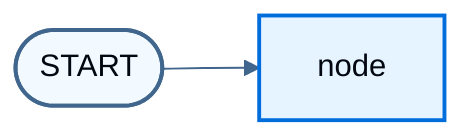

import LanggraphGraphApiMultipleSchemasJs from '/snippets/code-samples/langgraph-graph-api-multiple-schemas-js.mdx';
import LanggraphGraphApiMultipleSchemasPy from '/snippets/code-samples/langgraph-graph-api-multiple-schemas-py.mdx';
import LanggraphGraphApiReducersMergeDoesNotClearJs from '/snippets/code-samples/langgraph-graph-api-reducers-merge-does-not-clear-js.mdx';
import LanggraphGraphApiReducersMergeDoesNotClearPy from '/snippets/code-samples/langgraph-graph-api-reducers-merge-does-not-clear-py.mdx';
import LanggraphGraphApiReducersOverwriteClearJs from '/snippets/code-samples/langgraph-graph-api-reducers-overwrite-clear-js.mdx';
import LanggraphGraphApiReducersOverwriteClearPy from '/snippets/code-samples/langgraph-graph-api-reducers-overwrite-clear-py.mdx';
import LanggraphGraphApiReducersReplaceJs from '/snippets/code-samples/langgraph-graph-api-reducers-replace-js.mdx';
import LanggraphGraphApiStreamPrivateChannelPy from '/snippets/code-samples/langgraph-graph-api-stream-private-channel-py.mdx';
import LanggraphGraphApiStreamPrivateChannelJs from '/snippets/code-samples/langgraph-graph-api-stream-private-channel-js.mdx';
import LanggraphGraphApiStateAddMessagesInvokePy from '/snippets/code-samples/langgraph-graph-api-state-add-messages-invoke-py.mdx';
import LanggraphGraphApiStateAddMessagesPy from '/snippets/code-samples/langgraph-graph-api-state-add-messages-py.mdx';
import LanggraphGraphApiStateAltAnnotationRootJs from '/snippets/code-samples/langgraph-graph-api-state-alt-annotation-root-js.mdx';
import LanggraphGraphApiStateAltChannelsClassesJs from '/snippets/code-samples/langgraph-graph-api-state-alt-channels-classes-js.mdx';
import LanggraphGraphApiStateAltChannelsShorthandJs from '/snippets/code-samples/langgraph-graph-api-state-alt-channels-shorthand-js.mdx';
import LanggraphGraphApiStateAltZodV3Js from '/snippets/code-samples/langgraph-graph-api-state-alt-zod-v3-js.mdx';
import LanggraphGraphApiStateAltZodV4Js from '/snippets/code-samples/langgraph-graph-api-state-alt-zod-v4-js.mdx';
import LanggraphGraphApiStateBuildGraphJs from '/snippets/code-samples/langgraph-graph-api-state-build-graph-js.mdx';
import LanggraphGraphApiStateBuildGraphPy from '/snippets/code-samples/langgraph-graph-api-state-build-graph-py.mdx';
import LanggraphGraphApiStateDefineJs from '/snippets/code-samples/langgraph-graph-api-state-define-js.mdx';
import LanggraphGraphApiStateDefinePy from '/snippets/code-samples/langgraph-graph-api-state-define-py.mdx';
import LanggraphGraphApiStateInputOutputJs from '/snippets/code-samples/langgraph-graph-api-state-input-output-js.mdx';
import LanggraphGraphApiStateInputOutputPy from '/snippets/code-samples/langgraph-graph-api-state-input-output-py.mdx';
import LanggraphGraphApiStateInspectJs from '/snippets/code-samples/langgraph-graph-api-state-inspect-js.mdx';
import LanggraphGraphApiStateInvokeJs from '/snippets/code-samples/langgraph-graph-api-state-invoke-js.mdx';
import LanggraphGraphApiStateInvokePy from '/snippets/code-samples/langgraph-graph-api-state-invoke-py.mdx';
import LanggraphGraphApiStateMessagesStatePy from '/snippets/code-samples/langgraph-graph-api-state-messages-state-py.mdx';
import LanggraphGraphApiStateMessagesValueInvokeJs from '/snippets/code-samples/langgraph-graph-api-state-messages-value-invoke-js.mdx';
import LanggraphGraphApiStateMessagesValueJs from '/snippets/code-samples/langgraph-graph-api-state-messages-value-js.mdx';
import LanggraphGraphApiStateOverwriteJs from '/snippets/code-samples/langgraph-graph-api-state-overwrite-js.mdx';
import LanggraphGraphApiStateOverwriteJsonJs from '/snippets/code-samples/langgraph-graph-api-state-overwrite-json-js.mdx';
import LanggraphGraphApiStateOverwriteJsonPy from '/snippets/code-samples/langgraph-graph-api-state-overwrite-json-py.mdx';
import LanggraphGraphApiStateOverwritePy from '/snippets/code-samples/langgraph-graph-api-state-overwrite-py.mdx';
import LanggraphGraphApiStatePrettyPrintPy from '/snippets/code-samples/langgraph-graph-api-state-pretty-print-py.mdx';
import LanggraphGraphApiStatePrivateStateJs from '/snippets/code-samples/langgraph-graph-api-state-private-state-js.mdx';
import LanggraphGraphApiStatePrivateStatePy from '/snippets/code-samples/langgraph-graph-api-state-private-state-py.mdx';
import LanggraphGraphApiStatePydanticCoercionPy from '/snippets/code-samples/langgraph-graph-api-state-pydantic-coercion-py.mdx';
import LanggraphGraphApiStatePydanticInvalidPy from '/snippets/code-samples/langgraph-graph-api-state-pydantic-invalid-py.mdx';
import LanggraphGraphApiStatePydanticMessagesPy from '/snippets/code-samples/langgraph-graph-api-state-pydantic-messages-py.mdx';
import LanggraphGraphApiStatePydanticPy from '/snippets/code-samples/langgraph-graph-api-state-pydantic-py.mdx';
import LanggraphGraphApiStatePydanticSerializationPy from '/snippets/code-samples/langgraph-graph-api-state-pydantic-serialization-py.mdx';
import LanggraphGraphApiStateReducerDefineJs from '/snippets/code-samples/langgraph-graph-api-state-reducer-define-js.mdx';
import LanggraphGraphApiStateReducerDefinePy from '/snippets/code-samples/langgraph-graph-api-state-reducer-define-py.mdx';
import LanggraphGraphApiStateReducerInvokeJs from '/snippets/code-samples/langgraph-graph-api-state-reducer-invoke-js.mdx';
import LanggraphGraphApiStateReducerInvokePy from '/snippets/code-samples/langgraph-graph-api-state-reducer-invoke-py.mdx';
import LanggraphGraphApiStateReducerNodeJs from '/snippets/code-samples/langgraph-graph-api-state-reducer-node-js.mdx';
import LanggraphGraphApiStateReducerNodePy from '/snippets/code-samples/langgraph-graph-api-state-reducer-node-py.mdx';
import LanggraphGraphApiStateStreamOutputKeysJs from '/snippets/code-samples/langgraph-graph-api-state-stream-output-keys-js.mdx';
import LanggraphGraphApiStateStreamOutputKeysPy from '/snippets/code-samples/langgraph-graph-api-state-stream-output-keys-py.mdx';
import LanggraphGraphApiStateUpdateNodeJs from '/snippets/code-samples/langgraph-graph-api-state-update-node-js.mdx';
import LanggraphGraphApiStateUpdateNodePy from '/snippets/code-samples/langgraph-graph-api-state-update-node-py.mdx';

[State](/oss/langgraph/graph-api#state) is the shared schema that nodes read and write. [Reducers](/oss/langgraph/graph-api#reducers) control how each update merges into the current value. This page covers:

1. How to use state to define a graph's [schema](/oss/langgraph/graph-api#schema)
2. How to use reducers to control how state updates are processed

## Define state

:::python
[State](/oss/langgraph/graph-api#state) in LangGraph can be a `TypedDict`, `Pydantic` model, or dataclass. The examples below use `TypedDict`. Prefer that form for most graphs; see [Use Pydantic models for graph state](#use-pydantic-models-for-graph-state) when you need runtime validation on inputs.
:::

:::js
[State](/oss/langgraph/graph-api#state) in LangGraph is defined with the `StateSchema` class. It accepts [standard schemas](https://standardschema.dev/) (such as [Zod](https://zod.dev/)) for individual fields, plus value types like `ReducedValue`, `MessagesValue`, and `UntrackedValue`. Prefer `StateSchema` over the [legacy alternatives](#alternative-state-definitions).
:::

By default, a graph uses the same schema for input and output, and the state determines that schema. See [Define input and output schemas](#define-input-and-output-schemas) for distinct input and output schemas.

Start with a [messages](/oss/langgraph/graph-api#working-with-messages-in-graph-state) field. That shape fits many LLM applications. For more detail, see [Working with messages in graph state](/oss/langgraph/graph-api#working-with-messages-in-graph-state).

:::python
<LanggraphGraphApiStateDefinePy />

This state tracks a list of [message](/oss/langchain/messages) objects and an extra integer field. There is no reducer yet, so a node that updates `messages` must return the full list.
:::

:::js
<LanggraphGraphApiStateDefineJs />

This state tracks a list of [message](/oss/langchain/messages) objects and an extra integer field. `MessagesValue` includes a built-in reducer, so a node can return only the new messages to append.
:::

## Update state

:::python
Build a graph with a single [node](/oss/langgraph/graph-api#nodes). The node is a Python function that reads graph state and returns updates. The first argument is always the state:

<LanggraphGraphApiStateUpdateNodePy />

This node appends a message by concatenating in the return value (no reducer yet) and sets `extra_field`.
:::

:::js
Build a graph with a single [node](/oss/langgraph/graph-api#nodes). The node is a TypeScript function that reads graph state and returns updates. The first argument is always the state:

<LanggraphGraphApiStateUpdateNodeJs />

This node returns only the new message. The `MessagesValue` reducer appends it to the existing list and sets `extraField`.
:::

<Warning>
Nodes should return updates to the state directly, instead of mutating the state.
</Warning>

:::python
Define a simple graph with this node. Use [`StateGraph`](/oss/langgraph/graph-api#stategraph) for a graph that operates on this state, then [`add_node`](/oss/langgraph/graph-api#nodes) to populate the graph:

<LanggraphGraphApiStateBuildGraphPy />
:::

:::js
Define a simple graph with this node. Use [`StateGraph`](/oss/langgraph/graph-api#stategraph) for a graph that operates on this state, then [`addNode`](/oss/langgraph/graph-api#nodes) to populate the graph:

<LanggraphGraphApiStateBuildGraphJs />
:::

LangGraph provides built-in utilities for visualizing a graph. See [Visualize your graph](/oss/langgraph/graph-api-visualize) for detail.

:::python
```python
from IPython.display import Image, display

display(Image(graph.get_graph().draw_mermaid_png()))
```


:::

:::js
```typescript
import * as fs from "node:fs/promises";

const drawableGraph = await graph.getGraphAsync();
const image = await drawableGraph.drawMermaidPng();
const imageBuffer = new Uint8Array(await image.arrayBuffer());

await fs.writeFile("graph.png", imageBuffer);
```


:::

This graph executes a single node. Invoke it:

:::python
<LanggraphGraphApiStateInvokePy />

```
{'messages': [HumanMessage(content='Hi'), AIMessage(content='Hello!')], 'extra_field': 10}
```
:::

:::js
<LanggraphGraphApiStateInvokeJs />

```
{ messages: [HumanMessage { content: 'Hi' }, AIMessage { content: 'Hello!' }], extraField: 10 }
```
:::

Note that:

* Invocation started by updating a single key of the state.
* The invocation result includes the entire state.

:::python
Inspect [message](/oss/langchain/messages) content with pretty-print:

<LanggraphGraphApiStatePrettyPrintPy />

```
================================ Human Message ================================

Hi
================================== Ai Message ==================================

Hello!
```
:::

:::js
Inspect [message](/oss/langchain/messages) content by logging:

<LanggraphGraphApiStateInspectJs />

```
human: Hi
ai: Hello!
```
:::

## Process state updates with reducers

Each key in the state can have its own [reducer](/oss/langgraph/graph-api#reducers) function, which controls how updates from nodes are applied. If no reducer is specified, updates to that key replace the previous value.

:::python
For `TypedDict` state schemas, define reducers by annotating the field with a reducer function.

In the earlier example, the node updated `"messages"` by returning the full concatenated list. Add a reducer so updates are appended automatically:

<LanggraphGraphApiStateReducerDefinePy />

The node can then return only the new message:

<LanggraphGraphApiStateReducerNodePy />
:::

:::js
The earlier example already used `MessagesValue`, which includes a built-in reducer. For custom fields, use `ReducedValue` to define how updates are applied.

<LanggraphGraphApiStateReducerDefineJs />

The node returns only the new message; the reducer appends it:

<LanggraphGraphApiStateReducerNodeJs />
:::

:::python
<LanggraphGraphApiStateReducerInvokePy />

```
================================ Human Message ================================

Hi
================================== Ai Message ==================================

Hello!
```
:::

:::js
<LanggraphGraphApiStateReducerInvokeJs />

```
human: Hi
ai: Hello!
```
:::

:::python
### MessagesState

In practice, lists of messages need more than plain concatenation:

* Update an existing message in the state by ID.
* Accept shorthand [message formats](/oss/langgraph/graph-api#serialization), such as `{"role": "user", "content": "..."}`.

LangGraph includes a built-in reducer @[`add_messages`] that handles these cases:

<LanggraphGraphApiStateAddMessagesPy />

<LanggraphGraphApiStateAddMessagesInvokePy />

```
================================ Human Message ================================

Hi
================================== Ai Message ==================================

Hello!
```

This shape fits applications that use [chat models](/oss/langchain/models). For convenience, subclass the prebuilt `MessagesState`:

<LanggraphGraphApiStateMessagesStatePy />
:::

:::js
### MessagesValue

In practice, lists of messages need more than plain concatenation:

* Update an existing message in the state by ID.
* Accept shorthand [message formats](/oss/langgraph/graph-api#serialization), such as `{ role: "user", content: "..." }`.

`MessagesValue` is a field helper with a message-aware reducer that handles these cases:

<LanggraphGraphApiStateMessagesValueJs />

<LanggraphGraphApiStateMessagesValueInvokeJs />

```
human: Hi
ai: Hello!
```

This shape fits applications that use [chat models](/oss/langchain/models). Unlike Python's `MessagesState` class, TypeScript has no separate prebuilt state type: put `MessagesValue` on the `messages` field of a `StateSchema`, as in the example above.
:::

## Resetting a reducer field

A common source of confusion with reducers is that with a merging reducer, returning an empty value does not clear the field. The reducer merges the right argument into the left one, so an empty update is merged in and previously accumulated values are kept.

This pattern matters for error buffers or retry counters that must be cleared between retry attempts:

:::python
<LanggraphGraphApiReducersMergeDoesNotClearPy />

To clear the field while keeping a merging reducer, wrap the update with [`Overwrite`](https://reference.langchain.com/python/langgraph/types/):

<LanggraphGraphApiReducersOverwriteClearPy />

For more information, see [Bypass reducers with Overwrite](#bypass-reducers-with-overwrite).
:::

:::js
<LanggraphGraphApiReducersMergeDoesNotClearJs />

To let a node reset (clear) the field, define a custom reducer that replaces the accumulated value instead of merging it:

<LanggraphGraphApiReducersReplaceJs />

Alternatively, wrap the update with `Overwrite` to bypass the reducer for a single update, while keeping the field's normal merging behavior for every other update:

<LanggraphGraphApiReducersOverwriteClearJs />

For more information, see [Bypass reducers with Overwrite](#bypass-reducers-with-overwrite).
:::

## Bypass reducers with `Overwrite`

In some cases, you may want to bypass a reducer and directly overwrite a state value. When a node returns a value wrapped with `Overwrite`, the reducer is bypassed and the channel is set directly to that value.

This is useful when you want to reset or replace accumulated state rather than merge it with existing values.

:::python
LangGraph provides the [`Overwrite`](https://reference.langchain.com/python/langgraph/types/) type for this purpose.

<LanggraphGraphApiStateOverwritePy />

```
['replacement message']
```

You can also use JSON format with the special key `"__overwrite__"`:

<LanggraphGraphApiStateOverwriteJsonPy />

<Warning>
When nodes execute in parallel, only one node can use `Overwrite` on the same state key in a given super-step. If multiple nodes attempt to overwrite the same key in the same super-step, an `InvalidUpdateError` will be raised.
</Warning>
:::

:::js
LangGraph provides the `Overwrite` type for this purpose.

<LanggraphGraphApiStateOverwriteJs />

```
["replacement message"]
```

You can also use JSON format with the special key `"__overwrite__"`:

<LanggraphGraphApiStateOverwriteJsonJs />

<Warning>
When nodes execute in parallel, only one node can use `Overwrite` on the same state key in a given super-step. If multiple nodes attempt to overwrite the same key in the same super-step, an `InvalidUpdateError` is raised.
</Warning>
:::

## Define input and output schemas

By default, `StateGraph` operates with a single schema, and all nodes communicate using that schema. You can also define distinct input and output schemas.

When distinct schemas are specified, an internal schema is still used for communication between nodes. The input schema validates the provided input. The output schema filters the internal data so `invoke` returns only the fields in the output schema.

Define distinct input and output schemas:

:::python
<LanggraphGraphApiStateInputOutputPy />

```
{'answer': 'bye'}
```
:::

:::js
<LanggraphGraphApiStateInputOutputJs />

```
{ answer: 'bye' }
```
:::

Notice that the output of invoke only includes the output schema.

## Pass private state between nodes

Nodes sometimes need intermediate data that should not appear in the graph's main input or output schema. Keep that data private so only the nodes that need it can read it.

The following sequential graph has three nodes. Private data passes between the first two steps. The third step only sees the public overall state.

:::python
<LanggraphGraphApiStatePrivateStatePy />

```
Entered node `node_1`:
    Input: {'a': 'set at start'}.
    Returned: {'private_data': 'set by node_1'}
Entered node `node_2`:
    Input: {'private_data': 'set by node_1'}.
    Returned: {'a': 'set by node_2'}
Entered node `node_3`:
    Input: {'a': 'set by node_2'}.
    Returned: {'a': 'set by node_3'}

Output of graph invocation: {'a': 'set by node_3'}
```
:::

:::js
<LanggraphGraphApiStatePrivateStateJs />

```
Entered node 'node1':
	Input: {"a":"set at start"}.
	Returned: {"privateData":"set by node1"}
Entered node 'node2':
	Input: {"privateData":"set by node1"}.
	Returned: {"a":"set by node2"}
Entered node 'node3':
	Input: {"a":"set by node2"}.
	Returned: {"a":"set by node3"}

Output of graph invocation: {"a":"set by node3"}
```
:::

## Private channels and streaming

Input, output, and private schemas constrain what each node reads and what `invoke` returns. They do **not** hide channels from [streaming](/oss/langgraph/streaming).

Values streaming emits **all** state channels by default, including private ones. That applies to the values projection from [event streaming](/oss/langgraph/event-streaming) (`stream.values` on `stream_events` / `streamEvents` with `version="v3"`), and to `graph.stream` with `stream_mode="values"` / `streamMode: "values"`. Values streaming uses the full state, not the output schema. A private channel can be missing from `invoke` output but visible in the stream.

:::python
This example uses distinct input, output, overall, and private schemas. `invoke` returns only the output schema:

<LanggraphGraphApiMultipleSchemasPy />

Streaming with the values projection still includes the private `bar` channel:

<LanggraphGraphApiStreamPrivateChannelPy />

To restrict streamed values to specific channels (for example, only the output schema), pass `output_keys` to `graph.stream`:

<LanggraphGraphApiStateStreamOutputKeysPy />

If you only need the channels a node produced in each step (not the full accumulated state), use `stream_mode="updates"` instead. See [Streaming](/oss/langgraph/streaming).
:::

:::js
This example uses distinct input, output, overall, and private schemas. `invoke` returns only the output schema:

<LanggraphGraphApiMultipleSchemasJs />

Streaming with the values projection still includes the private `bar` channel:

<LanggraphGraphApiStreamPrivateChannelJs />

To restrict streamed values to specific channels (for example, only the output schema), pass `outputKeys` to `graph.stream`:

<LanggraphGraphApiStateStreamOutputKeysJs />

If you only need the channels a node produced in each step (not the full accumulated state), use `streamMode: "updates"` instead. See [Streaming](/oss/langgraph/streaming).
:::

:::python
## Use pydantic models for graph state

A @[StateGraph] accepts a @[`state_schema`] argument that specifies the shape of the state nodes can access and update.

Most examples on this page use a Python-native `TypedDict` or [`dataclass`](https://docs.python.org/3/library/dataclasses.html) for `state_schema`. @[`state_schema`] can be any [type](https://docs.python.org/3/library/stdtypes.html#type-objects).

Use a [Pydantic BaseModel](https://docs.pydantic.dev/latest/api/base_model/) for @[`state_schema`] when you need runtime validation on **inputs**.

<Note>
**Known Limitations**
* The output of the graph is **not** an instance of a Pydantic model.
* Runtime validation only occurs on inputs to the first node in the graph, not on subsequent nodes or outputs.
* The validation error trace from Pydantic does not show which node the error arises in.
* Pydantic's recursive validation can be slow. For performance-sensitive applications, prefer a `dataclass`.
</Note>

<LanggraphGraphApiStatePydanticPy />

Invoke the graph with an **invalid** input

<LanggraphGraphApiStatePydanticInvalidPy />

```
An exception was raised because `a` is an integer rather than a string.
1 validation error for OverallState
a
  Input should be a valid string [type=string_type, input_value=123, input_type=int]
    For further information visit https://errors.pydantic.dev/2.9/v/string_type
```

See below for additional features of Pydantic model state:

<Accordion title="Serialization Behavior">
  When using Pydantic models as state schemas, serialization matters especially when:

  * Passing Pydantic objects as inputs
  * Receiving outputs from the graph
  * Working with nested Pydantic models

  The following example shows these behaviors:

  <LanggraphGraphApiStatePydanticSerializationPy />
</Accordion>

<Accordion title="Runtime Type Coercion">
  Pydantic performs runtime type coercion for certain data types. That can help, but it can also produce unexpected values if you do not account for it.

  <LanggraphGraphApiStatePydanticCoercionPy />
</Accordion>

<Accordion title="Working with Message Models">
  When working with LangChain message types in a state schema, serialization matters. Use `AnyMessage` (rather than `BaseMessage`) for proper serialization and deserialization when message objects travel over the wire.

  <LanggraphGraphApiStatePydanticMessagesPy />
</Accordion>
:::

:::js
## Alternative state definitions

Prefer `StateSchema` for new graphs. LangGraph also supports the approaches below for legacy code and advanced channel control.

### Channels API

The channels API provides low-level control over state management. LangGraph provides several built-in channel types:

| Channel Type | Behavior | Use Case |
|--------------|----------|----------|
| `LastValue` | Stores the most recent value | Simple fields that get overwritten |
| `BinaryOperatorAggregate` | Combines values using a reducer function | Accumulating values (counters, lists) |
| `Topic` | Collects all values into a sequence | Event streams, audit logs |
| `EphemeralValue` | Value that resets between supersteps | Temporary computation state |

**Using the object shorthand:**

When you pass an object with `reducer` and `default`, it creates a `BinaryOperatorAggregate` channel. Passing `null` creates a `LastValue` channel:

<LanggraphGraphApiStateAltChannelsShorthandJs />

**Using channel classes directly:**

For more control, you can instantiate channel classes from `@langchain/langgraph/channels`:

<LanggraphGraphApiStateAltChannelsClassesJs />

### Annotation.Root

`Annotation.Root` provides a declarative way to define state with reducers. It is similar to `StateSchema` but uses a different syntax:

<LanggraphGraphApiStateAltAnnotationRootJs />

### Zod objects with Zod v3

When using Zod v3, you can define state with plain `z.object()` schemas. LangGraph extends Zod v3 with a `.langgraph` plugin that provides `.reducer()` and `.metadata()` methods:

<LanggraphGraphApiStateAltZodV3Js />

### Zod objects with Zod v4

Zod v4 uses a registry-based approach. Use the LangGraph registry to attach metadata to schema fields:

<LanggraphGraphApiStateAltZodV4Js />

### Comparison table

| Approach | Reducers | Type Safety | Zod Version | Recommended |
|----------|----------|-------------|-------------|-------------|
| `StateSchema` | ✅ Built-in | ✅ Full | v3 or v4 | ✅ Yes |
| Channels API | ✅ Manual | ⚠️ Partial | N/A | For advanced cases |
| `Annotation.Root` | ✅ Built-in | ✅ Full | N/A | Legacy |
| Zod v3 + `.langgraph` | ✅ Via plugin | ✅ Full | v3 only | Legacy |
| Zod v4 + registry | ✅ Via registry | ✅ Full | v4 only | Legacy |
:::

## See also

* [Graph API overview](/oss/langgraph/graph-api#state)
* [Working with messages in graph state](/oss/langgraph/graph-api#working-with-messages-in-graph-state)
* [Event streaming](/oss/langgraph/event-streaming)
* [Streaming](/oss/langgraph/streaming)
* [Use the Graph API](/oss/langgraph/use-graph-api)

