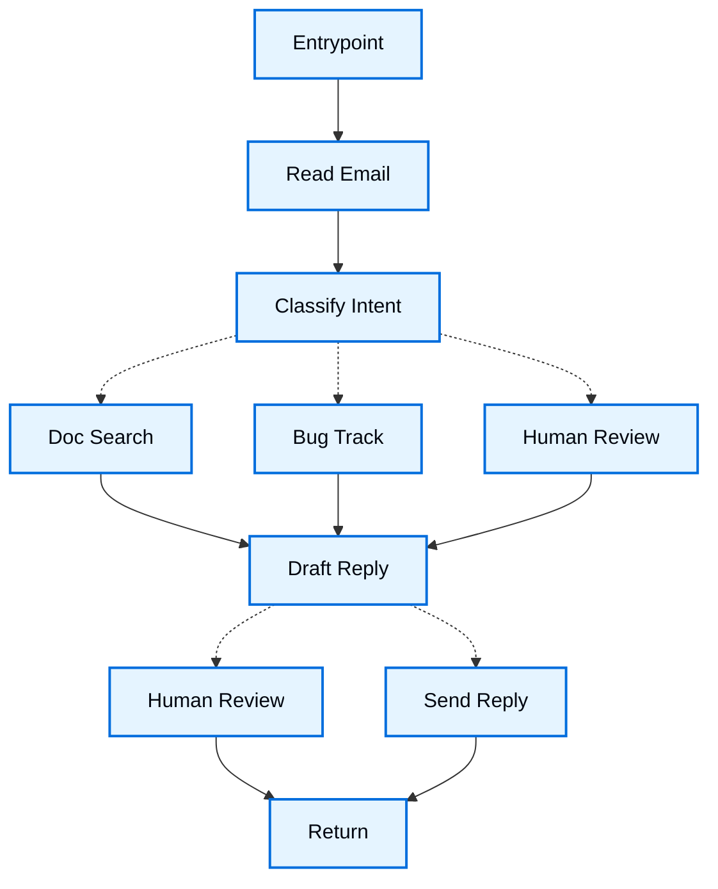

When you build an agent with the [Functional API](/oss/langgraph/functional-api), you break the process into discrete units of work called **tasks**. You compose those tasks inside an **entrypoint** using ordinary language control flow (`if`/`else`, loops, and function calls). Values pass between tasks as return values, not through a shared graph state schema.

This walkthrough builds a customer support email agent with the Functional API. For the same scenario with the Graph API, see [Thinking in the Graph API](/oss/langgraph/thinking-in-graph-api). To choose between the APIs, see [Choosing between Graph and Functional APIs](/oss/langgraph/choosing-apis).

## Start with the process you want to automate

Imagine that you need to build an AI agent that handles customer support emails. Your product team has given you these requirements:

```txt
The agent should:

- Read incoming customer emails
- Classify them by urgency and topic
- Search relevant documentation to answer questions
- Draft appropriate responses
- Escalate complex issues to human agents
- Schedule follow-ups when needed

Example scenarios to handle:

1. Simple product question: "How do I reset my password?"
2. Bug report: "The export feature crashes when I select PDF format"
3. Urgent billing issue: "I was charged twice for my subscription!"
4. Feature request: "Can you add dark mode to the mobile app?"
5. Complex technical issue: "Our API integration fails intermittently with 504 errors"
```

To implement an agent with the Functional API, you usually follow the same five steps.

## Step 1: Map out your workflow as discrete steps

Start by identifying the distinct steps in your process. Each step becomes a **task** (a function that does one specific thing). Then sketch how the entrypoint calls those tasks and branches.



In the Functional API, that diagram is a planning tool. The real control flow lives in the entrypoint as `if`/`else` and sequential calls. The Graph API would encode the same paths as nodes and edges.

Now that the components are identified, clarify what each step needs to do:

- `Read Email`: Extract and parse the email content
- `Classify Intent`: Use an LLM to categorize urgency and topic
- `Doc Search`: Query your knowledge base for relevant information
- `Bug Track`: Create or update an issue in a tracking system
- `Draft Reply`: Generate an appropriate response
- `Human Review`: Escalate to a human agent for approval or handling
- `Send Reply`: Dispatch the email response

<Tip>
Some steps always run in sequence (`Read Email` then `Classify Intent`). Others are conditional (`Doc Search` only for questions, `Bug Track` only for bugs). Encode those branches with ordinary control flow in the entrypoint.
</Tip>

## Step 2: Identify what each step needs to do

For each task, determine what type of operation it represents and what inputs it needs.

<CardGroup cols={2}>
    <Card title="LLM steps" icon="brain" href="#llm-steps">
        Use when you need to understand, analyze, generate text, or make reasoning decisions
    </Card>
    <Card title="Data steps" icon="database" href="#data-steps">
        Use when you need to retrieve information from external sources
    </Card>
    <Card title="Action steps" icon="bolt" href="#action-steps">
        Use when you need to perform external actions
    </Card>
    <Card title="User input steps" icon="user" href="#user-input-steps">
        Use when you need human intervention
    </Card>
</CardGroup>

### LLM steps

When a step needs to understand, analyze, generate text, or make reasoning decisions:

<AccordionGroup>
    <Accordion title="Classify intent">
        - Static context (prompt): Classification categories, urgency definitions, response format
        - Dynamic context (arguments): Email content, sender information
        - Desired outcome: Structured classification that drives later branches
    </Accordion>

    <Accordion title="Draft reply">
        - Static context (prompt): Tone guidelines, company policies, response templates
        - Dynamic context (arguments): Classification results, search results, customer history
        - Desired outcome: Professional email response ready for review
    </Accordion>
</AccordionGroup>

### Data steps

When a step needs to retrieve information from external sources:

<AccordionGroup>
    <Accordion title="Document search">
        - Parameters: Query built from intent and topic
        - Retry strategy: Yes, with exponential backoff for transient failures
        - Caching: Could cache common queries to reduce API calls
    </Accordion>

    <Accordion title="Customer history lookup">
        - Parameters: Customer email or ID
        - Retry strategy: Yes, but with fallback to basic info if unavailable
        - Caching: Yes, with time-to-live to balance freshness and performance
    </Accordion>
</AccordionGroup>

### Action steps

When a step needs to perform an external action:

<AccordionGroup>
    <Accordion title="Send reply">
        - When to execute: After approval (human or automated)
        - Retry strategy: Yes, with exponential backoff for network issues
        - Should not cache: Each send is a unique action
    </Accordion>

    <Accordion title="Bug track">
        - When to execute: Always when intent is "bug"
        - Retry strategy: Yes, critical to not lose bug reports
        - Returns: Ticket ID to include in the response
    </Accordion>
</AccordionGroup>

### User input steps

When a step needs human intervention:

<AccordionGroup>
    <Accordion title="Human review">
        - Context for decision: Original email, draft response, urgency, classification
        - Expected input format: Approval boolean plus optional edited response
        - When triggered: High urgency, complex issues, or quality concerns
    </Accordion>
</AccordionGroup>

## Step 3: Decide what data to pass between tasks

In the Functional API, there is no shared graph state schema. Each task takes arguments and returns a value. The entrypoint holds intermediate results in local variables and passes them to the next task.

Ask yourself these questions about each piece of data:

<CardGroup cols={2}>
    <Card title="Pass as an argument or return value" icon="check">
        Does a later task need this value? If yes, return it from the producing task and pass it forward.
    </Card>

    <Card title="Keep local to one task" icon="code">
        Is it only used to format a prompt or call inside one task? If yes, keep it inside that task.
    </Card>
</CardGroup>

For the email agent, the entrypoint needs to carry:

- The original email and sender info (inputs to the workflow)
- Classification results (needed by later branches and the draft step)
- Search results and customer data (expensive to re-fetch)
- The draft response (needed through review and send)

<Tip>
Store and pass raw data, not formatted prompt text. Format prompts inside the task that calls the model. That keeps tasks reusable and makes checkpoints easier to inspect.
</Tip>

:::python
```python
from typing import Literal, TypedDict


class EmailClassification(TypedDict):
    intent: Literal["question", "bug", "billing", "feature", "complex"]
    urgency: Literal["low", "medium", "high", "critical"]
    topic: str
    summary: str


class EmailInput(TypedDict):
    email_content: str
    sender_email: str
    email_id: str
```
:::

:::js
```typescript
type EmailClassification = {
  intent: "question" | "bug" | "billing" | "feature" | "complex";
  urgency: "low" | "medium" | "high" | "critical";
  topic: string;
  summary: string;
};

type EmailInput = {
  emailContent: string;
  senderEmail: string;
  emailId: string;
};
```
:::

These types document the values tasks exchange. They are ordinary TypedDicts or TypeScript types, not a Graph API state schema.

## Step 4: Build your tasks

Implement each step as a task. Tasks checkpoint independently, can retry on failure, and return values the entrypoint can await.

:::python
A @[`@task`] is a Python function that does one unit of work and returns a result. Call it from an entrypoint and resolve it with `.result()` (or `await` in an async entrypoint).
:::

:::js
A @[`task`] is a function that does one unit of work and returns a result. Call it from an entrypoint; the call returns a promise you can `await`.
:::

### Handle errors appropriately

Different errors need different handling strategies:

| Error type | Who fixes it | Strategy | When to use |
|------------|--------------|----------|-------------|
| Transient errors (network issues, rate limits) | System (automatic) | Retry policy on the task | Temporary failures that usually resolve on retry |
| LLM-recoverable errors (tool failures, parsing issues) | LLM | Return the error and branch or retry in the entrypoint | The model can adjust with more context |
| User-fixable errors (missing information, unclear instructions) | Human | Pause with `interrupt()` | Need user input to proceed |
| Unexpected errors | Developer | Fail the run | Bugs that need a code fix |

### Implementing the email agent tasks

:::python
```python
from langgraph.func import task
from langgraph.types import RetryPolicy


@task
def read_email(email_content: str, sender_email: str) -> dict:
    """Parse and normalize the incoming email."""
    return {
        "email_content": email_content,
        "sender_email": sender_email,
    }


@task
def classify_intent(email_content: str, sender_email: str) -> EmailClassification:
    """Classify intent and urgency with an LLM."""
    # Call your LLM and return structured output
    return {
        "intent": "question",
        "urgency": "low",
        "topic": "password reset",
        "summary": "Customer asks how to reset password",
    }


@task(retry_policy=RetryPolicy(max_attempts=3))
def search_documentation(topic: str, summary: str) -> list[str]:
    """Query the knowledge base for relevant chunks."""
    return [f"Docs related to {topic}"]


@task(retry_policy=RetryPolicy(max_attempts=3))
def create_bug_ticket(
    email_content: str, sender_email: str, summary: str
) -> str:
    """Create a ticket and return its ID."""
    return "TICKET-123"


@task
def draft_response(
    email_content: str,
    classification: EmailClassification,
    context: list[str],
) -> str:
    """Draft a reply from the email, classification, and gathered context."""
    return f"Thanks for your email about {classification['topic']}."


@task
def send_reply(draft: str, sender_email: str) -> None:
    """Send the approved reply."""
    return None
```
:::

:::js
```typescript
import { task } from "@langchain/langgraph";
import type { RetryPolicy } from "@langchain/langgraph";

const retryPolicy: RetryPolicy = { maxAttempts: 3 };

const readEmail = task("readEmail", async (emailContent: string, senderEmail: string) => {
  return { emailContent, senderEmail };
});

const classifyIntent = task(
  "classifyIntent",
  async (emailContent: string, senderEmail: string): Promise<EmailClassification> => {
    // Call your LLM and return structured output
    return {
      intent: "question",
      urgency: "low",
      topic: "password reset",
      summary: "Customer asks how to reset password",
    };
  }
);

const searchDocumentation = task(
  "searchDocumentation",
  async (topic: string, summary: string): Promise<string[]> => {
    return [`Docs related to ${topic}`];
  },
  { retry: retryPolicy }
);

const createBugTicket = task(
  "createBugTicket",
  async (emailContent: string, senderEmail: string, summary: string): Promise<string> => {
    return "TICKET-123";
  },
  { retry: retryPolicy }
);

const draftResponse = task(
  "draftResponse",
  async (
    emailContent: string,
    classification: EmailClassification,
    context: string[]
  ): Promise<string> => {
    return `Thanks for your email about ${classification.topic}.`;
  }
);

const sendReply = task(
  "sendReply",
  async (draft: string, senderEmail: string): Promise<void> => {
    return;
  }
);
```
:::

## Step 5: Compose the entrypoint

The entrypoint is the workflow. It calls tasks, branches with ordinary control flow, and pauses for humans with `interrupt()`. Compile it with a [checkpointer](/oss/langgraph/persistence) when you need durable execution and human-in-the-loop.

:::python
```python
from langgraph.checkpoint.memory import InMemorySaver
from langgraph.func import entrypoint
from langgraph.types import interrupt

checkpointer = InMemorySaver()


@entrypoint(checkpointer=checkpointer)
def email_agent(inputs: EmailInput) -> dict:
    parsed = read_email(inputs["email_content"], inputs["sender_email"]).result()
    classification = classify_intent(
        parsed["email_content"], parsed["sender_email"]
    ).result()

    context: list[str] = []
    if classification["intent"] == "question":
        context = search_documentation(
            classification["topic"], classification["summary"]
        ).result()
    elif classification["intent"] == "bug":
        ticket_id = create_bug_ticket(
            parsed["email_content"],
            parsed["sender_email"],
            classification["summary"],
        ).result()
        context = [f"Ticket created: {ticket_id}"]

    draft = draft_response(
        parsed["email_content"], classification, context
    ).result()

    # Pause for human review on urgent or complex issues
    if classification["urgency"] in ("high", "critical") or classification[
        "intent"
    ] == "complex":
        human_decision = interrupt(
            {
                "email_content": parsed["email_content"],
                "draft_response": draft,
                "classification": classification,
            }
        )
        if not human_decision.get("approved"):
            return {"status": "escalated", "draft": draft}
        draft = human_decision.get("edited_response", draft)

    send_reply(draft, parsed["sender_email"]).result()
    return {"status": "sent", "draft": draft, "classification": classification}
```
:::

:::js
```typescript
import {
  MemorySaver,
  entrypoint,
  interrupt,
} from "@langchain/langgraph";

const checkpointer = new MemorySaver();

const emailAgent = entrypoint(
  { checkpointer, name: "emailAgent" },
  async (inputs: EmailInput) => {
    const parsed = await readEmail(inputs.emailContent, inputs.senderEmail);
    const classification = await classifyIntent(
      parsed.emailContent,
      parsed.senderEmail
    );

    let context: string[] = [];
    if (classification.intent === "question") {
      context = await searchDocumentation(
        classification.topic,
        classification.summary
      );
    } else if (classification.intent === "bug") {
      const ticketId = await createBugTicket(
        parsed.emailContent,
        parsed.senderEmail,
        classification.summary
      );
      context = [`Ticket created: ${ticketId}`];
    }

    let draft = await draftResponse(
      parsed.emailContent,
      classification,
      context
    );

    // Pause for human review on urgent or complex issues
    if (
      classification.urgency === "high" ||
      classification.urgency === "critical" ||
      classification.intent === "complex"
    ) {
      const humanDecision = interrupt({
        emailContent: parsed.emailContent,
        draftResponse: draft,
        classification,
      });
      if (!humanDecision?.approved) {
        return { status: "escalated", draft };
      }
      draft = humanDecision.editedResponse ?? draft;
    }

    await sendReply(draft, parsed.senderEmail);
    return { status: "sent", draft, classification };
  }
);
```
:::

### Try out your agent

Run the agent with an urgent billing issue that needs human review:

:::python
```python
from langgraph.types import Command

config = {"configurable": {"thread_id": "customer_123"}}

result = email_agent.invoke(
    {
        "email_content": "I was charged twice for my subscription! This is urgent!",
        "sender_email": "customer@example.com",
        "email_id": "email_123",
    },
    config,
)
# The workflow pauses at interrupt() when urgency is high

# Resume with the human decision
email_agent.invoke(
    Command(
        resume={
            "approved": True,
            "edited_response": "We sincerely apologize for the double charge. I've initiated an immediate refund...",
        }
    ),
    config,
)
```
:::

:::js
```typescript
import { Command } from "@langchain/langgraph";

const config = { configurable: { thread_id: "customer_123" } };

const result = await emailAgent.invoke(
  {
    emailContent: "I was charged twice for my subscription! This is urgent!",
    senderEmail: "customer@example.com",
    emailId: "email_123",
  },
  config
);
// The workflow pauses at interrupt() when urgency is high

// Resume with the human decision
await emailAgent.invoke(
  new Command({
    resume: {
      approved: true,
      editedResponse:
        "We sincerely apologize for the double charge. I've initiated an immediate refund...",
    },
  }),
  config
);
```
:::

The workflow pauses at `interrupt()`, saves completed task results to the checkpointer, and waits. When you resume with `Command(resume=...)`, completed tasks reload from the checkpoint instead of re-running. The `thread_id` keeps this conversation's state together.

## Summary and next steps

### Key insights

Building this email agent shows the Functional API way of thinking:

<CardGroup cols={2}>
    <Card title="Break into discrete tasks" icon="sitemap" href="#step-1-map-out-your-workflow-as-discrete-steps">
        Each task does one thing well. Task boundaries are where results checkpoint, so failures and resumes redo less work.
    </Card>

    <Card title="Pass values, do not share graph state" icon="database" href="#step-3-decide-what-data-to-pass-between-tasks">
        Return raw data from tasks and pass it as arguments. Keep prompt formatting inside the task that needs it.
    </Card>

    <Card title="Entrypoints own control flow" icon="code" href="#step-5-compose-the-entrypoint">
        Use `if`/`else`, loops, and calls. You do not declare edges or conditional edge maps.
    </Card>

    <Card title="Errors are part of the flow" icon="alert-triangle" href="#handle-errors-appropriately">
        Transient failures get task retry policies, user-fixable problems pause with `interrupt()`, and unexpected errors fail the run.
    </Card>

    <Card title="Human input is first-class" icon="user" href="/oss/langgraph/interrupts">
        `interrupt()` pauses execution, saves completed task results, and resumes when you provide input.
    </Card>

    <Card title="Composition stays in code" icon="code" href="#step-5-compose-the-entrypoint">
        The workflow reads like a normal function. That fits existing procedural code and fast iteration.
    </Card>
</CardGroup>

### Task granularity trade-offs

<Accordion title="How small should tasks be?" icon="adjustments">
<Info>
Most applications can use the breakdown above. Read this section when you are deciding whether to merge or split tasks.
</Info>

LangGraph checkpoints at **task** boundaries inside an entrypoint. When a run resumes after an interrupt or failure, completed task results load from the checkpoint. Work that lived in the entrypoint body outside a task may run again.

Why this breakdown fits the email agent:

- **Isolation of external services:** Doc search and bug tracking are separate tasks so retries and failures stay scoped to those API calls.
- **Visibility:** Classification is its own task, so you can inspect the structured result before branching.
- **Different failure modes:** LLM calls, database lookups, and email sends get different retry policies.
- **Testing:** Smaller tasks are easier to unit test and reuse.

Merging `read_email` and `classify_intent` into one task is valid. You lose a checkpoint between them and repeat both on failure. For most agents, the observability benefit of separate tasks is worth it.
</Accordion>

### Where to go from here

This walkthrough introduces Functional API design. Extend it with:

<CardGroup cols={2}>
    <Card title="Build with the Functional API" icon="route" href="/oss/langgraph/use-functional-api">
        Decision guide for workflows, tasks, streaming, interrupts, and memory
    </Card>

    <Card title="Thinking in the Graph API" icon="sitemap" href="/oss/langgraph/thinking-in-graph-api">
        The same email agent with nodes, edges, and shared state
    </Card>

    <Card title="Compose workflows" icon="arrows-shuffle" href="/oss/langgraph/functional-api-workflows">
        Parallel tasks, calling graphs, and nesting entrypoints
    </Card>

    <Card title="Configure tasks" icon="settings" href="/oss/langgraph/functional-api-tasks">
        Retries, timeouts, caching, and resume after errors
    </Card>

    <Card title="Human-in-the-loop" icon="user-check" href="/oss/langgraph/functional-api-human-in-the-loop">
        Interrupt patterns for approval and tool review
    </Card>

    <Card title="Add memory" icon="database" href="/oss/langgraph/functional-api-memory">
        Short-term checkpointers and long-term stores
    </Card>
</CardGroup>
