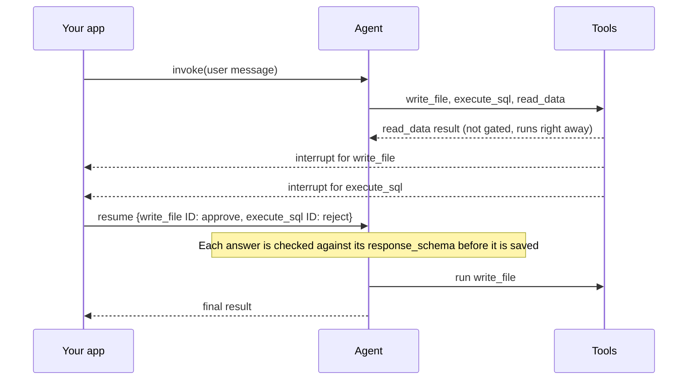

import HitlDecisionTypesTable from '/snippets/oss/hitl-decision-types-table.mdx';

Human-in-the-loop (HITL) pauses an agent before a tool call runs so a person can review it. The reviewer approves the call, edits its arguments, rejects it with feedback, or answers in place of the tool. Use it for actions that are hard to undo or that need sign-off, such as deleting records, sending email, or writing files.

You add review with @[`HumanInTheLoopMiddleware`] in [LangChain](/oss/langchain/human-in-the-loop), or with the `interrupt_on` parameter in [Deep Agents](/oss/deepagents/human-in-the-loop). The middleware pauses in one of two modes:

- **Per-call**: One pause for each tool call that needs review. Use per-call mode for new agents.
- **Batched**: One pause per model turn, covering every tool call in that turn. Batched mode is the current default.

<Note>
Per-call mode requires `langchain>=X.Y.Z`. Deep Agents uses batched mode.
</Note>

## Follow an approval from pause to resume

Every approval follows the same steps in either mode:

1. The model proposes one or more tool calls.
2. The middleware checks each call against your `interrupt_on` policy. Calls that need review pause the agent with an @[interrupt].
3. The [checkpointer](/oss/langgraph/persistence) saves the agent's state, so the run can stop and resume later, even in another process.
4. Your application shows the pending calls to a reviewer and collects a decision for each one.
5. You resume the agent with a `Command(resume=...)`. The middleware applies each decision, and the agent continues.

A decision is one of four types:

<HitlDecisionTypesTable />

The examples on this page use an agent with three tools. `write_file` allows every decision type. `execute_sql` allows only `approve` and `reject`. `read_data` runs without review. In one turn, the model calls all three.

## Review each tool call separately

In per-call mode, each tool call that needs review pauses on its own as it starts:



Each interrupt value describes one call and has `type: "tool_approval"`. The `execute_sql` interrupt looks like this:

```python
{
    "type": "tool_approval",
    "tool_call_id": "call_sql",
    "name": "execute_sql",
    "args": {"query": "DELETE FROM orders WHERE created_at < '2025-01-01'"},
    "description": "Tool execution requires approval\n\nTool: execute_sql\nArgs: {'query': \"DELETE FROM orders WHERE created_at < '2025-01-01'\"}",
}
```

Each interrupt also carries a [`response_schema`](/oss/langgraph/interrupts#define-an-interrupt-response-schema), a JSON schema of the answers that call accepts. For `execute_sql`, the schema allows `approve` and `reject`. For `write_file`, it also allows `respond` and `edit`, and the `edit` branch includes `write_file`'s own argument schema. Clients can render a form from the schema instead of hardcoding the decision types. The [LangChain guide](/oss/langchain/human-in-the-loop#read-the-response-schema) shows the schema for each decision type.

You answer each interrupt with one decision, keyed by the interrupt's ID:

```python
Command(resume={
    write_file_interrupt.id: {"type": "approve"},
    execute_sql_interrupt.id: {"type": "reject", "message": "Archive the rows before deleting them."},
})
```

LangGraph rejects an invalid answer before saving it, so the reviewer can answer again. Interrupts you do not answer stay pending, so a reviewer can answer them one at a time.

## Review a whole turn at once

In batched mode, the middleware pauses once after the model responds, before any tool runs. `read_data` waits for the review too, even though it is not gated. One interrupt lists every gated call in `action_requests`, and each call's allowed decisions in a separate `review_configs` list:

```python
{
    "action_requests": [
        {"name": "write_file", "args": {"path": "orders_archive.csv", "content": "id,total\n1,20\n"}, "description": "..."},
        {"name": "execute_sql", "args": {"query": "DELETE FROM orders WHERE created_at < '2025-01-01'"}, "description": "..."},
    ],
    "review_configs": [
        {"action_name": "write_file", "allowed_decisions": ["approve", "edit", "reject", "respond"]},
        {"action_name": "execute_sql", "allowed_decisions": ["approve", "reject"]},
    ],
}
```

You answer with one list of decisions, in the same order as `action_requests`:

```python
Command(resume={"decisions": [
    {"type": "approve"},
    {"type": "reject", "message": "Archive the rows before deleting them."},
]})
```

The interrupt has no `response_schema`. The middleware checks each decision when it applies it, after the answer is saved.

## Why per-call mode exists

Batched mode matches answers to calls by position and checks them after they are saved. Each row below is a problem that the agent above runs into in batched mode:

| In batched mode | What happens | In per-call mode |
| --- | --- | --- |
| Decisions match calls by position | A reviewer means to approve `write_file` and reject `execute_sql`, but sends `[reject, approve]`. The `DELETE` runs. | Each decision is keyed by its call's interrupt ID. |
| Allowed decisions live in `review_configs` | Clients pair two lists by position and hardcode a button for each decision type. | Each interrupt's `response_schema` lists its decisions and edit arguments. |
| An answer is saved before it is checked | One decision for two calls raises `ValueError: Number of human decisions (1) does not match number of hanging tool calls (2).` The corrected answer then fails with the same error, so the thread stays stuck. | The answer is checked first. Fix it and answer again. |
| Edited arguments are not checked | An edit to `write_file` without `content` still runs the tool, and the model receives an error for a call it never made. | The edit is rejected with `edit.edited_action.args.content Field required`. |

## Choose an interrupt mode

| | Per-call | Batched (default) |
| --- | --- | --- |
| **When it pauses** | As each gated tool call starts | After the model responds, before any tool runs |
| **Interrupts per turn** | One per gated tool call | One for the whole turn |
| **Ungated calls in the turn** | Run right away | Wait for the review |
| **Allowed decisions** | In each interrupt's `response_schema` | In a separate `review_configs` list |
| **Answer** | One decision per interrupt, keyed by interrupt ID | A list of decisions, matched by position |
| **Invalid answers** | Rejected before they are saved | Saved, then fail when applied |
| **Edited arguments** | Checked against the tool's Pydantic argument schema | Not checked before the tool runs |
| **Best for** | New agents, one approval card or message per call, forms built from the schema | Approval UIs that already read `action_requests` |

Use per-call mode for new agents. Keep batched mode while your approval UI reads the batched format, such as one built with the [`useStream` approval pattern](/oss/langchain/frontend/human-in-the-loop). LangChain plans to make per-call mode the default in the next major release.

## Prepare for per-call mode

Per-call mode changes how middleware order and resumes with several answers behave. Before you switch, read [Order middleware for per-call review](/oss/langchain/human-in-the-loop#order-middleware-for-per-call-review) and [Resume each call by ID](/oss/langchain/human-in-the-loop#resume-each-call-by-id).

## Learn more

- [Human-in-the-loop in LangChain](/oss/langchain/human-in-the-loop): configure the middleware and answer each decision type.
- [Human-in-the-loop in Deep Agents](/oss/deepagents/human-in-the-loop): approvals for deep agents and their subagents.
- [Define an interrupt response schema](/oss/langgraph/interrupts#define-an-interrupt-response-schema): how LangGraph checks resume values.
