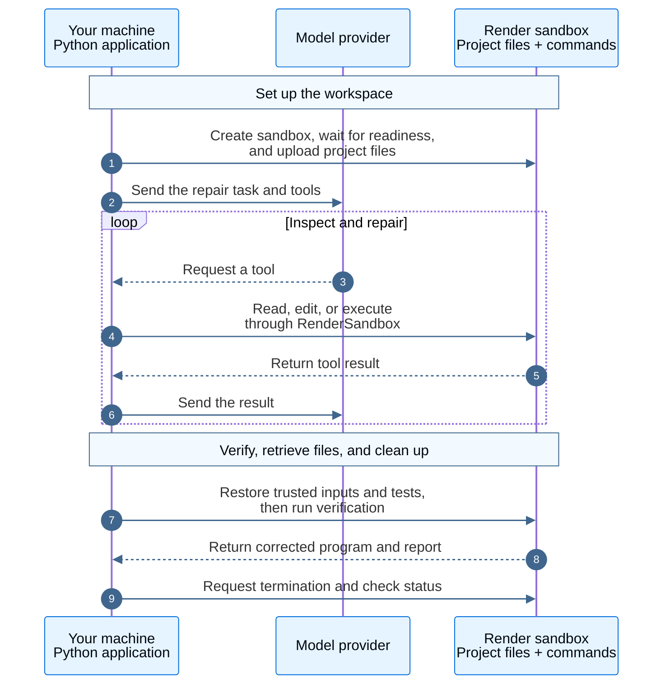

<a href="https://render.com/docs/sandboxes" target="_blank" rel="noopener noreferrer">Render Sandboxes</a> provides temporary Linux environments for running code. Give your coding agent a workspace to edit files, run programs, and test changes separately from your application.

[Deep Agents](/oss/deepagents/overview) provides an agent framework with built-in shell and file tools. The `langchain-render` integration connects those tools to a Render sandbox. Pass its backend to your agent to use those tools without implementing your own Render backend.

In this guide, a Python agent repairs a Python program that skips the last order in a CSV file, returning 32 instead of 42. Your application checks the fix with trusted tests, downloads the corrected program and report, and stops the sandbox.

<Info>
Render Sandboxes is in early access. APIs, defaults, and limits can change. Discuss production workloads with your Render contact. This integration is currently available in Python only.
</Info>

## How it works

Your Python application runs on your machine for this walkthrough. It runs the Deep Agents loop and calls the model provider. The model requests tools; the application's `RenderSandbox` backend translates those requests into Render SDK operations. Commands run and files live in the sandbox.



The Render and model API keys stay in your application. The model receives file contents and command output through tool results. Your application can also run on a server; the connection to the sandbox works the same way.

## Prerequisites

- Python 3.11 or later and <a href="https://docs.astral.sh/uv/getting-started/installation/" target="_blank" rel="noopener noreferrer">uv</a> on your machine. The commands below use Bash or Zsh.
- A Render workspace with <a href="https://render.com/docs/sandboxes#1-confirm-access" target="_blank" rel="noopener noreferrer">Sandboxes enabled</a>.
- A model-provider API key. This example uses Anthropic; the Render integration supports other compatible model providers.

Configure these values on the machine running the application:

| Value and where to get it | Purpose | Required access | Used by |
| --- | --- | --- | --- |
| `RENDER_API_KEY`: <a href="https://dashboard.render.com/u/settings?add-api-key" target="_blank" rel="noopener noreferrer">create a Render API key</a> | Create, use, and terminate sandboxes | Your Render user must have access to the enabled workspace | Render SDK in your application |
| `RENDER_WORKSPACE_ID`: workspace **Settings** in the <a href="https://dashboard.render.com/" target="_blank" rel="noopener noreferrer">Render Dashboard</a> | Select the workspace that owns the sandbox | Use the workspace where Sandboxes is enabled | Render SDK in your application |
| `ANTHROPIC_API_KEY` (this example): <a href="https://platform.claude.com/settings/keys" target="_blank" rel="noopener noreferrer">create a Claude API key</a> | Send the task and tool results to the model | Access to the configured Anthropic model | Model client in your application |

The workspace ID starts with `tea-` and is an identifier, not a secret. The Render SDK needs both it and the API key. This walkthrough uses the SDK, so signing in to the Render CLI is not required.

The sandbox connection check needs only the Render credentials. To run the repair agent with another supported tool-calling model, set `DEEP_AGENT_MODEL` in `.env`, install its LangChain provider package, and configure that provider's credentials.

The sandbox needs Bash, `python3`, and `python`. The example checks for them before starting. If your image lacks these tools, use an available filesystem snapshot containing them by setting `RENDER_SNAPSHOT_ID` in step 1. See <a href="https://render.com/docs/sandboxes#snapshots" target="_blank" rel="noopener noreferrer">sandbox snapshots</a> for preparation and expiry details.

## Step 1. Set up the example

<Info>

The integration is a development preview. Install from the source repository below. The Python package is not released on PyPI yet.

</Info>

Clone the integration repository and install the locked dependencies, including the integration and model client:

```shell
git clone https://github.com/render-oss/langchain-rendersandbox-plugin.git
cd langchain-rendersandbox-plugin
uv sync --frozen --group dev
```

Keep your terminal in this directory for the remaining commands. Continue when installation completes without errors. The command creates a `.venv` directory; you do not need to activate it.

Copy the environment template if you do not already have `.env`:

```shell
umask 077
cp -n .env.example .env
```

These commands normally print nothing. `umask 077` makes newly created files private to your OS user. Open `.env` in your editor and fill in these values to use Anthropic:

```dotenv
RENDER_API_KEY=your_render_api_key
RENDER_WORKSPACE_ID=tea-your-workspace-id
ANTHROPIC_API_KEY=your_anthropic_api_key
```

Use your actual workspace ID, including its `tea-` prefix. The commands below load this file with `--env-file .env`. The example's Git configuration ignores `.env`; keep its keys out of the sandbox's `env` option.

## Step 2. Check the sandbox connection

Run the <a href="https://github.com/render-oss/langchain-rendersandbox-plugin/blob/main/examples/lifecycle.py" target="_blank" rel="noopener noreferrer">lifecycle helper</a> before making a model call:

```shell
uv run --env-file .env python examples/lifecycle.py
```

It creates a sandbox, waits until it is running, checks the required tools, runs a command, and stops the sandbox. Output from a successful run, with the ID and timing abbreviated:

```text
Created sandbox sbx-...
hello from Render
Cleanup verified: sbx-... is terminated or no longer retrievable
Completed in ...s
```

The helper can be quiet while it waits for readiness. Continue when you see both `hello from Render` and `Cleanup verified`.

<Warning>

If creation times out before returning a sandbox ID, inspect your workspace in the <a href="https://dashboard.render.com/" target="_blank" rel="noopener noreferrer">Render Dashboard</a> before retrying. The request might have created a sandbox. The example sets a 15-minute lifetime to limit how long it can remain active.

</Warning>

## Step 3. Run the repair agent

The fixture contains three orders: two items at 10 each, three at 4 each, and one at 10. The broken program sums only the first two rows, producing 32.

Run the <a href="https://github.com/render-oss/langchain-rendersandbox-plugin/blob/main/examples/repair_project.py" target="_blank" rel="noopener noreferrer">repair example</a>:

```shell
uv run --env-file .env python examples/repair_project.py
```

The application uploads the program, CSV, and initial test into `/tmp/render-repair` in the sandbox. It confirms the incorrect total, then asks the agent to read the files, observe the failing test, fix the implementation, and regenerate `report.json`.

The integration point in `examples/repair_project.py` is:

```python
agent = create_deep_agent(model=model, backend=backend)
```

Here, `model` is the application's model client, and `backend` is the ready `RenderSandbox` returned by the session helper in `examples/lifecycle.py`. Deep Agents uses its built-in file and execution tools through that backend. The helper uses `sandbox_session(...)` to handle creation, readiness, and cleanup.

The example denies outbound network access from the sandbox. The application can still call Anthropic because the model client runs on your machine. The sandbox cannot download missing dependencies during this run.

Output from the [recorded model run](https://github.com/render-oss/langchain-rendersandbox-plugin/blob/main/validation/real-model-repair.json), with IDs and paths abbreviated:

```text
Created sandbox sbx-...
Confirmed the bug: total is 32; expected 42
Verified 3 tests and total 42. Downloaded files to .../.artifacts/repair-...
Cleanup verified: sbx-... is terminated or no longer retrievable
```

The application does not print each model response, so it can be quiet between the first two messages and verification. The model's choices can vary. Continue only when verification and cleanup both succeed.

## Step 4. Inspect the verified result

The application checks the repair independently of the agent's final response. After the agent finishes, it restores the original CSV and trusted tests from the application. It then runs three tests in the sandbox: the original orders, a different input, and a single order.

It regenerates and downloads `report.json`, parses it locally, and requires this result:

```json
{"total": 42}
```

Open the `.artifacts/repair-...` directory printed by the command. It contains `report.json` and the corrected `total.py`. The application saves generated Python for inspection and does not execute it on your machine.

Restoring trusted tests prevents an accidental test edit from becoming the evidence that the fix worked. For your own task, replace the fixture and verification cases with checks that establish the result you need.

## Step 5. Confirm cleanup

The session helper requests sandbox termination when the block exits, including after an exception or cancellation. It checks that Render reports the sandbox as terminated or no longer retrievable. The `Cleanup verified` message confirms that check succeeded; the local downloaded files remain available. When you no longer need the example, remove its API keys from `.env`.

<Warning>

Terminating a sandbox removes its filesystem. Download files you want to keep before leaving `sandbox_session(...)`. The repair example downloads its results before cleanup.

</Warning>

If cleanup fails, the helper raises an error containing the sandbox ID. Keep that ID and use the <a href="https://render.com/docs/sandboxes-sdk-python#terminate" target="_blank" rel="noopener noreferrer">Render SDK</a> to retry termination and check its status.

A failed test returns a nonzero exit code that the agent can inspect and recover from. A command timeout or interrupted execution stream makes this backend unusable. Closing the stream does not stop the remote command; end that agent run and let the owning session terminate the sandbox.

## Use the integration in your application

Use `sandbox_session(...)` when the application should create and clean up a sandbox for one task. Pass configuration such as `timeout_seconds`, `env`, or `snapshot_id` when creating the session. Download wanted results before its context exits.

If your application already owns a running sandbox, attach it with `RenderSandbox(sandbox_id=...)` and pass that backend to Deep Agents. Your application remains responsible for terminating it.

For snapshots, directory transfers, and streaming output, use the <a href="https://render.com/docs/sandboxes-sdk-python" target="_blank" rel="noopener noreferrer">Render Python SDK</a> with `backend.id`. These operations use the same sandbox. Restoring a snapshot creates a new sandbox; it does not automatically restore the agent's conversation state.

## See also

- <a href="https://render.com/docs/sandboxes" target="_blank" rel="noopener noreferrer">Render Sandboxes overview</a>
- <a href="https://render.com/docs/sandboxes-sdk-python" target="_blank" rel="noopener noreferrer">Sandboxes SDK for Python</a>
- [Deep Agents overview](/oss/deepagents/overview)
