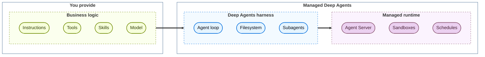

```mermaid actions={false}
%%{init: {"theme": "base", "themeVariables": {"lineColor": "#40668D", "primaryColor": "#E5F4FF", "primaryTextColor": "#030710", "primaryBorderColor": "#006DDD", "fontFamily": "Inter, ui-sans-serif, system-ui, sans-serif"}, "flowchart": {"nodeSpacing": 20, "rankSpacing": 40, "padding": 12}}%%
flowchart LR
    subgraph you["<b>You provide</b>"]
        direction TB
        subgraph logic["<b>Business logic</b>"]
            direction TB
            Instructions(["Instructions"])
            Tools(["Tools"])
            Skills(["Skills"])
            Model(["Model"])
        end
    end
    subgraph mda["<b>Managed Deep Agents</b>"]
        direction TB
        subgraph harness["<b>Deep Agents harness</b>"]
            direction TB
            AgentLoop(["Agent loop"])
            Filesystem(["Filesystem"])
            Subagents(["Subagents"])
        end
        subgraph runtime["<b>Managed runtime</b>"]
            direction TB
            AgentServer(["Agent Server"])
            Sandboxes(["Sandboxes"])
            Schedules(["Schedules"])
        end
        harness ==> runtime
    end
    logic ==> harness
    classDef logicItem fill:#F6FFDB,stroke:#6E8900,stroke-width:1.5px,color:#2E3900,rx:14,ry:14
    classDef harnessItem fill:#E5F4FF,stroke:#006DDD,stroke-width:1.5px,color:#030710,rx:14,ry:14
    classDef runtimeItem fill:#EBD0F0,stroke:#885270,stroke-width:1.5px,color:#441E33,rx:14,ry:14
    class Instructions,Tools,Skills,Model logicItem
    class AgentLoop,Filesystem,Subagents harnessItem
    class AgentServer,Sandboxes,Schedules runtimeItem
    style you fill:none,stroke:#40668D,stroke-width:1px
    style mda fill:none,stroke:#40668D,stroke-width:1px
    style logic fill:#FBFFEE,stroke:#6E8900,stroke-width:1px,stroke-dasharray:4 4
    style harness fill:#F3FAFF,stroke:#006DDD,stroke-width:1px,stroke-dasharray:4 4
    style runtime fill:#FBF3FE,stroke:#885270,stroke-width:1px,stroke-dasharray:4 4
```